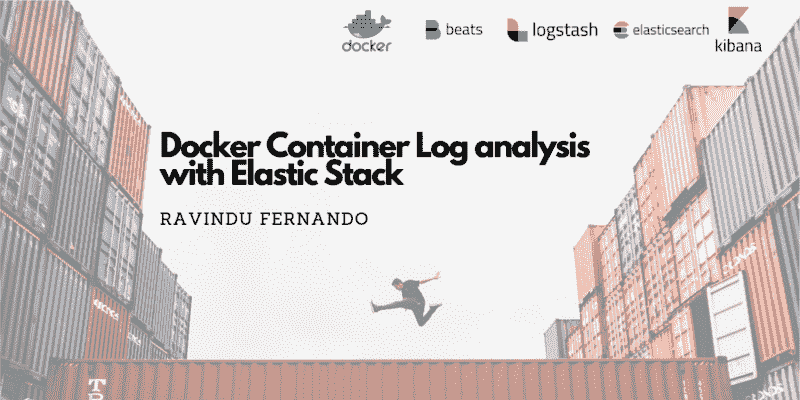
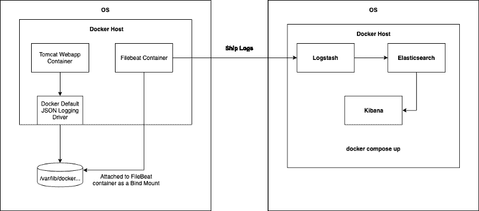
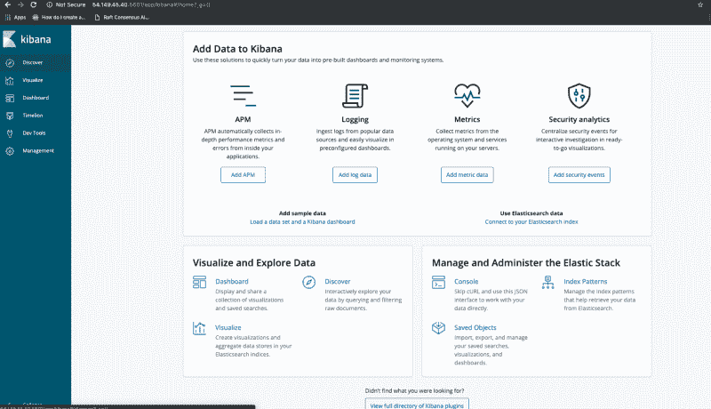
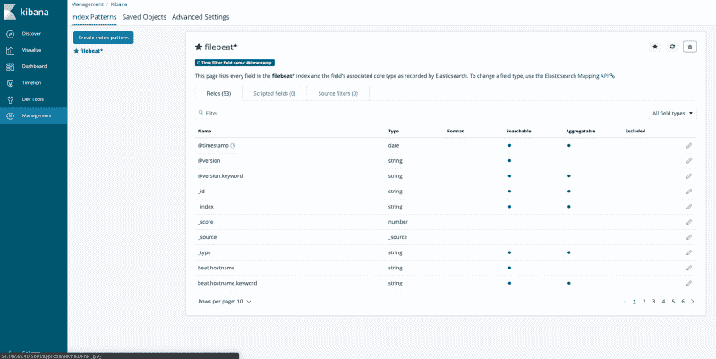

# 如何用弹性栈简化 Docker 容器日志分析

> 原文：<https://www.freecodecamp.org/news/docker-container-log-analysis-with-elastic-stack-53d5ec9e5953/>

作者:拉温杜·费尔南多

# 如何用弹性栈简化 Docker 容器日志分析



Background Image Courtesy — [https://images.ctfassets.net](https://images.ctfassets.net/) | Created via [https://www.canva.com/](https://www.canva.com/)

日志记录是任何应用程序中的一个基本组件。日志使您能够像故事一样分析和窥探应用程序代码中发生的事情。软件开发人员每天花很大一部分时间监控、排除故障和调试应用程序，这有时可能是一场噩梦。日志允许软件开发人员使这个忙乱的过程变得更加容易和流畅。


如果你已经用 docker 这样的容器平台容器化了你的应用，你可能熟悉 ***docker 日志*** ，它允许你查看在你的 Docker 容器内运行的应用中创建的日志。那么，为什么想到用弹性堆栈来分析您的日志呢？这里主要有两个燃烧问题:

*   想象一下，您有几十个、几百个甚至几千个生成日志的容器——SSH 到所有这些服务器并提取日志并不能很好地工作。
*   此外，容器是不可变的和短暂的，这意味着它们的生命周期较短。因此，一旦您的容器被新容器取代，所有与旧容器相关的应用程序日志都将消失。

因此，最终的解决方案是创建一个集中的日志记录组件，将所有容器日志收集到一个地方。这就是弹性堆栈的用武之地。

[弹性栈](https://www.elastic.co/products/)主要由四大部分组成:

*   **Beats** 是使麋鹿栈被称为弹性栈的新成员。Beats 是轻量级日志数据传送器，可以将日志推送到 ELK 堆栈。在这篇文章中，我将使用 beats 家族的成员之一 Filebeats，它提供了一种收集、转发和集中日志和文件的轻量级方法。
*   **Logstash** 是一个组件，它将来自多个输入位置的日志聚集、修改并传输到 Elasticsearch 中。
*   **Elasticsearch** 是一个分布式的、基于 JSON 的搜索和分析引擎，它以可伸缩和可管理的方式存储和索引数据(在这里是日志条目)。
*   Kibana 是一个丰富的 UI，用于分析和轻松访问 Elasticsearch 中的数据。

在这篇文章中，我们将探讨如何使用上述组件并实现一个集中式日志分析器来从 Docker 容器中收集和提取日志。

出于本文的目的，我使用了两个 t2.small AWS EC2 实例，运行安装了 Docker 和 Docker compose 的 Ubuntu 18.04。实例 1 运行 tomcat webapp，实例 2 运行 ELK stack (Elasticsearch，Logstash，Kibana)。

在 Linux 中默认可以在这个位置找到 docker 日志:
***/var/lib/docker/containers/<container-id>/<container-id&***gt；-json.log

所有 docker 日志都将通过作为容器在主机内部运行的 Filebeat 来收集。Filebeat 将安装在每台 docker 主机上(我们将使用一个定制的 Filebeat docker 文件和 systemd 单元，这将在配置 Filebeat 一节中解释。)

我们的 tomcat webapp 将使用默认的 docker 日志记录驱动程序将日志写入上述位置。然后，Filebeat 将从该位置提取日志，并将它们推送到 Logstash。

另一个需要注意的重要事项是，除了应用程序生成的日志之外，我们还需要与容器相关联的元数据，例如容器名称、图像、标记、主机等。这将使我们能够明确识别日志生成的确切主机和容器。这些数据也可以很容易地通过 Filebeat 与应用程序日志条目一起发送。



High Level Architecture — Instance 1 [Left] | Instance 2 [Right]

通过这样的实现，运行中的容器不需要担心日志驱动程序，也不需要担心日志是如何收集和推送的。Filebeat 会处理这些的。这就是通常所说的 ***单一责任原则。***

#### **配置 Filebeat**

> 对于这个部分，filebeat.yml 和 Dockerfile 是从 [Bruno COSTE](https://medium.com/@bcoste) 的[sample-file beat-docker-logging github repo](https://github.com/bcoste/sample-filebeat-docker-logging)中获得的。非常感谢他出色的工作。

> 但是由于我根据本文的要求对 filebeat.yml 做了一些修改，所以我在自己的 repo 中单独托管了 filebeat.service (systemd 文件)中的那些内容。您可以在此访问回购[。](https://github.com/rav94/filebeat-demo)

首先，您需要更新包含 filebeat 配置的 filebeat.yml 文件。下面给出了一个可以使用的 filebeat.yml 文件示例。注意第 21 行，output.logstash 字段和 hosts 字段。我已经将其配置为运行我的 ELK 堆栈的服务器的 IP 地址，但是如果您在单独的服务器上运行 Logstash，您可以修改它。默认情况下，Logstash 在端口 5044 上监听 Filebeat。

> 要了解更多关于 Filebeat Docker 配置参数的信息，[看这里](https://www.elastic.co/guide/en/beats/filebeat/master/filebeat-input-docker.html)。

之后，您可以使用以下 Docker 文件创建自己的 Filebeat Docker 映像。

一旦构建了映像，就可以将它放入 docker 存储库中。现在，既然您能够将 Filebeat 作为 docker 容器运行，那么只需在运行容器的主机实例上运行 Filebeat 容器。以下是 docker 运行命令。

```
docker run -v '/var/lib/docker/containers:/usr/share/dockerlogs/data:ro' -v '/var/run/docker.sock:/var/run/docker.sock' --name filebeat ${YOUR_FILEBEAT_DOCKER_IMAGE}:latest
```

在上面的 docker 命令中，请注意两个绑定挂载参数:/var/lib/docker/containers 是 Docker 日志在主机中存在的路径，它已经绑定到 Filebeat 容器中具有只读访问权限的/usr/share/dockerlogs/data path。在第二个 bind mount 参数中，/var/run/docker.sock 被绑定到 Filebeat 容器的 docker 守护进程中。它是 Docker 守护进程默认监听的 unix 套接字，可用于从容器内与守护进程通信。这允许我们的 Filebeat 容器获取 Docker 元数据，并丰富容器日志条目以及元数据，然后将其推送到 ELK 堆栈。

如果你想自动化这个过程，我写了一个 Systemd 单元文件来管理 Filebeat 作为一个服务。

#### **配置 ELK 堆栈**

为此，我将使用我的第二个 EC2 实例，在那里运行 ELK 堆栈。你可以通过简单地安装 Docker compose 并检查这个令人敬畏的[deviantony/Docker-elk repo](https://github.com/deviantony/docker-elk)并运行***Docker-compose up-d***来做到这一点

> 请注意，您的所有防火墙规则都允许入站流量进入 Logstash、Elasticsearch 和 Kibana。

在运行 ELK stack 之前，您需要确保您的 logstash.conf 文件被正确配置为在端口 5044 上监听传入的 beats 日志，并且这些日志被正确添加到 elasticsearch 主机上。此外，您需要确保在您的 Elasticsearch 中添加一个索引参数，以唯一地识别 Filbeat 生成的日志。

在您的 docker-elk repo 中，您可以按照 docker-elk/logstash/pipeline 路径名找到您的 logstash.conf 文件。这是用于设置 Logstash 配置的配置文件。您需要按如下方式更新它:

一旦你这样做了，默认情况下，你可以在端口 5601 上访问你的 Kibana 仪表板，正如在[devi Antony/docker-elk](https://github.com/deviantony/docker-elk)repo 上的 docker-compose.yml 文件中所定义的。



Kibana Dashboard

在“管理”选项卡下，您可以为 Filebeat 日志创建索引模式。这必须在您可以在 Kibana dashboard 上查看日志之前完成。



Filebeat Index Patten Configuration on Kibana Dashboard

如果您的容器通过 Logstash 将日志正确地推送到 Elasticsearch，并且您已经成功地创建了索引模式，那么您可以转到 Kibana 仪表板上的 Discover 选项卡，在 filebeat*索引模式下查看您的 Docker 容器应用程序日志以及 Docker 元数据。


Discover Docker container application logs along with the Docker host metadata in Kibana Dashboard

**参考文献**

1.  [https://www . elastic . co/guide/en/beats/filebeat/current/filebeat-getting-started . html](https://www.elastic.co/guide/en/beats/filebeat/current/filebeat-getting-started.html)
2.  [https://medium . com/@ bcoste/powerful-logging-with-docker-filebeat-and-elastic search-8ad 021 aecd 87](https://medium.com/@bcoste/powerful-logging-with-docker-filebeat-and-elasticsearch-8ad021aecd87)
3.  [https://www . elastic . co/guide/en/log stash/current/configuration . html](https://www.elastic.co/guide/en/logstash/current/configuration.html)
4.  [https://medium . com/lucjuggery/about-var-run-docker-sock-3 bfd 276 e 12 FD](https://medium.com/lucjuggery/about-var-run-docker-sock-3bfd276e12fd)