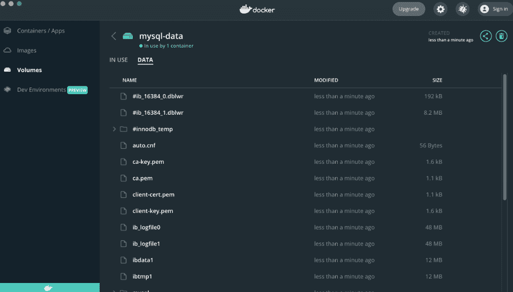

# Docker 挂载卷–如何挂载本地目录

> 原文：<https://www.freecodecamp.org/news/docker-mount-volume-guide-how-to-mount-a-local-directory/>

容器让软件工程变得更加容易和高效，并且 [Docker](https://www.docker.com/) 容器很受欢迎并且易于使用。

集装箱对当地发展至关重要。它们允许您在本地环境中测试运行您的应用程序，并开始构建所需的基础设施。

Docker 容器本质上是不可变的。这意味着重新启动容器会抹掉容器中存储的所有数据。但是 Docker 提供了卷和绑定挂载，这是在 Docker 容器中持久化数据的两种机制。

本教程将教你如何将本地目录绑定到 docker 容器，或者使用 Docker 管理的卷。了解这两者可以让您将 Docker 容器用于更多的用例，从而提高您的工作效率。

## 如何使用`docker run -v`挂载本地目录

> `docker run`命令首先在指定的映像上创建一个可写容器层，然后开始使用指定的命令。(消息来源[docker.com](https://www.bing.com/search?form=MOZLBR&ptag=MOZZ0000000011&pc=MOZD&q=docker+run+))

使用参数`-v`允许您绑定一个本地目录。

`-v`或`--volume`允许您将本地目录和文件挂载到容器中。例如，您可以启动一个 MySQL 数据库并挂载数据目录，以便在挂载的目录中存储实际数据。

```
# run mysql container in the background

$ docker run --name mysql-db -v $(pwd)/datadir:/var/lib/mysql -e MYSQL_ROOT_PASSWORD=my-secret-pw -d mysql:8.0.28-debian

# show content of data directory
$ ls -la datadir
total 383848
-rw-r-----    1 sebarthel  staff    196608 Mar 26 22:47 #ib_16384_0.dblwr
-rw-r-----    1 sebarthel  staff   8585216 Mar 26 22:47 #ib_16384_1.dblwr
drwxr-x---   12    sebarthel  staff       384 Mar 26 22:47 #innodb_temp
drwxr-xr-x@  27 sebarthel  staff       864 Mar 26 22:47 .
drwxr-xr-x    3 sebarthel  staff        96 Mar 26 22:47 ..
-rw-r-----    1 sebarthel  staff        56 Mar 26 22:47 auto.cnf
-rw-r-----    1 sebarthel  staff       913 Mar 26 22:47 binlog.000001
(more directories)

# stop mysql container
docker rm -f mysql-db
```

绑定目录是双向同步。您在主机上更改的每个文件都会在容器中更改，而在容器中更改的每个文件也会在主机上更改。因此，如果您停止并启动数据库，您可以挂载相同的目录，并且您的配置和存储的数据将是可用的。

这种方法的优点是使用简单，易于访问。对于要在主机上更改或观察的文件，如配置文件和日志文件，应该使用绑定本地目录。

## 如何使用 Docker 卷来保存更改

您可以使用 Docker 卷，而不是绑定您的本地目录。Docker 卷是 Docker 存储目录中的某个目录，可以挂载到一个或多个容器中。它们是完全受管理的，不依赖于特定的操作系统。

让我们创建一个 Docker 卷，并挂载它来保存 MySQL 数据:

```
# create volume
docker volume create mysql-data

# run mysql container in the background
$ docker run --name mysql-db -v mysql-data:/var/lib/mysql -e MYSQL_ROOT_PASSWORD=my-secret-pw -d mysql:latest

# stop mysql container
docker rm -f mysql-db

# remove volume
docker volume remove mysql-data
```

在移除 Docker 卷之前，您可以打开 Docker GUI，通过单击`data`选项卡来检查卷。



您可以看到文件，但它们被隔离在 Docker 卷中。建议使用它们来保存不需要从主机系统观察或更改的文件。众所周知，这种方法比本地目录绑定具有更好的性能。

# 摘要

当您知道如何持久保存数据并且在停止容器时不会丢失数据时，Docker 容器会变得更加强大。

通过提供 Docker run `-v`参数，可以将本地目录和卷绑定到一个容器。您需要给出绝对本地路径或卷名，并将其映射到容器`-v <source>:<target>`中的一个目录。

我希望你喜欢这篇文章。

如果你喜欢它，觉得有必要给我一点掌声，或者只是想和我保持联系，[在 Twitter 上关注我](https://twitter.com/sesigl)。

我在易贝·克莱南泽根公司工作，这是世界上最大的机密公司之一。顺便说一下，[我们正在招聘](https://www.ebay-kleinanzeigen.de/careers)！

### 参考

*   [如何在 Docker 容器中挂载目录](https://towardsdatascience.com/how-to-mount-a-directory-inside-a-docker-container-4cee379c298b)
*   【mysql 的对接影像
*   [Docker-撰写语法卷或绑定挂载](https://maximorlov.com/docker-compose-syntax-volume-or-bind-mount/)
*   [如何暂停和恢复 Docker 容器](https://www.thegeekdiary.com/how-to-pause-and-resume-docker-containers/)
*   [Docker 容量与装订数量之比](https://blog.logrocket.com/docker-volumes-vs-bind-mounts/)
*   [Docker 文档:命令卷创建](https://docs.docker.com/engine/reference/commandline/volume_create/)
*   [Docker 文档:卷备份和恢复](https://docs.docker.com/storage/volumes/#backup-restore-or-migrate-data-volumes)
*   桌面上的 Docker 容器