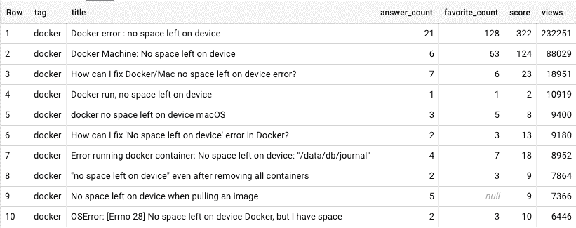

# Docker Remove Image:如何删除 Docker 图像并举例说明

> 原文：<https://www.freecodecamp.org/news/docker-remove-image-how-to-delete-docker-images-explained-with-examples/>

我们生活在一个储物越来越便宜的时代。我们可以把所有东西都送到云上，几乎不用支付任何费用。

那么，我们为什么需要担心删除 Docker 图像呢？

首先，仍然有一些任务关键型工作负载不能迁移到云，尤其是那些在法律或医疗保健等受到严格监管的行业中的工作负载。但是为了更好地回答这个问题，我想说的是，作为开发人员，我们经常发现自己的本地机器空间不足。

让我们对这个 [StackOverflow 公共数据集](https://cloud.google.com/blog/products/gcp/google-bigquery-public-datasets-now-include-stack-overflow-q-a)做一个快速分析，以进一步探究:

```
SELECT tag,
       title,
       answer_count,
       favorite_count,
       score,
       view_count VIEWS
FROM
  (SELECT title,
          answer_count,
          favorite_count,
          view_count,
          score,
          SPLIT(tags, '|') tags
   FROM `bigquery-public-data.stackoverflow.posts_questions` 
         posts_questions), UNNEST(tags) tag
WHERE tag = 'docker'
  AND title LIKE '%space left%'
ORDER BY VIEWS DESC
```

**查询结果:**



所以这不仅仅发生在我身上，对吗？看看那些 StackOverflow 帖子我们有多少浏览量。如果你想知道，这个数字是符合搜索查询的帖子的 **465687** 浏览量。

幸运的是，今天我们将看到一些**简单易用的**例子，告诉我们如何删除悬挂的和不用的 docker 图片来帮助自己。

## 什么是悬空和未使用的 Docker 图像？


你可能会问，悬空图像和未使用的图像有什么区别？

悬空图像意味着您已经创建了图像的新构件，但尚未给它命名。想想那些旧的、被遗忘的、没有人知道如何处理的图像——那些是“悬空的图像”。

它们没有标记，当您运行`docker images`时，它们的名字上会显示`<none>`。

另一方面，未使用的图像意味着它还没有被分配或者没有在容器中使用。

例如，当运行`docker ps -a`时，它将列出所有当前运行的容器和已退出的容器。任何容器中正在使用的任何图像都显示为“已使用的图像”，而任何其他图像都是未使用的。

## 删除 Docker 图像

现在让我们看一些如何删除 Docker 图片的例子。

### 我们的案例研究


Busy Cat Corp 是一家虚构的公司，它捕捉猫的行为数据，并向猫主人提供如何让他们的宠物更忙碌、更快乐的建议。

他们所有的工作负载都是容器化的，使用以下数据库镜像:
[Cassandra](https://hub.docker.com/_/cassandra)[postgres](https://hub.docker.com/_/postgres)[MySQL](https://hub.docker.com/_/mysql)和 [mongo](https://hub.docker.com/_/mongo) 。

他们的开发人员不断耗尽他们机器上的空间，他们是 StackOverflow 的顶级用户——我们不都是吗？因此，他们向我们询问了一些如何删除一些图像并收回空间的快速示例。

首先让我们看看他们其中一个开发者的机器。

```
docker images
```

**输出**

```
REPOSITORY  TAG          IMAGE ID            CREATED              SIZE
<none>       <none>      9c872a6119cc        About a minute ago   384MB
mysql        latest      5ac22cccc3ae        43 hours ago         544MB
cassandra    3           9fab0c92a93d        4 days ago           384MB
adoptopenjdk 8-jre...    2bf0172ac69b        4 days ago           210MB
mongo        latest      6d11486a97a7        2 weeks ago          388MB
postgres     latest      b97bae343e06        6 weeks ago          313MB
```

太酷了，他们下载了工作负载中的所有映像。但是看看磁盘空间——超过了 **2GB** ！让我们看看我们能为他们做些什么。

### 删除 Docker 悬挂图像

我们将从寻找悬空图像开始。

```
docker images -qf "dangling=true"
```

**输出**

```
REPOSITORY  TAG          IMAGE ID            CREATED              SIZE
<none>       <none>      9c872a6119cc        About a minute ago   384MB
```

我们有一个，所以我们要清除它。

**删除悬空图像**

```
docker rmi $(docker images -qf "dangling=true") 
```


### 删除 Docker 未使用的图像

接下来，我们将查找未使用的图像。

```
docker ps -a
```

**输出**

```
CONTAINER ID  IMAGE   CREATED           NAMES
b6387b343b81  mysql   16 minutes ago    some-mysql
```

我们只有一个容器运行`mysql`图像，所以所有其他图像都没有使用。

因此，我们不必手动操作，我们可以编写一个脚本，显示所有未使用的图像来验证它们。

```
# Get all the images currently in use
USED_IMAGES=($( \
    docker ps -a --format '{{.Image}}' | \
    sort -u | \
    uniq | \
    awk -F ':' '$2{print $1":"$2}!$2{print $1":latest"}' \
))

# Get all the images currently available
ALL_IMAGES=($( \
    docker images --format '{{.Repository}}:{{.Tag}}' | \
    sort -u \
))

# Print the unused images
for i in "${ALL_IMAGES[@]}"; do
    UNUSED=true
    for j in "${USED_IMAGES[@]}"; do
        if [[ "$i" == "$j" ]]; then
            UNUSED=false
        fi
    done
    if [[ "$UNUSED" == true ]]; then
        echo "$i is not being used."
    fi
done
```

based on [this stackoverflow answer](https://stackoverflow.com/a/37133531/12067297)

**输出**

```
adoptopenjdk:8-jre-hotspot-bionic is not being used.
cassandra:3 is not being used.
mongo:latest is not being used.
postgres:latest is not being used.
```

然后，它删除未使用的图像。

```
# Get all the images currently in use
USED_IMAGES=($( \
    docker ps -a --format '{{.Image}}' | \
    sort -u | \
    uniq | \
    awk -F ':' '$2{print $1":"$2}!$2{print $1":latest"}' \
))

# Get all the images currently available
ALL_IMAGES=($( \
    docker images --format '{{.Repository}}:{{.Tag}}' | \
    sort -u \
))

# Remove the unused images
for i in "${ALL_IMAGES[@]}"; do
    UNUSED=true
    for j in "${USED_IMAGES[@]}"; do
        if [[ "$i" == "$j" ]]; then
            UNUSED=false
        fi
    done
    if [[ "$UNUSED" == true ]]; then
        docker rmi "$i"
    fi
done
```

based on [this stackoverflow answer](https://stackoverflow.com/a/37133531/12067297)

删除悬挂和未使用的图像后，我们可以看看我们还剩下什么。

```
docker images
```

**输出**

```
REPOSITORY  TAG          IMAGE ID            CREATED              SIZE
mysql        latest      5ac22cccc3ae        43 hours ago         544MB
```

所以我们只剩下`mysql`图像了，太好了！


### 用 prune 删除所有过时的 Docker 图像

这些命令听起来很棒，但是第二个开发者说他们不关心悬空和未使用图像之间的区别。

他们想要的只是清除过时的图像，拿回他们的磁盘空间。

> 就我个人而言，这是我通常做的。

所以我们可以使用 Docker 的修剪命令。

```
# First delete all stopped containers
docker container prune

# Then delete both dangling and unused images
docker image prune --all
```

这将删除未使用的和悬挂的图像。或者换句话说，没有至少一个与之相关联的容器的图像。

注意:这就是为什么我们需要首先删除上面代码中停止的容器。

## **************向上**************

在本文中，我们看到了如何删除 Docker 图像，我们使用了一个虚构的公司，并用一些易于使用的例子来解释它。

需要指出的是，你不应该使用 Docker 来保存旧图片的历史记录。对于开发人员环境来说，这很好，如果您必须处理大量的工作负载，您甚至可以自动执行映像清理工作负载。

但是对于生产工作负载，您应该使用容器注册解决方案来处理 Docker 图像。

有许多容器注册解决方案，如带有[工件注册](https://cloud.google.com/artifact-registry)的谷歌云平台和带有 [Docker 可信注册](https://docs.mirantis.com/docker-enterprise/v3.0/dockeree-products/dtr.html)的 Docker Enterprise。如果你在开源世界，你可以使用 [Docker Hub](https://hub.docker.com/) :)。

感谢阅读！

*来自[图标 8](https://icons8.com/) 的 的插图

如果你觉得这很有帮助，或者希望挑战或扩展这里提出的任何问题，请随时通过 [Twitter](https://twitter.com/mesmacosta) 或 [Linkedin](https://www.linkedin.com/in/mesmacosta) 与我联系。我们连线吧！