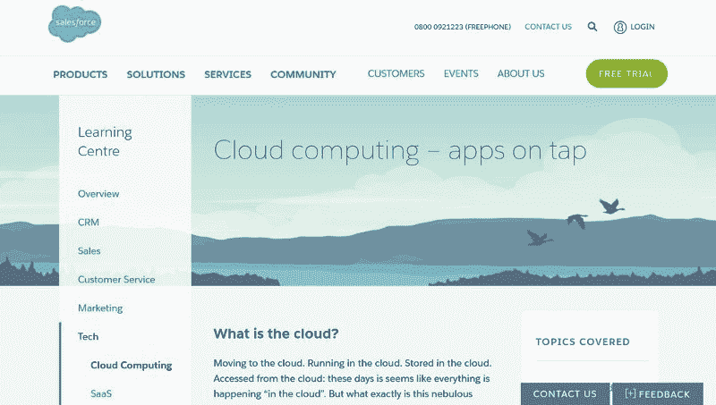
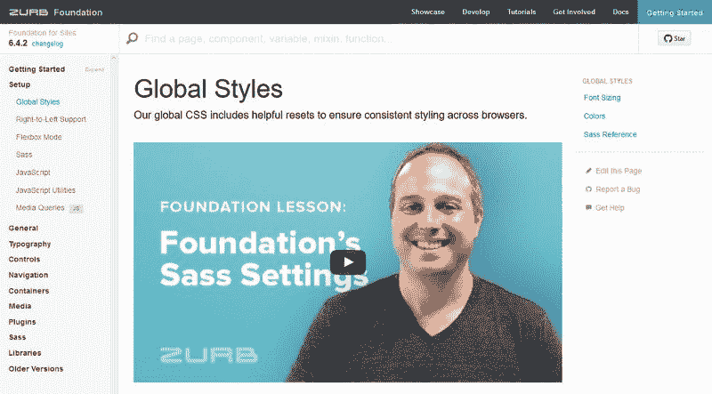
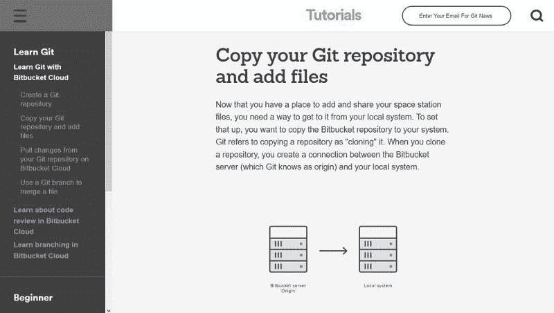

# 为什么软件文档是可访问性的一部分[举例]

> 原文：<https://www.freecodecamp.org/news/documentation-is-part-of-accessibility-439d7750267d/>

可访问性主要是作为一种使残疾人能够使用工具(网站、应用程序等)的方式来讨论的。)并尽可能少地丢失信息。然而，没有任何残疾但经历其他困难的用户的可访问性需求却很少被广泛讨论。

缺乏某个特定主题的知识是一件非常困难的事情，因此向用户提供高质量的技术文档是可访问性的重要组成部分。在开源工具的情况下，这可能更重要，因为在这里，用户不只是想使用工具，他们中的许多人也会对代码做出贡献。

如果你曾经不得不使用文档很差的软件，你知道我在说什么。无聊、结构不良和对用户不友好的文档会让人们放弃一个工具，就像过于复杂的购买过程会导致电子商务网站上的购物车被放弃一样。

### 两种类型的技术文档

本质上，有两种类型的技术文档(然而，你可能会发现更多，例如[这篇文章](https://www.rhyous.com/2011/07/21/the-different-types-of-technical-documentation-for-software-and-why-each-is-important/)提到了八种类型):

1.  为最终用户创建的文档
2.  为开发人员创建的文档

### 最终用户文档

公司倾向于更加关注最终用户文档；你可以找到这类文档的[好的和用户友好的例子](http://blog.screensteps.com/10-examples-of-great-end-user-documentation)。然而，即使是设计最好的最终用户文档也往往缺乏重要的可访问性特征(例如，足够的颜色对比度或教学视频的字幕)。

例如，看看 Salesforce 的[学习中心](https://www.salesforce.com/uk/learning-centre/)。总的来说，他们在文档方面做得很好。这些信息结构良好，逻辑性强，而且文档没有使用太多的技术术语。

另一方面，您会发现缺少一些必要的可访问性特性，例如，链接仅通过颜色来区分，而不是提供一个[非颜色指示符](https://www.annalytic.com/link-accessibility-colors-not-enough.html)，例如下划线。

### 开发者文档

为开发人员创建的技术文档多年来一直处于糟糕的状态。它们不仅缺乏可访问性，而且结构糟糕，使用不可读的字体和小行高，缺乏目录，整体上看起来缺乏吸引力。

视频教程的兴起使得开发者文档的场景变得更好，因为大约在同一时间，设计良好的文档开始出现。

我真正喜欢的第一个开发者文档是 Zurb 基础文档。自从我第一次看到它以来，它已经改进了很多，但即使是早期版本的设计、编写和结构也让我想学习。

Atlassian 的 Git 教程为用户友好的开发者文档提供了另一个很好的例子。它们和基础文档一样结构良好，但也有很好的解释性插图(SVG 格式！)和一个[可下载的小抄](https://www.atlassian.com/git/tutorials/atlassian-git-cheatsheet)。

虽然基础文档和 Git 教程都以一种不了解该主题的用户也能理解的方式呈现信息，但您会发现两者都存在一些可访问性问题，这可能会妨碍残疾用户(例如，颜色对比问题)。

### 文档可访问性的两个级别

基本上，文档可访问性有两个层次:

1.  文档需要能够被没有足够工具知识的用户访问。
2.  这些文档需要便于可能患有不同残疾的用户使用。

这两个级别也可能交叉，因为可能会有用户同时受到这两个问题的影响(即没有足够的知识加上有残疾)。

我在本文中提到的三个例子(Salesforce、Foundation、Atlassian)很好地处理了第一级文档可访问性，因为它们:

*   不要使用技术术语，如果使用，他们会给出必要的解释
*   提供菜单/小部件/目录来简化导航
*   结构页面(精心排版，足够的留白，垂直节奏等。)
*   提供插图或教学视频
*   提供用法、演示或代码片段的示例

他们也部分地实现了第二层的可访问性，但是你会在这里和那里发现一些问题，比如颜色对比，链接可见性，视频字幕等等。

### 文档可以完全访问吗？

我不知道完全可访问的文档是否存在，但如果存在，他们应该实现两个级别的文档可访问性。这当然不是一件容易完成的事情，因为要注意的事情太多了。

然而，文档可访问性仍然是可访问性的重要组成部分。首先，因为残疾用户不应该被排除在采用新技术之外，还因为这极大地影响了有多少人愿意多走一步去使用新工具。

你可以在[annalytic.com](https://www.annalytic.com/documentation-part-of-accessibility/)上阅读更多我的博客文章。