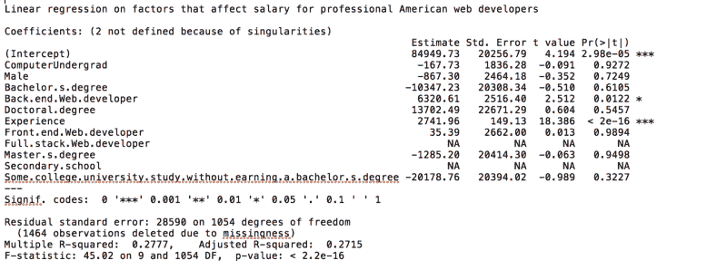
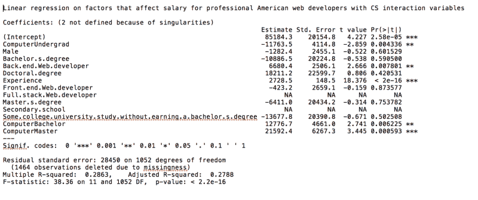

# 计算机科学学位真的能提高你的工资吗？我仔细研究了这些数字来寻找答案。

> 原文：<https://www.freecodecamp.org/news/does-an-undergrad-computer-science-education-affect-a-web-developer-s-salary-80711fff9298/>

李·银色啤酒杯乐队

# 计算机科学学位真的能提高你的工资吗？我仔细研究了这些数字来寻找答案。

Photo by [Neil Cooper](https://unsplash.com/photos/qoMkohLzc6g?utm_source=unsplash&utm_medium=referral&utm_content=creditCopyText) on [Unsplash](https://unsplash.com/?utm_source=unsplash&utm_medium=referral&utm_content=creditCopyText)

我正在写一篇关于软件行业专业化与工资的相关性的文章。我已经研究出了为什么专业化和如何影响工资，以及专业化在哪里发生的理论。我唯一需要的是统计证据。

所以我拿了 [2017 年堆栈溢出调查数据](https://insights.stackoverflow.com/survey/2017)，清理了它，并开始插入以前分析的变量，这些变量是[已知的影响最终工资的变量](https://stackoverflow.blog/2017/06/15/developers-use-spaces-make-money-use-tabs/)。

数据分析最棘手的部分之一是理解哪些变量是你想测试的，哪些是你不想测试的。这样，你就可以控制他们的行为。

例如，我可以测试在工作中使用 PHP 是否会增加你的薪水。但是如果我不考虑回答者的国家，我就不能如实地说明 PHP 的影响。

因为我在测试专门化，所以我需要简化数据集并提高对专门化变化的敏感度。我选择只使用来自美国的专业 web 开发人员，并且考虑到专业化，我希望测试前端和后端专家相对于全栈通才的工资。

我逐渐加入了变量:经验，教育，网站开发类型。结果并不完美。我原以为正规教育会有更积极的影响，但我很乐观，我已经看到了专业化优势的一些证据。

这时候意想不到的事情发生了。

我的职业是 web 开发人员，我做全栈开发。我一直在想，如果我再成熟一点，获得一个计算机科学(CS)学位，而不是美术学位，我可能会赚更多的钱。

我的一个弟弟有计算机科学学位，而我们的工资似乎在两个不同的等级上，而且这两个等级永远不会重合。我遇到的每一个对编程感兴趣的人，我总是告诉他们，一个本科计算机科学学位至少值 20000 英镑的永久工资差，我认为我是保守的。

所以你可以想象，当我把拥有计算机科学学位的本科生和其他人进行对比分析时，我有多震惊。**没有显著差异。**

“我肯定犯了一个错误，”我想。我第一次进行分析的时候，我把计算机专业的毕业生和工程师、数学家以及信息技术专业的毕业生归为一类。很明显 CS 需要独立成一个部门。

所以我又分析了一遍。

但同样，没有显著差异。

Linear regression on factors that affect salary for professional American web developers

### 让我来概述一下这里到底发生了什么。

当我考虑了正规教育、经验、网站开发者类型和本科专业后，**拥有计算机科学专业——或者工程或数学专业——和薪水之间没有关联。**

所以我开始去除变量。“可能 CS 专业的一般都会流入后端吧”我想。所以我去掉了“web 开发者”类型。没有关联。

我完全取消了正规教育。没有学士、硕士或博士学位的考试。没有关联。

### 我尝试了所有能想到的组合。我也没有发现拥有计算机科学本科学位和高收入之间有什么显著的联系。

对于本科计算机科学学位和工资缺乏统计相关性，有几种可能的解释。首先想到的是数据不好。这不是一个适当的人口抽样，或者人们说谎，或者人们没有完成调查。

例如，我们知道女性在最初的调查结果中被歪曲了。我们还可以看到，只有三分之一的美国专业网站开发人员的受访者实际上包括了他们的工资，而从那些确实包括了工资的受访者来看，大多数人的年薪在 9 万美元到 13 万美元之间。

我们知道网络开发人员的全国平均工资接近 7 万美元。所以这里可能存在一种偏见，即人们只会报告他们引以为豪的薪水。

因此，我通过给所有不适用的员工分配低于平均水平 40，000 美元的工资来测试这一假设。我发现它打破了所有以前的相关性，并导致没有新的启示。

另一种可能是，接受计算机科学教育的本科生流入了 web 开发之外的领域，留下了 web 开发的散兵游勇。我知道这有点牵强，但我真的很想弄清楚。

统计学既是一门科学，也是一门艺术。对数据进行回归并找到相关性是很容易的，但有时这只是整个事情的逻辑。在不诚实的人手中，统计数据可能被用来传递谎言。

> “谎言有三种**:**谎言**，**可恶的谎言，统计**。”——马克·吐温**

**回顾第一次线性回归，我注意到一个问题是关于那些上过大学但没有获得学位的回答者的。高达 14%的受访者是没有完成学位的学生。**

**变量是微不足道的，但估计的影响是非常消极的。如果一些从学院和大学退学的学生是计算机科学专业的学生会怎么样？**

**我创建了两个交互变量:一个用于完成学士学位的计算机系学生，另一个用于完成硕士学位的计算机系学生。结果是显著的，非常积极的。看起来拥有计算机学士学位确实会影响薪水。**

**

Linear regression on factors that affect salary for professional American web developers with cs interaction variables** 

**还是做到了？看看主修计算机科学和完成计算机科学学士学位的效果。这些符号几乎是相同的。只差一千分。**

**另一方面，拥有一个拥有硕士学位的计算机科学本科生，价值额外的 1 万美元。因此，如果你对网页开发感兴趣，并且已经获得了计算机科学本科学位，你可能会考虑攻读硕士学位。**

**所以我差不多又回到了起点。拥有计算机科学学位确实会影响薪水，但这种影响远远没有达到我最初假设的 2 万美元的涨幅。**

**取而代之的是更接近 1000 美元——对于大多数回答调查的开发者来说，这意味着总收入相差不到 2%。**

**也许这让我感到震惊，因为我是加拿大人，在筛选简历时，我们往往会更保守一些。也许计算机科学学位在这里更有价值。也许在世界上很多地方它更值钱。但是 CS 学位似乎并不影响美国专业网页开发人员的薪水。**