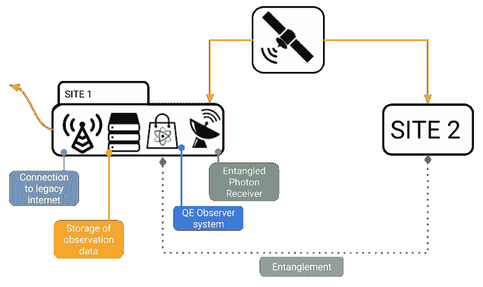
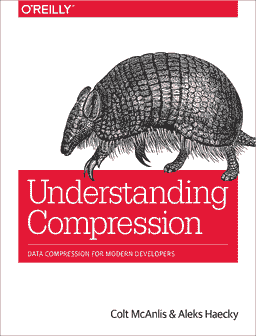

# 数据压缩在量子互联网上重要吗？

> 原文：<https://www.freecodecamp.org/news/does-data-compression-matter-on-a-quantum-internet-f6b986473c1c/>

作者柯尔特·麦坎利斯

# 数据压缩在量子互联网上重要吗？

免责声明:这是一篇假设的思考文章。这是个人观点，不代表我可能会(..或者可以不涉及)。如果你看完这篇文章后把时空撕了个洞……那是你自己的错。

如果你没有听说，中国的一个研究小组刚刚在实现使用[量子纠缠作为有效的通信容器](http://science.sciencemag.org/cgi/doi/10.1126/science.aan3211)方面取得了巨大的飞跃。他们的过程是使用一颗低地球卫星来制造一对纠缠光子，然后将它们发送到彼此相距非常远的位置。即使在前所未有的距离上，光子也保持了它们的纠缠，这使得互联网对通信的未来以及新的量子互联网何时会发生产生了热议。

现在，看着数学，**我仍然有点怀疑量子纠缠**是否可以用于通信。这位数学专家[解释说](https://www.forbes.com/sites/chadorzel/2016/05/04/the-real-reasons-quantum-entanglement-doesnt-allow-faster-than-light-communication/#1c0c3f153a1e)比好一点点[。然而，有很多人假设这是新量子互联网的第一步，像](https://medium.com/starts-with-a-bang/ask-ethan-can-we-use-quantum-entanglement-to-communicate-faster-than-light-e0d7097c0322)[纠缠交换](http://spectrum.ieee.org/telecom/security/two-steps-closer-to-a-quantum-internet)和[扭曲光](https://en.wikipedia.org/wiki/Orbital_angular_momentum_of_light)这样的东西可以弥合这些差距。

那么让我们提出一个思想实验:假设未来有一个互联网，它的技术基于量子纠缠。这意味着数据可以在两个位置之间以接近光速的速度传输，而无需物理连接介质。

在这样的世界里，数据压缩还重要吗？

### 关于 QE 互联网如何运作的一个小想法

我们必须假设，由于目前的技术，QE 互联网(QEI)的第一次实现将非常类似于过去的电报系统。维护和运行这些早期 QEI 站点的成本会限制它们的可用性，这意味着通信只能在少数站点之间进行。

这些站点需要两个主要特征:

1.  一个非集中式系统，可以将纠缠光子对分配到各个站点(例如低轨道卫星)。
2.  一个记录系统，记录纠缠测试的结果，并可以存储/检索这些结果。

#2 最有可能建立在今天的现代技术之上。因此，你可以想象这样一种情况，十亿个光子对被发送到一个地点，被统一采样，并作为二进制数据存储在该地点。

从那时起，数据最有可能使用更传统的方法(例如光纤连接)分发到其最终目的地。

### 第一代 QEI 的局限性

显然，我们仍然会遇到一些基于数据的瓶颈:

1.  一个站点可以存储多少纠缠线对是有物理限制的，因此限制了它的总带宽。
2.  纠缠对从分配器定期发送到站点的速度有物理限制，因此限制了总的系统带宽。
3.  环境因素将导致光子从分配器系统传输到站点的数据丢失。因此，在该过程中需要冗余，限制了总的系统带宽。

观察上述内容时，您会很快发现 QEI 的整体带宽会受到上述系统的限制，而不考虑信息通过量子手段在站点之间传播的能力。所以很明显，减少通过网站发送的数据量是很重要的，但是今天的数据压缩算法有意义吗？

### QEI 的数据压缩

“数据”有几个定义，将它表示为一个物理实体，随着量子互联网的(潜在)实现，对光子传输的需求使这一概念更加真实。

事实上，这可能是量子纠缠互联网最大的分支:你的数据现在有了一个非常物理的表现形式和成本。

因此，很明显，数据压缩作为一门科学，在 QEI 的未来仍然是需要的，但我们应该问自己的真正问题是:**今天的压缩算法足以支持量子互联网吗？**

我的看法？差远了。

正如在“[理解压缩](https://www.amazon.com/Understanding-Compression-Data-Modern-Developers/dp/1491961538)中所解释的，今天的系统仍然基于香农的基本架构“*最频繁的符号得到最小的比特。*“在这个过程中有很大的力量，但直到我们走出符号空间，并开始获得完全在位向量空间中处理压缩的计算能力，[我们将在桌面上留下很多信息](http://ieeexplore.ieee.org/abstract/document/1054929/)。(但那是我自己不受欢迎的观点...)

让我们看看更远的地方。有没有潜在的系统，我们可以直接应用于纠缠光子，而不是应用于数据集？我们会开始讨论算法来对站点上的光子和正在传输的数据进行 diff，以便减少更新对的数量吗？当我们开始用[量子比特](https://en.wikipedia.org/wiki/Qubit)而不仅仅是比特来思考时，会发生什么？我们是不是要开始思考 8 维空间的 LZ 编码了？

显然，量子计算的实现和标准化将为我们的世界工作方式带来巨大的技术变革。我有充分的理由相信数据压缩也将会出现。