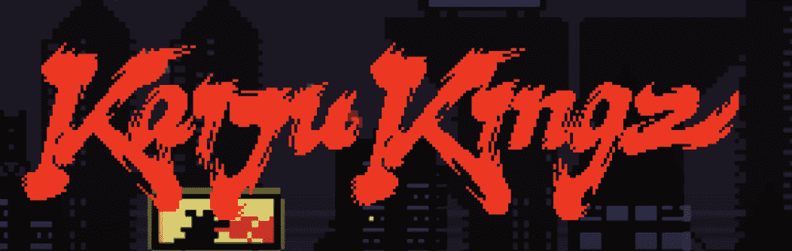

# 向 freeCodeCamp 捐赠 100 万美元，用于开发免费的碳中和 Web3 课程

> 原文：<https://www.freecodecamp.org/news/donating-a-million-dollars-to-freecodecamp-a-web3-curriculum/>

我是自由代码营的校友。我在 freeCodeCamp 学会了编码。我用这些技能建立了一家盈利的公司。

今天，这家名为 KaijuKingz 的公司向 freeCodeCamp 捐赠了 100 万美元，帮助他们创建更多的免费学习资源。

freeCodeCamp 社区已经帮助我和成千上万的其他人通过构建项目来学习编码。为了给我们的捐赠做个铺垫，我想给你们一些我自己的开发者之旅的背景——从偶然发现 freeCodeCamp 到闯入 Web3。

这是我的故事。

## **从补锅匠到辍学者**

我从小就对编程感兴趣。我会为我高中的女朋友制作简单的基于 IF-ELSE 文本的冒险游戏。我想在我看来，我是某种 leet 开发者。

不幸的是，我的学校当时没有提供任何探索编程的途径。尽管如此，我还是尽了最大努力来提高自己的技能。我深入参与了一门计算机系统课程，这门课程允许学生获得 CompTIA、A+和 Net+等认证。

当我能够上大学时，我决定攻读计算机科学学位，但我很快就落后了。教科书很贵。我面临着资源的全面缺乏。我最终辍学了。

在与动力作斗争并无家可归了一段时间后，我决心让我的生活恢复正常。

## **挣扎着回来**

我能够利用我的 CompTIA 认证在一家大型零售商找到我的第一份最低工资的计算机技术工作。我在这个领域越陷越深，并通过不懈的努力一步步向上爬。

我在一家大型医疗中心的 IT 部门一步步升到了二级支持的职位。在这里，我重新发现了自己对编程的热爱，并开始了简单的自动化任务。我开始用 Visual Basic 编写脚本。PowerShell 成为我自动化任务的首选工具。渐渐地，我进入了这个领域。

这是我第一次考虑学习成为全栈开发者的时候。我会研究工具，梦想有一天我可以参加编码训练营，成为一些超级棒的全栈开发人员。

这是我第一次发现免费资源，如 freeCodeCamp 和许多教授开发的 YouTube 频道。(喊出 Sentdex < 3)。

2019 年，我完成了 freeCodeCamp 响应式网页设计认证课程。我会经常查看 freeCodeCamp，阅读新的教程，观看社区每天创建的一些新的视频课程。这很有趣，我学到了很多，而且没花我一分钱。

## 从我的第一份软件工程师工作到创办我的第一家公司

2020 年，我在一个电子商务平台找到了第一份软件工程工作。我继续提高我的技能。

快进到六个月前——我决定把我所有的时间都投入到学习 Web3 空间上，重点放在去中心化和社区建设上。结果是:KaijuKingz。

The KaijuKingz logo, inspired by traditional Japanese brush stroke technique

在创建 KaijuKingz 的时候，我的团队决定为其他有抱负的开发者和创造者留出一些资金来学习 Web3。我们计划筹集足够的资金，也许可以送 3-4 个人去编码训练营，希望能改变一些人的生活，然后就到此为止。

成功之后，我们意识到我们有机会影响比最初计划更多的人的生活。因此，我们联系了昆西，讨论如何利用我们的资金，为有抱负的开发者建立一个 Web3 项目。我们想帮助那些热衷于权力下放和社区拥有的技术的人。

我们决定全力以赴，利用他的团队和他们在开发世界上任何人都可以访问的有效课程和认证方面的记录。

## **即将推出的 freeCodeCamp Web3 课程计划**

我们的 100 万美元捐款将用于建立一个完整的 Web3 开发课程。它将涵盖从 Rust 和 Solidity 编程基础到使用 web3.js 等 JavaScript 库的所有内容。

该课程最终将提供约 300 小时的免费学习，帮助人们从零开始学习 Web3。学习者唯一需要的是使用电脑，以及完成课程的纪律。freeCodeCamp 现有的 Web2 开发课程将教你所有必要的必备工具。

昆西和我都对环境有强烈的感受。这个课程将是碳中和的。

通过免费资源学习编程，我从根本上改变了我的生活。回馈学习编程的最全面和最有效的资源之一(同时帮助他们升级未来的课程)给了我一个目标。我们希望改变成千上万人的生活，而不是改变一个人的生活，并为 Web3 生态系统带来新的开发者。

感谢 freeCodeCamp，感谢支持我们的 KaijuKingz 社区，感谢所有帮助建设去中心化未来的人。

干杯，
内森