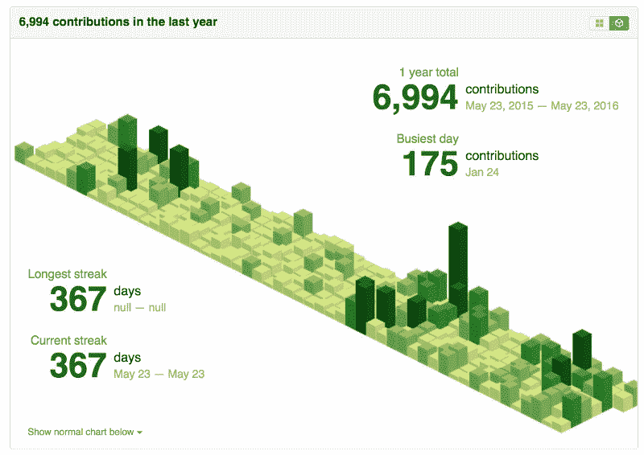
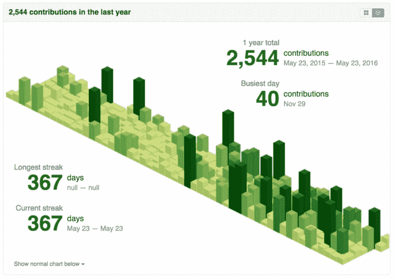
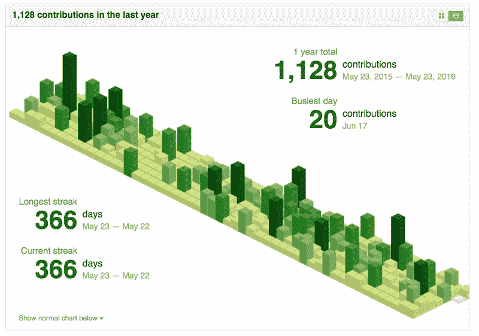
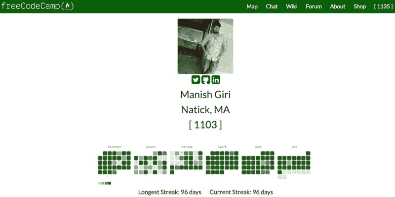

# 不要打破链条:为什么我们会错过 GitHub 条纹

> 原文：<https://www.freecodecamp.org/news/dont-break-the-chain-why-github-s-streaks-will-be-sorely-missed-by-many-4fff90bc2a38/>

GitHub 在周四悄悄地移除了他们的 code streak 特性，作为他们贡献图更新的一部分。

在一个关于你现在如何获得私人贡献信用的[公告](https://github.com/blog/2173-more-contributions-on-your-profile)中(以前，只有开源贡献被计算在内),他们说:

> 作为此次更新的一部分，代码条纹不再出现在你的贡献图上。简化的界面专注于你正在做的工作，而不是你活动的持续时间。

可以理解，许多开发人员很高兴他们雇主的闭源项目的日常工作现在可以在他们的贡献图上得到认可。

但是很多开发者对 GitHub 突然单方面决定移除代码条纹感到难过。

截至周四，杰德·沃森(Jed Watson)已经连续 1000 多天贡献开源软件，他写了一篇感人的文章，讲述了他的连续经历如何伴随他度过了许多人生里程碑，如推出 [KeystoneJS](http://keystonejs.com/) 和他女儿的出生。

杰德并不孤单。许多其他著名的开源贡献者为他们一致的编码感到自豪，这反映在他们长期运行的记录中。

请注意，这些图表——由[等距贡献 Chrome 扩展](https://chrome.google.com/webstore/detail/isometric-contributions/mjoedlfflcchnleknnceiplgaeoegien)生成——仅显示了过去一年的情况。许多开源贡献者的连续记录可以追溯到几年前。

Open source contributions by [John-David Dalton](https://github.com/jdalton), creator of Lodash

Open source contributions of [Sahat Yalkabov](https://github.com/sahat), creator of the Hackathon Starter

#### 为什么条纹很重要

有人曾经问过喜剧演员杰瑞·宋飞，他是如何写出这么多原创素材的。他指着一个盖着 X 的挂历，惊呼道:“别把链子弄断了！”

Coding spree!

它是这样工作的:对于你坐下来写的每一天，你在你的日历上画一个 X。很快你就有了一连串的 X。如果你写不出来，你就不能画 x。你的记录会重新开始。

通过每天写一点，你最终会完成更多的工作，因为它变得更容易开始，并且你会更快地进入状态。

合理的解释是，如果你休息一天，你会花更长的时间重新投入工作。你甚至可能成为“见鬼效应”的牺牲品，说:“见鬼，我昨天已经打破了我的记录。让我再休息一天吧……”

#### 每天写代码

jQuery 的创始人 John Resig 采用了“不要打破链条”的方法，并将其应用于编码。他的[博文](http://ejohn.org/blog/write-code-every-day/)发起了“每天写代码”运动。

Open source contributions by [John Resig](https://github.com/jeresig), creator of jQuery

我在 2014 年 10 月遇到了 Resig 的“每天写代码”文章，当时我正在构建自由代码营的第一个版本。我决定像他推荐的那样每天试着编码。

果然，在连续几周的贡献之后，编程成为了第二天性。我不再需要走到咖啡馆或共同工作的地方，然后通过耳机播放音乐来为编程打气。

相反，我可以下床，沏些茶，坐在餐桌旁开始工作。

很难描述我感受到的前进的动力。虽然我从来没有像你在这里看到的开发人员那样的史诗般的连胜，但那一年我确实连续 60 多天做开源贡献，并且从那以后有许多更短的连胜。

因此，当决定我们应该在自由代码营中包含哪些游戏化元素来鼓励我们的营员时，我们自然决定尝试条纹。

您可以通过完成编码挑战以及在我们的帮助聊天室帮助其他营员来获得加分。如果你连续几天这样做，你将开始一个连胜。

连胜是一种令人难以置信的强有力的方式，可以让学习者保持动力，朝着他们的目标稳步前进。

我们会想念 GitHub 的条纹。至少，他们已经激励我们的开源社区使用类似的机制来激励人们，并让人们每天都写代码。

下次见，编码快乐！保持这种势头，不要打破链条。

我只写编程和技术。如果你在推特上关注我，我不会浪费你的时间。？