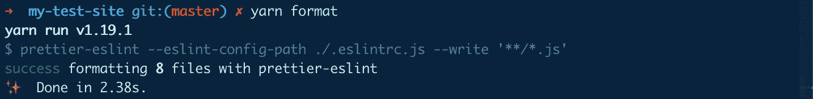

# 不要只是丢弃你的代码——用更漂亮的代码来修复它

> 原文：<https://www.freecodecamp.org/news/dont-just-lint-your-code-fix-it-with-prettier/>

林挺让我们的生活变得更容易，因为它告诉我们代码有什么问题。但是我们如何避免做实际的修复工作呢？

以前我写过关于林挺的文章，它是什么，以及它如何让你的生活变得更容易。最后，我实际上包含了一种可以自动修复代码的方法。那我为什么要写这个呢？

## 你说修好它是什么意思？

在我们开始之前，让我们快点。Linters 功能强大，提供了一种简单的方法来扫描代码中可能导致 bug 的语法错误。或者他们可以简单地帮助保持代码库的干净、健康和一致。当运行时，它会显示所有的问题，并让您逐个解决它们。

更进一步，一些 linter 实际上允许你传递一个参数给运行 linter 的命令，让它自动修复。这意味着您不必手动浏览并创建所有这些小空格和分号(添加它们！？)拧自己！


Ron Swanson happy

## 那么，我还能做些什么来解决问题呢？

如果您已经使用了修复选项，这是一个好的开始。但是已经有专门开发的工具来解决这个问题，而不仅仅是命令中的一面旗帜。我要报道的那个更漂亮。

## 什么更漂亮？

更漂亮的称自己是“一个固执己见的代码格式化者”它接受您的代码输入，并以一致的格式输出，去掉任何原始代码风格。它实际上将你的代码转换成一个[语法树](https://github.com/benjamn/recast)，然后使用你和 prettle 通过你的 ESLint 配置和 prettle 的默认规则一起提供的样式和规则重写它。

你可以很容易地单独使用 Prettier 来格式化你的代码，这很好。但是如果你把它和一个底层的 ESLint 过程结合起来，你会得到一个强大的 linter 和一个强大的 fixer。我将向您展示如何让它们协同工作。


Voltron

## **更漂亮的开始使用**

对于本演练，我将假设您已经在应用程序中设置和配置了 ESLint。特别是，我将从我之前的演练中离开的地方开始，在那里[我们将 ESLint 安装到 React 应用程序](https://www.freecodecamp.org/news/what-is-linting-and-how-can-it-save-you-time/)。

另外值得一提的是，Prettier 从一开始就告诉我们，它是一个固执己见的代码格式化程序。你应该预料到它会以一种一致的方式格式化你的代码，但是可能会以一种不同于你当前配置的方式。但是不要烦恼！您可以调整这个配置。

那么我们从什么开始呢？我们已经:

*   已经安装了 [ESLint](https://github.com/eslint/eslint)
*   添加了 [Babel](https://github.com/babel/babel-eslint) 作为我们的解析器
*   添加了一个包含 React 配置的[插件](https://github.com/yannickcr/eslint-plugin-react)

接下来，让我们从安装几个包开始:

```
yarn add prettier prettier-eslint prettier-eslint-cli -D
```

*注意:上面的命令类似于使用`npm`。如果你的项目不使用`yarn`，适当地换成`npm`。*

上面，我们正在安装:

*   [更漂亮](https://github.com/prettier/prettier):核心更漂亮的包装和引擎
*   [beautiful-lint](https://github.com/prettier/prettier-eslint):将 beautiful 结果传递给 ESLint，使用 ESLint 配置进行修复
*   prettle-eslint-CLI:帮助 prettle 和 ESLint 在您的项目中合作处理各种文件

我们将它们作为开发依赖项进行安装，因为我们在开发之外不需要它。

## **配置您的新格式化程序**

现在我们的包已经安装好了，我们可以设置`yarn`来为我们运行这个命令。

之前，我们在`package.json`中设置了一个`lint`脚本，如下所示:

```
"scripts": {
  ...
  "lint": "eslint . --ext .js"
  ...
}
```

我们将保持原样，但我们将做一些类似的事情，并在它旁边为我们的格式化程序创建一个名为`format`的新脚本:

```
"scripts": {
  ...
  "format": "prettier-eslint --eslint-config-path ./.eslintrc.js --write '**/*.js'",
  "lint": "eslint . --ext .js"
  ...
}
```

那里发生了什么事？我们是:

*   添加一个名为`format`的新脚本，我们可以将其作为`yarn format`运行
*   我们利用我们的`prettier-eslint-cli`包来为我们运行格式化
*   我们将传递位于项目根目录下`package.json`旁边的 ESLint 配置(如果它在不同的位置，请更改它)
*   最后，我们告诉 prettier 编写所有匹配`**/*.js`的文件，或者它在我们的项目中递归找到的任何 JS 文件

这里的美妙之处在于，我们将 ESLint 配置传递给了更漂亮的。这意味着我们只需要为这两个工具维护 1 个配置，但是我们仍然利用了 ESLint 的林挺功能和 Prettier 的格式化功能。

## 运行你的格式化程序！

现在我们都设置好了，让我们运行它！运行以下命令:

```
yarn format 
```

很快，我们看到它起作用了:



Successfully running Prettier

## 嘿，我的代码看起来不一样！


Angry mob with pitchforks

正如我前面提到的，漂亮地告诉我们，这是一个固执己见的格式化程序。它有自己的规则，有点像它自己的 ESLint 配置，所以它也会经历这些变化。

不要抛弃你的代码！相反，你可以回顾这些变化，看看保持这种方式是否有意义(它将非常一致)，或者你可以更新你的 ESLint 配置(`.eslintrc.js`)来覆盖你不喜欢的规则。这也是一个很好的方法，也许可以学到一些你以前没有预料到的新东西。

## 那么，这给我们带来了什么？

如果您已经了解了，我们现在有两个命令:

*   它会检查你的代码并告诉你哪里出了问题
*   将自动尝试为您修复问题

在实践中使用这些工具时，你最好总是先运行`format`,让它尝试自动修复它能修复的任何东西。然后立即运行`lint`来捕捉任何漂亮的不能自动修复的东西。

## 下一步是什么？

既然我们可以自动格式化我们的代码，我们应该能够自动修复我们的代码！


Eddie from Fresh Off the Boat's mind blown

下一次我们将更进一步，设置一个`git`钩子，允许它在你提交之前运行。这意味着您再也不用担心忘记运行它了！

[](https://twitter.com/colbyfayock)

*   [？在 Twitter 上关注我](https://twitter.com/colbyfayock)
*   [？️订阅我的 Youtube](https://youtube.com/colbyfayock)
*   [✉️注册我的简讯](https://www.colbyfayock.com/newsletter/)

*最初发布于[https://www . colbyfayock . com/2019/11/dont-just-lint-your-code-fix-it-with-appellister/](https://www.colbyfayock.com/2019/11/dont-just-lint-your-code-fix-it-with-prettier/)*