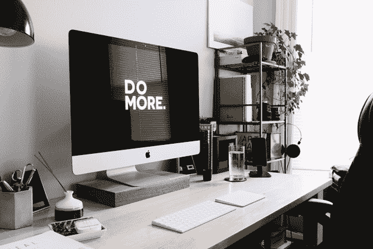

# 别担心，开心点:如何用 5 个简单的步骤打造你未来的科技职业生涯。

> 原文：<https://www.freecodecamp.org/news/dont-worry-be-happy-how-to-build-your-future-tech-career-in-5-simple-steps-5a4e759793db/>

迈克尔·汤博尔

# 别担心，开心点:如何用 5 个简单的步骤打造你未来的科技职业生涯。

> "不要说"我没有时间"，试着说"这不是首要任务"，然后看看感觉如何。"劳拉·范德卡姆

转行很难。再加上一份全职工作和几个孩子，这个任务似乎几乎不可能完成。然而，即使你很忙，你也可以优先考虑，腾出时间专注于对你来说重要的事情，并**积累技能，提升你的职业生涯** *。*

#### **用代码**设计您的未来

我六个月前才开始我的编码之旅。现在我离在 freeCodeCamp 上完成我的前端开发者证书还差一个项目。我还在 Udemy 上完成了柯尔特·斯蒂尔的 web 开发者训练营课程。我在抚养两个孩子的同时做着全职工作。

当我开始使用这些技巧时，我看到我的进步增加了十倍。我知道，如果我在旅程中早点实施它们，我会取得更大的成就。我不仅从提高的生产力中受益，而且我感到更加平衡，比以往任何时候都更有乐趣。

#### **我转向网络开发的支点**

在做了五年的医疗保健后，我意识到这并不是我下半辈子想做的事情。不要误解我——我喜欢帮助人们走向健康，但我讨厌看到系统为他们而崩溃。我讨厌人们付不起药费，或者他们的医疗计划与他们需要的治疗不同步。

我想做更多的事来帮助这些人。但是我知道我不能做得更多，除非我后退一步，看看更大的画面。

我并不总是对编码感兴趣，但是我越是关注那些真正改变当今世界的力量，就越是发现这些进步背后的技术。

我看到了一个做出有意义的改变的机会，那就是我对编码感兴趣的时候。

#### 你为什么要编码？

不管是什么原因，真的好好想想，确定下来。把它作为推动你实现编码目标的动力。有了这个最终目标将帮助你突破停滞期，推进困难的部分(编码是困难的)。

我在当前工作中度过的每一天都激励我回家，启动我的笔记本电脑，继续我学习如何编码的旅程。

好消息是构建编码技能很简单。你所要做的就是编码一个批次。但是**不幸的是**、**T5 这就是难的地方。至少可以说，在你繁忙的生活中安排时间进行常规编码是很困难的。**

#### **如何攀登编码之山**

你现在的位置和你想要的位置之间有差距。这就是你阅读这篇文章的原因。这就是为什么你日以继夜地工作，最终牺牲掉与家人和爱人在一起的时间。

如果我们把所有的时间都花在实现我们的目标上，最重要的是让我们花在学习如何编码上的时间**最多**。

以下是将这个梦想变成现实的五个步骤:

1.  **创建您的个性化目标**

为了充分利用你的时间，没有什么比制定可行的短期目标更重要的了。这不仅有助于你每次达到目标时都有一种成就感，而且有助于让编码之旅不那么令人生畏。

**目标锻炼！**

为了帮助你制定目标，我想鼓励你做一个快速练习，这是我从劳拉·凡德卡姆那里学来的。

1.想象一年后的自己。你已经粉碎了所有的编码目标，并得到了你梦想中的工作。你在世界各地的会议上做了五次演讲，你开发了自己的应用程序，并取得了成功。无论成功对你来说是什么样子，想象一下你未来的自己。请胸怀大志，也许甚至有点梦想。

2.那一年你完成了什么 3 - 5 个目标让它如此成功？

3.把这些目标写下来。

4.为你的个人生活目标重复这个练习。不可能一直工作，要想成功，你需要工作与生活的平衡(否则你会精疲力尽)。

现在你有 6 - 10 个雄心勃勃的目标想要在下一年完成。为了将这些更大的目标分解成行动项目，思考并计划如何实现这些目标。

例如，如果你想完成 freeCodeCamp 前端证书，你需要安排一周的时间来完成它。想跑马拉松，需要买跑鞋，报名参加马拉松，安排时间定期训练。

**2。** **制定时间表**

老实说，我绝对不是那种会安排时间的人。我以为我可以日复一日地即兴发挥。但实际上，你需要留出时间来集中注意力，否则你的目标会涌入你的余生。当我和家人在一起或者哄孩子睡觉时，我发现自己对编码感到焦虑，因为那天我还没有编码。

我整天期待的事情(编码)开始对我的生活质量产生负面影响。

把你的时间分成几个集中的部分可以让你 100%的活在当下。当它是编码时间，你可以有隧道视野和黑客攻击了。当到了放松的时候，或者和你关心的人出去玩的时候，你可以在场，因为你那天早上编码了，或者把时间安排在一天的晚些时候。

以下是我个人日程表的一个例子:

如你所见，我安排了很多家庭时间。家庭对我来说真的很重要。你的时间表看起来会有很大的不同，但关键是要制定一个时间表，让你实现目标，同时不会讨厌生活。试着把每件事都考虑进去，这样你就能坚持你的计划。

**3。** **审核自己寻找时机**

写下某一天或某一周的所有活动，看看你真正用你的时间做了什么。你可能会惊讶于自己无意识地浏览 Instagram 页面，或者疯狂观看新的网飞节目(我喜欢奇怪的东西)所花的时间。

我并不是要你把它们都去掉，而是要保持平衡。您肯定可以将一些空闲时间转化为一些重要的编码收益。

**时间比你想象的要多**

如果你还在想，“是的，但是我仍然工作很多，所以我没有时间”，那么这里有一个有趣的事实！一周有 168 个小时。如果你一周工作 40 小时，减去每晚 8 小时的睡眠时间(我肯定没睡够)，你仍然有 72 小时的“空闲”时间。

看看你在生活中所拥有的时间，尽你所能在这段时间里挤出尽可能多的“好”东西。那里**是**时间。

**4。** **让你的时间充满品质**

下面是一些工具，我用它们来帮助我完成我的编码目标，并专注于我的学习之路:

**freeCodeCamp**

说真的，这是实现目标的最佳工具之一。课程就在那里等着你去遵循和学习，它甚至跟踪你的进度！

**JavaScript 30**

30 JavaScript 项目真的可以帮助你掌握数组方法，同时用项目填满你的投资组合(另外它非常有趣)。Wes Bos 是一位可靠的讲师，提供优质的免费课程。你可以在连续 30 天内完成，或者将其纳入你的学习计划。

**推特上的 100 天代码**

这个 100 天的挑战包括每天编写代码，并在推特上发布你所做的事情。这是一个很好的工具，可以用来跟踪进度，衡量你已经走了多远。这个社区充满了来自世界各地的鼓舞人心的人，是认识志同道合的开发人员的好方法。

**网络开发者训练营**

这门课我快学完了，它修补了我编码知识的很多漏洞。柯尔特不仅仅向你展示如何做某事，他还解释了为什么你用某种方式做某事。另外，现在有一个高级 web 开发人员训练营，一旦我完成了，我就去参加。

**尽情享受吧！**

这不是一种资源，但你应该通过生活来拥抱技术社区。开车去上班或洗碗的时候听听播客。在 Twitter 上关注行业领袖。看文章。沉浸在科技中，你会在不知不觉中学习。

**5。** **乘以你的时间**

我们已经设定了目标，现在有几个更大的目标被分解成可操作的目标。我们已经讨论了如何将这些目标融入你忙碌的生活，我也给了你一些如何打发时间的建议。现在，我想告诉你如何最大限度地利用你投入编码的时间。

答案是:快乐！

你会问，快乐和管理时间有什么关系？简单来说:就是**一切**。这个想法叫做倍增你的时间。

活在当下并高度专注会提高生产力。这反过来通过提高效率来增加你花费的时间。另外，谁不想开心呢？

肖恩·阿克尔研究了快乐的影响及其与生产力的联系，他认为，当你感到快乐时，你的大脑表现得更有效率。

当你感觉积极时，多巴胺会涌入你的系统，它有两个作用:

1.  它让你更快乐(咄！)
2.  它开启了你大脑中的学习中心。它们帮助你更容易地学习，让你花更少的时间学习，同时保留更多的信息。

把你的大脑变成多巴胺制造机器！

你可以通过创造持久、积极的变化来释放更多的多巴胺。你可以在日常生活中做五件事，把你的大脑变成一台制造多巴胺的机器:

1.写下你每天感激的三件新事情。这创造了扫描世界寻找积极事物的习惯，而不是消极事物。

2.写下你在过去 24 小时内的一次正面经历。这让你重新体验导致相同多巴胺反应的积极体验。

3.**运动。**在编码会议之前，走一小段路，或者进行一次快速锻炼。锻炼会释放大量的多巴胺。

4.**沉思。冥想训练你的大脑更加专注于手头的任务，同时释放多巴胺。**

5.随意的善举。感谢你的社会支持网络中帮助过你的人，或者帮助过别人。这不仅为你释放了多巴胺，也为你帮助过的人释放了多巴胺(他们可能会向前支付)。

#### **用一段段的时间打造你的未来**

即使我们很忙，我们也必须抽出时间做最重要的事情。当你专注于重要的事情时，你可以用你所拥有的时间构建你想要的生活。

感谢你阅读这篇文章！你可以在推特上找到我