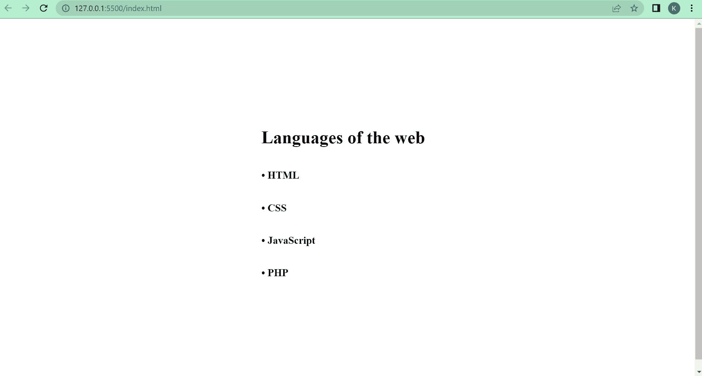
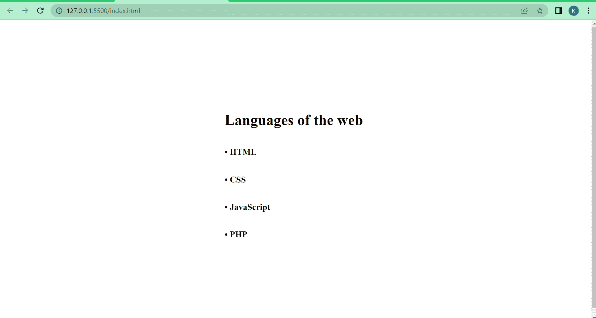

# 点符号–HTML Unicode 中的项目符号

> 原文：<https://www.freecodecamp.org/news/dot-symbol-bullet-point-in-html-unicode/>

在你的 HTML 文档中，你经常需要制作一个条目列表。你可以用项目符号来达到这个目的。

您可以使用项目符号的 Unicode 字符(或实体)来显示项目符号。

在本文中，我将向您展示在网页上显示项目符号的 Unicode 和 HTML 实体。

在这篇文章的结尾，我还将向你展示 5 个组合键，你可以用它们来键入一个大点符号。

## 项目符号的 Unicode 和 HTML 实体

用于显示点符号或项目符号的 Unicode 字符是`U+2022`。

但是要正确地使用这个 Unicode，需要删除`U+`，用&符号(`&`)、井号(`#`)和`x`代替。然后输入 2022 这个数字，再加上一个分号。所以，它变成了`&#x2022;`。

它看起来会像这样:

```
<h1>Languages of the web</h1>
<h3>&#x2022; HTML</h3>
<h3>&#x2022; CSS</h3>
<h3>&#x2022; JavaScript</h3>
<h3>&#x2022; PHP</h3> 
```



除了`&#x2022;` Unicode 字符，你还可以使用`&bull;`和`&#8226;` HTML 实体在网页上显示项目符号或点符号。

```
<h1>Languages of the web</h1>
<h3>&#8226; HTML</h3>
<h3>&bull; CSS</h3>
<h3>&#8226; JavaScript</h3>
<h3>&bull; PHP</h3> 
```

输出保持不变:


## 用于键入点符号的键盘快捷键

要在键盘上键入点符号，按下`NumLk`打开数字键盘，按住`Alt`并连续按下`0`、`1`、`4`和`9`键。

如果您不使用数字键盘键入数字，点符号将不会显示。

感谢您的阅读！