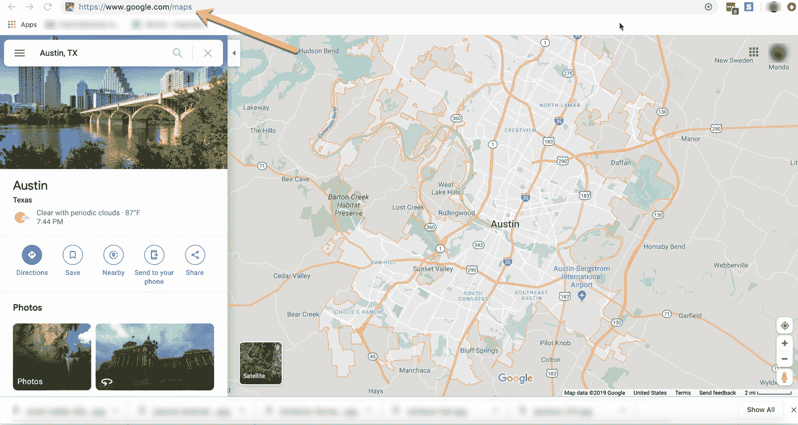
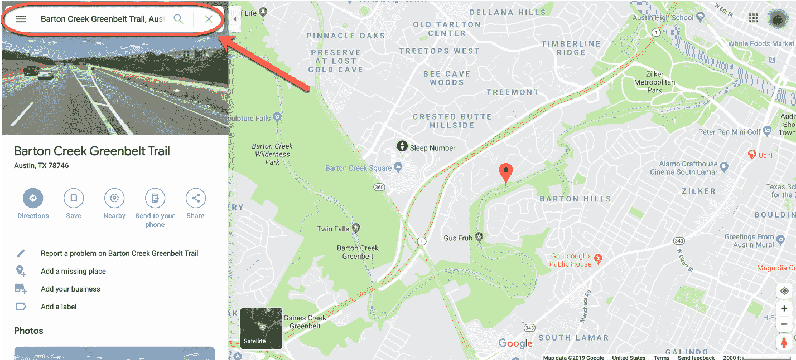
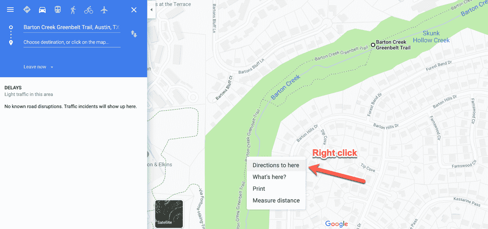
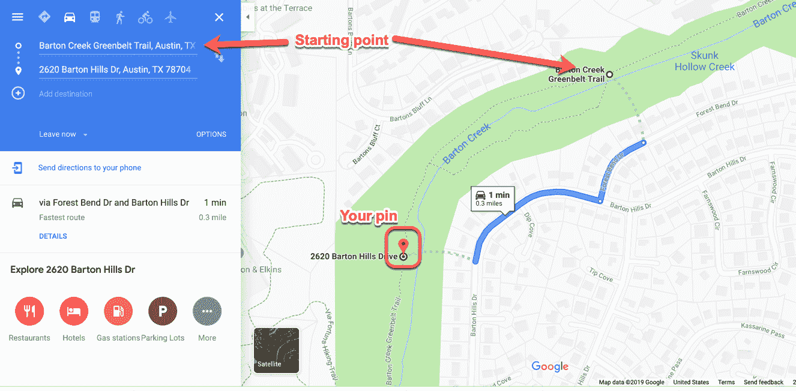
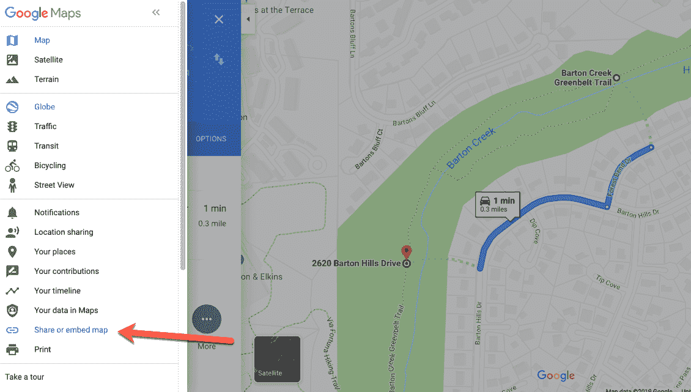
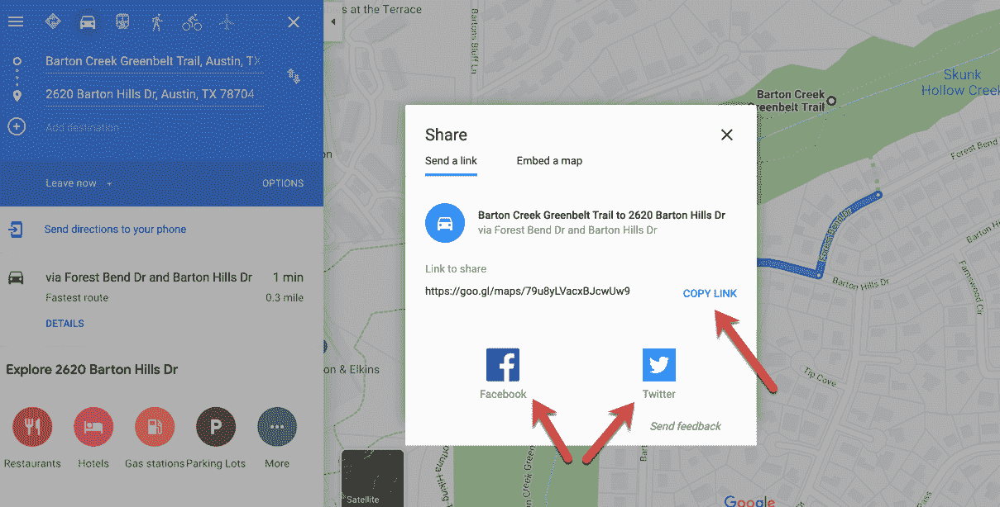
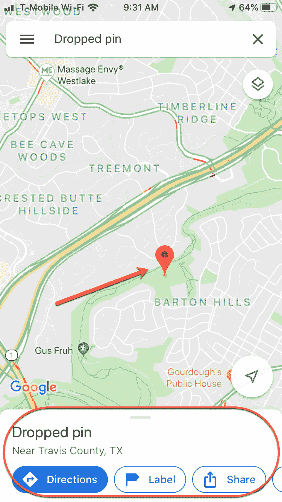
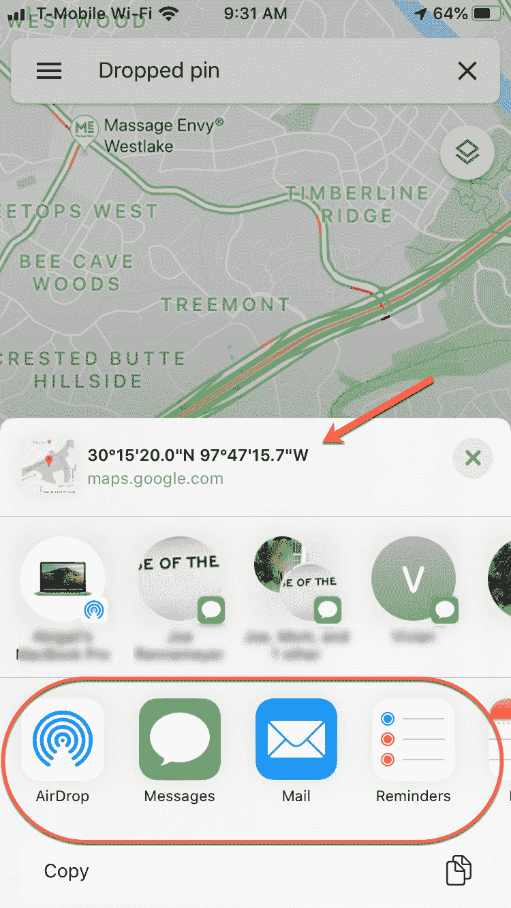
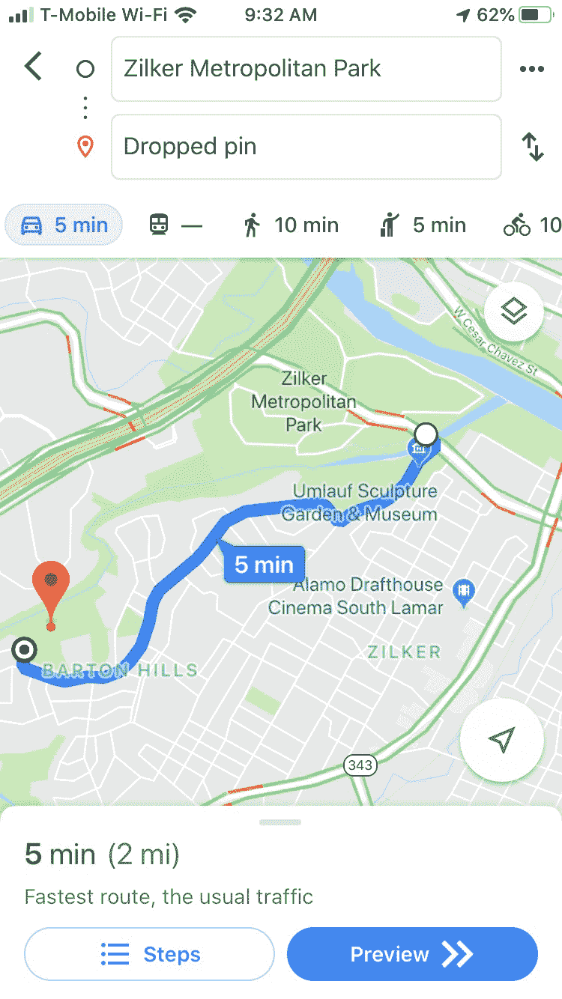
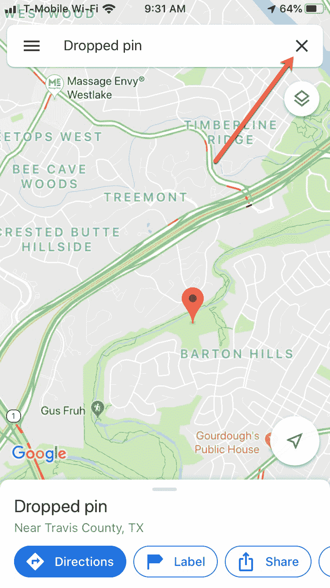

# 谷歌地图中掉落的图钉——如何锁定位置和移除图钉

> 原文：<https://www.freecodecamp.org/news/dropped-pins-in-google-maps-how-to-pin-a-location-and-remove-a-pin/>

如果你在一个有实际地址的地方，告诉朋友在哪里见你是很容易的。但是如果你想在一个大公园里找到对方呢？或者你想告诉他们你在那条无名的土路上的超级秘密露营点在哪里？

有一个比告诉他们“在大树后的奶牛处左转”更简单的方法:在谷歌地图上放一个大头针。

## 这是什么意思？

当你把一个大头针放到你的准确位置时，你就保存了那个点的 GPS 坐标。

这样，当你和你的朋友分享时，你是在告诉他们你的确切位置，而不是最近的街道地址(可能有几英里远)。

### 那么你是怎么做到的呢？

让我们来看看在您的电脑和手机上从 Google Maps 添加(和删除)pin 的步骤。

## 如何在您的 PC 上放置一个 pin:

### 第一步:打开你最喜欢的浏览器，进入谷歌地图。

### 第二步:去一个更具体的地方

在“搜索谷歌地图”字段中，输入更具体的位置，以便缩小搜索范围。

Pick your starting point

现在你越来越接近了。但还是不够近。奥斯汀的巴顿河绿地是一个相当大的地方。所以放大一点。

### 第三步:放下你的密码

放大后，选择要锁定的位置。右键单击，然后从出现的下拉列表中选择“到此处的方向”:

Right click to drop that pin exactly where you are (or want to go)

然后它会让你输入一个起点(你的朋友来自哪里？)并将产生到该地点的驾驶方向。

Getting directions

### 第四步:分享你的方向

现在你只需要告诉你的朋友去哪里，这样你就会想要分享这些方向。

点击左上角的汉堡菜单(三个横条)，从长长的下拉列表中选择“共享或嵌入地图”。

Share 'em with a friend

你可以选择通过社交媒体分享链接，或者如果你想保密，复制链接并直接发送给你的朋友:

Or share 'em with everyone (only if you want the world to know where you are)

这就对了。你的朋友现在更有可能找到你。

### 如何移除 pin

如果您想从 Google Maps 中删除 pin，只需右键单击并选择“删除此目的地”噗，没了。

## 如何在你的手机上放一个大头针

在你的 iPhone 上掉个大头针超级容易。只需打开谷歌地图应用程序，导航到您所在/想要去的大致区域。

### 第一步:找到你的位置

放大，就像我们上面做的那样，直到你可以看到你想要锁定的点。然后按住屏幕，直到那个红色的小大头针掉下来:

Just a light press and hold will bring up that red pin

一旦你放置了大头针，你会在底部看到一些选项。您可以选择:

*   得到从某个地方到那个地方的方向
*   标记该点以备将来使用
*   通过文本、电子邮件等方式共享 GPS 坐标(通过链接)
*   下载地图，以便您可以离线访问

### 第二步:分享你的个人识别码

您可以和朋友分享您的 pin 码，就像我们上面所做的一样。例如，您可以通过文本发送坐标/链接:

Choose to share your location via air drop, message, email and so on.

您还可以获得从某个位置到大头针的方向。如果您选择此选项，只需选择“方向”选项卡并输入起点。

For the visual learners out there...

看，很简单:)

### 如何移除 pin

如果你想删除那个大头针，只需在搜索栏中点击 x，它就会消失。

Just clear the search field and the pin will go away.

现在你可以随时找到你的朋友(或者被找到)——即使你在偏僻的地方。