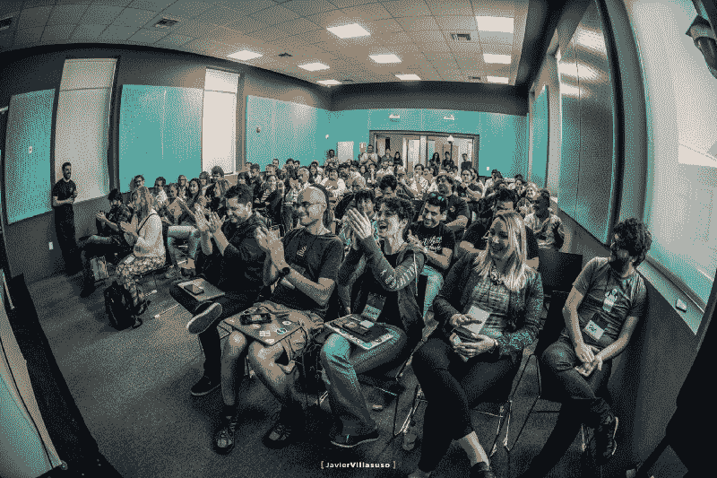
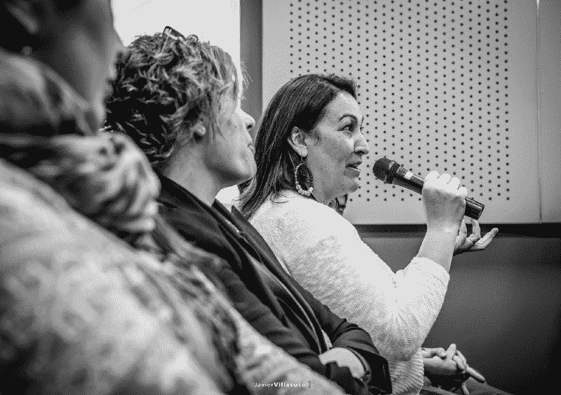
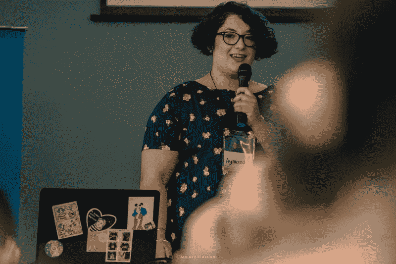
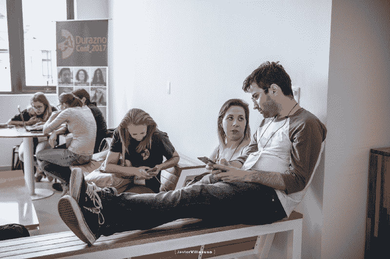
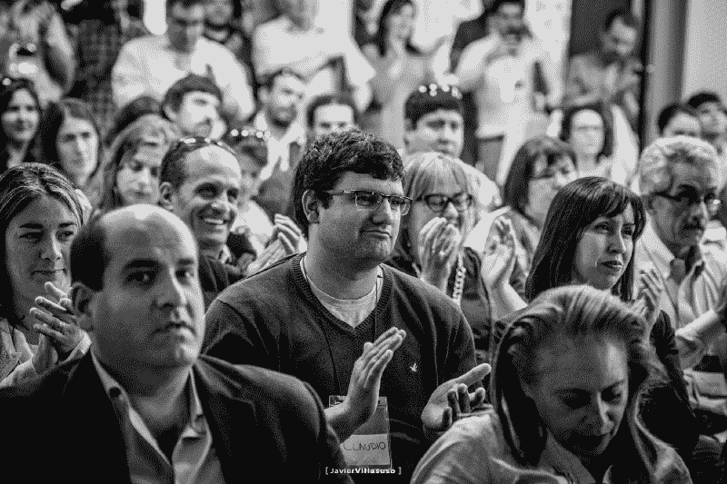
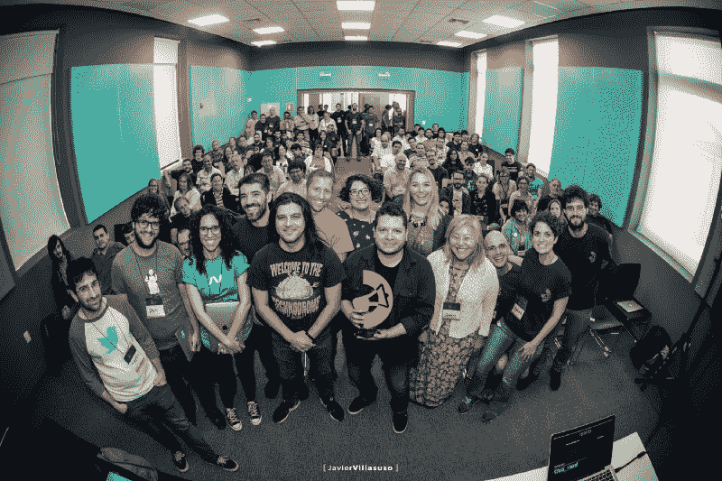

# 我从 DuraznoConf 学到的关于编程中人性的一面

> 原文：<https://www.freecodecamp.org/news/duraznoconf-the-human-side-of-programming-12b5f679b312/>

阿尔瓦罗·维德拉

# 我从 DuraznoConf 学到的关于编程中人性的一面

DuraznoConf 2017 — Photo by Javier Villasuso

"我不敢相信我说服了你们所有人来杜拉斯诺！"说完这些话，我欢迎九名阿根廷人和一名美国人来到我的家乡。这是一个寒冷的春夜的凌晨 3 点，在乌拉圭中部的城市杜拉斯诺，这几乎就像在一个不知名的地方说*。*

*我们离 DuraznoConf 的开始只有一天半的时间了。这个活动开始是一个技术会议，但随着时间的推移，它变得比我们曾经希望的任何事情都要大。*

*在我继续说下去之前，DuraznoConf 是什么？*

*[DuraznoConf](http://duraznoconf.uy/2017/) 是去年 10 月 23 日和 24 日在乌拉圭杜拉斯诺召开的会议(我们已经在准备今年的[版](https://twitter.com/DuraznoConf/status/1024017244425252864))。).*

*这个会议从 Twitter 上的一个笑话开始——这个笑话持续了太长时间——直到它成为一个真正的技术会议。去年 7 月底，我发了以下推文:*

*这条推文发出后，一条又一条回复回来，人们渴望参加这样的活动，只是为了参观拥有 3 万人口的杜拉斯诺镇。但不是任何一个城镇:一个我承诺会发生意想不到的事情的城镇。当然，这座城市名不虚传，但这是后来的事了。*

### *让会议召开*

*那么，当我们住在瑞士的时候，我们是如何从发推特到实际组织会议的呢？*

*当我发现回复我的微博的人不是在开玩笑时，我决定打电话给这个城市的市长，T2 市长卡梅隆·维达林。就在那里，我告诉他，我想在杜拉斯诺组织一次独特的科技活动，邀请科技界的顶尖人士在大会上发言。他喜欢这个想法，并告诉我，我可以指望城市的支持。*

*下一步是找一个场地。这里运气也站在我们这边。不久前，UTEC 一所新大学刚刚在杜拉斯诺开张。它不是普通的大学，而是一所科技大学。*

*所以我联系了大学校长丹妮拉·冈萨雷斯，告诉她我的想法。她也很喜欢它，第二天她就已经在和市政府谈判，看他们如何合作来实现它。*

**

*当我们继续推进涉及使技术会议成为现实的许多细节时，我不断看到这一点:人们不断插话，询问他们是否可以以任何方式伸出援手。*

*但是在我开始之前，让我们看看我们是如何为会议建立一个网站的。*

### *把话传出去*

*就在那时，我打电话给巴勃罗·弗朗哥，他是来自杜拉斯诺的一名优秀的创意人员，也是一名网页设计师。我想，如果我们想把科技场景带到杜拉斯诺，我们不妨从展示本地人才开始。因此，Pablo 不仅是设计网站的最佳人选，也是 DuraznoConf 整体形象的最佳人选——徽标、颜色、横幅、t 恤等等。*

*当我给帕布罗打电话时，他马上接受了。不仅如此，他说，“我知道谁能负责会议摄影”。他联系了来自杜拉斯诺的优秀摄影师 Javier Villasuso，他也喜欢和我们一起工作。*

*就这样，关于会议的消息开始在城市里流传，更多的人不断打电话来提供帮助。在此，我要特别提到马塞洛·蒙迪诺，他是当地电视制作公司“斑马电视台”的老板，也是当地电视频道“Canal Seis”的负责人。*

*一天晚上，马塞洛打电话给我，告诉我他不仅提供他的电视频道向全市播放会议，而且他将与蒙得维的亚的人们联系，这样会议将最终向全国播放！*

*他确实做到了！他联系了乌拉圭主要电信公司的流媒体服务公司 VeraTV，在那里他们向全世界直播了这次会议。*

*但马塞洛的努力并没有就此停止，他与该国主要的有线电视提供商 TCC 取得了联系，通过他们的频道 [Asuntos Públicos](https://www.tccvivo.com.uy/title/315827) ，他们向全国所有的订户转播了这次活动。多亏了这些曝光，一些不能去 DuraznoConf 看孙子们演讲的祖母们可以在他们舒适的客厅里看到他们了！*

### *创建网站*

*接下来要做的是创建网站。就在这时，我们的一位发言人，艾马拉·萨穆迪奥(Aymará Samudio)跳了进来，向她提供了帮助。不仅如此，在和她聊天时，我们头脑风暴出了会议的口号:*编程的人性一面。**

*

DuraznoConf 2017 — Photo by Javier Villasuso* 

### *代表权问题*

*我们的目标不仅仅是举办另一场科技会议。我们希望召开一次会议，将人们聚集在一起，并帮助在遥远的地方形成一个社区。*

*我们也想促进技术和编程，为那些可能还没有机会参与其中的人们。*

*乌拉圭是一个拥有 350 万人口的国家，一半人口居住在首都。这意味着，纵观历史，我们看到了一个高度中央集权的国家，像大学、医院和其他许多东西只存在于首都。*

*UTEC 在杜拉斯诺的成立代表了一种改变这种状况的努力，将高等教育带到了农村。由于杜拉斯诺位于该国的中心，它成为其总部之一。*

*这是 DuraznoConf 的第一步，我们希望给人们带来榜样。我们想向他们展示，其他和他们一样，有着相似奋斗经历的人，也能够在科技领域开始职业生涯。*

*艾马拉说“你不能成为你看不见的人”，我完全同意她的观点。代表权很重要。考虑到这一点，我们寻找能够分享他们如何在技术领域开始职业生涯的故事的演讲者，尽管他们几乎是局外人，或者在其他情况下，他们克服了所有困难。与此同时，我们希望让那些脚踏实地的人参与进来——那些可以分享他们鼓舞人心的故事，同时向我们传达“如果我做到了，你也能做到”的信息。*

*

DuraznoConf 2017 — Photo by Javier Villasuso* 

*考虑到这一点，我们邀请了来自乌拉圭农村、甚至比杜拉斯诺还小的城镇的演讲者。这些演讲者为西班牙的公司或 StackOverflow 之类的公司远程工作，如罗德里戈·门德斯和 T2。*

*他们的远程工作经历尤为重要，因为 UTEC 的目标之一是教育农村地区的人们，这样他们就可以在这里发挥自己的才能。否则，学习然后不得不搬到蒙得维的亚找工作是没有意义的。*

*我们也邀请了来自阿根廷农村的演讲者，比如住在阿根廷安第斯山脉的 Aymará Samudio，她在那里开办了一所学院，帮助女性进入编程领域。同样来自附近省份的我们邀请了 [Pablo Sanchez](https://www.freecodecamp.org/news/duraznoconf-the-human-side-of-programming-12b5f679b312/undefined) ，他将自己的创业公司卖给了 [Mercado Libre](https://www.mercadolibre.com.ar) ，拉丁美洲最大的在线零售商。这两个故事对 DuraznoConf 来说都很有意义。*

*然后我们遇到了劳拉·桑塔纳，她是一名古巴工程师，为了在科技领域发展，她搬到了乌拉圭。她讲述了一个惊人的故事，讲述了她如何在古巴学习编程，然后在几乎没有互联网的情况下发出求职申请和练习。非常鼓舞人心。*

*从蒙得维的亚，我们有纽约的费德里卡·佩尔泽，他是万事达卡平台和数据分析总监。她也曾在布宜诺斯艾利斯政府工作过，所以让她分享她如何在世界顶级城市之一工作的经历真是太棒了。*

*说到纽约，我们有我所知道的最有才华的阿根廷程序员之一，Dan Zajdband。他讲述了自己如何通过一条推文开始一场对话，并让自己在《纽约时报》工作的故事。用他自己的话说:“有一天，我看到自己与普利策奖获得者共用办公室”。*

*我们还邀请了来自蒙得维的亚的 Daniela Vázquez，她是一名经济学家，后来成为了 NASA 数据科学社区的一员！多好的经历啊。这非常符合我们想通过这次会议传达的信息。正如我上面所说的，在 UTEC 之前，杜拉斯诺的许多人没有机会选择科技行业，因为那里没有科技行业！*

*丹妮拉表明，即使在完成学业后，也有可能转向科技行业。*

*最后，我们邀请乔伊斯·帕克在大会上发言。她对我来说是一个非常特别的人，因为，多亏了她的[书](https://www.amazon.com/PHP5-MySQL-Bible-Tim-Converse/dp/0764557467)，我让[开始了编程](https://medium.freecodecamp.org/become-how-i-went-from-selling-food-in-the-street-to-working-for-top-firms-in-tech-6aa61a2d0629)。那是十多年前的事了，那时在杜拉斯诺还没有大学。Joyce 是一位硅谷资深人士，她向我们讲述了她在创业世界的经历，目的是分享她在杜拉斯诺创造创业场景的技巧(请不要告诉任何人，但她的韩国妈妈是整个硅谷最好的帕尔塔吐司)。*

### *研讨会——实践经验*

*谈判一结束，我们就想为会议安排一些研讨会。这将使人们能够了解新技术、编程语言以及在团队中高效工作的方式。*

*为此，我们请来了 Sebastián Waisbrot 给我们开了一个围棋研习班，[Guido vila Rio](https://twitter.com/gvilarino)开了他的 Docker 研习班，来自意大利的 [Jacopo Romei](https://twitter.com/jacoporomei) 向我们展示了如何使用点游戏来教授人们在团队中工作的有效方法，最后，令人惊叹的 [Aymará Samudio](https://www.freecodecamp.org/news/duraznoconf-the-human-side-of-programming-12b5f679b312/undefined) 上了关于初始 Web 开发的课。*

*在 Aymará的工作室里，我们让青少年和五十多岁的人一起学习编程——大家一起学习。UTEC 能给每个参与者提供他们自己的电脑真是太好了，所以没有人觉得被遗忘了。*

### *让会议召开*

*所以我们有了演讲者，我们有了会议的设计和图像，还有网站。然后是时候让事情发生了。这时，来自 UTEC 的 Daniela González 和她的秘书 Pablo Salazar 介入并制定了所有的后勤工作，以便该大学为举办活动做好准备。*

*他们还负责与市政府协调所有细节，从为会议提供流媒体，到安排演讲者的交通和住宿。市政府甚至为演讲者提供了导游，让他们可以参观镇上所有的旅游景点，以及该市的主要产业。*

### *杜拉兹诺，奇迹发生的城市*

*说到住宿，在会议的前一天晚上，我们意识到从阿根廷来的人将在凌晨 3 点左右到达杜拉斯诺，但他们预订的酒店在中午就已经入住了。我打电话给杜拉斯诺酒店的老板，告诉他我们的问题。“我五分钟后给你回电话”。五分钟后，他免费为我们安排了两个人的住宿。那是杜拉斯诺的人们试图让事情发生。*

*但是我们还得在其他地方再装 8 个。这时候大学打电话给空军——是的，不要表现出惊讶，杜拉斯诺有一个国际机场。*

*空军和我们共用一个士兵营房，这样我们其他的阿根廷客人就可以在那里过夜。第二天早上，军用飞机用引擎叫醒他们，同时飞行员开始训练机动。对于一些阿根廷观众来说，这是一次难忘的经历。*

*

DuraznoConf 2017 — Photo by Javier Villasuso* 

*但是帮助并没有就此停止。我们不得不在凌晨 3:00 从汽车站接他们，把他们带到他们的旅馆或镇外的空军。那天晚上，我和 Diaro El Acontecer 的一些朋友谈论了我们为会议所做的准备。他们帮助我们通过他们的报纸来宣传这次会议，他们写了关于这次会议的文章，还刊登了关于这次会议的广告。报纸老板马丁·罗曼要了我的电话，告诉我他会尽力帮我。半小时后，他自告奋勇开了一辆小巴去车站接人！*

*这些是我们在会议期间的许多经历中的一部分，我们看到一个城市聚集在一起，使会议得以举行。这让我感到非常自豪，因为我想告诉大家，如果杜拉斯诺做到了，我们就能让事情发生。*

### *宣传会议*

*如上所述，由于 Marcelo Mondino，会议通过有线电视和流媒体到达了国家电视台。Diario El Acontecer 通过他们当地的报纸帮助我们宣传这次会议，但我们也想走向全国。*

*我们让乌拉圭的主要报纸《国家报》写了几篇关于 DuraznoConf 的文章。El Observador 也在他们的[技术门户](https://www.cromo.com.uy/duraznoconf-el-lado-humano-la-programacion-n1144586)上写了相关内容。*

*我们也在阿根廷的主要报纸上得到了报道，阿根廷报纸撰写了一篇关于我们的发言人 T2 的报道。[巴西 InfoQ】也报道了这次会议。](https://www.infoq.com/br/news/2017/11/durazno-conf-2017)*

*在会议期间，我们参观了当地的电台和电视频道，活动结束后，演讲者被邀请在当地议会讨论在杜拉斯诺创造一个技术场景的重要性。*

### *多元化很重要*

*总的来说，我们试图为这次会议制造很多噪音，因为我们想向人们展示将技术带到农村和遥远的地方是至关重要的。重要事件不仅仅发生在大国的首都。*

*

DuraznoConf 2017 — Photo by Javier Villasuso* 

*此外，从物流的角度来看，把 10 个优秀的演讲者带到一个遥远的城市很容易，就像强迫每个人从遥远的城市飞到只在美国或欧洲举行的会议一样容易。*

*有时，由于经济原因，拉丁美洲的人们很难参加美国或欧洲的科技活动。将科技会议带到拉丁美洲有助于扩大那里每个人接触科技的渠道。这些分享的经验丰富了每个人的视角，这是技术世界真正需要的东西。我们需要让科技变得可及和负担得起。*

### *社区*

*我从这次会议中得到的最大收获是围绕演讲者形成的社区，以及这座城市本身。每个人都觉得他们是一个家庭的一部分，我们试图互相帮助，使会议最终取得成功。*

*我交了很多新朋友，也有了难忘的经历。最后，我想分享阿塔瓦尔帕·尤潘基的歌曲《Los Hermanos》中的一些歌词。*

> *我有这么多**兄弟**我不能告诉他们。山谷、山、潘帕斯和大海。每个人都有自己的工作梦想每个人。带着希望前进，带着回忆前进。*

*

DuraznoConf 2017 Group Photo — by Javier Villasuso* 

#### *笔记*

*   *Javier Villasuso 的照片。*
*   *你可以在这里观看 DuraznoConf 2017 [的演讲。](https://www.youtube.com/watch?v=4gv7dNuWyRw&list=PLWAe4csrFAcZlnckP3Qrh9oFAAEFA_Etr)*