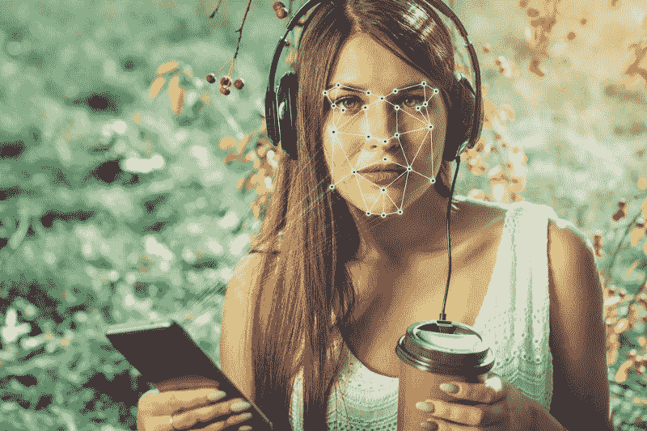
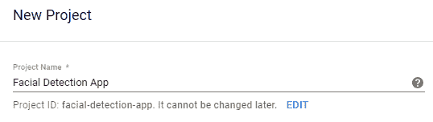
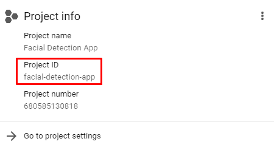
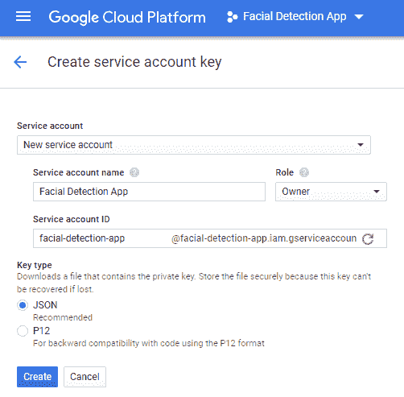
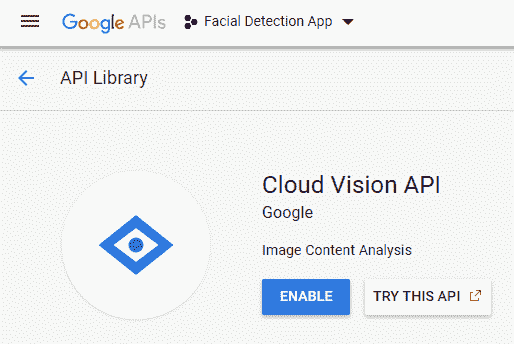
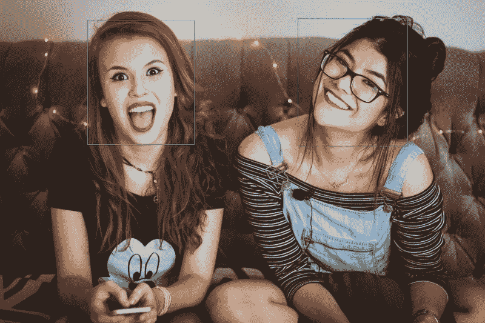

# 在您的 Laravel PHP 应用程序中轻松实现面部检测

> 原文：<https://www.freecodecamp.org/news/easy-facial-detection-in-your-laravel-php-application-11664ac9c9b9/>

作者达伦·乔勒斯

# 在您的 Laravel PHP 应用程序中轻松实现面部检测

#### 使用谷歌云视觉 API 检测图像中的人脸



你可能以前见过面部检测。一旦你把全家福上传到脸书，你会注意到所有检测到的面孔周围的方框。通过面部识别功能，它有时甚至会自动标记正确的朋友。它并不总是 100%准确，但它仍然是一些伟大的工程！

### 面部检测的应用

在本文中，我们将使用 Google Cloud Vision API 来检测人脸。我们将使用现有的图像，并在每个检测到的人脸周围画一个方框。

面部检测有几个真实世界的用例。其中包括:

*   检测上传的图像是否有人脸。这可能是“了解你的客户”识别工作流程中的一个筛选步骤。
*   允许用户生成内容的应用程序的图像审核。
*   提供标记的能力，就像社交网络一样。

### Cloud Vision API 中提供的其他功能

面部检测只是这个 API 提供的众多功能之一。它支持以下附加功能:

*   流行标志的检测。
*   检测适用于图像的所有类别的能力。例如，一张猫的照片可能会产生类别:猫、哺乳动物、脊椎动物和波斯猫。
*   检测受欢迎的自然和人造地标。
*   从图像中提取文本。
*   运行安全搜索检测来标记包含成人内容或暴力的图像。

### Google 云平台设置

第一步是在 Google 云平台控制台中创建一个新项目。



前往仪表板，[创建一个新项目](https://console.cloud.google.com/projectcreate)。



一旦创建了项目，就将项目 ID 放在手边。



请遵循以下步骤:

*   一旦您有了项目，请转到[创建服务帐户密钥](https://console.cloud.google.com/apis/credentials/serviceaccountkey)页面。
*   确保您的面部检测项目在顶部被选中。
*   在“服务帐户**”**下，选择“新服务帐户”。
*   在“服务帐户名称”中输入名称。
*   在“角色”下，选择“项目”>“所有者”。
*   最后，单击“Create”自动下载 JSON 凭证文件。



您可能还需要通过 [API 库](https://console.developers.google.com/apis/library/vision.googleapis.com)部分启用云视觉 API。

### Laravel 项目设置

下一步是建立一个新的 Laravel 项目。如果您已经有一个 Laravel 项目，您可以跳过这一步。

我在这篇文章中使用的是 Laravel 5.5 LTS。在命令行中，运行下面的 Composer 命令来创建一个新项目(您也可以使用 [Laravel 安装程序](https://laravel.com/docs/5.5#installing-laravel)):

```
composer create-project --prefer-dist laravel/laravel sample "5.5.*"
```

如果您使用了 Composer，请将 **.env.example** 文件重命名为**。env** ，然后运行以下命令来设置应用程序密钥:

```
php artisan key:generate
```

### 添加谷歌云视觉包

运行以下命令将`google/cloud-vision`包添加到您的项目中:

```
composer require google/cloud-vision
```

您可以将下载的 JSON 凭证文件放在您的应用程序根目录中。不要把它放在你的公共目录里。随意改名。**不要**将这个文件提交给你的代码回购。一种选择是手动将其添加到服务器。

### 最后，我们开始编码吧！

首先，确保你已经安装并激活了 [GD 库](http://php.net/manual/en/image.setup.php)。默认情况下，大多数平台都启用了这一功能。

我将把下面的路由添加到我的“routes/web.php”文件中:

```
Route::get('/', 'SampleController@detectFaces');
```

我创建了一个简单的控制器来存放代码。我将在控制器中添加所有代码。在生产应用程序中，我**强烈建议**对任何业务逻辑使用单独的服务类。这样，控制器是精简的，并坚持他们的初衷:控制输入/输出。

我们将从一个简单的控制器开始，添加一个`use`语句来包含 Google Cloud `ServiceBuilder`类:

```
<?php
```

```
namespace App\Http\Controllers;
```

```
use Google\Cloud\Core\ServiceBuilder;
```

```
class SampleController extends Controller{    public function detectFaces()    {        // Code will be added here    }}
```

我们要做的第一件事是创建一个`ServiceBuilder`类的实例，这样我们就可以指定我们的项目 ID 和 JSON 凭证。

```
$cloud = new ServiceBuilder([     'keyFilePath' => base_path('fda.json'),     'projectId' => 'facial-detection-app' ]);
```

使用`keyFilePath`键指定 JSON 文件的位置。我已经使用 Laravel [base_path()](https://laravel.com/docs/5.5/helpers#method-base-path) 助手来引用完全限定的应用程序根路径。

下一个选项是`projectId`。这是您在 GCP 控制台中创建项目时获得的值。

接下来，我们将创建一个`VisionClient`类的实例。`ServiceBuilder`类通过在 API 中公开各种授权访问服务的工厂方法来简化这一过程。

```
$vision = $cloud->vision();
```

现在我们有了类的实例，我们可以开始使用 Vision API 了。我们将使用下面的图像作为例子。随意下载这张图片，命名为“friends.jpg ”,放在你的“public”文件夹里。


“Two girls looking happily at the camera.” by [Matheus Ferrero](https://unsplash.com/@matheusferrero?utm_source=medium&utm_medium=referral) on [Unsplash](https://unsplash.com?utm_source=medium&utm_medium=referral)

我们将首先使用 GD `imagecreatefromjpeg()`函数创建一个新的图像。我们将使用 [public_path()](https://laravel.com/docs/5.5/helpers#method-public-path) Laravel 助手来引用我们放在“public”文件夹中的图像。

```
$output = imagecreatefromjpeg(public_path('friends.jpg'));
```

接下来，我们将使用相同的图像创建一个云视觉`Image`对象，并指定我们要运行面部检测:

```
$image = $vision->image(file_get_contents(public_path('friends.jpg')), ['FACE_DETECTION']);
```

你会注意到这里有一点小小的变化。我们不是提供图像的路径，而是使用`file_get_contents()`以字符串的形式提供实际的图像。

然后我们对图像运行`annote()`方法:

```
$results = $vision->annotate($image);
```

现在我们有了结果，我们只需要循环遍历找到的面，并使用结果中提供的顶点在它们周围绘制方框:

```
foreach ($results->faces() as $face) {    $vertices = $face->boundingPoly()['vertices'];
```

```
 $x1 = $vertices[0]['x'];    $y1 = $vertices[0]['y'];    $x2 = $vertices[2]['x'];    $y2 = $vertices[2]['y'];
```

```
 imagerectangle($output, $x1, $y1, $x2, $y2, 0x00ff00);}
```

完成后，我们可以输出图像并销毁它以释放内存:

```
header('Content-Type: image/jpeg'); imagejpeg($output); imagedestroy($output);
```

这就是结果:



下面是最终的控制器类代码:

```
<?php
```

```
namespace App\Http\Controllers;
```

```
use Google\Cloud\Core\ServiceBuilder;
```

```
class SampleController extends Controller{    public function detectFaces()    {        $cloud = new ServiceBuilder([            'keyFilePath' => base_path('fda.json'),            'projectId' => 'facial-detection-app'        ]);
```

```
 $vision = $cloud->vision();
```

```
 $output = imagecreatefromjpeg(public_path('friends.jpg'));        $image = $vision->image(file_get_contents(public_path('friends.jpg')), ['FACE_DETECTION']);        $results = $vision->annotate($image);
```

```
 foreach ($results->faces() as $face) {            $vertices = $face->boundingPoly()['vertices'];
```

```
 $x1 = $vertices[0]['x'];            $y1 = $vertices[0]['y'];            $x2 = $vertices[2]['x'];            $y2 = $vertices[2]['y'];
```

```
 imagerectangle($output, $x1, $y1, $x2, $y2, 0x00ff00);        }
```

```
 header('Content-Type: image/jpeg');
```

```
 imagejpeg($output);        imagedestroy($output);    }}
```

### 附加功能

除了获取顶点之外，响应还包括大量有用的信息。这包括嘴、眼睛、眉毛、鼻子等的位置。简单地用`print_r()`变量`$face`快速查看可用数据。

另一个伟大的功能是检查检测到的脸是快乐，悲伤，愤怒，还是惊讶。你甚至可以检测脸部是否模糊或曝光不足，以及他们是否戴着头饰。

如果你用了这个，结果做了一些很酷的事情，请告诉我！

### 升级你的网站开发技能！

注册我的时事通讯，在那里我将分享有见地的网络开发文章，以增强你的技能。

最初发布于 2018 年 7 月 6 日[www.chowles.com](https://www.chowles.com/easy-facial-detection-in-your-laravel-php-application/)。