# 如何在 macOS 中使用微软远程桌面连接 Amazon EC2

> 原文：<https://www.freecodecamp.org/news/ec2-with-microsoft-remote-desktop/>

我创建这个指南是因为我在教学时的一次经历。我的学生需要使用只能在 Windows 操作系统上使用的应用程序，但是学生们只有 macOS。

我们将触及以下显示的技术:

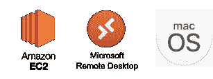

*   亚马逊 EC2:推出 Windows Server 2019
*   微软远程桌面:macOS 应用程序到远程桌面连接(RDP)到 EC2

## 亚马逊 EC2

### 启动 Windows Server EC2 实例

1.  登录您的 [AWS 管理控制台](https://aws.amazon.com/console/)。
2.  选择**服务**，然后选择 **EC2** 。
3.  在工具条中，点击**实例**。

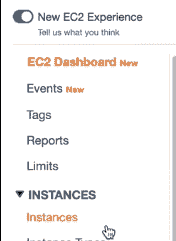

EC2 sidebar

4.点击**启动实例**。

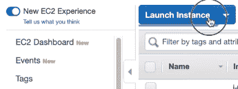

Launch Instance button

5.向下滚动并选择**Microsoft Windows Server 2019 Base**。

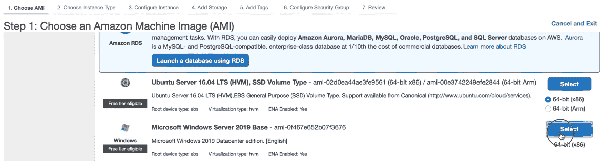

Choose AMI page

6.在选择实例类型页面的底部，单击**查看并启动**。这将使您跳转到评论页面。

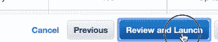

Launch with minimal configuration

7.在查看页面中，点击**启动**。系统会提示您选择现有的密钥对或新的密钥对。

如果您选择**创建新的密钥对**，您需要为新的密钥对命名，然后下载密钥对。然后您将能够继续选择**启动实例**。

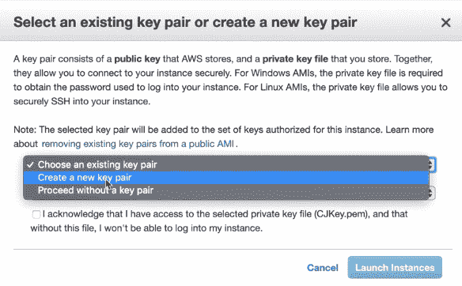

Key pair to access the instance

如果您选择**选择一个现有的密钥对**，您需要选择一个密钥对并勾选复选框以确认密钥对的使用。

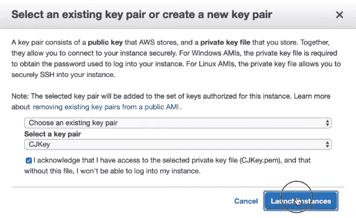

Last step to launch instance

8.单击生成的实例 ID。

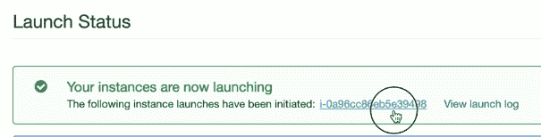

Accessing the EC2 Instance

9.查找并保存以下信息:

*   公共 DNS (IP 地址)
*   用户名
*   密码

要获取 IP 地址，请滚动到 EC2 实例的右侧:

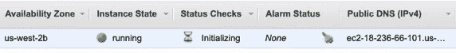

IP Address of EC2 Instance

您也可以在下面的描述选项卡中找到它:

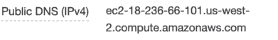

IP Address of EC2 Instance

10.要获取用户名和密码，选择 EC2 实例(勾选复选框)，点击**动作**，然后**获取 Windows 密码**。

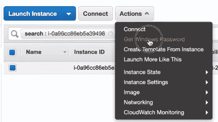

Obtaining the username and password

您可能会遇到*密码不可用*的情况，您需要等待几分钟。

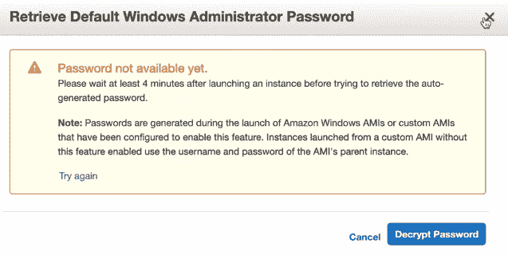

Provisioning the auto-generated password

11.在本地计算机上找到现有的密钥对或新创建的密钥对。点击**选择文件**。

Retrieve the key pair

12.上传密钥对后，点击**解密密码**。

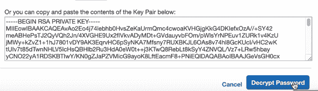

13.复制以下信息，并将其保存在文件或剪贴板中。完成后点击**关闭**。

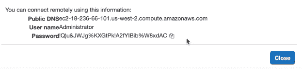

Information for remote desktop connection

## Microsoft 远程桌面

### 安装应用程序并连接到 EC2 实例

1.  打开你的应用商店，然后搜索**微软远程桌面**。单击“安装”(此处显示更新，因为我已经安装了)。

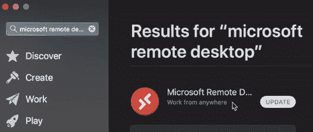

Microsoft Remote Desktop in the App Store

2.安装后，打开 Microsoft 远程桌面。

3.在顶部，点击 **+** 图标，选择**桌面**。

Creating a new desktop connection

4.在 PC 名称中，复制 EC2 实例的 IP 地址，然后点击**添加**。

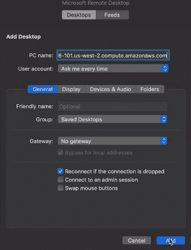

Adding the IP address

5.复制前面的管理员和密码并粘贴到这里。点击**继续**。

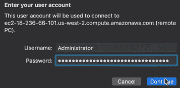

Signing in with the username and password

您现在已连接到 Windows Server EC2 实例。

Windows Server EC2 Instance

注意:为了避免在用完 EC2 的空闲层后被收费，要么点击**停止**以获得更低的成本，要么**终止**以移除实例而不被收费。

您可以通过选择实例并选择**动作>实例状态>停止/终止**来访问它。

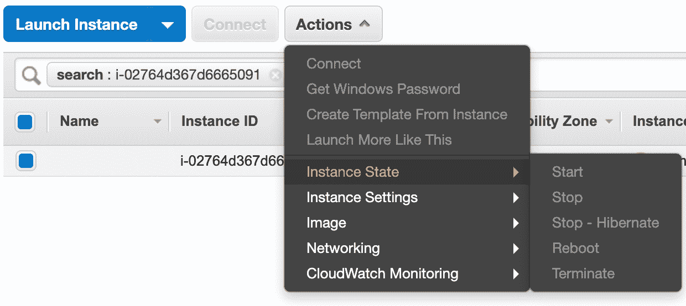

## 这里有一个视频教程:

[https://www.youtube.com/embed/QQIivlr_CKk?feature=oembed](https://www.youtube.com/embed/QQIivlr_CKk?feature=oembed)

在 LinkedIn 上与我联系[这里](https://www.linkedin.com/in/clarkngo/)。

