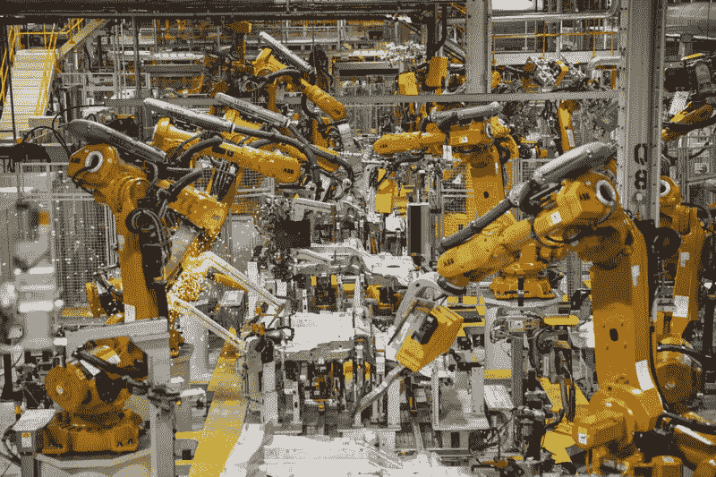
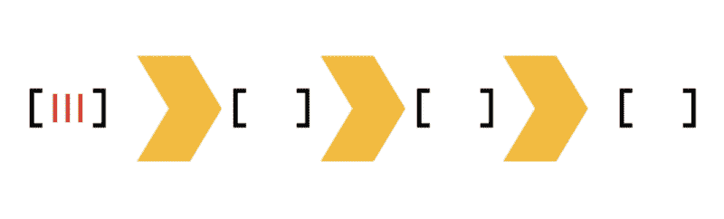
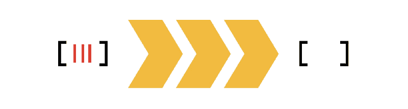

# 如何使用转换器提高数据转换的效率

> 原文：<https://www.freecodecamp.org/news/efficient-data-transformations-using-transducers-c779043ba655/>

吉多·施密茨

# **使用传感器的高效数据转换**



转换大量数据可能会很昂贵，尤其是当你使用[高阶函数](https://medium.freecodecamp.org/higher-order-functions-in-javascript-d9101f9cf528)时，比如*映射*和*过滤器*。

本文将展示转换器创建高效数据转换函数的能力，它不会创建临时集合。当*映射*和*过滤器*函数链接在一起时，创建临时集合。这是因为这些函数返回一个新的集合，并将结果传递给下一个函数。

想象一下，拥有 1，000，000 人的记录，并且想要创建一个“居住在荷兰的 18 岁以上女性的姓名”的子集。有不同的方法来解决这个问题，但是让我们从*链接*方法开始。

如果这种方法对你来说是新的，或者你想了解更多，我写了一篇关于使用[高阶函数](https://medium.freecodecamp.org/higher-order-functions-in-javascript-d9101f9cf528)的博文。

```
const ageAbove18 = (person) => person.age > 18;const isFemale = (person) => person.gender === ‘female’;const livesInTheNetherlands = (person) => person.country === ‘NL’;const pickFullName = (person) => person.fullName;
```

```
const output = bigCollectionOfData  .filter(livesInTheNetherlands)  .filter(isFemale)  .filter(ageAbove18)  .map(pickFullName);
```

下面是使用创建临时数组的链式方法的可视化。想象一下将 1，000，000 条记录循环三次的代价！



当然，过滤后的收藏会减少一些，但是仍然很贵。

然而，一个关键的见解是，可以使用*减少*来定义*映射*和*过滤器*。让我们根据 *reduce* 来实现上面的代码。

```
const mapReducer = (mapper) => (result, input) => {  return result.concat(mapper(input));};
```

```
const filterReducer (predicate) => (result, input) => {  return predicate(input) ? result.concat(input) : result;};
```

```
const personRequirements = (person) => ageAbove18(person)  && isFemale(person)  && livesInTheNetherlands(person);
```

```
const output = bigCollectionOfData  .reduce(filterReducer(personRequirements), [])  .reduce(mapReducer(pickFullName), []);
```

我们可以通过使用 [**函数组合**](https://medium.com/javascript-scene/master-the-javascript-interview-what-is-function-composition-20dfb109a1a0) 来进一步简化 *filterReducer* 。

```
filterReducer(compose(ageAbove18, isFemale, livesInTheNetherlands));
```

当使用这种方法时，我们减少(哈哈！)我们创建临时数组的次数。下面是使用 *reduce* 方法时转换的可视化。



很漂亮，对吧？但我们说的是传感器。我们的传感器在哪里？
原来，我们创建的 *filterReducer* 和 *mapReducer* 是**还原函数**。我们可以这样表达:

```
reducing-function :: result, input -> result
```

传感器是接受一个**缩减函数**并返回一个缩减函数的函数。这可以表达如下:

```
transducer :: (result, input -> result) -> (result, input -> result)
```

最有趣的部分是传感器的类型特征大致对称。它们接受一个缩减函数，返回另一个。

因此，我们可以使用函数组合来组合任意数量的传感器。

#### **打造自己的传感器**

希望现在一切都开始变得有意义了。让我们为*贴图*和*过滤器*构建自己的传感器函数。

```
const mapTransducer = (mapper) => (reducingFunction) => {  return (result, input) => reducingFunction(result, mapper(input));}
```

```
const filterTransducer = (predicate) => (reducingFunction) => {  return (result, input) => predicate(input)    ? reducingFunction(result, input)    : result;}
```

使用我们上面创建的转换器，让我们转换一些数字。我们将使用 RamdaJS 中的 [*撰写*](http://ramdajs.com/docs/#compose) 函数。

[**RamdaJS**](http://ramdajs.com) 是一个提供实用函数方法的库，是专门为函数式编程风格设计的。

```
const concatReducer = (result, input) => result.concat(input);const lowerThan6 = filterTransducer((value) => value < 6);const double = mapTransducer((value) => value * 2);
```

```
const numbers = [1, 2, 3];
```

```
// Using Ramda's compose hereconst xform = R.compose(double, lowerThan6);
```

```
const output = numbers.reduce(xform(concatReducer), []); // [2, 4]
```

*concatReducer* 被称为**迭代器函数**。这将在每次迭代中被调用，并将负责转换传感器函数的输出。

在这个例子中，我们只是连接结果。因为每个传感器只接受一个缩减函数，所以我们不能使用 *value.concat* 。

当我们将多个传感器组合成一个功能时，大多数时候它被称为 *xform* 传感器。所以当你在某个地方看到这个，你就知道它的意思了。

#### **组成多个传感器**

我们在前面的例子中使用了普通的函数组合，你可能想知道求值的顺序是什么。尽管函数组合从右向左应用函数，但转换实际上将在执行时从左向右计算——这对于我们这些用从左向右语言阅读的人来说要直观得多。

需要一点思考来看看为什么这是真的:假设我们的转换器 *double* 返回一个减少函数，我们的转换器 *lowerThan6* 也返回一个减少函数，当你组合 *double* 和 *lowerThan6* 时， *double* 的输出将被传递给 *lowerThan6* ，后者将返回 *lowerThan6* 的减少函数。因此， *double* 是合成的结果，求值的顺序确实是从左到右。

我用一些 *console.log* 语句创建了一个 JSBin [**示例**](https://jsbin.com/kezugajaqa/1/edit?js,console) ，你可以自己看看。

#### **使用 RamdaJS 提高可读性**

因为转换器是函数式编程风格的完美例子，所以让我们看看 Ramda 如何通过使用他们的一套方法来帮助我们。

```
const lowerThan6 = R.filter((value) => value < 6);const double = R.map((value) => value * 2);const numbers = [1, 2, 3];
```

```
const xform = R.compose(double, lowerThan6);
```

```
const output = R.into([], xform, numbers); // [2,4]
```

有了 Ramda，我们可以使用他们的*贴图*和*滤镜*方法。这是因为 Ramda 内部的 [*reduce*](https://github.com/ramda/ramda/blob/v0.25.0/source/internal/_reduce.js) 方法使用了引擎盖下的[换能器协议](https://github.com/cognitect-labs/transducers-js#the-transducer-protocol)。

> 转换器协议的目标是所有的 JavaScript 转换器实现互操作，而不管表面层的 API。它独立于输入和输出源的上下文来调用转换器，并且仅根据单个元素来指定转换的本质。
> *由于传感器与输入或输出源解耦，因此可用于许多不同的过程——采集、流、通道、可观测等。传感器直接合成，不知道输入或中间聚合体的产生。*

#### **结论**

转换器是一种强大的、可组合的方式来构建可以在许多上下文中重用的转换。一旦你有了传感器，你就可以做一系列开放的事情。

它们在转换大型数据集时特别有用，但是您也可以使用同一个传感器来转换单个记录。

如果你想进一步了解这个主题，我推荐以下文章:

[https://clojure.org/reference/transducers](https://clojure.org/reference/transducers)
[http://blog . cogn itect . com/blog/2014/8/6/transducers-coming](http://blog.cognitect.com/blog/2014/8/6/transducers-are-coming)
[https://github . com/cogn itect-labs/transducers-js # the-transducer-protocol](https://github.com/cognitect-labs/transducers-js#the-transducer-protocol)

#### ？？如果你喜欢这篇文章，请点击下面的按钮。。这对我意义重大，也有助于其他人看到这篇文章。

#### 关注我以获得更多类似的编程内容的通知。