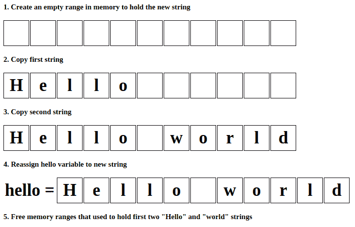
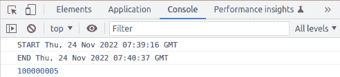
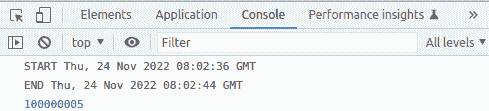

# 如何在 JavaScript 中使用字符串——高效字符串串联的技巧

> 原文：<https://www.freecodecamp.org/news/efficient-string-building-in-javascript/>

你在浏览器中看到的所有东西——除了图像和视频——都是字符串。

这就是为什么你应该学会如何正确地与他们合作。这将极大地提高 web 应用程序的性能，无论是前端还是后端。

## 默认字符串串联的工作原理及其问题

编程中关于字符串应该了解什么？`string`是保存字符数组的原始数据类型。原始数据类型的值是不可变的，所以字符串的值在实例化后不能改变。对于大多数编程语言来说都是如此，包括 JavaScript。

但是等一下，当你这样做的时候:

```
let hello = "Hello";
hello += " world";
console.log(hello);
```

你会在控制台上看到 **Hello world** ，这意味着`hello`变量的值已经改变。这怎么可能？JavaScript 如何在改变字符串变量的值的同时保持其不可变？

这是因为 JavaScript 不会直接将第二个字符串添加到第一个字符串中。相反，它创建第三个空字符串，将两个字符串的值复制到其中，最后将“hello”变量重新分配给第三个字符串。

这样，第三个字符串的值只设置一次，两个初始字符串的值保持不变，以满足不变性规则。

整个字符串串联过程如下所示:



1) Create an empty range in memory to hold the new string. 2) Copy first string to it. 3) Copy second string to it 4) Reassign the "hello" variable to the new string. 5) Free memory ranges that used to hold first two "Hello" and "world" strings.

你觉得这里有什么问题吗？对于这次行动的表现，我们能说些什么？似乎它执行的操作比应该执行的操作多了五倍，并且在步骤 3 中使用了两倍多的内存来保存相同的数据。

一方面，如果我们只是想连接两个字符串，这不是一个大问题，因为计算机可以在一秒钟内完成数百万次运算。但是如果我们需要构建长字符串，问题就变得更严重了。

假设我们需要在一个循环中从一个外部数据数组构造一大部分 HTML 内容。在这种情况下，HTML 字符串会在这个过程中变得很大，JavaScript 会在循环的每次迭代中创建这个字符串的副本。

作为一个例子，让我们看看在一个循环中构建一个巨大字符串的代码，它将初始字符串串联了一亿次。

```
let str = "Hello";

console.log("START",new Date().toUTCString());

for (let index=0;index<100000000;index++) {
    str += "!";
}

console.log("END",new Date().toUTCString());
console.log(str.length);
```

这段代码附加了“！”符号到弦上一亿次。在现实世界的例子中，你可以假设代替'！'符号它将是来自外部源的真实数据，应该在以后显示。

此外，这段代码在循环前后输出当前的日期和时间，这有助于测量需要多长时间。最后，它显示构造的字符串的长度。

当我在谷歌 Chrome 浏览器上运行时，花了一段时间才完成。最后，它在 JavaScript 控制台上显示了以下内容:



The Javascript console shows that the code of a basic string concatenation created a string of 100000005 characters in 1 minute 26 seconds.

正如您所看到的，它花了 1 分 26 秒并输出了正确长度的连接字符串。但是当我在另一台计算机上运行时，这段代码使浏览器崩溃，我看到了以下输出:


The web browser crash

如果您还记得上面描述的字符串连接的基本算法，应该很清楚为什么会出现这种情况。

默认的字符串串联算法效率太低，浪费大量内存。在这个例子中，它在循环迭代时从 1 到 1 亿个字符复制了 1 亿次。用于此的内存量甚至难以实现。

这意味着程序是否崩溃取决于可用的空闲内存量，以及内存垃圾收集器在具体的 JavaScript 引擎实现中如何擦除未使用的临时字符串。

## 如何改进默认的字符串连接算法

我们上面讨论的 JavaScript 字符串连接算法并不声称在学术上是准确的。JavaScript 引擎的各种实现可以使用不同的字符串处理优化和内存处理机制。

但是你不应该指望你的代码会一直在这样的引擎中运行。

例如，在撰写本文时最新版本的 Google Chrome 中，字符串连接的工作方式如上面的截图所示。因此，本文的目的是展示如何更有效地使用字符串，而不管它在默认情况下是如何实现的。

我们肯定会找到一种方法，通过使用单个操作将两个字符串连接起来，来完成我们所需要的工作。许多其他编程语言，如 Java 或 Go(也使用不可变字符串)都有一个名为 StringBuilder 的工具。这是一个助手对象，允许你从数组元素或其他可变对象中构造一个字符串。

JavaScript 没有这个内置特性，但是自己实现类似的想法并不困难。

您可以用不同的方式编写相同的字符串:

```
let hello = ["Hello"];
```

这不是一个字符串，而是一个包含字符串的数组。与字符串不同，数组是可变的，你可以通过添加条目来改变它们。这意味着，如果您运行以下命令:

```
hello.push(" world"); 
```

Javascript 将通过在末尾添加“world”项来改变数组。这将在一次操作中完成，之后阵列将包含以下内容:

```
["Hello"," world"] 
```

这样，您可以以非常低的成本将任意多的字符串连接到这个数组中。

最后，要从中创建字符串，可以在数组上运行`join`操作:

```
hello = hello.join("");
console.log(hello); 
```

此后,“hello”变量的输出将包含“Hello world”字符串。实际上，join 操作也会创建一个空字符串，然后将数组中的项复制到其中。但是这种情况只发生一次(而不是在连接字符串时每次都发生)。

这种方法极大地提高了循环中字符串连接的速度。让我们更改循环示例，使用数组而不是字符串:

```
let str = ["Hello"];

console.log("START",new Date().toUTCString());

for (let index=0;index<100000000;index++) {
    str.push("!");
}

str = str.join("");

console.log("END",new Date().toUTCString());
console.log(str.length); 
```

在同一个浏览器上运行后，我收到了以下输出:



The Javascript console shows that the code of a string concatenation using array created a string of 100000005 characters in 8 seconds.

正如您所看到的，同样的结果在 8 秒内实现，这比常规的字符串连接快 10 倍。

## 最后的想法

如您所见，只需更改三行代码，就可以显著提高数据处理管道的性能。

作为我实践的一部分，我有一个客户，他的网站由于无效的字符串处理而速度变慢，他试图通过在 CloudFlare 中缓存内容来解决这个问题。他还认真考虑过迁移到 AWS 来提高数据吞吐量，以解决这些问题。但是做一次代码检查来修复它就足够了。

当在 JavaScript 中从可变大小的外部数据流构建循环中的字符串时，可以使用本教程中描述的方法。只是把字符串一个一个的加到一个数组里，最后在输出之前把它们连接成一个字符串。

其他编程语言建议使用内部 StringBuilder 或 StringBuffer 对象进行字符串串联。

对于 Javascript，我们构造了简单的 StringBuilder，它只能追加字符串。实际上，您可以扩展它并添加不同的方法来从数组中“追加”、“插入”或“移除”字符串。您还可以创建一个类，用函数封装一个数组变量来操作这个数组中的子字符串，并在需要时从中构造最终的字符串。

### 这种方法的一些限制

向数组中添加元素时，记住数组元素数量的现有限制很重要。如果不考虑它们，您可能会遇到“RangeError: invalid array range”错误。你可以[在这里](https://developer.mozilla.org/en-US/docs/Web/JavaScript/Reference/Errors/Invalid_array_length)了解更多关于限制的信息。

如果要添加到循环中的行数超过这些限制，那么您必须定期将数组刷新到临时字符串缓冲区中，然后合并这些缓冲区。

为了帮助您更有效地处理字符串，有更多优秀的字符串处理算法可用。

其中最快的一种基于一种叫做“Rope”的数据结构。发明它是为了快速处理巨大字符串上的操作。你可以在这里了解更多信息。这比上面讨论的方法更复杂，但是您可以从在您的项目中重用`Rope`的 Javascript 实现之一开始(您可以在这里找到它们[，在这里](https://github.com/component/rope)找到它们[)。](https://github.com/josephg/jumprope)

## 感谢您的阅读！

祝大家好运，编码快乐:)

请随时在下面的社交网络上连接并关注我，我在那里发布关于我即将发表的文章的公告，类似于这篇文章和其他软件开发新闻:

领英:[https://www.linkedin.com/in/andrey-germanov-dev/](https://www.linkedin.com/in/andrey-germanov-dev/)
脸书:[https://web.facebook.com/AndreyGermanovDev](https://web.facebook.com/AndreyGermanovDev)推特:[https://twitter.com/GermanovDev](https://twitter.com/GermanovDev)