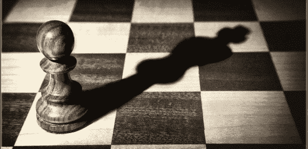
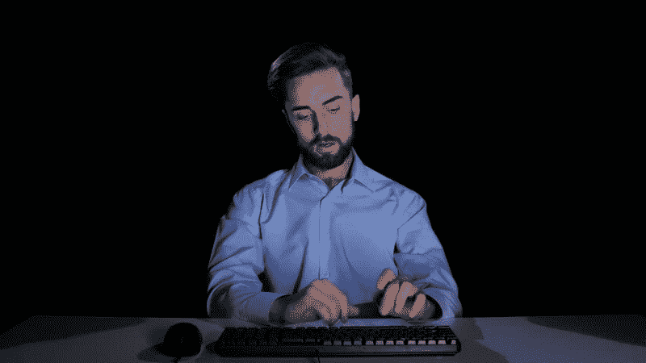
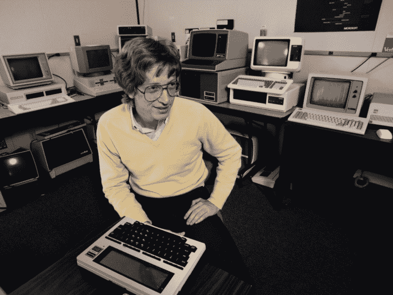
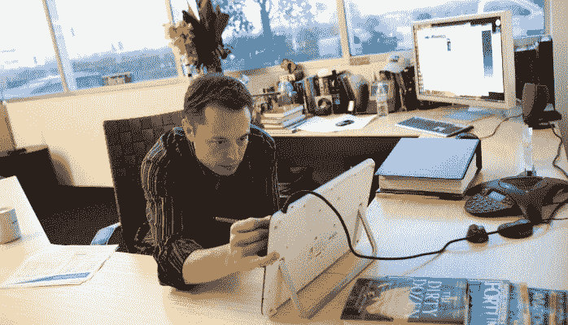
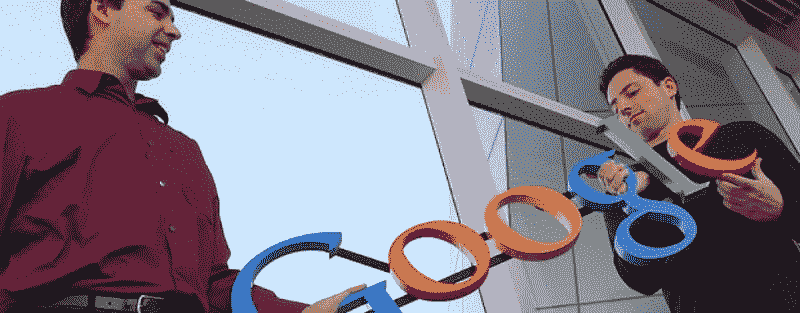
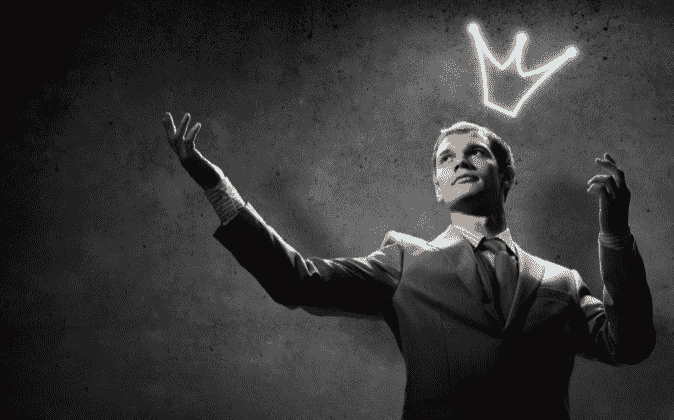
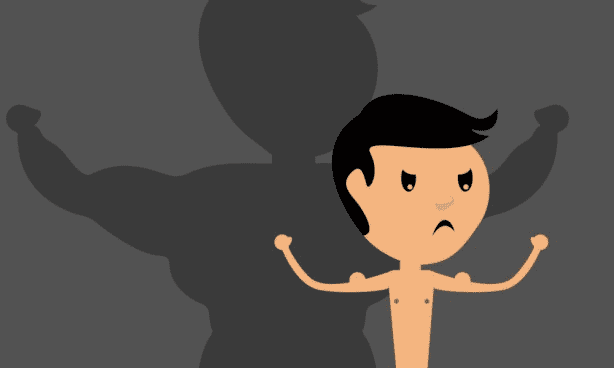
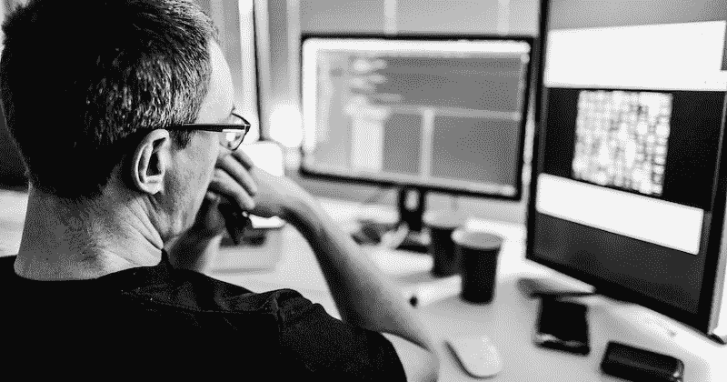
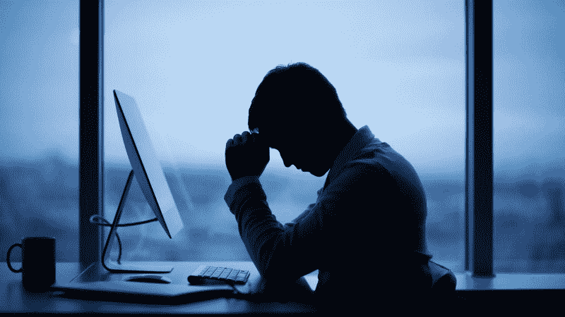
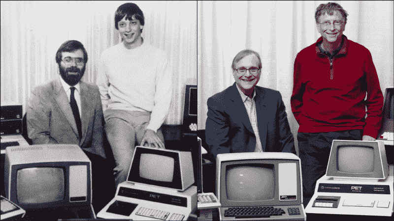

# 对于开发者来说，自我是敌人

> 原文：<https://www.freecodecamp.org/news/ego-is-the-enemy-for-software-developers-585909fb0501/>

*本帖最初发表于[媒体](https://medium.com/better-programming/for-developers-ego-is-the-enemy-77d1550a50af)。* 
*我最近读完了《自我是敌人[》这本书，通过赖安·哈乐黛，想到了许多宝贵的建议，我决定写这篇文章。](https://www.amazon.com.au/Ego-Enemy-Master-Greatest-Opponent-ebook/dp/B01AWUTMB0)*

当你听到敌人这个词时，你可能会想到正则表达式、bug、部署、会议和截止日期。事实上，在我们寻求达到我们的目标并成为我们想要成为的软件开发人员的过程中，我们通常是自己最大的敌人。自我是阻止我们寻求帮助、学习、合作和努力工作的东西。

这里的自我指的是对我们自身重要性的不健康的信念:我们的傲慢和以自我为中心的野心。每个人都有任性的孩子，总是选择以牺牲他人为代价来赢得胜利。

自我让我们认为我们很特别，我们知道的比我们实际知道的多得多，我们不需要与他人合作，因为我们是自给自足的。它阻碍了对编程的真正掌握。从良好的工作和与其他开发人员或其他人建立良好的关系。认识到机会，或者创造机会，仅仅因为我们生活在自己对伟大的幻想中。

自我在我们生活的每时每刻都是一个持续的威胁。它阻止我们构建更伟大的产品，保持并朝着更高的目标前进，并从失败的项目中恢复。

如果我们真的想保护自己不受小我的伤害，我们应该在人生的每个阶段都意识到它的技巧。

> “知己知彼，百战不殆。如果你了解自己但不了解敌人，那么每一次胜利都会让你遭受失败。不知己知彼，百战不殆。”
> —孙子

### 无论你渴望什么，自我都是你的敌人

你可能有一个非常好的平均绩点，或者你的许多家庭成员和密友可能称你为神童。

在这种情况下，你的自我倾向于让你觉得这个世界欠你你想要的成功。你必须找到工作，以创纪录的时间爬上公司的阶梯。你不需要通过正式的招聘程序就可以被雇佣。

你可能认为你不需要在 GitHub 上有任何知识库，因为你的 GPA 已经超过了你的同龄人。你的自我让你认为你不需要努力工作。

如果我们回顾历史，那些让我们惊讶于他们所做的工作的人都是非常努力的人。

WordPress 是世界上最著名的内容管理系统之一，它为超过 27%的网络提供动力。它的创始人马特·莫楞威格[一天只睡四个小时](https://venturebeat.com/2015/02/11/how-sleeping-6-times-a-day-helped-the-founder-of-wordpress-build-a-billion-dollar-company/)，在开发 WordPress 的时候工作非常努力。

微软的联合创始人、世界首富比尔·盖茨曾经每天都在工作。“我周末工作，我不太相信假期，”他在一次采访中回忆道。

回到马克·扎克伯格在脸书做开发者的时候，他必须努力工作。“过去的六年是大量编码、专注和努力的工作。但也许把它作为派对和所有这些疯狂的戏剧来记忆会很有趣。”

埃隆·马斯克是贝宝的联合创始人，他曾经是一名软件开发员，尽管被认为是一个神童，但他从清晨工作到深夜。他现在[每周工作](http://www.independent.co.uk/news/business/news/how-tesla-boss-elon-musk-works-up-to-100-hours-a-week-a6836461.html)长达 100 小时。

你不应该高估自己的能力，陷入认为自己比实际情况好得多的困境。如果你真的想在编程方面出类拔萃，你应该非常投入，并投入大量的时间和精力。

你的自负甚至会阻止你与其他人合作。它会让你觉得你足够聪明，足够有自己的技能，而不需要在项目中与其他同事合作。事实上，已经取得突破并帮助了数百万用户的大项目通常是协作工作的结果。

拉里·佩奇和谢尔盖·布林在斯坦福大学计算机科学系相遇后，一起创立了谷歌。比尔·盖茨[和保罗·艾伦一起创立了](http://www.businessinsider.com/what-paul-allen-really-thinks-of-bill-gates-2011-3)微软，保罗·艾伦[提出了](http://www.businessinsider.com/what-paul-allen-really-thinks-of-bill-gates-2011-3)微软这个名字。埃隆·马斯克[与他的兄弟金巴尔一起创建了他的第一家 IT 公司 Zip2，该公司被 AltaVista 以 3.07 亿美元的现金和 3400 万美元的证券收购。布莱恩·阿克顿与简·库姆合作，创建了 WhatsApp。](https://astrumpeople.com/elon-musk-biography/)

你应该努力工作，谦虚并与他人合作。你甚至不应该考虑独自开始和完成一件大规模的事情。你应该成为团队的一员。

### 无论你取得了什么样的成功，自我都是敌人

你可能认为你现在已经有了一份工作，有了几年的经验，你已经有了一个坚固的城堡，应该可以持续到你退休。你只学了几周 React，几个月内就找到了工作，没有大学文凭。你受雇于一家顶级科技公司，或者成为许多其他有经验的开发人员的团队领导。你开发的应用程序在 iTunes 上的下载量达到了数千次。

你可能得到了硅谷一家顶级科技公司的工作机会，并一直吹嘘自己，却忘记了这种态度并没有让你走到今天这一步。

达到一定程度的成功伴随着领域。这些类型的成功可能非常令人印象深刻，但对我们未来的自己也是毁灭性的。它们可能会提升我们的自我意识，阻止我们刻意去坚持那些让我们达到这种水平的原则、惯例和努力工作。我们忘记了为了达到这个阶段我们做了多少工作。

结果，我们无法取得更多的进展，仅仅因为我们只能看到我们已经做了什么。我们将注意力从成功的原因转移到结果上。我们忽略了磨练我们的编程技能和提高我们的性能。因为我们沉迷于先前成功的好处。正如行为艺术家玛丽娜·阿布拉莫维奇所说，“如果你开始相信自己的伟大，那就是你创造力的死亡。”

社会赞扬我们，戏剧性地夸大我们的成就，这助长了我们的自我。我们不知道自己真正的成就。我们大大高估了他们。

计算机编程是一个不需要获得四年学位就能找到工作的职业。你可以通过学习编程语言找到工作，甚至有机会远程工作。如果你没有变得更好，没有学到目前市场上有价值的东西，你很可能会被来自世界另一端的年轻热情的家伙取代。你可能不像你的自我暗示的那么特别。

如果你想成为一名更好的程序员，并且仍然有机会开发真正酷的应用程序，那么你需要永远保持谦逊和学习。你需要进行[刻意练习](http://calnewport.com/blog/2010/01/06/the-grandmaster-in-the-corner-office-what-the-study-of-chess-experts-teaches-us-about-building-a-remarkable-life/)，不断挑战自己的极限。

没有高原这回事。在物理学中有一种东西叫做熵。你要么往下走，要么往上走。就这些了。没有停滞。很容易成功一周或一个月，然后被自我的故事所困，很快失败。我相信真正的成功是可持续的。作为 49 人队的教练，比尔·沃尔什说过，“我曾经不得不做的最艰难的事情是让我的球队克服成功病。”

### 无论你面对什么样的失败和挑战，自我都是敌人

无论你多么努力，有些失败是不可避免的。你工作的那家想要改变世界的初创公司未能推出成功的产品。该公司的销售额大幅下降，不得不解雇大部分软件开发人员。该企业陷入了一个大债务，现在你需要找到一份新工作。

这些和其他类似的失败可能超出你的控制。在其他情况下，您可能要对某些类型的故障负责。然而，在这两种情况下，这并不意味着你应该完全投降，永远不要试图改变你的处境。

> “这是因为人类倾向于同情我们的快乐比同情我们的悲伤，我们炫耀我们的财富，隐藏我们的贫穷。没有什么比不得不把我们的痛苦暴露在公众面前，并感觉到尽管我们的处境在全人类的眼中是公开的，但没有人能为我们设想我们所遭受的痛苦的一半更令人羞愧的了。”
> —亚当·斯密

你的自我可能会阻止你谦虚并从错误中学习。你不想学习一门新的编程语言，或者一个新的框架，因为你的自我告诉你已经足够熟练和有成就了。

你可能讨厌寻求帮助，或者尝试学习新的东西，克服你所处的失败。你开始责怪每个人。你没有停下来为自己的处境承担极端的所有权和责任。结果你可能无法理解你实际上需要成为一个更好的软件开发者。

微软并不是比尔·盖茨和保罗·艾伦创办的第一家公司。他们在 20 世纪 70 年代早期有另一家名为 Traf-O-Data 的公司，由于亏损他们不得不关闭。他们从那次经历中学到的经验对微软起到了至关重要的作用。

布莱恩·阿克顿在脸书不被接受。他也被推特总部[拒绝](https://twitter.com/brianacton/status/1895942068)。他没有自杀，而是和他的搭档简·库姆合作，开发了 WhatsApp。拒绝布莱恩的社交媒体公司之一[在不到 5 年后以 190 亿美元收购了](https://www.forbes.com/sites/parmyolson/2014/10/06/facebook-closes-19-billion-whatsapp-deal/) WhatsApp。

在凭借《愤怒的小鸟》获得“一夜成名”之前，Rovio 开发了 51 款不成功的游戏。

你正在做的项目失败的可能性很高。然而，这不应该让你感到痛苦，只要你把这些失败作为学习的经验。

正如视频游戏设计师威尔·莱特[说](http://www.gamasutra.com/features/20050520/cifaldi_pfv.htm)“我实际上更有可能根据一个人经历了多少次失败来雇佣他。我认为这是最好的学习系统。”

谦逊而坚强的人不会只在成功的时候坚持到底。他们利用从失败中吸取的教训，设法克服并利用它们作为弹射的立足点。

正如 Ryan Holiday [在书](https://www.amazon.com.au/Ego-Enemy-Master-Greatest-Opponent-ebook/dp/B01AWUTMB0)中提到的，“唯一真正的失败是放弃你的原则，”并进一步补充道，“如果你的声誉不能承受一些打击，它首先就一文不值。”

### 对于接下来的一切，自我是敌人

现在你已经读了这篇文章，你已经对你的自我进行了严重的打击，但这还不够。如果我们真的想成为最好的自己，我们需要采纳这些建议。正如德里克·西弗斯关于拥有知识的观点，[说](http://tim.blog/2016/11/21/tools-of-titans-derek-sivers-distilled/)“如果(更多)信息是答案，那么我们都将成为拥有完美腹肌的亿万富翁。”

我们应该从他人的自我经验中学习，而不是成为他人可以学习的受害者。我们应该对我们的愿望保持谦逊，对我们的成功保持优雅，对我们的失败保持坚韧。这并不意味着我们不独特，也不意味着我们没有有价值的东西可以贡献。它只是意味着我们不应该总是把自己作为故事的主题。相反，我们应该更加关注工作和整个过程。

我们需要识别自我在我们头脑中的无声对话，并在它让我们养成坏习惯之前尽早抑制它。当我们达到一定程度的成功时，我们必须用谦卑和自律来抑制它的诱惑。我们必须谦虚，随时准备向他人学习，并在事情不顺心时培养力量和毅力。

> “第一条原则是，你不能欺骗自己——而你是最容易被欺骗的人。”
> —理查德·费曼

*本帖最初发表于[媒体](https://medium.com/better-programming/for-developers-ego-is-the-enemy-77d1550a50af)。*