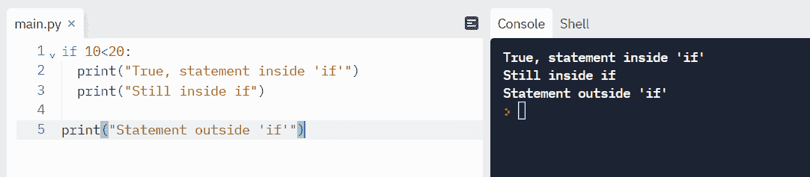
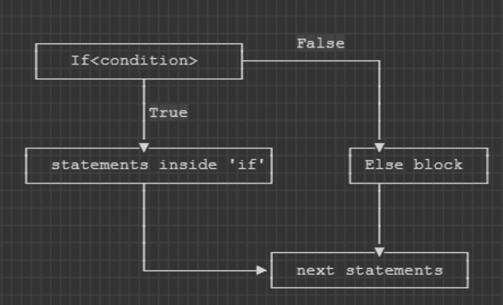
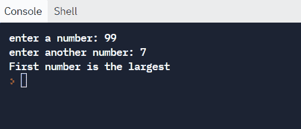
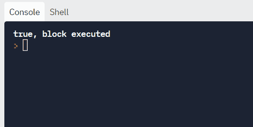
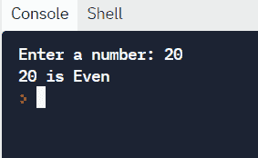
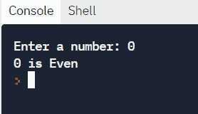
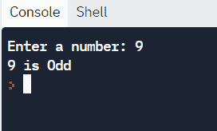

# Python 中的 else-If–Python If 语句示例语法

> 原文：<https://www.freecodecamp.org/news/else-if-in-python-python-if-statement-example-syntax/>

当你编码时，你需要能够检查某些条件，并相应地改变程序执行的控制。

Python 为决策提供了很多条件语句，`if-else`就是其中之一。

在这篇博文中，我们将了解到:

1.  语句的默认执行顺序以及如何改变它。
2.  什么是`if-else`语句及其语法。
3.  如何用`elif`处理多个条件？
4.  一个`if else`的实际例子，我们将编写一个程序来检查数字是偶数还是奇数。

## Python 中的顺序与控制结构

默认情况下，语句是按顺序执行的。**连续顺序**意味着语句按照编写的顺序一个接一个地执行。

让我们通过计算一个工人每小时的工资率来看看下面的顺序执行的例子:

```
# Write a program to calculate total rate

hours = input("enter hours: ")
rateperhr = 10
print("Your total rate is", int(hours)*rateperhr) 
```


如果我们需要检查一天的小时数是否超过 8 小时，进入加班限制怎么办？

这里我们需要检查一个条件，并相应地做出决定。这就是**控制结构**的用武之地。控制结构重定向程序中语句的执行顺序。

在 Python 中，我们可以使用`if`、`if-else,`、`if-elif-else`或`switch`语句来控制程序的执行。循环是控制执行流程的另一种方式。在这篇博客中，我们将主要关注 if-else 及其衍生物。

## Python 中 if 语句的介绍

如果是`true`，则`if`语句基于某个条件继续。如果条件为假，则执行`if`块之外的语句。

### Python 中`if`语句的语法:

```
if <expression>:
    <statement>
```

注意，`if`块的主体是缩进的语句序列。`<expression>`末尾的冒号表示`if`语句的开始。


Flow of `if` statement 

**举例:**

```
if 10<20:
  print("True, statement inside 'if'")
  print("Still inside if")

print("Statement outside 'if'")
```

**输出:**



Example of if statement

### Python 中的 If-else 语句

万一`if`语句为假，我们想做些什么呢？我们可以通过增加一个额外的`else`模块来实现。

`if-else`的语法:

```
if <exprression>:
    <statement>
    <statement>
else:
    <statement>
    <statement>
```

在`if-else`语句中，我们有两个分支，以防语句为真或为假。如果表达式为真，则执行`if`块。如果表达式为假，则执行`else`块。看到我们是如何改变执行顺序的了吗？由于控制结构，这是可能的。

## Python 中 if-else 语句的流程

我们可以在下面的流程图中总结一下`if-else`语句的流程。

首先，计算表达式。如果表达式为真，则执行`if`内的语句并跳过`else`块。如果表达式为假，则执行`else`块语句。



if-else flow diagram

### Python 中 if-else 的示例:

让我们比较两个数字，找出最大的。

```
a = input("enter a number: ")
b = input("enter another number: ")

if a>b:
  print("First number is the largest")
else:
  print("Second number is the largest")
```

**输出**:



Example of if-else

## Python 中的 elif 子句

`elif`语句向`if-else`添加了另一个“决策”分支。假设你要对多个表达式求值，那么你可以如下使用`elif`:

```
if <expression>:
    <statement(s)>
elif <expression>:
    <statement(s)>
elif <expression>:
    <statement(s)>
    .
    .
    .
else:
    <statement(s)> 
```

这意味着当`if`语句为假时，检查下一个`elif`表达式。当任何一个表达式为真时，控制就在`if-else`块之外。

最多执行一个块。如果未指定`else`，并且所有语句都是`false`，则不会执行任何块。

**这里有一个例子:**

```
if 51<5:
  print("False, statement skipped")
elif 0<5:
  print("true, block executed")
elif 0<3:
  print("true, but block will not execute")
else:
  print("If all fails.")
```

**输出:**



注意，第二个`elif`没有像第一个 elif 评估为`true`那样执行。

## if-else 的一个实际例子——数字是偶数还是奇数？

在这个例子中，我们将检查一个数字是偶数还是奇数。在逻辑中，我们已经检查过，如果一个数的模为零，它就是偶数。这是因为所有偶数被 2 除时，都有一个余数`0`。我们已经在单独的语句中检查了`0`的模数，因为被零除会产生回溯误差。

```
#Take user input
inp_num = input("Enter a number: ")

#Convert string to int
inp_num = int(inp_num)

if inp_num == 0:
  print(inp_num, "is Even")
elif inp_num%2==0:
  print(inp_num, "is Even")
else:
  print(inp_num, "is Odd")
```

**输出:**

测试案例#1:



测试案例#2:



测试案例#3:



## 包扎

在本教程中，我们学习了如何使用`if-else`语句控制执行流程。使用条件语句有助于我们编写有意义的程序。这些语句可以嵌套，以针对复杂的问题。

你从这个教程中学到的最喜欢的东西是什么？在 [Twitter](https://twitter.com/hira_zaira) 上告诉我！

你可以在这里阅读我的其他帖子[。](https://www.freecodecamp.org/news/author/zaira/)

Banner image credits: [由 story set-www.freepik.com](https://www.freepik.com/vectors/thinking)canva.com&创建的思维向量