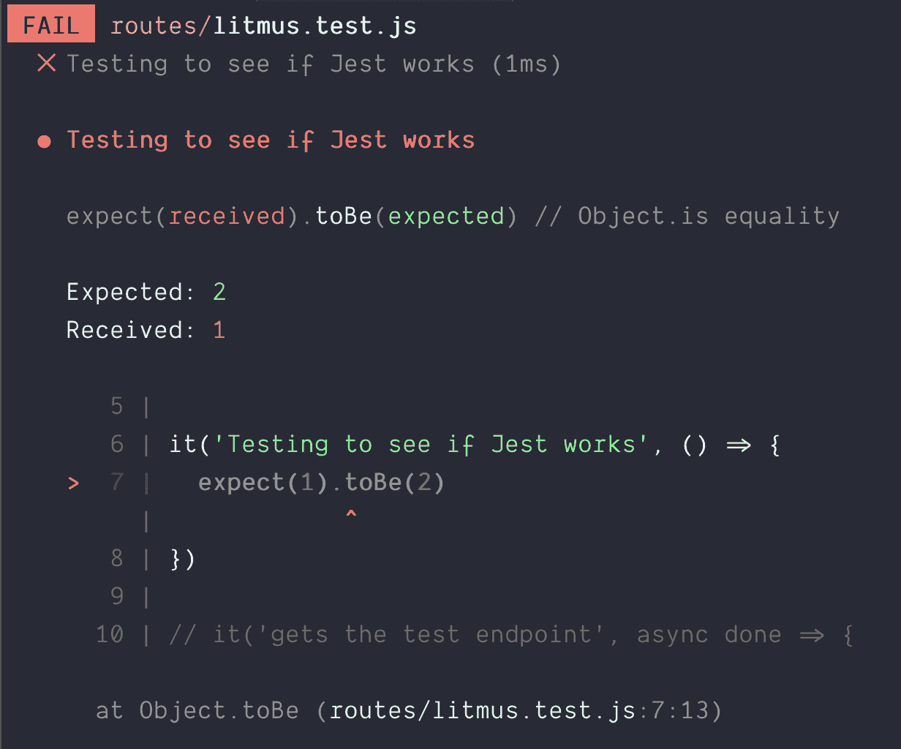
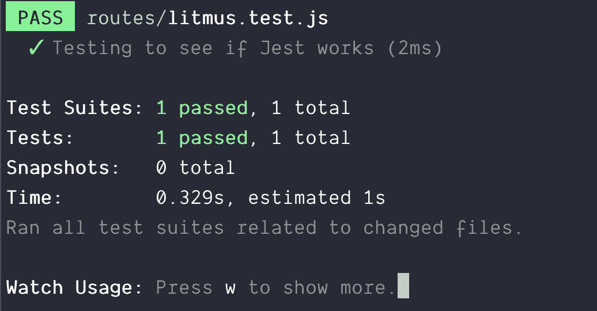
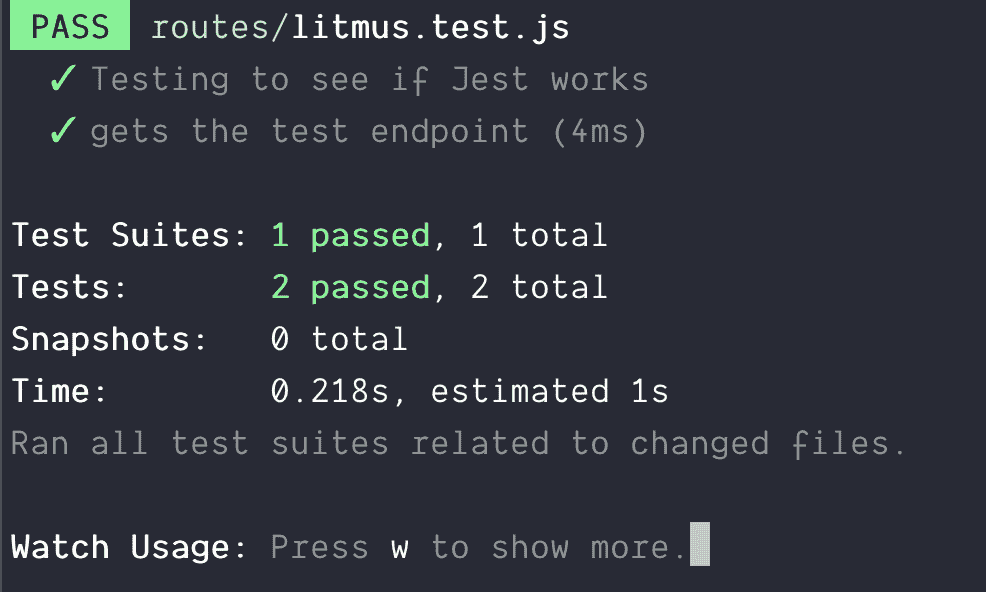
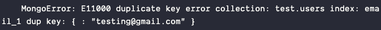
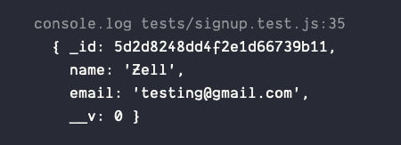
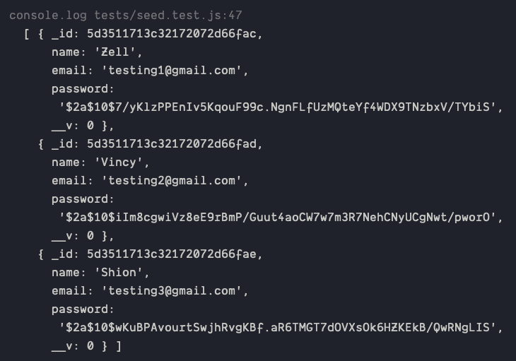
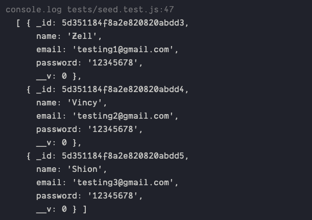

# 端点测试的逐步介绍

> 原文：<https://www.freecodecamp.org/news/end-point-testing/>

我最近一直在玩测试。我尝试做的一件事是测试我的 Express 应用程序的端点。

设置测试是最难的部分。写测试的人实际上不会教你他们是如何设置的。我找不到任何有用的信息，我不得不试着弄清楚。

所以今天，我想分享我为自己创建的设置。希望这能在您创建自己的测试时帮助您。

## 目录

1.  [设置 Jest 和 Supertest](#part1)
2.  [连接笑话和猫鼬](#part2)
3.  [播种数据库](#part3)

## 设置笑话和超级测试

首先，我们来谈谈堆栈。

### 堆栈

*   我用 Express 创建了我的应用程序。
*   我用 Mongoose 连接到 MongoDB
*   我使用 Jest 作为我的测试框架。

您可能已经预料到了 Express 和 Mongoose，因为其他人似乎都在使用这两个框架。我也用过。

但是为什么是 Jest 而不是其他测试框架呢？

### 怎么了

我不喜欢脸书，所以我不想尝试脸书团队创造的任何东西。我知道这听起来很傻，但这是事实。

在 Jest 之前，我尝试了各种测试框架。我尝试了踢踏舞、磁带、摩卡、茉莉和 AVA。每个测试框架都有自己的优点和缺点。我差点就选择了 AVA，但我没有选择 AVA，因为我发现这很难安排。最终，我尝试了 Jest out，因为 Kent C. Dodds 推荐了它。

试过之后就爱上了 Jest。我喜欢它，因为:

1.  这很容易设置
2.  [手表模式](https://egghead.io/lessons/javascript-use-jest-s-interactive-watch-mode "Use Jest's Interactive Watch Mode")太神奇了
3.  当你做某事时，它毫无困难地出现了(这是 AVA 的一个缺点)。

### 设置笑话

首先，你需要安装 Jest。

```
npm install jest --save-dev 
```

接下来，您想要添加测试脚本到您的`package.json`文件中。它有助于添加`test`和`test:watch`脚本(分别用于一次性测试和观察模式)。

```
"scripts": {
  "test": "jest",
  "test:watch": "jest --watch"
}, 
```

您可以选择以下列格式之一来编写您的测试文件。Jest 会自动帮你捡起来。

1.  `__tests__`文件夹中的`js`文件
2.  以`test.js`命名的文件(如`user.test.js`
3.  以`spec.js`命名的文件(如`user.spec.js`

你可以随意摆放你的文件。当我测试端点时，我把测试文件和我的端点放在一起。我发现这更容易管理。

```
- routes
  |- users/
    |- index.js
    |- users.test.js 
```

### 编写您的第一个测试

Jest 在每个测试文件中都为你包含了`describe`、`it`和`expect`。你不用`require`他们。

*   让您将许多测试打包在一起。(它用于组织您的测试)。
*   让您运行测试。
*   让您执行断言。如果所有断言都通过了，测试就通过了。

这里有一个测试失败的例子。在这个例子中，我`expect`认为`1`应该严格等于`2`。从`1 !== 2`开始，测试失败。

```
// This test fails because 1 !== 2
it("Testing to see if Jest works", () => {
  expect(1).toBe(2);
}); 
```

如果你运行 Jest，你会从 Jest 看到一个失败的消息。

```
npm run test:watch 
```



期待`1 === 1`就能让测试通过。

```
// This passes because 1 === 1
it("Testing to see if Jest works", () => {
  expect(1).toBe(1);
}); 
```



这是最基本的测试。这一点用都没有，因为我们还没有测试任何真实的东西。

## 异步测试

您需要发送一个请求来测试一个端点。请求是异步的，这意味着您必须能够进行异步测试。

这很容易理解。有两个步骤:

1.  添加`async`关键字
2.  当你完成测试后打电话给`done`

它可能是这样的:

```
it("Async test", async done => {
  // Do your async tests here

  done();
}); 
```

注意:[如果你不知道如何使用 JavaScript，这里有一篇关于 Async/await 的文章](https://zellwk.com/blog/async-await)。

## 测试端点

您可以使用 Supertest 来测试端点。首先，您需要安装 Supertest。

```
npm install supertest --save-dev 
```

在测试端点之前，您需要设置服务器，以便 Supertest 可以在您的测试中使用它。

大多数教程教你`listen`到服务器文件中的 Express app，像这样:

```
const express = require("express");
const app = express();

// Middlewares...
// Routes...

app.listen(3000); 
```

这不起作用，因为它开始监听一个端口。如果你试图写很多测试文件，你会得到一个错误，说“端口正在使用”。

您想要允许每个测试文件自己启动一个服务器。要做到这一点，你需要在不监听的情况下导出`app`。

```
// server.js
const express = require("express");
const app = express();

// Middlewares...
// Routes...

module.exports = app; 
```

出于开发或生产的目的，您可以像平常一样在一个不同的文件(如`start.js`)中收听您的`app`。

```
// start.js
const app = require("./server.js");
app.listen(3000); 
```

### 使用超级测试

要使用 Supertest，您需要在测试文件中包含您的应用程序和 supertest。

```
const app = require("./server"); // Link to your server file
const supertest = require("supertest");
const request = supertest(app); 
```

一旦这样做了，您就能够发送 get、POST、PUT、PATCH 和 DELETE 请求。在发送请求之前，我们需要有一个端点。假设我们有一个`/test`端点。

```
app.get("/test", async (req, res) => {
  res.json({ message: "pass!" });
}); 
```

要向`/test`发送 GET 请求，可以使用 Supertest 中的`.get`方法。

```
it("Gets the test endpoint", async done => {
  // Sends GET Request to /test endpoint
  const res = await request.get("/test");

  // ...
  done();
}); 
```

Supertest 给你一个来自端点的响应。您可以像这样测试 HTTP 状态和主体(无论您通过`res.json`发送什么):

```
it("gets the test endpoint", async done => {
  const response = await request.get("/test");

  expect(response.status).toBe(200);
  expect(response.body.message).toBe("pass!");
  done();
}); 
```



## 连接笑话和猫鼬

测试后端应用程序的困难部分是建立一个测试数据库。这可能很复杂。

今天，我想分享我是如何设置 Jest 和 Mongoose 的。

### 用笑话逗猫鼬

如果你试图用猫鼬和 Jest 一起玩，Jest 会给你一个警告。


如果你不想看到这个错误，你需要在你的`package.json`文件中设置`testEnvironment`到`node`。

```
"jest": {
  "testEnvironment": "node"
} 
```

### 在测试文件中设置 Mongoose

您希望在开始任何测试之前连接到数据库。您可以使用`beforeAll`挂钩来完成此操作。

```
beforeAll(async () => {
  // Connect to a Mongo DB
}); 
```

要连接到 MongoDB，可以使用 Mongoose 的`connect`命令。

```
const mongoose = require("mongoose");
const databaseName = "test";

beforeAll(async () => {
  const url = `mongodb://127.0.0.1/${databaseName}`;
  await mongoose.connect(url, { useNewUrlParser: true });
}); 
```

这将创建一个到名为`test`的数据库的连接。您可以将数据库命名为任何名称。稍后您将学习如何清理它们。

注意:在测试之前，确保您有一个活动的本地 MongoDB 连接。如果没有活动的本地 MongoDB 连接，您的测试将会失败。阅读这个来学习如何创建一个本地 MongoDB 连接。

### 为每个测试文件创建数据库

测试时，您希望为每个测试文件连接到不同的数据库，因为:

1.  Jest 异步运行每个测试文件。你不会知道哪个文件先来。
2.  您不希望测试共享同一个数据库。您不希望一个测试文件中的数据溢出到下一个测试文件中。

要连接到不同的数据库，您需要更改数据库的名称。

```
// Connects to database called avengers
beforeAll(async () => {
  const url = `mongodb://127.0.0.1/avengers`;
  await mongoose.connect(url, { useNewUrlParser: true });
}); 
```

```
// Connects to database power-rangers
beforeAll(async () => {
  const url = `mongodb://127.0.0.1/power-rangers`;
  await mongoose.connect(url, { useNewUrlParser: true });
}); 
```

### 发送发布请求

假设您想要为您的应用程序创建一个用户。用户有一个名字和一个电子邮件地址。您的 Mongoose 模式可能如下所示:

```
const mongoose = require("mongoose");
const Schema = mongoose.Schema;

const userSchema = new Schema({
  name: String,
  email: {
    type: String,
    require: true,
    unique: true
  }
});

module.exports = mongoose.model("User", userSchema); 
```

要创建一个用户，需要将`name`和`email`保存到 MongoDB 中。您的路线和控制器可能如下所示:

```
const User = require("../model/User"); // Link to your user model

app.post("/signup", async (req, res) => {
  const { name, email } = req.body;
  const user = new User({ name, email });
  const ret = await user.save();
  res.json(ret);
}); 
```

要将用户保存到数据库中，您可以向`signup`发送 POST 请求。要发送 post 请求，可以使用`post`方法。要随 POST 请求一起发送数据，可以使用`send`方法。在你的测试中，它会像这样。

```
it("Should save user to database", async done => {
  const res = await request.post("/signup").send({
    name: "Zell",
    email: "testing@gmail.com"
  });
  done();
}); 
```

注意:如果您运行这段代码两次，您将得到一个`E1100 duplicate key error`。发生此错误的原因是:

1.  我们在上面的模式中说过`email`应该是`unique`。
2.  我们试图用`testing@gmail.com`创建另一个用户。即使数据库中已经存在一个。(第一个是在您发送第一个请求时创建的)。



## 在测试之间清理数据库

您希望在每次测试之间从数据库中删除条目。这确保您总是从空数据库开始。

你可以用`afterEach`钩来完成。

```
// Cleans up database between each test
afterEach(async () => {
  await User.deleteMany();
}); 
```

在上面的代码中，我们只清除了数据库中的`User`集合。在实际场景中，您希望清除所有集合。您可以使用以下代码来实现这一点:

```
async function removeAllCollections() {
  const collections = Object.keys(mongoose.connection.collections);
  for (const collectionName of collections) {
    const collection = mongoose.connection.collections[collectionName];
    await collection.deleteMany();
  }
}

afterEach(async () => {
  await removeAllCollections();
}); 
```

### 测试端点

让我们开始测试。在这个测试中，我们将向`/signup`端点发送一个 POST 请求。我们希望确保:

1.  用户被保存到数据库中
2.  返回的对象包含有关用户的信息

### 检查用户是否已保存到数据库中

要检查用户是否被保存到数据库中，您需要在数据库中搜索该用户。

```
const User = require("../model/User"); // Link to your user model

it("Should save user to database", async done => {
  const res = await request.post("/signup").send({
    name: "Zell",
    email: "testing@gmail.com"
  });

  // Searches the user in the database
  const user = await User.findOne({ email: "testing@gmail.com" });

  done();
}); 
```

如果您是用户，您应该会看到类似这样的内容:



这意味着我们的用户被保存到数据库中。如果我们想确认用户有一个名字和一个电子邮件，我们可以做`expect`他们是真实的。

```
it("Should save user to database", async done => {
  // Sends request...

  // Searches the user in the database
  const user = await User.findOne({ email: "testing@gmail.com" });
  expect(user.name).toBeTruthy();
  expect(user.email).toBeTruthy();

  done();
}); 
```

#### 检查返回的对象是否包含用户信息

我们希望确保返回的对象包含用户的姓名和电子邮件地址。为此，我们检查 post 请求的响应。

```
it("Should save user to database", async done => {
  // Sends request...

  // Searches the user in the database...

  // Ensures response contains name and email
  expect(res.body.name).toBeTruthy();
  expect(res.body.email).toBeTruthy();
  done();
}); 
```

我们已经做完测试了。我们想从 MongoDB 中删除数据库。

### 删除数据库

若要删除数据库，您需要确保数据库中有 0 个集合。我们可以通过删除我们使用的每个集合来做到这一点。

我们将在所有测试运行完毕后，在`afterAll`钩子中执行。

```
afterAll(async () => {
  // Removes the User collection
  await User.drop();
}); 
```

要删除所有收藏，您可以使用:

```
async function dropAllCollections() {
  const collections = Object.keys(mongoose.connection.collections);
  for (const collectionName of collections) {
    const collection = mongoose.connection.collections[collectionName];
    try {
      await collection.drop();
    } catch (error) {
      // This error happens when you try to drop a collection that's already dropped. Happens infrequently.
      // Safe to ignore.
      if (error.message === "ns not found") return;

      // This error happens when you use it.todo.
      // Safe to ignore.
      if (error.message.includes("a background operation is currently running"))
        return;

      console.log(error.message);
    }
  }
}

// Disconnect Mongoose
afterAll(async () => {
  await dropAllCollections();
}); 
```

最后，您希望关闭 Mongoose 连接来结束测试。你可以这样做:

```
afterAll(async () => {
  await dropAllCollections();
  // Closes the Mongoose connection
  await mongoose.connection.close();
}); 
```

这就是用 Jest 设置 Mongoose 所需要做的一切！

### 重构

有很多代码被放入`beforeEach`、`afterEach`和`afterAll`钩子中。我们将在每个测试文件中使用它们。为这些钩子创建一个安装文件是有意义的。

```
// test-setup.js
const mongoose = require("mongoose");
mongoose.set("useCreateIndex", true);
mongoose.promise = global.Promise;

async function removeAllCollections() {
  const collections = Object.keys(mongoose.connection.collections);
  for (const collectionName of collections) {
    const collection = mongoose.connection.collections[collectionName];
    await collection.deleteMany();
  }
}

async function dropAllCollections() {
  const collections = Object.keys(mongoose.connection.collections);
  for (const collectionName of collections) {
    const collection = mongoose.connection.collections[collectionName];
    try {
      await collection.drop();
    } catch (error) {
      // Sometimes this error happens, but you can safely ignore it
      if (error.message === "ns not found") return;
      // This error occurs when you use it.todo. You can
      // safely ignore this error too
      if (error.message.includes("a background operation is currently running"))
        return;
      console.log(error.message);
    }
  }
}

module.exports = {
  setupDB(databaseName) {
    // Connect to Mongoose
    beforeAll(async () => {
      const url = `mongodb://127.0.0.1/${databaseName}`;
      await mongoose.connect(url, { useNewUrlParser: true });
    });

    // Cleans up database between each test
    afterEach(async () => {
      await removeAllCollections();
    });

    // Disconnect Mongoose
    afterAll(async () => {
      await dropAllCollections();
      await mongoose.connection.close();
    });
  }
}; 
```

您可以像这样导入每个测试的设置文件:

```
const { setupDB } = require("../test-setup");

// Setup a Test Database
setupDB("endpoint-testing");

// Continue with your tests... 
```

我还想给你看一样东西。

当您创建测试时，您希望在数据库中植入虚假数据。

### 设定数据库种子

当您为后端编写测试时，您需要测试四种不同的操作:

1.  创建(用于向数据库添加内容)
2.  阅读(从数据库中获取信息)
3.  更新(用于更改数据库)
4.  删除(从数据库中删除内容)

最容易测试的类型是创建操作。你把一些东西放入数据库，测试它是否在那里。

对于其他三种类型的操作，您需要在编写测试之前将一些内容放入数据库中。

### 把东西放进数据库

向数据库添加内容的过程称为**播种数据库**。

假设您想要向数据库添加三个用户。这些用户包含姓名和电子邮件地址。

```
const users = [
  {
    name: "Zell",
    email: "testing1@gmail.com"
  },
  {
    name: "Vincy",
    email: "testing2@gmail.com"
  },
  {
    name: "Shion",
    email: "testing3@gmail.com"
  }
]; 
```

您可以在测试开始时使用您的模型作为数据库的种子。

```
const User = require("../model/User"); // Link to User model

it("does something", async done => {
  // Add users to the database
  for (const u of users) {
    const user = new User(u);
    await user.save();
  }

  // Create the rest of your test here
}); 
```

如果每次测试都需要这些用户，最好的方法是通过`beforeEach`钩子添加他们。在每个`it`声明之前，`beforeEach`钩子都会运行。

```
// Seed the database with users
beforeEach(async () => {
  for (u of users) {
    const user = new User(u);
    await user.save();
  }
}); 
```

你也可以用 Mongoose 的`create`功能来做同样的事情。它运行`new Model()`和`save()`，所以下面的代码和上面的代码做同样的事情。

```
// Seed the database with users
beforeEach(async () => {
  await User.create(users);
}); 
```

### 创建与插入许多

Mongoose 有第二种方法来帮助您播种数据库。这种方法叫做`insertMany`。`insertMany`比`create`快，因为:

*   `insertMany`向服务器发送一个操作
*   `create`为每个文档发送一个操作

但是，`insertMany`并不运行`save`中间件。

#### 触发保存中间件重要吗？

这取决于你的种子数据。如果你的种子数据需要经过`save`中间件，你需要使用`create`。例如，假设您想要将用户的密码保存到数据库中。你有这些数据:

```
const users = [
  {
    name: "Zell",
    email: "testing1@gmail.com",
    password: "12345678"
  },
  {
    name: "Vincy",
    email: "testing2@gmail.com",
    password: "12345678"
  },
  {
    name: "Shion",
    email: "testing3@gmail.com",
    password: "12345678"
  }
]; 
```

当我们将用户的密码保存到数据库中时，出于安全原因，我们希望对密码进行哈希处理。我们通常通过`save`中间件哈希密码。

```
// Hashes password automatically
userSchema.pre("save", async function(next) {
  if (!this.isModified("password")) return next();
  const salt = bcrypt.genSaltSync(10);
  const hashedPassword = bcrypt.hashSync(password, salt);
  this.password = hashedPassword;
}); 
```

如果你使用`create`，你会得到散列密码的用户:



如果您使用`insertMany`，您将得到没有散列密码的用户:



### 何时使用创建，何时使用插入许多

因为`insertMany`比`create`快，所以你想尽可能使用`insertMany`。

我是这样做的:

1.  如果种子数据不需要`save`中间件，则使用`insertMany`。
2.  如果种子数据需要`save`中间件，使用`create`。然后，覆盖种子数据，使其不再需要`save`中间件。

对于上面的密码示例，我将首先运行`create`。然后，我复制粘贴哈希密码种子数据。然后，我将从这一点开始运行`insertMany`。

如果您想覆盖复杂的种子数据，您可能想直接从 MongoDB 获取 JSON。为此，您可以使用`mongoexport`:

```
mongoexport --db <databaseName> --collection <collectionName> --jsonArray --pretty --out output.json 
```

上面写着:

1.  从`<databaseName>`导出`<collection>`
2.  在一个名为`output.json`的文件中创建 JSON 数组形式的输出。该文件将放在您运行该命令的文件夹中。

### 播种多个测试文件和集合

您需要一个存储种子数据的地方，这样您就可以在所有的测试和收集中使用它们。这是我使用的一个系统:

1.  我根据它们的模型来命名种子文件。我用`user.seed.js`文件播种了一个`User`模型。
2.  我把种子文件放在了`seeds`文件夹中
3.  我遍历每个种子文件来播种数据库。

要遍历每个种子文件，您需要使用`fs`模块。`fs`代表文件系统。

遍历文件最简单的方法是在同一个`seeds`文件夹中创建一个`index.js`文件。一旦有了`index.js`文件，就可以使用下面的代码来查找所有带有`*.seed.js`的文件

```
const fs = require("fs");
const util = require("util");

// fs.readdir is written with callbacks.
// This line converts fs.readdir into a promise
const readDir = util.promisify(fs.readdir);

async function seedDatabase() {
  // Gets list of files in the directory
  // `__dirname` points to the `seeds/` folder
  const dir = await readDir(__dirname);

  // Gets a list of files that matches *.seed.js
  const seedFiles = dir.filter(f => f.endsWith(".seed.js"));
} 
```

一旦有了种子文件列表，就可以遍历每个种子文件来为数据库设定种子。这里，我使用了一个`for...of`循环来简化事情。

```
async function seedDatabase() {
  for (const file of seedFiles) {
    // Seed the database
  }
} 
```

要对数据库进行种子化，我们需要从种子文件的名称中找到正确的 Mongoose 模型。名为`user.seed.js`的文件应该是`User`模型的种子。这意味着:

1.  我们必须从`user.seed.js`中找到`user`
2.  我们必须将`user`大写成`User`

这是一个粗略的版本，它完成了所需的工作。(如果你愿意，可以用 regex 而不是`split`让代码更健壮)。

```
for (const file of seedFiles) {
  const fileName = file.split(".seed.js")[0];
  const modelName = toTitleCase(fileName);
  const model = mongoose.models[modelName];
} 
```

接下来，我们要确保每个文件都有一个与之对应的模型。如果找不到模型，我们希望抛出一个错误。

```
for (const file of seedFiles) {
  //...
  if (!model) throw new Error(`Cannot find Model '${modelName}'`);
} 
```

如果有相应的模型，我们希望用种子文件中的内容播种数据库。为此，我们需要首先读取种子文件。在这里，由于我使用了`.js`扩展名，我可以简单地要求文件。

```
for (const file of seedFiles) {
  //...
  const fileContents = require(path.join(__dirname, file));
} 
```

为此，我的种子文件必须导出一组数据。

```
module.exports = [
  {
    name: "Zell",
    email: "testing1@gmail.com",
    password: "12345678"
  },
  {
    name: "Vincy",
    email: "testing2@gmail.com",
    password: "12345678"
  },
  {
    name: "Shion",
    email: "testing3@gmail.com",
    password: "12345678"
  }
]; 
```

一旦我有了种子文件的内容，我就可以运行`create`或`insertMany`。

```
async function seedDatabase(runSaveMiddleware = false) {
  // ...
  for (const file of seedFiles) {
    // ...

    runSaveMiddleware
      ? model.create(fileContents)
      : model.insertMany(fileContents);
  }
} 
```

下面是完整的`seedDatabase`代码:

```
const fs = require("fs");
const util = require("util");
const readDir = util.promisify(fs.readdir).bind(fs);
const path = require("path");
const mongoose = require("mongoose");

function toTitleCase(str) {
  return str.replace(/\w\S*/g, txt => {
    return txt.charAt(0).toUpperCase() + txt.substr(1).toLowerCase();
  });
}

async function seedDatabase(runSaveMiddleware = false) {
  const dir = await readDir(__dirname);
  const seedFiles = dir.filter(f => f.endsWith(".seed.js"));

  for (const file of seedFiles) {
    const fileName = file.split(".seed.js")[0];
    const modelName = toTitleCase(fileName);
    const model = mongoose.models[modelName];

    if (!model) throw new Error(`Cannot find Model '${modelName}'`);
    const fileContents = require(path.join(__dirname, file));

    runSaveMiddleware
      ? await model.create(fileContents)
      : await model.insertMany(fileContents);
  }
} 
```

### 为什么是 JS，而不是 JSON？

使用 JSON 存储数据是行业规范。在这种情况下，我发现使用 JavaScript 对象更容易，因为:

1.  我不需要为每个属性写开始和结束双引号。
2.  我根本不用双引号！(写单引号更容易，因为不需要按 shift 键)。

```
// Which is easier to write. JavaScript objects or JSON?

// JavaScript objects
module.exports = [
  {
    objectName: "property"
  }
][
  // JSON
  {
    objectName: "property"
  }
]; 
```

如果您想使用 JSON，请确保将`seedDatabase`改为使用 JSON。(我将让您自己处理代码)。

## 调整 setupDB 功能

早些时候，我创建了一个`setupDB`函数来帮助为我的测试建立数据库。`seedDatabase`进入`setupDB`功能，因为播种是设置过程的一部分。

```
async function seedDatabase(runSaveMiddleware = false) {
  // ...
}

module.exports = {
  setupDB(databaseName, runSaveMiddleware = false) {
    // Connect to Mongoose
    beforeAll(/*...*/);

    // Seed Data
    beforeEach(async () => {
      await seedDatabase(runSaveMiddleware);
    });

    // Cleans up database between each test
    afterEach(/*...*/);

    // Disconnect Mongoose
    afterAll(/*...*/);
  }
}; 
```

### Github 知识库

我为这篇文章创建了一个 [Github 库](https://github.com/zellwk/endpoint-testing-example "Endpoint testing example")。我希望这个演示代码可以帮助您开始测试您的应用程序。

* * *

感谢阅读。这篇文章最初发表在我的博客上。如果你想要更多的文章来帮助你成为一个更好的前端开发者，请注册[我的时事通讯](https://zellwk.com)。