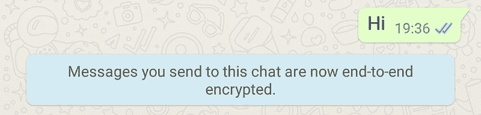
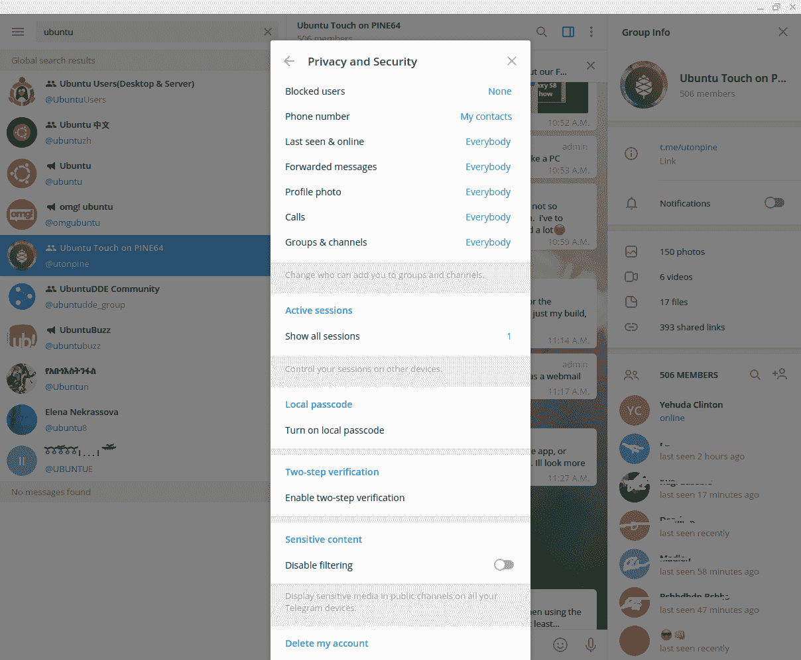

# 端到端加密–您的数据对大型技术公司来说安全吗？

> 原文：<https://www.freecodecamp.org/news/end-to-end-encryption-is-your-data-safe/>

时不时地，我们会在新闻中听到一些令人震惊的重大科技隐私侵权事件。我们还经常被告知我们的应用程序正在采取的所有新措施，以进一步保护我们的隐私。

然后，我们中的大多数人在没有真正理解问题的情况下，权衡了这些顾虑，承认了现状。只要除了我们没有人能看到这条消息:

最近，WhatsApp 宣布，用户必须同意与脸书分享你的数据，包括电话号码和位置。

让我们从最基本的问题开始:

## app、网站、操作系统可以接触到哪些信息？

让我们试着深入研究 WhatsApp，因为它们最近受到了攻击。

每个 WhatsApp 用户都会遇到类似“这个个人消息有端到端加密”的说法。这意味着一旦这条信息离开你的手机，WhatsApp 或其他任何人都无法破译它。

我们应该能够相信，脸书无法在服务器上读取我们的 WhatsApp 消息，即使他们在接收者连接之前存储了这些消息。你可以在这里阅读 WhatsApp 的[隐私政策。](https://www.whatsapp.com/legal/privacy-policy)

到目前为止，没有骗局。

然而，他们在隐私政策中没有提到的是关于媒体和传感器的应用内权限。我指的是首次使用时弹出的权限对话框。

我还指的是你的操作系统在应用生态系统之外与脸书共享的数据。

[Help understanding Whatsapp’s permissionsWhatsapp has been nagging me for the past few days that I have to upgrade it to continue using it. With the Facebook acquisition and the Play Store no longer marking the permissions that are “NEW”sundar - Reinstate MonicaAndroid Enthusiasts Stack Exchange](https://android.stackexchange.com/questions/71802/help-understanding-whatsapps-permissions)

安装新手机时，您可以阅读该应用程序访问的权限列表，包括:存储、位置、摄像头、麦克风、帐户、个人资料、联系人和查看正在运行的应用程序。

上面的 *StackExchange* 文章已经有五年多了，从那以后列表也发生了变化。然而，您会看到权限频繁更改的模式，以及确定应用程序何时以及如何访问媒体或设备传感器是多么困难。

### BIG-Tech 如何使用您的数据？

让我们来看一下 WhatsApp 列出的一些权限:

*   **您的社交媒体资料** -详细信息，如“电话号码”和“关于”
*   **地点和时间** -当你在一个给定的地方
*   照片/媒体/文件 -希望他们只是把它用于他们所说的
*   **联系人** -他们可能会在广告算法中分享这些信息
*   **摄像头** -希望它只在加密视频通话时使用
*   **麦克风** -希望如此...但是看到[这个](https://www.quora.com/Can-Whatsapp-use-microphone-access-to-listen-to-converstations-even-when-not-being-used-for-audio-video-call-And-can-Facebook-use-that-data-to-shows-ads?share=1)和[这个](https://www.quora.com/Is-Facebook-listening-to-me-through-my-phones-microphone)。听起来不清楚
*   **陀螺仪/加速度计** -确定您何时行走、坐着或驾驶
*   **光传感器** -帮助确定你的手机是在你的口袋里还是靠在你的头上等等

### 那么在你没有预料到的时候，他们是直接还是间接使用这些传感器呢？

脸书可能不需要承认这个问题的答案，因为 google-play-services 收集了很多这类信息，并以不同的方式与他们分享。我们最好的答案是，我们无法用这种或那种方式来证明它。

如果 Big-Tech 只是利用我们的数据向我们推销相关广告，这对大多数人来说都没问题，但我们怎么知道呢？同样，如果他们今天没有这样做，也没有什么能阻止他们有一天这样做。

### 他们是如何逃脱的

我们可以从其他案例中看到，大型科技公司通常会在这些问题上相互支持。Big-Tech 已经建立了以数据为中心的方式来推动网络世界的发展。他们似乎不喜欢竞争。

请注意 Parler 应用程序如何从 AWS 启动，同时又被不同的应用程序商店禁止。AWS 托管的应用程序或谷歌上还有很多其他的煽动行为。即使存在抛弃 Parler 的持续压力，作为一个不断增长的社交媒体应用可能会决定他们的命运。

## 那么有哪些选择呢？

### [电报](https://telegram.org)信号&

Telegram 是一个关注隐私的即时通讯平台，拥有大约 5 亿用户。尽管这款应用让人感觉像顶级社交网络，但其首席执行官[并不打算利用用户数据](https://techcrunch.com/2020/12/23/telegram-to-launch-an-ad-platform-as-it-approaches-500-million-users/)来赚钱。

它的移动应用程序是开源的，所以我们可以准确地知道它如何使用你的手机数据。这也允许我们评估端到端加密的强度。

**Signal** 是一个完全开源的消息和呼叫服务。它的非营利性质保证你没有广告或费用，但它使用起来有点复杂，服务质量较低。

### 如何保持你的电报的私密性和安全性

使用设置来控制谁可以查看您的照片、群组/频道或电话号码。您可以将您的帐户名设为别名，并在您的个人资料中使用您的真实姓名，只有您的朋友可以看到。

## 你拿什么来交换隐私？

当使用 WhatsApp 和类似的社交媒体时，你被迫遵守硅谷的政治和道德标准。尽管你可能讨厌它，但它们确实能很好地保护你免受诈骗、骚扰和其他犯罪活动的侵害。

如果你决定使用替代方案，比如 Telegram，你应该准备好成为自己的过滤器。如果没有仔细的监督，Telegram 或 Signal 应用程序可能对儿童不安全。这款应用有[个版本](https://www.mspy.com/telegram.html)，允许父母监控孩子的信息和联系人。

如果你想了解更多我们日常遇到的底层技术，请阅读大卫·克林顿的这本书。

如果你正在寻找加密你的设备，考虑参加我的来自曼宁出版社的 VPN 课程。