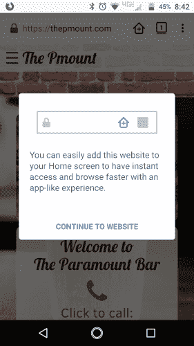
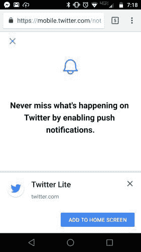
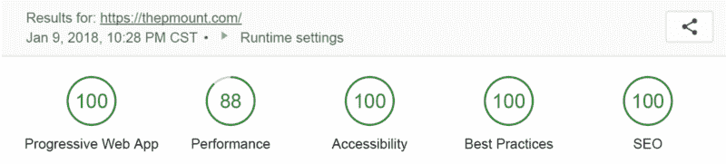

# 通过渐进式网络应用吸引用户并增强他们的体验

> 原文：<https://www.freecodecamp.org/news/engage-your-users-and-enhance-their-experience-with-progressive-web-apps-de0e0bfb2fbf/>

作者戴夫·格雷

# 通过渐进式网络应用吸引用户并增强他们的体验

Photo by [Rodion Kutsaev](https://unsplash.com/photos/0VGG7cqTwCo?utm_source=unsplash&utm_medium=referral&utm_content=creditCopyText) on [Unsplash](https://unsplash.com/search/photos/smartphone?utm_source=unsplash&utm_medium=referral&utm_content=creditCopyText)

### **什么是渐进式网络应用？**

一个**渐进式网络应用**(又名 PWA)是二元的。既是网站又是 web app。PWA 为新网站和现有网站提供[渐进式增强](https://developers.google.com/web/updates/2015/12/getting-started-pwa)。这些以移动为重点的增强功能很容易证明其合理性。[2016 年秋季，移动互联网使用量超过了桌面互联网使用量。](https://techcrunch.com/2016/11/01/mobile-internet-use-passes-desktop-for-the-first-time-study-finds/)这是一个真正的移动优先的世界。

其中一个增强功能是“添加到主屏幕”选项。网站通过[满足特定的 PWA 设计标准](https://developers.google.com/web/fundamentals/app-install-banners/#what_are_the_criteria)在某些浏览器中启用该功能。此功能允许您将 PWA 图标与其他应用程序图标一起保存到主屏幕。然后，您可以使用应用程序的外观启动 PWA。

The default message from Firefox Beta when visiting a Progressive Web App.

网络开发者现在可以为用户设计一个“类似应用程序”的全屏体验。HTML、CSS 和 Javascript 是唯一必要的编程语言。包括推送通知、摄像头、地理定位和更多功能在内的原生移动设备功能现已可供使用。此外，即使您丢失了数据连接，PWA 仍应提供功能。离线应该能用！

谷歌定义了进步网络应用的三个“必须”领域:必须**可靠**、**快速**，以及**吸引**。谷歌表示，渐进式网络应用应该“*即时加载，而不管网络状态*”、“*快速响应用户交互*”、“*在用户的主屏幕上直播*”、“*提供沉浸式全屏体验*。

### 为什么我(或我的公司)需要一款渐进式网络应用？

当渐进式网络应用程序足够时，你可以**消除开发单独解决方案** (iOS、Android、Web)的需要。

无论如何，pwa 都不是所有移动应用的替代品。有许多移动应用程序具有 PWAs 无法复制的功能。然而，如果你的应用侧重于信息共享(帖子、图片、产品、支持、社交互动)，PWA 是一个很好的选择。

“为什么”这个问题的另一个答案是**到达**。

参考 comScore 2017 年美国移动应用报告([在此请求访问](https://www.comscore.com/Insights/Presentations-and-Whitepapers/2017/The-2017-US-Mobile-App-Report))，87%的使用时间在移动应用上，而 13%的使用时间在移动网络上。然而，当比较前 500 名移动网络应用程序与前 500 名移动网络属性的覆盖范围时，移动网络的覆盖范围是前者的两倍多——平均每月独立访问者为 1，570 万，而移动应用程序为 700 万。

此外，comScore 指出，2017 年，80%的用户有意将应用程序移动到他们的主屏幕上，比 2016 年上升了 5%。

The Pmount PWA installed on the home screen and ready to send push notifications for daily specials.

渐进式网络应用结合了本地应用功能的能力，这些功能推动了**高使用次数**和**的网络属性**以及**在主屏幕上安装的能力**。这种混合组合使得渐进式网络应用程序值得考虑。

一些网站已经开始向全功能的渐进式网络应用迈进。

The Twitter Lite PWA requesting permissions for push notifications and a home screen icon

Twitter Lite 是利用推送通知和离线功能的一个很好的例子。Twitter 的 PWA " [显著提高了参与度，减少了数据使用](https://developers.google.com/web/showcase/2017/twitter)。

The Pinterest PWA resulted in an increase of 40% more time spent in the mobile experience

这个 [Pinterest PWA 案例研究](https://medium.com/dev-channel/a-pinterest-progressive-web-app-performance-case-study-3bd6ed2e6154)揭示了令人印象深刻的统计数据和宝贵的见解。与之前的移动网络体验相比，Pinterest 的核心参与度增长了 60%。他们的用户生成广告收入增长了 44%。此外，花费的时间增加了 40%。

Over half a million Trivago users have already decided to “add to home screen”

Trivago 的 PWA 正在取得惊人的成绩。[超过 50 万用户](https://www.thinkwithgoogle.com/intl/en-gb/consumer-insights/trivago-embrace-progressive-web-apps-as-the-future-of-mobile/)使用了他们的“添加到主屏幕”功能。这些用户的参与度上升了 150%。 [Trivago](https://www.trivago.com/) 在这段视频中讨论他们的 PWA 决定[。](https://youtu.be/pFE3LRRxqlo)

还有许多其他艾滋病毒感染者的例子。从 [pwa.rocks](https://pwa.rocks/) 和这个[5 个令人敬畏的 pwa](https://deanhume.com/home/blogpost/5-awesome-progressive-web-apps-worth-exploring/10153)列表开始你的搜索。

### 我如何开始？

如果你是一名网络开发者，一个很好的起点是[谷歌开发者渐进式网络应用页面](https://developers.google.com/web/progressive-web-apps/)。你需要了解[服务人员](https://developers.google.com/web/fundamentals/primers/service-workers/)和[网络应用清单](https://developers.google.com/web/fundamentals/web-app-manifest/)。

Google 提供了一个名为 Lighthouse 的自动化网站审计工具。Lighthouse 审核你的应用的五个类别:渐进式网络应用、性能、可访问性、最佳实践和搜索引擎优化。详细的 Lighthouse 审计报告将为您提供 15 页的详细信息以及 50 多个单独的审计结果。

The five categories of audit results provided by Lighthouse.

如果你不是一个网站开发者，你需要找一个来创建或更新你当前的网站到一个进步的网络应用。pwa 目前是开发人员密集型的。我不知道有任何服务将代码知识从解决方案中移除。如果你拥有当地的酒吧或咖啡店，你可能会发现一个经常光顾的顾客，他也是一个需要 PWA 测试项目的开发人员。(见[thepmount.com](http://thepmount.com))在接下来的几个月里，我计划就 PWA 创建过程的每一步发表文章。

### **结论**

**渐进式网络应用**为现有网站提供[渐进式增强](https://developers.google.com/web/updates/2015/12/getting-started-pwa)，并为现有和新的网络应用设定[新标准](https://developers.google.com/web/fundamentals/app-install-banners/#what_are_the_criteria)。满足 PWA 要求并通过 [Lighthouse 审核](https://developers.google.com/web/tools/lighthouse/)将有助于在移动设备上提供[可靠、快速和吸引人的](https://developers.google.com/web/progressive-web-apps/)用户体验……这是我们都应该从中受益的事情。

Today’s Americano from the local coffee shop

任何时候都可以通过 LinkedIn 或 T2 Twitter 联系我。如果你喜欢这篇文章，给它一些掌声。我将真诚地感谢它。

[**戴夫·格雷|职业简介| LinkedIn**](https://www.linkedin.com/in/davidagray/)
[*查看戴夫·格雷在 LinkedIn 上的职业简介。LinkedIn 是世界上最大的商业网络，帮助…*www.linkedin.com](https://www.linkedin.com/in/davidagray/)[**戴夫·格雷(@ yedavidgray)|推特**](https://twitter.com/yesdavidgray)
[*戴夫·格雷的最新推文(@ yedavidgray)。讲师@FHSUInformatics *开发者*音乐人*企业家……*twitter.com](https://twitter.com/yesdavidgray)