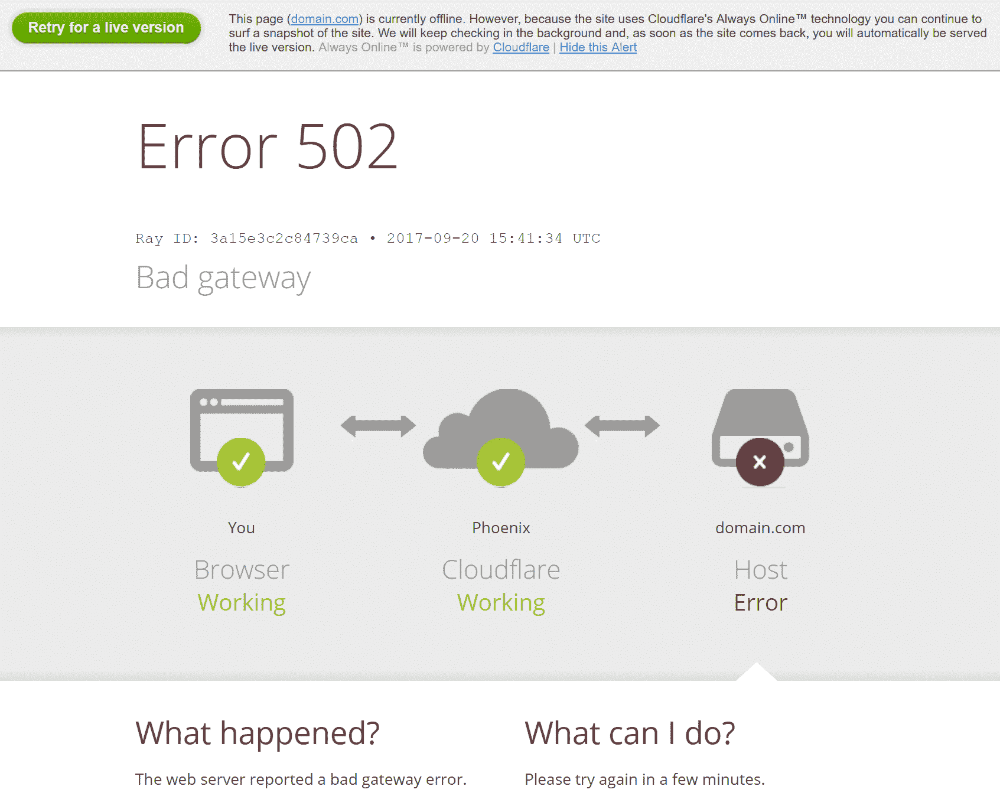

# 错误 502 错误网关含义

> 原文：<https://www.freecodecamp.org/news/error-502-bad-gateway-meaning/>

当你访问一个网站，你得到一个“502 坏网关”的错误，这意味着有一个网站的服务器供电问题。

在许多情况下，这种错误是网站本身的问题，所以在你这边，你无法解决它。

但是，如果计算机的网络适配器或网络设置配置不当，也会出现此错误。

错误中的“502”是一个 HTTP 状态代码，表示一台服务器从另一台服务器收到了无效响应。

谷歌是这样显示错误的:

有时候，我所在国家的一个流行论坛是这样显示的:

看起来由 Cloudflare 支持的网站以这种方式显示了错误。

其他一些网站以自己定制的方式展示。

## 502 坏网关到底是什么意思？

国际工程任务组(IETF)以更广泛的方式定义了 502 坏网关错误:

> 502(坏网关)状态代码表示服务器在充当网关或代理时，收到了来自它在尝试完成请求时访问的入站服务器的无效响应。

“代理服务器”是一个系统或路由器，充当您的计算机和互联网之间的网关。

另一方面，入站服务器是将传入连接传送到您的计算机的服务器。即 web 服务器。

## 什么导致了坏网关错误？

正如前面指出的，502 坏网关是一个服务器错误，就像 500 范围内的其他 HTTP 状态代码错误一样，如 501(未实现)、503(服务不可用)、504(网关超时)和 505(不支持 HTTP 版本)。

这个特定的服务器错误可能是过载的服务器、编程和后端配置错误，甚至是尚未传播的域名。

但有时，由于过期更新、广告拦截器、浏览器扩展或计算机 DNS 服务器问题，浏览器可能会抛出此错误。

## 最后的想法

我希望这篇文章能帮助你理解 502 坏网关错误意味着什么。

如果你是一个网站管理员，你的用户抱怨这个错误，你应该尽快修复它，因为它可能会对你的网站的搜索引擎优化产生负面影响。

如果你作为一个用户遇到这个错误，它很有可能来自你试图访问的网站。有些时候，这可能是由于配置不良的路由器和设置。

您可以尝试刷新网页，清除浏览器缓存，然后切换到另一个浏览器。

为了看看作为用户你如何解决这个错误，我写了一篇详细的文章来帮助你。

感谢您的阅读。