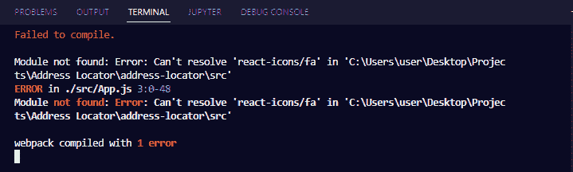
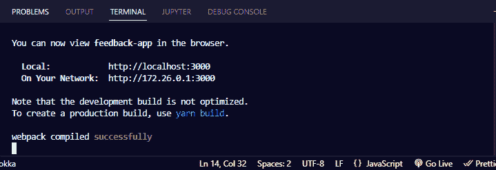

# 错误:找不到模块[节点 npm 错误已解决]

> 原文：<https://www.freecodecamp.org/news/error-cannot-find-module-node-npm-error-solved/>

如果您是使用 Node JS 和 JavaScript 库以及 React、Vue 和 Angular 等框架的开发人员，那么您可能会遇到“错误:找不到模块”错误。

在本文中，我将向您展示如何修复这个错误。

## 为什么会出现“错误:找不到模块”

发生此错误的原因如下:

*   您正试图从项目目录中未安装的模块中导入一项
*   你正在从一个过时的包中导入一些东西
*   你指向一个不存在的文件

在下面的截图中，你可以看到我得到了错误:



我得到这个错误是因为我试图从 react-icons 包中导入 freeCodeCamp 图标，我还没有安装这个包。

```
import { FaFreeCodeCamp } from "react-icons/fa"; 
```

## 如何修复“找不到模块”错误

如果你得到这个错误，解决方法总是在错误中。找不到的模块(包)总是以“找不到的模块:错误:无法解析“项目目录”中的“包名”的格式指定。

我的情况是这样得到的“找不到模块:错误:无法解析' C:\ Users \ user \ Desktop \ Projects \ Address Locator \ Address-Locator \ src '中的' react-icons/fa '”。

要修复这个错误，您需要安装您的项目目录中不存在的包—`npm install package-name`或`yarn add package-name`。

在我的例子中，我需要安装`react-icons`包，这样 freeCodeCamp 图标就可以被解析。我将通过运行`yarn add react-icons`来实现。

一旦我安装了软件包并运行了应用程序，一切都应该成功编译:



如果您安装了软件包，但仍然出现错误，请按照以下步骤操作:

*   通过运行 `rm -rf node_modules`删除节点模块文件夹
*   运行 `rm -f package-lock.json`删除 package.lock.json 文件
*   通过运行 `npm cache clean --force`清理 NPM 缓存
*   通过运行`npm install`再次安装所有软件包

这应该可以修复你的错误。

## 结论

当你得到“找不到模块”的错误，或者“找不到模块”，这意味着你没有安装你想使用的软件包。

如果即使安装了软件包也出现错误，那么本文中建议的修复方法可以帮助您解决问题。

感谢您的阅读。