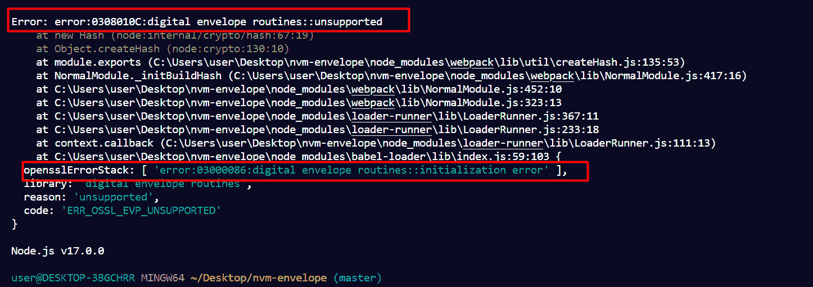
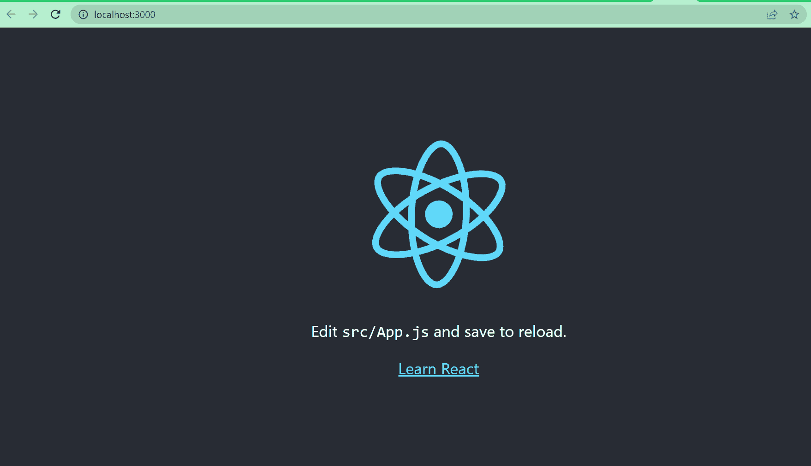

# 错误:错误:0308010c:数字信封例程::不支持[节点错误已解决]

> 原文：<https://www.freecodecamp.org/news/error-error-0308010c-digital-envelope-routines-unsupported-node-error-solved/>

如果您使用 Node.js 和命令行界面解决方案，如 Webpack、create-react-app 或 vue-cli-service，您可能会遇到错误`Error: error:0308010c:digital envelope routines::unsupported`。

你并不孤单，因为我现在也一样:

React 应用程序确实无法启动:

在本文中，您将学习如何用 3 种方法修复这个错误。但首先，让我们讨论一下是什么导致了错误。

## 什么导致了“0308010c:数字信封例程::不支持”的错误？

您可能会收到此错误，主要有两个原因:

*   您没有使用 Node JS 的 LTS(长期支持)版本。您可以看到我使用的是 Node 17.0.0，这不是 Node 的 LTS 版本。
*   您使用的 react-script 版本低于 5

因为您使用的是节点 17，所以也可能发生错误。

## 如何修复“0308010c:数字信封例程::不支持”错误

至少有 3 种方法可以修复这个错误。我们将一个一个来看。他们中的任何一个都应该为你工作。

### 将`--openssl-legacy-provider`传递给 Webpack 或 CLI 工具

例如，在 React 应用程序中，您可以像这样将`--openssl-legacy-provider`传递给启动脚本`"react-scripts --openssl-legacy-provider start"`。

应该可以了。但是如果这不能修复错误，那么继续下一个修复。在许多情况下，它是有效的。

### 使用节点 JS 的 LTS 版本

考虑将您的节点版本降级到 16.16.0 或其他 LTS 版本。

目前，18.12.1 是 Node 的最新 LTS 版本。可以从 Node JS 官网下载或者使用 NVM 安装。

### 将 React 脚本升级到版本 5+

如果您正在使用 React，但仍然无法修复错误，那么很可能是 React 脚本有问题。

如果您使用的 React 脚本版本低于 5，那么您应该将其升级到版本 5+。

在我的例子中，我目前使用的是 react-scripts 3.4.3:

要将 react-scripts 升级到 5+版本，有两种方法可以实现:

*   卸载并重新安装 react 脚本

    *   打开终端并运行`npm uninstall react-scripts`
    *   运行`npm install react-scripts`
*   手动更改 react 脚本版本

    *   转到您的`package.json`，将 react-script 版本更改为 5.0.2
    *   通过运行`rm –rf node_modules`删除 node_modules 文件夹
    *   通过运行`rm –rf package.lock.json`删除 package.lock.json 文件
    *   运行`npm install`或`yarn add`，这取决于您使用的软件包管理器

将 react-scripts 版本升级到 5+后，我的 react 应用程序现在工作正常:

## 结论

正如本文已经指出的，如果您得到“0308010 c:digital envelope routines::unsupported”错误，那么可能您没有使用 Node JS 的 LTS 版本，或者您使用的 react-scripts 版本低于 5。

希望我们在本教程中讨论的修复可以帮助您修复这个错误。如果任何一个补丁对你不起作用，那么你应该试试其他的。在我的情况下，将 react-scripts 升级到 5+对我来说是有效的。

感谢您的阅读。