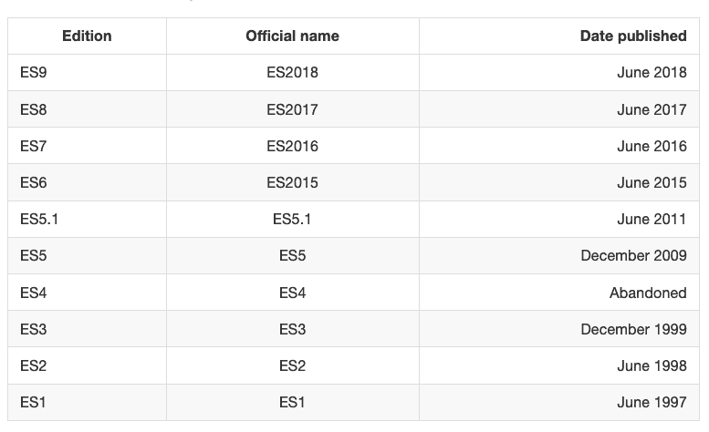
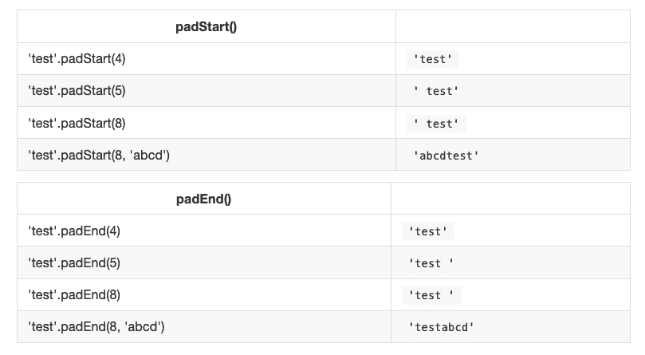

# ES5 到 es next——这是自 2015 年以来 JavaScript 增加的所有功能

> 原文：<https://www.freecodecamp.org/news/es5-to-esnext-heres-every-feature-added-to-javascript-since-2015-d0c255e13c6e/>

我写这篇文章是为了帮助您学习 ES6 之前的 JavaScript 知识，并让您快速了解该语言的最新进展。

今天的 JavaScript 是唯一一种可以在浏览器中本地运行的语言，并且是高度集成和优化的。

JavaScript 的未来将是辉煌的。跟上这些变化应该不会比现在更难，我在这里的目标是给你一个快速而全面的新东西的概述。

**[点击这里获取这篇帖子的 PDF / ePub / Mobi 版本离线阅读](https://flaviocopes.com/page/es5-to-esnext/)**

# ECMAScript 简介

每当你阅读 JavaScript 时，你都会不可避免地看到这些术语中的一个:ES3、ES5、ES6、ES7、ES8、ES2015、ES2016、ES2017、ECMAScript 2017、ECMAScript 2016、ECMAScript 2015……它们是什么意思？

他们都在引用一个**标准**，叫做 ECMAScript。

ECMAScript 是 JavaScript 基于的标准，通常缩写为 T2 ES T3。

除了 JavaScript，其他语言也实现了 ECMAScript，包括:

*   自从 Flash 将于 2020 年正式停产以来，action script(Flash 脚本语言)正在失去人气
*   JScript(微软脚本方言)，因为当时 JavaScript 仅被 Netscape 支持，浏览器大战正处于高峰期，微软不得不为 Internet Explorer 开发自己的版本

当然，JavaScript 是 ES 中最流行和广泛使用的实现。

为什么取这个奇怪的名字？是瑞士标准协会，负责定义国际标准。

JavaScript 创建时，由网景公司和太阳微系统公司提交给 Ecma，他们将其命名为 ECMA-262 别名 **ECMAScript** 。

Netscape 和 Sun Microsystems(Java 的制造商)发布的新闻稿可能有助于解决名称选择的问题，这可能包括委员会中的微软的法律和品牌问题，根据维基百科的说法是。

在 IE9 之后，微软停止在浏览器中将其 ES 支持命名为 JScript，并开始称之为 JavaScript(至少，我再也找不到它的参考文献了)。

所以截至 201x，支持 ECMAScript 规范的唯一流行语言是 JavaScript。

### 当前 ECMAScript 版本

目前的 ECMAScript 版本是 **ES2018** 。

2018 年 6 月发布。

### 什么是 TC39

TC39 是 JavaScript 发展的委员会。

TC39 的成员是 JavaScript 和浏览器供应商，包括 Mozilla、谷歌、脸书、苹果、微软、英特尔、PayPal、SalesForce 等。

每个标准版本提案都必须经过不同的阶段，[在此](https://tc39.github.io/process-document/)解释。

### ES 版本

我发现令人困惑的是，为什么有时 es 版本是通过版本号引用的，而有时是通过年份引用的，而我对年份恰好是数字上的-1 感到困惑，这增加了围绕 JS/ES 的普遍困惑？

在 ES2015 之前，ECMAScript 规范通常按其版本进行调用。所以 ES5 是 2009 年发布的 ECMAScript 规范更新的官方名称。

为什么会这样？在通向 ES2015 的过程中，名称从 ES6 更改为 ES2015，但由于完成得较晚，人们仍然将其称为 ES6，并且社区并没有放弃版本命名— *世界仍然通过版本号*来称呼 ES 版本。

这张桌子应该能让事情清楚一点:


让我们深入了解自 ES5 以来 JavaScript 中添加的特定特性。让我们从 ES2015 的特性开始。

## 让和 const

在 ES2015 之前，`var`是唯一可用于定义变量的构造。

```
var a = 0
```

如果你忘记添加`var`，你将会给一个未声明的变量赋值，结果可能会不同。

在现代环境中，如果启用了严格模式，您将会得到一个错误。在旧的环境中(或者禁用了严格模式)，这将初始化变量并将其赋给全局对象。

如果您在声明变量时没有初始化它，它将拥有`undefined`值，直到您给它赋值。

```
var a //typeof a === 'undefined'
```

您可以多次重新声明该变量，并覆盖它:

```
var a = 1
var a = 2
```

您也可以在同一语句中一次声明多个变量:

```
var a = 1, b = 2
```

**范围**是变量可见的代码部分。

在任何函数之外用`var`初始化的变量被赋给全局对象，具有全局作用域并且随处可见。在函数内部用`var`初始化的变量被赋给那个函数，它是局部的，并且只在函数内部可见，就像函数参数一样。

在函数中定义的任何与全局变量同名的变量优先于全局变量，并隐藏它。

理解块(由一对花括号标识)并不定义新的作用域，这一点很重要。只有在创建函数时才会创建新的作用域，因为`var`没有块作用域，只有函数作用域。

在函数内部，函数中定义的任何变量在整个函数代码中都是可见的，即使变量是在函数的末尾声明的，它仍然可以在函数的开头被引用，因为 JavaScript 在执行代码之前实际上*将所有变量移动到了*之上(这被称为**提升**)。为了避免混淆，总是在函数的开头声明变量。

### 使用`let`

`let`是 ES2015 中引入的新功能，本质上是`var`的块范围版本。它的范围仅限于定义它的块、语句或表达式，以及所有包含的内部块。

现代 JavaScript 开发人员可能会选择只使用`let`，而完全放弃使用`var`。

> *如果`let`似乎是一个晦涩的术语，只要把`let color = 'red'`读作*让颜色变成红色*就更有意义了*

在任何函数之外定义`let`——与`var`相反——不会创建全局变量。

### 使用`const`

用`var`或`let`声明的变量可以在程序的后面被改变，并被重新分配。一旦`const`被初始化，它的值就不能再被改变，也不能被重新赋值。

```
const a = 'test'
```

我们不能给`a`常量赋予不同的文字。然而，如果一个对象提供了改变其内容的方法，我们可以改变`a`。

`const`不提供不变性，只是确保引用不能被改变。

`const`有阻塞范围，同`let`。

现代 JavaScript 开发人员可能会选择总是使用`const`来表示程序中不需要重新分配的变量，因为我们应该总是使用最简单的构造来避免以后出错。

## 箭头功能

自从引入箭头函数以来，它永远改变了 JavaScript 代码的外观(和工作方式)。

在我看来，这种变化是如此受欢迎，以至于你现在很少在现代代码库中看到关键字`function`的用法。尽管这仍然有它的用法。

从视觉上看，这是一个简单而受欢迎的变化，它允许您用更短的语法编写函数，来自:

```
const myFunction = function() {
  //...
}
```

到

```
const myFunction = () => {
  //...
}
```

如果函数体只包含一条语句，可以省略括号，将所有语句写在一行中:

```
const myFunction = () => doSomething()
```

参数在括号中传递:

```
const myFunction = (param1, param2) => doSomething(param1, param2)
```

如果有一个(且只有一个)参数，可以完全省略括号:

```
const myFunction = param => doSomething(param)
```

由于这个简短的语法，箭头函数**鼓励使用小函数**。

### 隐性回报

箭头函数允许您隐式返回:返回的值不需要使用`return`关键字。

当函数体中有一行语句时，它就工作了:

```
const myFunction = () => 'test'

myFunction() //'test'
```

另一个例子，当返回一个对象时，记得用圆括号将花括号括起来，以避免它被认为是包装函数体括号:

```
const myFunction = () => ({ value: 'test' })

myFunction() //{value: 'test'}
```

### `this`如何在箭头函数中工作

`this`是一个很难理解的概念，因为它根据上下文变化很大，也根据 JavaScript 的模式而变化(*严格模式*与否)。

澄清这个概念很重要，因为与常规函数相比，箭头函数的行为非常不同。

当定义为一个对象的方法时，在常规函数中`this`指的是这个对象，所以你可以做:

```
const car = {
  model: 'Fiesta',
  manufacturer: 'Ford',
  fullName: function() {
    return `${this.manufacturer} ${this.model}`
  }
}
```

调用`car.fullName()`会返回`"Ford Fiesta"`。

带有箭头函数的`this`作用域是从执行上下文中继承的**。一个箭头函数根本没有绑定`this`，所以它的值会在调用栈中查找，所以在这段代码中`car.fullName()`不会工作，会返回字符串`"undefined undefined"`:**

```
const car = {
  model: 'Fiesta',
  manufacturer: 'Ford',
  fullName: () => {
    return `${this.manufacturer} ${this.model}`
  }
}
```

因此，箭头函数不适合作为对象方法。

箭头函数也不能用作构造函数，当实例化一个对象时会引发一个`TypeError`。

这就是应该使用常规函数的地方，**当不需要动态上下文时**。

这也是处理事件时的问题。DOM 事件侦听器将`this`设置为目标元素，如果您在事件处理程序中依赖于`this`，那么一个常规函数是必要的:

```
const link = document.querySelector('#link')
link.addEventListener('click', () => {
  // this === window
})

const link = document.querySelector('#link')
link.addEventListener('click', function() {
  // this === link
})
```

## 班级

JavaScript 有一种很不寻常的方法来实现继承:原型继承。原型继承虽然在我看来很棒，但它不同于大多数其他流行编程语言的继承实现，后者是基于类的。

来自 Java 或 Python 或其他语言的人很难理解原型继承的复杂性，因此 ECMAScript 委员会决定在原型继承的基础上增加语法，以便类似于其他流行实现中基于类的继承的工作方式。

这一点很重要:幕后的 JavaScript 仍然是一样的，您可以用通常的方式访问对象原型。

### 类别定义

这就是一个类的样子。

```
class Person {
  constructor(name) {
    this.name = name
  }

  hello() {
    return 'Hello, I am ' + this.name + '.'
  }
}
```

一个类有一个标识符，我们可以用这个标识符通过`new ClassIdentifier()`创建新的对象。

当对象初始化时，调用`constructor`方法，并传递任何参数。

一个类需要多少方法就有多少方法。在这种情况下,`hello`是一个方法，可以在从该类派生的所有对象上调用:

```
const flavio = new Person('Flavio')
flavio.hello()
```

### 类继承

一个类可以扩展另一个类，使用那个类初始化的对象继承两个类的所有方法。

如果继承的类有一个方法与层次结构中较高的类同名，则最接近的方法优先:

```
class Programmer extends Person {
  hello() {
    return super.hello() + ' I am a programmer.'
  }
}

const flavio = new Programmer('Flavio')
flavio.hello()
```

(以上程序打印“*你好，我是 Flavio。我是一名程序员。*))

类没有显式的类变量声明，但是您必须在构造函数中初始化任何变量。

在一个类内部，可以引用父类调用`super()`。

### 静态方法

通常方法是在实例上定义的，而不是在类上。

静态方法改为在类上执行:

```
class Person {
  static genericHello() {
    return 'Hello'
  }
}

Person.genericHello() //Hello
```

### 私有方法

JavaScript 没有定义私有或受保护方法的内置方式。

有变通方法，但我不会在这里描述它们。

### Getters 和 setters

您可以添加以`get`或`set`为前缀的方法来创建 getter 和 setter，这是根据您所做的事情执行的两段不同的代码:访问变量或修改其值。

```
class Person {
  constructor(name) {
    this._name = name
  }

  set name(value) {
    this._name = value
  }

  get name() {
    return this._name
  }
}
```

如果您只有一个 getter，则无法设置属性，并且任何这样做的尝试都将被忽略:

```
class Person {
  constructor(name) {
    this._name = name
  }

  get name() {
    return this._name
  }
}
```

如果您只有一个 setter，您可以更改该值，但不能从外部访问它:

```
class Person {
  constructor(name) {
    this._name = name
  }

  set name(value) {
    this._name = value
  }
}
```

## 默认参数

这是一个接受`param1`的`doSomething`函数。

```
const doSomething = (param1) => {

}
```

如果在没有指定参数的情况下调用函数，我们可以为`param1`添加一个默认值:

```
const doSomething = (param1 = 'test') => {

}
```

当然，这也适用于更多的参数:

```
const doSomething = (param1 = 'test', param2 = 'test2') => {

}
```

如果您有一个唯一的对象，其中包含参数值，该怎么办？

从前，如果我们必须将一个选项对象传递给一个函数，以便在其中一个选项未定义时拥有这些选项的默认值，您必须在函数中添加一点代码:

```
const colorize = (options) => {
  if (!options) {
    options = {}
  }

  const color = ('color' in options) ? options.color : 'yellow'
  ...
}
```

通过析构，您可以提供默认值，这大大简化了代码:

```
const colorize = ({ color = 'yellow' }) => {
  ...
}
```

如果在调用我们的`colorize`函数时没有传递对象，类似地，我们可以默认分配一个空对象:

```
const spin = ({ color = 'yellow' } = {}) => {
  ...
}
```

## 模板文字

与 ES5 及以下版本相比，模板文字允许你以一种新颖的方式处理字符串。

乍一看，语法非常简单，只需使用反斜线代替单引号或双引号:

```
const a_string = `something`
```

它们是独一无二的，因为它们提供了许多用引号构建的普通字符串所没有的功能，特别是:

*   它们提供了很好的语法来定义多行字符串
*   它们提供了在字符串中插入变量和表达式的简单方法
*   它们允许你创建带有模板标签的 DSLs 是指领域特定语言，例如在 React by Styled Components 中使用它来定义组件的 CSS)

让我们来详细研究一下这些问题。

### 多行字符串

在 ES6 之前，要创建跨两行的字符串，必须在行尾使用`\`字符:

```
const string =
  'first part \
second part'
```

这允许在两行上创建一个字符串，但它只在一行上呈现:

`first part second part`

为了在多行上显示字符串，您需要在每行的末尾添加`\n`,就像这样:

```
const string =
  'first line\n \
second line'
```

或者

```
const string = 'first line\n' + 'second line'
```

模板文字使得多行字符串更加简单。

一旦用反勾号打开了模板文字，您只需按 enter 键创建一个新行，不包含特殊字符，它将按原样呈现:

```
const string = `Hey
this

string
is awesome!`
```

请记住，空间是有意义的，所以这样做:

```
const string = `First
                Second`
```

会创建这样一个字符串:

```
First
                Second
```

解决这个问题的一个简单方法是让第一行为空，并在右反勾号后追加 trim()方法，这将消除第一个字符前的任何空格:

```
const string = `
First
Second`.trim()
```

### 插入文字

模板文字提供了一种将变量和表达式插入字符串的简单方法。

您可以通过使用`${...}`语法来实现:

```
const var = 'test'
const string = `something ${var}` //something test
```

在`${}`中，你可以添加任何东西，甚至是表达式:

```
const string = `something ${1 + 2 + 3}`
const string2 = `something ${foo() ? 'x' : 'y'}`
```

### 模板标签

标记模板是一个一开始听起来不太有用的特性，但它实际上被很多流行的库使用，如 Styled Components 或 Apollo，GraphQL 客户端/服务器库，所以理解它是如何工作的是很重要的。

在样式化组件中，模板标签用于定义 CSS 字符串:

```
const Button = styled.button`
  font-size: 1.5em;
  background-color: black;
  color: white;
`
```

在 Apollo 中，模板标签用于定义 GraphQL 查询模式:

```
const query = gql`
  query {
    ...
  }
`
```

那些例子中突出显示的`styled.button`和`gql`模板标签只是**函数**:

```
function gql(literals, ...expressions) {}
```

这个函数返回一个字符串，它可以是任何一种计算的结果。

`literals`是一个数组，包含由表达式插值标记的模板文字内容。

`expressions`包含所有插值。

如果我们举一个上面的例子:

```
const string = `something ${1 + 2 + 3}`
```

`literals`是包含两项的数组。第一个是`something`，第一次插值之前的字符串，第二个是空字符串，第一次插值结束(我们只有一个)和字符串结束之间的空格。

在这种情况下，`expressions`是一个只有一项的数组，`6`。

一个更复杂的例子是:

```
const string = `something
another ${'x'}
new line ${1 + 2 + 3}
test`
```

在本例中,`literals`是一个数组，其中第一项是:

```
;`something
another `
```

第二是:

```
;`new line `
```

第三个是:

```
;`
new line `
```

本例中的`expressions`是一个包含两项的数组，`x`和`6`。

传递这些值的函数可以对它们做任何事情，这就是这种特性的强大之处。

最简单的例子是通过连接`literals`和`expressions`来复制字符串插值的功能:

```
const interpolated = interpolate`I paid ${10}€`
```

这就是`interpolate`的工作方式:

```
function interpolate(literals, ...expressions) {
  let string = ``
  for (const [i, val] of expressions) {
    string += literals[i] + val
  }
  string += literals[literals.length - 1]
  return string
}
```

## 析构赋值

给定一个对象，您可以只提取一些值，并将它们放入命名变量中:

```
const person = {
  firstName: 'Tom',
  lastName: 'Cruise',
  actor: true,
  age: 54, //made up
}

const {firstName: name, age} = person
```

`name`和`age`包含所需的值。

该语法也适用于数组:

```
const a = [1,2,3,4,5]
const [first, second] = a
```

该语句通过从数组`a`中获取索引为 0，1，4 的项来创建 3 个新变量:

## 增强的对象文字

```
const [first, second, , , fifth] = a
```

在 ES2015 中，对象文字获得了超能力。

### 包含变量的更简单语法

而不是做

```
const something = 'y'
const x = {
  something: something
}
```

你能做到

```
const something = 'y'
const x = {
  something
}
```

### 原型

原型可以用以下内容来指定

```
const anObject = { y: 'y' }
const x = {
  __proto__: anObject
}
```

### 超级()

```
const anObject = { y: 'y', test: () => 'zoo' }
const x = {
  __proto__: anObject,
  test() {
    return super.test() + 'x'
  }
}
x.test() //zoox
```

### 动态性能

```
const x = {
  ['a' + '_' + 'b']: 'z'
}
x.a_b //z
```

## For-of 循环

早在 2009 年，ES5 就引入了`forEach()`循环。虽然不错，但他们没有提供打破的方法，就像`for`循环总是做的那样。

ES2015 推出了`**for-of**` **循环**，它结合了`forEach`的简洁和打破的能力:

```
//iterate over the value
for (const v of ['a', 'b', 'c']) {
  console.log(v);
}

//get the index as well, using `entries()`
for (const [i, v] of ['a', 'b', 'c'].entries()) {
  console.log(index) //index
  console.log(value) //value
}
```

注意`const`的用法。这个循环在每次迭代中都创建一个新的范围，所以我们可以安全地使用它来代替`let`。

与`for...in`的区别在于:

*   `for...of` **迭代属性值**
*   `for...in` **迭代属性名**

## 承诺

一个承诺通常被定义为**一个最终将变得可用的价值的代理**。

承诺是处理异步代码的一种方式，无需在代码中编写太多回调。

异步函数使用 promises API 作为它们的构建模块，所以理解它们是基本的，即使在新的代码中你可能会使用异步函数而不是 promises。

### 简而言之，承诺是如何起作用的

一旦承诺被调用，它将从**未决状态**开始。这意味着调用者函数继续执行，同时等待承诺进行自己的处理，并给调用者函数一些反馈。

此时，调用者函数等待它返回处于**已解决状态**或**已拒绝状态**的承诺，但是正如您所知 [JavaScript](https://flaviocopes.com/javascript/) 是异步的，所以*函数继续执行，同时承诺工作*。

### 哪些 JS API 使用承诺？

除了您自己的代码和库代码，promises 还被标准的现代 Web APIs 使用，例如:

*   电池 API
*   [获取 API](https://flaviocopes.com/fetch-api/)
*   [服务人员](https://flaviocopes.com/service-workers/)

在现代 JavaScript 中，你不太可能发现自己*而不是*在使用承诺，所以让我们开始深入了解它们。

### 创造承诺

Promise API 公开了一个 Promise 构造函数，您可以使用`new Promise()`来初始化它:

```
let done = true

const isItDoneYet = new Promise((resolve, reject) => {
  if (done) {
    const workDone = 'Here is the thing I built'
    resolve(workDone)
  } else {
    const why = 'Still working on something else'
    reject(why)
  }
})
```

正如你所看到的，承诺检查了`done`全局常量，如果这是真的，我们返回一个解析的承诺，否则返回一个拒绝的承诺。

使用`resolve`和`reject`我们可以传递回一个值，在上面的例子中我们只是返回一个字符串，但是它也可以是一个对象。

### 履行诺言

在上一节中，我们介绍了如何创建承诺。

现在让我们来看看承诺是如何被消费或使用的。

```
const isItDoneYet = new Promise()
//...

const checkIfItsDone = () => {
  isItDoneYet
    .then(ok => {
      console.log(ok)
    })
    .catch(err => {
      console.error(err)
    })
}
```

运行`checkIfItsDone()`将执行`isItDoneYet()`承诺，并等待它解决，使用`then`回调，如果有错误，它将在`catch`回调中处理它。

### 连锁承诺

一个承诺可以转化为另一个承诺，形成一个承诺链。

链接承诺的一个很好的例子是由 [Fetch API](https://flaviocopes.com/fetch-api) 给出的，它是 XMLHttpRequest API 之上的一层，我们可以使用它来获取资源，并在获取资源时对要执行的承诺链进行排队。

Fetch API 是一个基于承诺的机制，调用`fetch()`相当于使用`new Promise()`定义我们自己的承诺。

### 连锁承诺示例

```
const status = response => {
  if (response.status >= 200 && response.status < 300) {
    return Promise.resolve(response)
  }
  return Promise.reject(new Error(response.statusText))
}

const json = response => response.json()

fetch('/todos.json')
  .then(status)
  .then(json)
  .then(data => {
    console.log('Request succeeded with JSON response', data)
  })
  .catch(error => {
    console.log('Request failed', error)
  })
```

在这个例子中，我们调用`fetch()`从域根中找到的`todos.json`文件中获取 TODO 项的列表，并且我们创建了一个承诺链。

运行`fetch()`返回一个[响应](https://fetch.spec.whatwg.org/#concept-response)，它有许多属性，在我们引用的属性中:

*   `status`，代表 HTTP 状态码的数值
*   `statusText`，状态消息，如果请求成功，则为`OK`

`response`也有一个`json()`方法，它返回一个承诺，这个承诺将通过处理并转换成 JSON 的正文内容来解决。

给定这些前提，事情是这样的:链中的第一个承诺是我们定义的函数，称为`status()`，它检查响应状态，如果不是成功响应(在 200 和 299 之间)，它拒绝这个承诺。

该操作将导致承诺链跳过列出的所有连锁承诺，并将直接跳到底部的`catch()`语句，记录`Request failed`文本和错误消息。

如果成功了，它调用我们定义的 json()函数。因为前一个承诺成功时返回了`response`对象，所以我们将它作为第二个承诺的输入。

在本例中，我们返回 JSON 处理的数据，因此第三个承诺直接接收 JSON:

```
.then((data) => {
  console.log('Request succeeded with JSON response', data)
})
```

我们把它记录到控制台。

### 处理错误

在上面的例子中，在前面的部分中，我们有一个附加到承诺链的`catch`。

当承诺链中的任何一项失败并引发错误或拒绝承诺时，控制权将转移到链中最近的`catch()`语句。

```
new Promise((resolve, reject) => {
  throw new Error('Error')
}).catch(err => {
  console.error(err)
})

// or

new Promise((resolve, reject) => {
  reject('Error')
}).catch(err => {
  console.error(err)
})
```

### 级联错误

如果在`catch()`中引发了一个错误，可以追加第二个`catch()`来处理它，以此类推。

```
new Promise((resolve, reject) => {
  throw new Error('Error')
})
  .catch(err => {
    throw new Error('Error')
  })
  .catch(err => {
    console.error(err)
  })
```

### 精心策划的承诺

#### `Promise.all()`

如果您需要同步不同的承诺，`Promise.all()`帮助您定义一个承诺列表，并在它们都解决后执行一些事情。

示例:

```
const f1 = fetch('/something.json')
const f2 = fetch('/something2.json')

Promise.all([f1, f2])
  .then(res => {
    console.log('Array of results', res)
  })
  .catch(err => {
    console.error(err)
  })
```

ES2015 析构赋值语法还允许您

```
Promise.all([f1, f2]).then(([res1, res2]) => {
  console.log('Results', res1, res2)
})
```

你当然不局限于使用`fetch`，**任何承诺都行**。

#### `Promise.race()`

当您传递给它的一个承诺解决时，它就运行，并且它只运行一次附加的回调，第一个承诺的结果被解决。

示例:

```
const promiseOne = new Promise((resolve, reject) => {
  setTimeout(resolve, 500, 'one')
})
const promiseTwo = new Promise((resolve, reject) => {
  setTimeout(resolve, 100, 'two')
})

Promise.race([promiseOne, promiseTwo]).then(result => {
  console.log(result) // 'two'
})
```

## 模块

ES 模块是使用模块的 ECMAScript 标准。

虽然 Node.js 多年来一直使用 CommonJS 标准，但浏览器从未有过模块系统，因为每个重大决策(如模块系统)都必须首先由 ECMAScript 标准化，然后由浏览器实现。

这一标准化过程随着 ES2015 完成，浏览器开始实施这一标准，试图保持一切协调一致，以相同的方式工作，现在 ES 模块在 Chrome、Safari、Edge 和 Firefox(从版本 60 开始)中得到支持。

模块非常酷，因为它们可以让你封装各种功能，并将这些功能作为库暴露给其他 JavaScript 文件。

### ES 模块语法

导入模块的语法是:

```
import package from 'module-name'
```

而 commons 使用

```
const package = require('module-name')
```

模块是一个 JavaScript 文件，**使用`export`关键字导出**一个或多个值(对象、函数或变量)。例如，此模块导出一个返回大写字符串的函数:

> *uppercase.js*

```
export default str => str.toUpperCase()
```

在这个例子中，模块定义了一个单独的，**默认导出**，所以它可以是一个匿名函数。否则，它将需要一个名字来区别于其他出口。

现在，**任何其他 JavaScript 模块**都可以通过导入 uppercase.js 提供的功能。

HTML 页面可以通过使用带有 sp`ecial type="m`module "属性的`<scri` pt >标签来添加模块:

```
<script type="module" src="index.js"></script>
```

> *注意:这个模块导入的行为类似于`defer`脚本加载。参见[用延迟和异步有效加载 JavaScript](https://flaviocopes.com/javascript-async-defer/)*

需要注意的是，任何用`type="module"`加载的脚本都是在严格模式下加载的。

在这个例子中，`uppercase.js`模块定义了一个**默认导出**，所以当我们导入它时，我们可以给它指定一个我们喜欢的名称:

```
import toUpperCase from './uppercase.js'
```

我们可以利用它:

```
toUpperCase('test') //'TEST'
```

还可以使用绝对路径导入模块，以引用在另一个域上定义的模块:

```
import toUpperCase from 'https://flavio-es-modules-example.glitch.me/uppercase.js'
```

这也是有效的导入语法:

```
import { toUpperCase } from '/uppercase.js'
import { toUpperCase } from '../uppercase.js'
```

这不是:

```
import { toUpperCase } from 'uppercase.js'
import { toUpperCase } from 'utils/uppercase.js'
```

要么是绝对的，要么名字前有个`./`或者`/`。

### 其他导入/导出选项

我们在上面看到了这个例子:

```
export default str => str.toUpperCase()
```

这将创建一个默认导出。但是，在一个文件中，您可以使用以下语法导出多个内容:

```
const a = 1
const b = 2
const c = 3

export { a, b, c }
```

另一个模块可以使用

```
import * from 'module'
```

您可以使用析构赋值来导入这些导出中的一部分:

```
import { a } from 'module'
import { a, b } from 'module'
```

为了方便起见，您可以使用`as`重命名任何导入:

```
import { a, b as two } from 'module'
```

您可以按名称导入默认导出和任何非默认导出，就像下面这个常见的 React 导入一样:

```
import React, { Component } from 'react'
```

你可以在这里看到一个 ES 模块的例子:[https://glitch.com/edit/#!/flavio-es-modules-示例？path=index.html](https://glitch.com/edit/#!/flavio-es-modules-example?path=index.html)

### 克-奥二氏分级量表

使用 CORS 获取模块。这意味着如果你引用来自其他域的脚本，它们必须有一个有效的 CORS 头，允许跨站点加载(像`Access-Control-Allow-Origin: *`)

#### 不支持模块的浏览器怎么办？

使用`type="module"`和`nomodule`的组合:

```
<script type="module" src="module.js"></script>
<script nomodule src="fallback.js"></script>
```

### 包装模块

ES 模块是现代浏览器中引入的最大特性之一。它们是 ES6 的一部分，但是实现它们的道路是漫长的。

我们现在可以使用它们了！但是我们也必须记住，拥有过多的模块会影响页面的性能，因为这是浏览器在运行时必须执行的又一个步骤。

即使 ES 模块登陆浏览器，Webpack 可能仍将是一个巨大的参与者，但在语言中直接构建这样一个功能对于统一模块在客户端和 Node.js 上的工作方式来说是巨大的。

## 新的字符串方法

任何字符串值都有一些新的实例方法:

*   `repeat()`
*   `codePointAt()`

### 重复()

将字符串重复指定的次数:

```
'Ho'.repeat(3) //'HoHoHo'
```

如果没有参数，则返回空字符串，或者参数为`0`。如果参数是负的，你会得到一个 RangeError。

### 代码点()

此方法可用于处理无法用单个 16 位 Unicode 单元表示的 Unicode 字符，而需要用 2 来表示。

使用`charCodeAt()`您需要检索第一个和第二个，并将它们组合起来。使用`codePointAt()`你可以在一次调用中得到整个角色。

比如这个汉字“？”由 2 个 UTF-16 (Unicode)部分组成:

```
"?".charCodeAt(0).toString(16) //d842
"?".charCodeAt(1).toString(16) //dfb7
```

如果通过组合这些 unicode 字符来创建新字符:

```
"\ud842\udfb7" //"?"
```

可以得到相同的结果符号`codePointAt()`:

```
"?".codePointAt(0) //20bb7
```

如果通过组合这些 unicode 字符来创建新字符:

```
"\u{20bb7}" //"?"
```

在我的 [Unicode 指南](https://flaviocopes.com/unicode/)中有更多关于 Unicode 和使用它的内容。

## 新对象方法

ES2015 在对象命名空间下引入了几个静态方法:

*   `Object.is()`确定两个值是否相同
*   `Object.assign()`用于浅层复制一个对象
*   `Object.setPrototypeOf`设置一个对象原型

### Object.is()

这种方法旨在帮助比较值。

用法:

```
Object.is(a, b)
```

结果总是`false`，除非:

*   `a`和`b`是同一个精确的物体
*   `a`和`b`是相等的字符串(由相同字符组成的字符串是相等的)
*   `a`和`b`是相等的数(值相等时数相等)
*   `a`和`b`都是`undefined`，都是`null`，都是`NaN`，都是`true`或者都是`false`

`0`和`-0`在 JavaScript 中是不同的值，所以在这种特殊情况下要注意(例如，在比较之前使用`+`一元运算符将 all 转换为`+0`)。

### 对象.分配()

在`ES2015`中引入，该方法将一个或多个对象的所有 ****可枚举自身属性**** 复制到另一个中。

它的主要用例是创建一个对象的浅层副本。

```
const copied = Object.assign({}, original)
```

作为浅层复制，值被克隆，对象引用被复制(而不是对象本身)，因此如果您在原始对象中编辑对象属性，该属性在复制的对象中也会被修改，因为引用的内部对象是相同的:

```
const original = {
  name: 'Fiesta',
  car: {
    color: 'blue'
  }
}

const copied = Object.assign({}, original)

original.name = 'Focus'
original.car.color = 'yellow'

copied.name //Fiesta
copied.car.color //yellow
```

我提到了“一个或多个”:

```
const wisePerson = {
  isWise: true
}
const foolishPerson = {
  isFoolish: true
}
const wiseAndFoolishPerson = Object.assign({}, wisePerson, foolishPerson)

console.log(wiseAndFoolishPerson) //{ isWise: true, isFoolish: true }
```

### Object.setPrototypeOf()

设置对象的原型。接受两个参数:对象和原型。

用法:

```
Object.setPrototypeOf(object, prototype)
```

示例:

```
const animal = {
  isAnimal: true
}
const mammal = {
  isMammal: true
}

mammal.__proto__ = animal
mammal.isAnimal //true

const dog = Object.create(animal)

dog.isAnimal  //true
console.log(dog.isMammal)  //undefined

Object.setPrototypeOf(dog, mammal)

dog.isAnimal //true
dog.isMammal //true
```

### 扩展运算符

您可以使用扩展运算符`...`扩展一个数组、一个对象或一个字符串

让我们从一个数组例子开始。考虑到

```
const a = [1, 2, 3]
```

您可以使用创建新的数组

```
const b = [...a, 4, 5, 6]
```

您还可以使用创建数组的副本

```
const c = [...a]
```

这也适用于对象。使用以下内容克隆对象:

```
const newObj = { ...oldObj }
```

使用字符串，spread 运算符创建一个数组，其中包含字符串中的每个字符:

```
const hey = 'hey'
const arrayized = [...hey] // ['h', 'e', 'y']
```

这个运算符有一些非常有用的应用。最重要的一点是能够以非常简单的方式使用数组作为函数参数:

(在过去，你可以使用`f.apply(null, a)`来做这件事，但是那样不太好，可读性也不好。)

使用 ****数组析构**** 时， ****剩余元素**** 很有用:

```
const numbers = [1, 2, 3, 4, 5]
[first, second, ...others] = numbers
```

还有 ****传播元素**** :

```
const numbers = [1, 2, 3, 4, 5]
const sum = (a, b, c, d, e) => a + b + c + d + e
const sum = sum(...numbers)
```

ES2018 引入了 rest 属性，除了对象之外，其余都是相同的。

****休息属性**** :

```
const { first, second, ...others } = {
  first: 1,
  second: 2,
  third: 3,
  fourth: 4,
  fifth: 5
}

first // 1
second // 2
others // { third: 3, fourth: 4, fifth: 5 }
```

****传播属性**** 允许我们通过组合传播运算符后传递的对象的属性来创建一个新的对象:

```
const items = { first, second, ...others }
items //{ first: 1, second: 2, third: 3, fourth: 4, fifth: 5 }
```

## 一组

集合数据结构允许我们向容器中添加数据。

集合是对象或基本类型(字符串、数字或布尔值)的集合，您可以将其视为一个映射，其中值用作映射键，映射值始终为布尔值 true。

### 初始化集合

通过调用以下命令来初始化集合:

```
const s = new Set()
```

### 向器械包中添加物品

您可以使用`add`方法向器械包添加物品:

```
s.add('one')
s.add('two')
```

一个集合只存储唯一的元素，所以多次调用`s.add('one')`不会添加新的项目。

您不能同时将多个元素添加到集合中。需要多次调用`add()`。

### 检查物品是否在器械包中

一旦一个元素在集合中，我们可以检查集合是否包含它:

```
s.has('one') //true
s.has('three') //false
```

### 按键从集合中删除一个项目

使用`delete()`方法:

```
s.delete('one')
```

### 确定器械包中物品的数量

使用`size`属性:

```
s.size
```

### 删除集合中的所有项目

使用`clear()`方法:

```
s.clear()
```

### 迭代集合中的项目

使用`keys()`或`values()`方法——它们是等效的:

```
for (const k of s.keys()) {
  console.log(k)
}

for (const k of s.values()) {
  console.log(k)
}
```

`entries()`方法返回一个迭代器，可以这样使用:

```
const i = s.entries()
console.log(i.next())
```

调用`i.next()`会将每个元素作为`{ value, done = false }`对象返回，直到迭代器结束，此时`done`为`true`。

您还可以对集合使用 forEach()方法:

```
s.forEach(v => console.log(v))
```

或者您可以在 for 中使用该集合..循环的:

```
for (const k of s) {
  console.log(k)
}
```

### 用值初始化集合

您可以用一组值初始化集合:

```
const s = new Set([1, 2, 3, 4])
```

### 将集合密钥转换成数组

```
const a = [...s.keys()]

// or

const a = [...s.values()]
```

### 弱势群体

弱势群体是一种特殊的群体。

在集合中，项目永远不会被垃圾回收。相反，WeakSet 让它的所有项目都被免费垃圾收集。WeakSet 的每个键都是一个对象。当对该对象的引用丢失时，该值可以被垃圾回收。

以下是主要区别:

1.  你不能迭代最弱的
2.  您不能清除仓库集中的所有物品
3.  你不能检查它的大小

WeakSet 通常由框架级代码使用，并且只公开这些方法:

*   添加()
*   有()
*   删除()

## 地图

映射数据结构允许我们将数据与一个键相关联。

### ES6 之前

在引入之前，人们通常将对象用作映射，将一些对象或值与特定的键值相关联:

```
const car = {}
car['color'] = 'red'
car.owner = 'Flavio'
console.log(car['color']) //red
console.log(car.color) //red
console.log(car.owner) //Flavio
console.log(car['owner']) //Flavio
```

### 输入地图

ES6 引入了地图数据结构，为我们处理这种数据组织提供了合适的工具。

通过调用以下命令来初始化映射:

```
const m = new Map()
```

### 向地图添加项目

您可以使用`set`方法向地图添加项目:

```
m.set('color', 'red')
m.set('age', 2)
```

### 通过键从地图中获取项目

你可以使用`get`从地图中获取物品:

```
const color = m.get('color')
const age = m.get('age')
```

### 通过键从地图中删除项目

使用`delete()`方法:

```
m.delete('color')
```

### 从地图中删除所有项目

使用`clear()`方法:

```
m.clear()
```

### 通过关键字检查地图是否包含项目

使用`has()`方法:

```
const hasColor = m.has('color')
```

### 查找地图中项目的数量

使用`size`属性:

```
const size = m.size
```

### 用值初始化地图

您可以用一组值初始化地图:

```
const m = new Map([['color', 'red'], ['owner', 'Flavio'], ['age', 2]])
```

### 地图键

就像任何值(object，array，string，number)都可以作为地图项的 key-value 条目的值一样， ****任何值都可以作为 key**** ，甚至对象。

如果您尝试使用`get()`从映射中获取一个不存在的键，它将返回`undefined`。

### 你在现实生活中几乎找不到的奇怪情况

```
const m = new Map()
m.set(NaN, 'test')
m.get(NaN) //test

const m = new Map()
m.set(+0, 'test')
m.get(-0) //test
```

### 迭代映射键

Map 提供了`keys()`方法，我们可以用它来迭代所有的键:

```
for (const k of m.keys()) {
  console.log(k)
}
```

### 迭代地图值

Map 对象提供了我们可以用来迭代所有值的`values()`方法:

```
for (const v of m.values()) {
  console.log(v)
}
```

### 迭代映射键、值对

Map 对象提供了我们可以用来迭代所有值的`entries()`方法:

```
for (const [k, v] of m.entries()) {
  console.log(k, v)
}
```

这可以简化为

```
for (const [k, v] of m) {
  console.log(k, v)
}
```

### 将映射键转换成数组

```
const a = [...m.keys()]
```

### 将地图值转换为数组

```
const a = [...m.values()]
```

## WeakMap

地图是一种特殊的地图。

在地图对象中，项目永远不会被垃圾收集。相反，WeakMap 让它的所有物品都被免费垃圾收集。WeakMap 的每个键都是一个对象。当对该对象的引用丢失时，该值可以被垃圾回收。

以下是主要区别:

1.  不能迭代 WeakMap 的键或值(或键值)
2.  您不能清除武器地图中的所有物品
3.  你不能检查它的大小

WeakMap 公开了这些方法，这些方法相当于 Map 方法:

*   `get(k)`
*   `set(k, v)`
*   `has(k)`
*   `delete(k)`

WeakMap 的用例没有 Map 那么明显，您可能永远也不会发现需要它们，但本质上它可以用来构建一个不会干扰垃圾收集的内存敏感的缓存，或者用于小心封装和信息隐藏。

## 发电机

生成器是一种特殊的函数，能够暂停自己，稍后恢复，允许其他代码同时运行。

关于这个主题的详细解释，请参阅完整的 JavaScript 生成器指南。

代码决定它必须等待，所以它让“队列中”的其他代码运行，并保留“当它等待的事情完成时”恢复其操作的权利。

所有这些都是通过一个简单的关键字完成的:`yield`。当生成器包含该关键字时，执行会暂停。

一个生成器可以包含许多`yield`关键字，因此可以多次暂停自己，它由`*function`关键字标识，不要与 C、C++或 Go 等低级编程语言中使用的指针解引用操作符混淆。

生成器支持全新的 JavaScript 编程范式，允许:

*   发电机运行时的双向通信
*   长寿命的 while 循环不会冻结你的程序

这里有一个发电机的例子，解释了它是如何工作的。

```
function *calculator(input) {
    var doubleThat = 2 * (yield (input / 2))
    var another = yield (doubleThat)
    return (input * doubleThat * another)
}
```

我们用初始化它

```
const calc = calculator(10)
```

然后我们在生成器上启动迭代器:

```
calc.next()
```

第一次迭代启动迭代器。代码返回此对象:

```
{
  done: false
  value: 5
}
```

实际情况是:代码运行函数，在生成器构造函数中传递`input = 10`。一直运行到`yield`，返回`yield` : `input / 2 = 5`的内容。所以我们得到了值 5，以及迭代没有完成的指示(函数只是暂停了)。

在第二次迭代中，我们传递值`7`:

```
calc.next(7)
```

我们得到的是:

```
{
  done: false
  value: 14
}
```

`7`被放置为`doubleThat`的值。重要提示:你可能会觉得`input / 2`就是参数，但那只是第一次迭代的返回值。我们现在跳过它，使用新的输入值`7`，并将其乘以 2。

然后我们到达第二个 yield，它返回`doubleThat`，所以返回值是`14`。

在下一次，也是最后一次迭代中，我们传递 100

```
calc.next(100)
```

作为回报，我们得到了

```
{
  done: true
  value: 14000
}
```

随着迭代的完成(没有找到更多的 yield 关键字)，我们只返回相当于`10 * 14 * 100`的`(input * doubleThat * another)`。

* * *

这些是 ES2015 中引入的功能。现在让我们深入了解范围小得多的 ES2016。

* * *

## Array.prototype.includes()

这个特性引入了一个可读性更好的语法来检查数组是否包含元素。

在 ES6 和更低版本中，要检查数组是否包含元素，您必须使用`indexOf`，它检查数组中的索引，如果元素不存在，则返回`-1`。

既然`-1`被评估为真值，你可以用 ****而不是**** 做例子

```
if (![1,2].indexOf(3)) {
  console.log('Not found')
}
```

借助 ES7 中引入的这一功能，我们可以做到

```
if (![1,2].includes(3)) {
  console.log('Not found')
}
```

# 指数运算符

取幂操作符`**`相当于`Math.pow()`，但是被引入到语言中，而不是作为库函数。

```
Math.pow(4, 2) == 4 ** 2
```

这个特性对于数学密集型 JS 应用程序来说是一个很好的补充。

`**`操作符在许多语言中都是标准化的，包括 Python、Ruby、MATLAB、Lua、Perl 和许多其他语言。



* * *

这些是 2016 年推出的功能。现在让我们进入 2017 年

* * *

# 字符串填充

字符串填充的目的是 ****给一个字符串**** 添加字符，所以它 ****达到一个特定的长度**** 。

ES2017 引入了两种`String`方法:`padStart()`和`padEnd()`。

```
padStart(targetLength [, padString])
padEnd(targetLength [, padString])
```

示例用法:



## Object.values()

此方法返回包含所有对象自身属性值的数组。

用法:

```
const person = { name: 'Fred', age: 87 }
Object.values(person) // ['Fred', 87]
```

`Object.values()`也适用于数组:

```
const people = ['Fred', 'Tony']
Object.values(people) // ['Fred', 'Tony']
```

## Object.entries()

该方法返回一个包含所有对象自身属性的数组，作为一个由`[key, value]`对组成的数组。

用法:

```
const person = { name: 'Fred', age: 87 }
Object.entries(person) // [['name', 'Fred'], ['age', 87]]
```

`Object.entries()`也适用于数组:

```
const people = ['Fred', 'Tony']Object.entries(people) // [['0', 'Fred'], ['1', 'Tony']]
```

## Object.getOwnPropertyDescriptors()

这个方法返回一个对象的所有自己的(非继承的)属性描述符。

JavaScript 中的任何对象都有一组属性，每个属性都有一个描述符。

描述符是属性的一组属性，由以下内容的子集组成:

*   ****价值**** 财产的价值
*   ****可写**** : true 属性可以更改
*   ****get**** :属性的 getter 函数，读取属性时调用
*   ****set**** :属性的 setter 函数，当属性被设置为一个值时调用
*   ****可配置**** :如果为 false，则不能删除该属性，也不能改变除其值以外的任何属性
*   ****可枚举**** :如果属性可枚举，则为真

接受一个对象，并返回一个带有描述符集合的对象。

### 这在哪些方面有用？

ES6 给了我们`Object.assign()`，它从一个或多个对象中复制所有可枚举的自身属性，并返回一个新的对象。

但是，这有一个问题，因为它不能正确地复制具有非默认属性的属性。

例如，如果一个对象只有一个 setter，使用`Object.assign()`就不能正确地复制到一个新对象。

例如，与

```
const person1 = {
    set name(newName) {
        console.log(newName)
    }
}
```

这不行:

```
const person2 = {}
Object.assign(person2, person1)
```

但这是可行的:

```
const person3 = {}Object.defineProperties(person3,  Object.getOwnPropertyDescriptors(person1))
```

正如您在一个简单的控制台测试中看到的:

```
person1.name = 'x'
"x"

person2.name = 'x'

person3.name = 'x'
"x"
```

`person2`错过了二传手，就没有抄过来。

同样的限制也适用于使用 ****Object.create()**** 的浅层克隆对象。

## 尾随逗号

该特性允许在函数声明和函数调用中使用尾随逗号:

```
const doSomething = (var1, var2,) => {
  //...
}

doSomething('test2', 'test2',)
```

这一改变将鼓励开发人员停止丑陋的“行首逗号”习惯。

## 异步函数

JavaScript 在很短的时间内从回调发展到承诺(ES2015)，自 ES2017 以来，异步 JavaScript 通过 async/await 语法变得更加简单。

异步函数是承诺和生成器的组合，基本上，它们是对承诺的更高层次的抽象。我再说一遍: ****async/await 是建立在承诺上的**** 。

### 为什么引入 async/await？

它们减少了承诺周围的样板文件，以及链接承诺的“不要打破链条”限制。

当 ES2015 中引入承诺时，它们旨在解决异步代码的问题，它们确实解决了，但在 ES2015 和 ES2017 相隔的两年中，很明显 **承诺不可能是最终的解决方案** 。

承诺的引入是为了解决著名的 **回调地狱** 问题，但是它们本身引入了复杂性，以及语法复杂性。

它们是很好的原语，围绕它们可以向开发者展示更好的语法，所以当时机成熟时，我们得到了 ****异步函数**** 。

它们使代码看起来像是同步的，但在幕后却是异步的和非阻塞的。

### 它是如何工作的

异步函数返回一个承诺，如下例所示:

```
const doSomethingAsync = () => {
  return new Promise(resolve => {
    setTimeout(() => resolve('I did something'), 3000)
  })
}
```

当你要 ****调用**** 这个函数时你预置`await`， ****调用代码会停止，直到承诺被解决或者拒绝**** 。一个警告:客户端函数必须定义为`async`。这里有一个例子:

```
const doSomething = async () => {
  console.log(await doSomethingAsync())
}
```

### 一个简单的例子

这是一个用于异步运行函数的 async/await 的简单示例:

```
const doSomethingAsync = () => {
  return new Promise(resolve => {
    setTimeout(() => resolve('I did something'), 3000)
  })
}

const doSomething = async () => {
  console.log(await doSomethingAsync())
}

console.log('Before')
doSomething()
console.log('After')
```

上述代码会将以下内容打印到浏览器控制台:

```
Before
After
I did something //after 3s
```

### 答应所有的事情

在任何函数前面加上`async`关键字意味着该函数将返回一个承诺。

即使它没有明确地这样做，它也会在内部让它返回一个承诺。

这就是这段代码有效的原因:

```
const aFunction = async () => {
  return 'test'
}

aFunction().then(alert) // This will alert 'test'
```

这和:

```
const aFunction = async () => {
  return Promise.resolve('test')
}

aFunction().then(alert) // This will alert 'test'
```

### 代码更容易阅读

正如你在上面的例子中看到的，我们的代码看起来非常简单。与使用简单承诺的代码相比，它具有链接和回调函数。

这是一个非常简单的例子，当代码非常复杂时，主要的好处就会出现。

例如，下面是如何获得一个 JSON 资源，并使用 promises 解析它:

```
const getFirstUserData = () => {
  return fetch('/users.json') // get users list
    .then(response => response.json()) // parse JSON
    .then(users => users[0]) // pick first user
    .then(user => fetch(`/users/${user.name}`)) // get user data
    .then(userResponse => response.json()) // parse JSON
}

getFirstUserData()
```

下面是使用 await/async 提供的相同功能:

```
const getFirstUserData = async () => {
  const response = await fetch('/users.json') // get users list
  const users = await response.json() // parse JSON
  const user = users[0] // pick first user
  const userResponse = await fetch(`/users/${user.name}`) // get user data
  const userData = await user.json() // parse JSON
  return userData
}

getFirstUserData()
```

### 多个异步函数串联

异步函数可以很容易地链接起来，并且语法比简单的承诺可读性更好:

```
const promiseToDoSomething = () => {
  return new Promise(resolve => {
    setTimeout(() => resolve('I did something'), 10000)
  })
}

const watchOverSomeoneDoingSomething = async () => {
  const something = await promiseToDoSomething()
  return something + ' and I watched'
}

const watchOverSomeoneWatchingSomeoneDoingSomething = async () => {
  const something = await watchOverSomeoneDoingSomething()
  return something + ' and I watched as well'
}

watchOverSomeoneWatchingSomeoneDoingSomething().then(res => {
  console.log(res)
})
```

将打印:

```
I did something and I watched and I watched as well
```

### 更容易调试

调试承诺是困难的，因为调试器不会跳过异步代码。

Async/await 使这变得非常容易，因为对于编译器来说，它就像同步代码一样。

## 共享内存和原子

WebWorkers 用于在浏览器中创建多线程程序。

他们通过事件提供消息协议。从 ES2017 开始，您可以使用`SharedArrayBuffer`在 web 工作者和他们的创建者之间创建共享内存数组。

由于不知道写入共享内存部分需要多少时间来传播， ****原子**** 是一种在读取值时强制完成任何类型的写操作的方式。

关于这个[的更多细节可以在 spec 提案](https://github.com/tc39/ecmascript_sharedmem/blob/master/TUTORIAL.md)中找到，该提案已经实施。

* * *

这是 ES2017。现在让我来介绍 ES2018 的特性

* * *

## 休息/传播属性

ES2015 在使用 ****数组析构**** 时引入了 ****剩余元素**** 的概念:

```
const numbers = [1, 2, 3, 4, 5]
[first, second, ...others] = numbers
```

还有 ****传播元素**** :

```
const numbers = [1, 2, 3, 4, 5]
const sum = (a, b, c, d, e) => a + b + c + d + e
const sum = sum(...numbers)
```

ES2018 针对对象推出了相同的功能。

****休息属性**** :

```
const { first, second, ...others } = { first: 1, second: 2, third: 3, fourth: 4, fifth: 5 }

first // 1
second // 2
others // { third: 3, fourth: 4, fifth: 5 }
```

****展开属性**** 允许通过组合展开操作符后传递的对象属性来创建一个新对象:

```
const items = { first, second, ...others }
items //{ first: 1, second: 2, third: 3, fourth: 4, fifth: 5 }
```

## 异步迭代

新的构造`for-await-of`允许您使用异步可迭代对象作为循环迭代:

```
for await (const line of readLines(filePath)) {
  console.log(line)
}
```

因为它使用了`await`，所以你只能在`async`函数中使用它，就像普通的`await`一样。

## 无极.原型.最终()

当一个承诺实现时，它成功地一个接一个地调用`then()`方法。

如果在此期间出现故障，则`then()`方法被跳转，并且`catch()`方法被执行。

`finally()`允许你运行一些代码，不管承诺执行成功与否:

```
fetch('file.json')
  .then(data => data.json())
  .catch(error => console.error(error))
  .finally(() => console.log('finished'))
```

## 正则表达式改进

ES2018 引入了许多关于正则表达式的改进。我推荐我在 https://flaviocopes.com/javascript-regular-expressions/的教程。

以下是 ES2018 的新增功能。

### RegExp lookbehind 断言:根据字符串前面的内容匹配字符串

这是一个前瞻:您使用`?=`来匹配后面跟有特定子串的字符串:

```
/Roger(?=Waters)/

/Roger(?= Waters)/.test('Roger is my dog') //false
/Roger(?= Waters)/.test('Roger is my dog and Roger Waters is a famous musician') //true
```

`?!`执行相反的操作，如果一个字符串是 ****而不是**** 后跟一个特定的子字符串，则进行匹配:

```
/Roger(?!Waters)/

/Roger(?! Waters)/.test('Roger is my dog') //true
/Roger(?! Waters)/.test('Roger Waters is a famous musician') //false
```

前视头使用`?=`符号。他们已经有了。

****Lookbehinds**** ，新功能，用`?<=`。

```
/(?<=Roger) Waters/

/(?<=Roger) Waters/.test('Pink Waters is my dog') //false
/(?<=Roger) Waters/.test('Roger is my dog and Roger Waters is a famous musician') //true
```

使用`?<!`取消后视:

```
/(?<!Roger) Waters/

/(?<!Roger) Waters/.test('Pink Waters is my dog') //true
/(?<!Roger) Waters/.test('Roger is my dog and Roger Waters is a famous musician') //false
```

### Unicode 属性转义\p{…}和\P{…}

在正则表达式模式中，您可以使用`\d`匹配任何数字，`\s`匹配任何非空白字符，`\w`匹配任何字母数字字符，等等。

这个新特性将这个概念扩展到所有引入`\p{}`的 Unicode 字符，并且是否定的`\P{}`。

任何 unicode 字符都有一组属性。例如，`Script`决定了语系，`ASCII`是一个布尔值，对于 ASCII 字符也是如此，等等。您可以将该属性放在图形括号中，正则表达式将检查该属性是否为真:

```
/^\p{ASCII}+$/u.test('abc')   //✅
/^\p{ASCII}+$/u.test('ABC@')  //✅
/^\p{ASCII}+$/u.test('ABC?') //❌
```

`ASCII_Hex_Digit`是另一个布尔属性，它检查字符串是否只包含有效的十六进制数字:

```
/^\p{ASCII_Hex_Digit}+$/u.test('0123456789ABCDEF') //✅
/^\p{ASCII_Hex_Digit}+$/u.test('h')                //❌
```

还有许多其他布尔属性，您只需在图形括号中添加它们的名称即可，包括`Uppercase`、`Lowercase`、`White_Space`、`Alphabetic`、`Emoji`等等:

```
/^\p{Lowercase}$/u.test('h') //✅
/^\p{Uppercase}$/u.test('H') //✅

/^\p{Emoji}+$/u.test('H')   //❌
/^\p{Emoji}+$/u.test('??') //✅
```

除了这些二进制属性，您还可以检查任何 unicode 字符属性以匹配特定值。在本例中，我检查字符串是用希腊字母还是拉丁字母书写的:

```
/^\p{Script=Greek}+$/u.test('ελληνικά') //✅
/^\p{Script=Latin}+$/u.test('hey') //✅
```

阅读更多关于您可以直接在提案上使用[的所有属性的信息。](https://github.com/tc39/proposal-regexp-unicode-property-escapes)

### 命名捕获组

在 ES2018 中，可以给采集群组指定一个名称，而不仅仅是在结果阵列中指定一个位置:

```
const re = /(?<year>\d{4})-(?<month>\d{2})-(?<day>\d{2})/
const result = re.exec('2015-01-02')

// result.groups.year === '2015';
// result.groups.month === '01';
// result.groups.day === '02';
```

### 正则表达式的 s 标志

`s`标志，是 **单行** 的缩写，使得`.`也匹配新的行字符。没有它，点匹配常规字符，但不匹配新行:

```
/hi.welcome/.test('hi\nwelcome') // false
/hi.welcome/s.test('hi\nwelcome') // true
```

* * *

## eq next

下一步是什么？ESNext。

ESNext 是一个名称，总是表示 JavaScript 的下一个版本。

目前 ECMAScript 版本为 ****ES2018**** 。2018 年 6 月发布。

历史上 JavaScript 版本在夏季已经标准化，因此我们可以预计 ****ECMAScript 2019**** 将在 2019 年夏季发布。

所以在写的时候 ES2018 已经发布了， ****ESNext 就是 ES2019****

ECMAScript 标准的提案是分阶段组织的。第 1-3 阶段是新功能的孵化器，达到第 4 阶段的功能将作为新标准的一部分最终确定下来。

在写这篇文章的时候，我们已经有了许多处于 ****、第 4 阶段**、第 3 阶段的特性。我将在本节中介绍它们。主流浏览器的最新版本应该已经实现了其中的大部分。**

其中一些变化主要是内部使用的，但是知道发生了什么也是很好的。

第三阶段还有其他功能，可能会在接下来的几个月内升级到第四阶段，你可以在 GitHub 的这个资源库中查看这些功能:[https://github.com/tc39/proposals](https://github.com/tc39/proposals)。

## Array.prototype.{flat，flatMap}

`flat()`是一个新的数组实例方法，可以从多维数组创建一维数组。

示例:

```
['Dog', ['Sheep', 'Wolf']].flat()
//[ 'Dog', 'Sheep', 'Wolf' ]
```

默认情况下，它最多只能“平铺”一层，但是您可以添加一个参数来设置希望平铺数组的层数。将其设置为`Infinity`以获得无限等级:

```
['Dog', ['Sheep', ['Wolf']]].flat()
//[ 'Dog', 'Sheep', [ 'Wolf' ] ]

['Dog', ['Sheep', ['Wolf']]].flat(2)
//[ 'Dog', 'Sheep', 'Wolf' ]

['Dog', ['Sheep', ['Wolf']]].flat(Infinity)
//[ 'Dog', 'Sheep', 'Wolf' ]
```

如果你熟悉数组的 JavaScript `map()`方法，你知道使用它你可以在数组的每个元素上执行一个函数。

`flatMap()`是一个新的数组实例方法，结合了`flat()`和`map()`。当调用在 map()回调中返回数组的函数时，这很有用，但是您希望得到的数组是平面的:

```
['My dog', 'is awesome'].map(words => words.split(' '))
//[ [ 'My', 'dog' ], [ 'is', 'awesome' ] ]

['My dog', 'is awesome'].flatMap(words => words.split(' '))
//[ 'My', 'dog', 'is', 'awesome' ]
```

### 可选 catch 绑定

有时我们不需要将参数绑定到 try/catch 的 catch 块。

我们以前不得不做:

```
try {
  //...
} catch (e) {
  //handle error
}
```

即使我们从来不需要使用`e`来分析错误。我们现在可以简单地忽略它:

```
try {
  //...
} catch {
  //handle error
}
```

## Object.fromEntries()

从 ES2017 开始，对象有一个`entries()`方法。

它返回包含所有对象自身属性的数组，作为一个由`[key, value]`对组成的数组:

```
const person = { name: 'Fred', age: 87 }
Object.entries(person) // [['name', 'Fred'], ['age', 87]]
```

ES2019 引入了一个新的`Object.fromEntries()`方法，它可以从这样的属性数组创建一个新对象:

```
const person = { name: 'Fred', age: 87 }
const entries = Object.entries(person)
const newPerson = Object.fromEntries(entries)

person !== newPerson //true 
```

## String.prototype.{trimStart，trimEnd}

这项功能成为 v8/Chrome 的一部分已经快一年了，它将在 ES2019 年实现标准化。

## `trimStart()`

返回一个新字符串，从原始字符串的开头删除空格

```
'Testing'.trimStart() //'Testing'
' Testing'.trimStart() //'Testing'
' Testing '.trimStart() //'Testing '
'Testing'.trimStart() //'Testing'
```

## `trimEnd()`

返回一个新字符串，从原始字符串的末尾删除空格

```
'Testing'.trimEnd() //'Testing'
' Testing'.trimEnd() //' Testing'
' Testing '.trimEnd() //' Testing'
'Testing '.trimEnd() //'Testing'
```

## 符号.原型.描述

现在，您可以通过访问符号的`description`属性来检索符号的描述，而不必使用`toString()`方法:

```
const testSymbol = Symbol('Test')
testSymbol.description // 'Test'
```

## JSON 改进

在此更改之前，行分隔符(\u2028)和段落分隔符(\u2029)符号不允许出现在被解析为 JSON 的字符串中。

使用 JSON.parse()，这些字符产生了一个`SyntaxError`，但是现在它们被正确解析了，正如 JSON 标准所定义的。

### 格式良好的 JSON.stringify()

修复了处理代理 UTF-8 码点(U+D800 到 U+DFFF)时的`JSON.stringify()`输出。

在此更改之前，调用`JSON.stringify()`会返回一个格式错误的 Unicode 字符(一个“↑”)。

现在，这些代理代码点可以使用`JSON.stringify()`安全地表示为字符串，并使用`JSON.parse()`转换回它们的原始表示。

## Function.prototype.toString()

函数总是有一个名为`toString()`的实例方法，它返回一个包含函数代码的字符串。

ES2019 引入了对返回值的更改，以避免去除注释和空白等其他字符，准确地表示函数的定义。

如果以前我们有

```
function /* this is bar */ bar () {}
```

行为是这样的:

```
bar.toString() //'function bar() {}
```

现在新的行为是:

```
bar.toString(); // 'function /* this is bar */ bar () {}'
```

* * *

最后，我希望这篇文章能帮助你了解一些最新的 JavaScript 附加功能，以及我们将在 2019 年看到的新功能。

[****点击这里获取这篇帖子的 PDF / ePub / Mobi 版本离线阅读****](https://flaviocopes.com/page/es5-to-esnext)

弗拉维奥