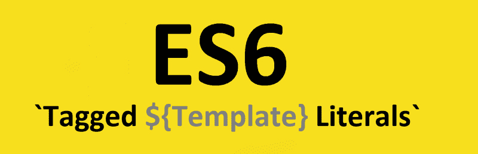

# ES6 标记的模板文字

> 原文：<https://www.freecodecamp.org/news/es6-tagged-template-literals-48a70ef3ed4d/>

作者:Sanket Meghani



# ES6 标记的模板文字

您可能已经熟悉 ES6 模板文字，它允许字符串插值，如下所示:

```
const name = 'Steve';const message = `Hello ${name}!`;
```

```
console.log(message); // Output -> Hello Steve!
```

ES6 还引入了一个更高级、更强大的标记模板文字概念。标签是一个能够解释和处理模板的函数。这意味着我们可以通过函数运行模板字符串，并对模板如何转换为字符串表示有更多的控制。

标签只是普通的函数，但是为了有用，它们必须以不同的方式被调用。以下示例显示了如何定义和调用标签:

标签需要通过传递一个模板文本来调用，而不使用括号，如上面第 9 行所示。

模板文本作为多个参数传递给标记函数。第一个参数是一个字符串数组，包含模板中的字符串:数组中的第一个元素是从索引 0 开始到第一个插值的字符串，数组中的第二个元素是第一个插值后的字符串，直到下一个插值，依此类推，直到到达模板的结尾。

所有插入的**表达式**都被求值，并作为第二个参数按照它们出现的顺序传递给标签。标签可以处理文字和计算表达式以形成返回值。

### 是什么让它强大？

显而易见的问题是:这怎么比普通的模板文字更强大？

所有插入的**表达式**都被求值并作为第二个参数传递给标签…

这允许我们使用函数表达式作为插值，这些插值可以被回调。我们举个例子，让它更清晰。

当插值包含函数表达式时，在正常模板文字的情况下，它被视为正常字符串。

例如，`${() => myFunction`()}被评估为 string`ng () => myFunc`tion()。

而在标记模板文字的情况下，相同的表达式被计算为函数，并且标记可以调用该函数。如示例所示，在调用`myTag`时，表达式`{() => myFunction` ()}被求值并作为函数`in f` unc 参数传递，我们的标记在第 9 行调用了 usi `ng fun` c()。

### 结论

Tag 使用函数表达式作为插值的能力——以及使用任何逻辑解释模板的能力——使它非常强大。它可以用来创建特定于领域的语言，并为使用(或滥用)带标签的模板文字提供了许多可能性。

带标签的模板文字支持开发像[样式组件](https://github.com/styled-components/styled-components)这样的库。如果您能想到标记模板文字可以支持的所有其他用例，请在下面评论。