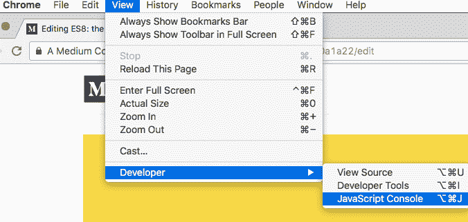

# ES8:JavaScript 语言在 2017 年有什么新变化

> 原文：<https://www.freecodecamp.org/news/es8-the-new-features-of-javascript-7506210a1a22/>

弗拉维奥·h·弗雷塔斯

# ES8:JavaScript 语言在 2017 年有什么新变化


What's new?

ES8 上线了！今年夏天早些时候发布的 ES8(也称为 ES2017)提供了用 JavaScript 编码的新方法。让我们来探索它们。

如果你有最新版本的 Chrome，打开控制台，我们一起编码。



How to access the JavaScript console in Chrome: View > Developer > JavaScript Console

### Object.values()

毫不复杂地访问我们对象的所有值。这里有一个例子:

```
const countries = {    BR: 'Brazil',    DE: 'Germany',    RO: 'Romania',    US: 'United States of America'};
```

```
Object.values(countries); // ['Brazil', 'Germany', 'Romania', 'United States of America']
```

### 对象.条目

将您的**对象的**属性转化为属性的**数组**:

```
const countries = {    BR: 'Brazil',    DE: 'Germany',    RO: 'Romania',    US: 'United States of America'};
```

```
Object.entries(countries); 
```

```
// [['BR', 'Brazil'], ['DE', 'Germany'], ['RO', 'Romania'], ['US','United States of America']]
```

### 字符串填充(padStart 和 padEnd)

这将返回传递的字符串，并在它的开头或结尾添加填充符。该函数定义为:

```
'string'.padStart(targetLength, padString)
```

```
'string'.padEnd(targetLength, padString)
```

我们可以制造:

```
'0.10'.padStart(10); // it return a string of length 10, padding empty spaces in the beginning
```

```
'hi'.padStart(1);            // 'hi''hi'.padStart(5);            // '   hi''hi'.padStart(5, 'abcd');    // 'abchi''hi'.padStart(10, 'abcd');   // 'abcdabcdhi'
```

```
'loading'.padEnd(10, '.');   // 'loading...'
```

```
// useful example making things easier to read'0.10'.padStart(12);         // '       0.10''23.10'.padStart(12);        // '      23.10''12,330.10'.padStart(12);    // '  12,330.10'
```

### Object.getOwnPropertyDescriptors()

它返回一个对象的所有自己的(非继承的)属性描述符。返回对象的属性可以是:`value`、`writable`、`get`、`set`、`configurable`、`enumerable`。

```
const obj = {    name: 'Pablo',    get foo() { return 42; }};
```

```
Object.getOwnPropertyDescriptors(obj);//// {//  "name": {//     "value": "Pablo",//     "writable":true,//     "enumerable":true,//     "configurable":true//  },//  "foo":{//     "enumerable":true,//     "configurable":true,//     "get": function foo()//     "set": undefined//  }// }
```

一个实际的例子是:JavaScript 有一个复制属性`Object.assign()`的方法。它复制键为`key`的属性。像这样:

```
const value = source[key]; // gettarget[key] = value;       // set
```

在某些情况下，它会失败，因为它没有正确地复制具有非默认属性的属性，如 getters、setters 和不可写属性。

例如:

```
const objTarget = {};const objSource = {    set greet(name) { console.log('hey, ' + name); }};Object.assign(objTarget, objSource);
```

```
objTarget.greet = 'love';     // trying to set fails, sets greet = 'love'
```

求解:

```
const objTarget = {};const objSource = {    set greet(name) { console.log('hey, ' + name); }};Object.defineProperties(objTarget,                     Object.getOwnPropertyDescriptors(objSource));
```

```
objTarget.greet = 'love'; // prints 'hey, love'
```

### 函数参数列表和调用中的尾随逗号

这是一个语法变化。它允许我们用逗号结尾写一个有效的函数声明。

```
getDescription(name, age,) { ... }
```

### 异步函数(异步和等待)

这使得使用异步函数更加容易:

```
function loadExternalContent() {    return new Promise((resolve, reject) => {        setTimeout(() => {            resolve('hello');        }, 3000);    });}
```

```
async function getContent() {    const text = await loadExternalContent();    console.log(text);}
```

```
console.log('it will call function');getContent();console.log('it called function');
```

```
// it prints:
```

```
'it will call function' // synchronous'it called function'    // synchronous'hello'                 // asynchronous (after 3 seconds)
```

### 共享内存和原子

根据[规格](https://tc39.github.io/ecmascript_sharedmem/shmem.html):

> "共享内存正以新的 SharedArrayBuffer 类型的形式公开；新的全局原子对象提供共享内存位置上的原子操作，包括可用于创建阻塞同步原语的操作。

这意味着:

共享内存:我们可以使用新的`SharedArrayBuffer`构造函数允许多个线程读写相同的数据。

原子性:我们可以使用`Atomics`对象来确保任何正在被写入或读取的内容都不会在进程中间被中断。因此，在下一个操作开始之前，操作已经完成。

如果你喜欢这篇文章，一定要喜欢它，给我很多掌声——它对作者来说意味着整个世界？如果你想阅读更多关于文化、技术和创业的文章，请关注我。

Flávio H. de Freitas 是一名企业家、工程师、技术爱好者、梦想家和旅行家。先后在**【巴西】**【硅谷】和欧洲**担任 **CTO** 。**