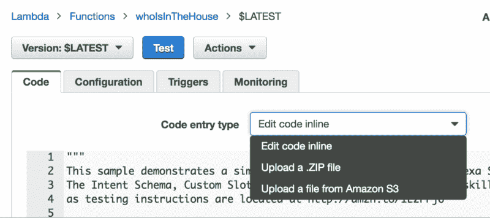
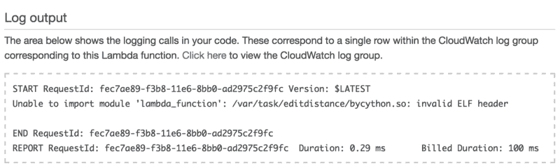

# 如何使用 Docker 的力量摆脱 AWS Lambda 函数的困境

> 原文：<https://www.freecodecamp.org/news/escaping-lambda-function-hell-using-docker-40b187ec1e48/>

作者:利兹·赖斯

# 如何使用 Docker 的力量摆脱 AWS Lambda 函数的困境


*Photo credit: [Inferno](https://flic.kr/p/76rbCN) by [Ken](https://www.flickr.com/photos/fractal_ken/)*

当你构建 Lambda 函数时，很容易陷入“无效的 ELF 头”的噩梦。问题是你的二进制文件是为错误的平台构建的。下面是正在发生的事情，以及如何使用 Docker 轻松修复它。

当大多数人开始使用 Lambda 函数时，他们会使用控制台中的在线编辑器来输入代码。这对于您的第一个或第二个示例来说很好，但是很快您就会想要做一些疯狂的事情，比如导入一个库。

在过去的几个周末，我一直在为亚马逊 Echo 开发我的第一个 Alexa 技能，我已经到了想要使用一些第三方代码来添加一些额外功能的地步。



Your options for supplying the code for your Lambda function, as seen in the AWS Console

在线编辑器只是让你编辑单个文件。如果您想要引用其他文件——包括导入的库——您可以将它们上传到一个 ZIP 文件中(Amazon 称之为[部署包](http://docs.aws.amazon.com/lambda/latest/dg/lambda-python-how-to-create-deployment-package.html))。但是，如果你在苹果电脑或 Windows 电脑上工作，就有一个问题。

当您使用 pip 在笔记本电脑上安装 Python 库时，它会给出二进制文件(所以文件)是为在你的机器上运行而构建的。但是，当 Lambda 函数在 AWS 云中运行时，它将在 Linux 上运行——而为 Mac 构建的二进制文件(这些通常被称为“达尔文”构建)或 Windows 不会在 Linux 上运行(反之亦然)。

如果你上传 Mac 版本，当你试图测试你的 Lambda 函数时，你会看到“无效的 ELF 头”日志。



Invalid ELF header indicates it’s the wrong binary format for the platform

所以你需要这些库文件的 Linux 版本。但是如果你手头没有 Linux 盒子呢？

您可以从 Amazon(或者 Digital Ocean 上的 droplet，或者您喜欢的任何 Linux VM)获得 EC2 实例，但在我看来，这是一个相当好的性能，甚至可能会花费您一点钱(特别是如果您在不需要 EC2 时忘记将其取下)。

我认为最简单的解决方法是使用 Docker。

### 码头工人方法

有了 [Docker](http://docker.com) 你可以非常容易地在你的 Mac 上本地运行一个 Linux 容器，在容器中安装 Python 库，这样它们就自动成为正确的 Linux 格式，并压缩文件准备上传到 AWS。你需要先安装 [Docker for Mac(或 Windows)](https://www.docker.com/products/docker) 。

旋转一个 Ubuntu 容器，它可以看到你想要上传的 Lambda 代码。

```
docker run -v <directory with your code>:/working -it --rm ubuntu
```

*   `-v`标志使您的代码目录在容器内一个名为“working”的目录中可用。
*   标志意味着你可以与这个容器交互。
*   `--rm`标志意味着当你完成时 Docker 将移走容器。
*   是一个官方容器图片的名字，你猜对了，是 Ubuntu。如果您的机器上还没有这个容器映像，Docker 会为您下载。

现在，您应该在容器内部出现类似如下的 shell 提示符:

```
root@c1996f32a397:/#
```

安装 pip 和 zip:

```
$ apt-get update$ apt-get install python-pip$ apt-get install zip
```

进入工作目录(你应该可以在这里看到你的 Lambda 函数代码):

```
$ cd working
```

使用 pip 获取您感兴趣的库。您可以使用-t 标志告诉 pip 将库放在当前目录中，这在以后会更方便，因为这是 AWS 部署包希望它们放在的位置:

```
$ pip install -t . <library>
```

如果你很好奇，你可以看看这个安装了什么。在我自己的例子中，我安装了`editdistance`库，它给了我以下附加的目录和文件。

```
editdistance:__init__.py __init__.pyc _editdistance.h bycython.so def.h
```

```
editdistance-0.3.1.dist-info:DESCRIPTION.rst INSTALLER METADATA RECORD WHEEL metadata.json top_level.txt
```

你能看到 bycython.so 文件吗？这是正确的 Linux 版本的二进制文件，当我点击无效的 ELF 头时，AWS 反对它(如上面的错误日志截图所示)。

用您的 Lambda 代码创建 ZIP 文件(在我的例子中，是一个名为 lambda_function.py 的文件)和库(对我来说，是两个 editdistance 目录及其内容。

```
$ zip linux-lambda.zip lambda_function.py
```

```
$ zip -r linux-lambda.zip edit*
```

zip 上的`-r`标志告诉它递归地添加目录的内容。

现在您有了一个名为 linux-lambda.zip 的归档文件，可以上传到 AWS。因为目录是从主机(您的 Mac)装载到容器中的，所以您可以简单地将文件上传到控制台。

回到终端，键入`exit`退出容器，就好像它从未存在过一样，除了 linux-lambda.zip 文件的存在，该文件在主机上仍然可用。

在控制台中上传 ZIP 文件，保存它并尝试运行测试。无效 ELF 标题错误不再出现！

如果这篇文章对你有所帮助，请点击？按钮，以便其他人更容易找到它。如果你真的喜欢它，为什么不去香蕉也分享一下呢？

我写了一些其他的帖子，讲述我在编写我的第一个 Alexa 技能时所学到的东西，就像这个帖子一样，我在我的 Lambda 函数中添加了数据库存储功能。如果你觉得它们有用，你可能会对我正在写的一本书感兴趣，这本书名叫《T2 与亚历山大的冒险》。自己挑价格！