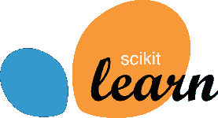
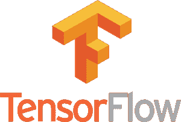
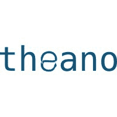
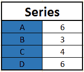
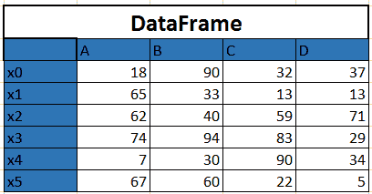
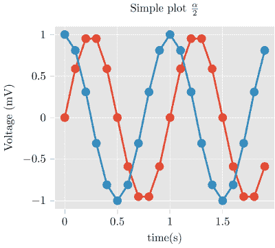
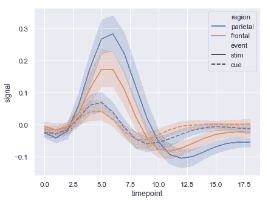

# Python 中机器学习的基本库

> 原文：<https://www.freecodecamp.org/news/essential-libraries-for-machine-learning-in-python-82a9ada57aeb/>

作者 Shubhi Asthana

Python 通常是需要在工作中应用统计技术或数据分析的开发人员的首选语言。数据科学家也使用它，他们的任务需要与 web 应用程序或生产环境集成。

Python 确实在机器学习领域大放异彩。它结合了一致的语法、较短的开发时间和灵活性，非常适合开发可以直接插入生产系统的复杂模型和预测引擎。

Python 最大的资产之一是其丰富的库。

库是用给定语言编写的一组例程和函数。一组健壮的库可以使开发人员更容易执行复杂的任务，而无需重写许多行代码。

机器学习在很大程度上基于数学。具体来说，数学优化，统计和概率。Python 库帮助不太具备开发者知识的研究人员/数学家轻松“做机器学习”。

以下是机器学习中最常用的一些库:

#### **sci kit-学习使用经典 ML 算法**

Scikit-learn 是最流行的 ML 库之一。它支持许多监督和非监督学习算法。示例包括线性和逻辑回归、决策树、聚类、k 均值等。

它建立在 Python 的两个基本库 NumPy 和 SciPy 之上。它为常见的机器学习和数据挖掘任务添加了一套算法，包括聚类、回归和分类。甚至像转换数据、特征选择和集成方法这样的任务也可以用几行代码实现。

对于 ML 新手来说，Scikit-learn 是一个绰绰有余的工具，直到您开始实现更复杂的算法。

#### **深度学习的 Tensorflow】**

如果你在机器学习领域，你可能听说过、尝试过或实现过某种形式的深度学习算法。它们有必要吗？不是所有的时间。如果做对了，它们会很酷吗？是啊！

关于 [Tensorflow](https://www.tensorflow.org/) 有趣的是，当你用 Python 写程序时，你可以在你的 CPU 或 GPU 上编译和运行。所以你不用写 C++或者 CUDA 级别的就能在 GPU 上运行。

它使用多层节点系统，允许您快速设置、训练和部署具有大型数据集的人工神经网络。这使得谷歌能够识别照片中的物体，或者在其语音识别应用程序中理解口语。

#### **Theano 也是为了深度学习**

[Theano](http://www.deeplearning.net/software/theano/) 是另一个很好的用于数值计算的 Python 库，类似于 NumPy。Theano 允许您高效地定义、优化和评估涉及多维数组的数学表达式。

让 ano 与众不同的是，它利用了计算机的 GPU。这使得它进行数据密集型计算的速度比单独在 CPU 上运行时快 100 倍。Theano 的速度使得它对于深度学习和其他计算复杂的任务尤其有价值。

Theano 库的最终版本是在去年——2017 年，1.0.0 版本，有很多新功能、界面变化和改进。

#### **数据提取和准备的熊猫**

Pandas 是一个非常受欢迎的库，它提供了简单易用且直观的高级数据结构。

它有许多用于分组、组合数据和过滤以及执行时间序列分析的内置方法。

Pandas 可以轻松地从不同的来源获取数据，如 SQL 数据库、CSV、Excel、JSON 文件，并操纵数据来执行操作。库中有两种主要结构:

*   “系列”——一维

*   “数据帧”——二维的。

关于如何使用序列和数据帧的更多细节，请查看我的另一篇[博客文章](https://medium.freecodecamp.org/series-and-dataframe-in-python-a800b098f68)。

#### **用于数据可视化的 Matplotlib】**

Image source: [https://github.com/nschloe/matplotlib2tikz](https://github.com/nschloe/matplotlib2tikz)

如果你不能和其他人交流，最好最复杂的 ML 也是没有意义的。

那么，你如何真正从你拥有的所有这些数据中获得价值呢？你如何激励你的商业分析师，并告诉他们充满“洞察力”的“故事”？

这就是 Matplotlib 的用武之地。这是一个标准的 Python 库，每个数据科学家都使用它来创建 2D 图和图形。它非常低级，这意味着它需要比一些高级库更多的命令来生成好看的图形和数字。

然而，它的另一面是灵活性。有了足够多的命令，你就可以用 Matplotlib 制作任何你想要的图形。您可以构建各种图表，从直方图和散点图到非笛卡尔坐标图。

它支持所有操作系统上的不同 GUI 后端，还可以将图形导出为常见的矢量和图形格式，如 PDF、SVG、JPG、PNG、BMP、GIF 等。

#### **Seaborn 是另一个数据可视化库**

Image source: [seaborn.pydata.org/](https://seaborn.pydata.org/)

Seaborn 是一个流行的可视化库，建立在 Matplotlib 的基础上。它是一个更高级的库，这意味着它更容易生成某些类型的图，包括热图、时间序列和小提琴图。

### 结论

这是对机器学习最重要的 Python 库的集合。如果您计划使用 Python 和数据科学，这些库值得一看，也值得熟悉。

我错过了什么重要的 Python ML 库吗？如果有，请务必在下面的评论中提及。即使我试图涵盖最有用的库，我可能仍然没有涵盖其他一些值得一看的库。

问题或反馈？我很乐意收到你的来信——请随意留下评论，或者通过 T[witter](https://twitter.com/shubhi_asthana)/[Linkedin](https://www.linkedin.com/in/shubhi-asthana/)与我联系。