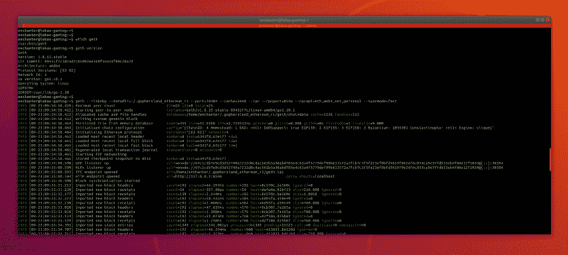
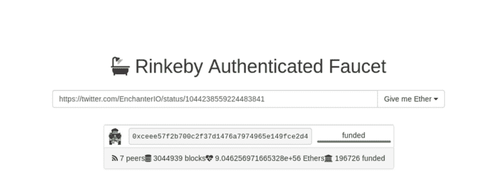
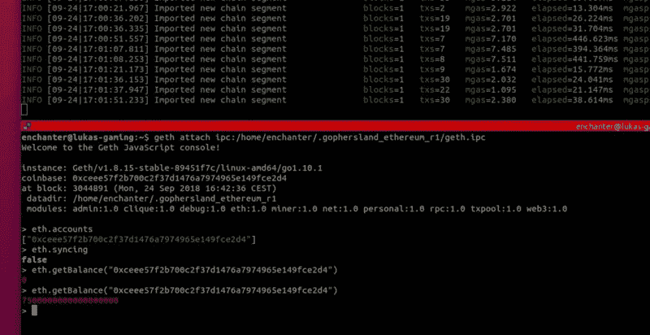

# 以太坊 69:如何在 10 分钟内设置完全同步的区块链节点

> 原文：<https://www.freecodecamp.org/news/ethereum-69-how-to-set-up-a-fully-synced-blockchain-node-in-10-mins-f6318d7aad40/>

欢迎阅读我们新围棋以太坊系列的第一篇文章！

在接下来的 10 分钟内，您将:

*   在没有任何必要的生态系统知识的情况下学习第一个区块链词汇表
*   **在** **中设置完全同步的测试节点**【客户端/服务器】**10 分钟**
*   **创建您的帐户**并从以太坊基金会免费获得一笔 8th 的交易

我们的座右铭是，先实践后理论——所以让我们直接开始安装一个连接到 Rinkeby 测试网络的完全同步以太坊测试节点吧！

### Geth

是一个命令行界面(CLI)，一个编译好的二进制文件、程序和客户端，用于运行一个在 Go 中实现的完整以太坊节点。

我们将使用 **Geth** 来:

*   运行一个完全同步的以太坊节点，连接到一个名为 Rinkeby 的测试网络
*   创建一个能够发送和接收交易的新帐户
*   用于读取 EVM 状态，例如检查任何账户的余额(想知道你的女朋友、男朋友、妻子、邻居有多少余额？甜美透明！)

### 安装 Geth

我们可以直接从存储库安装它:

**Mac**

```
brew tap ethereum/ethereumbrew install ethereum
```

**Linux**

```
sudo apt-get install software-properties-commonsudo add-apt-repository -y ppa:ethereum/ethereumsudo apt-get updatesudo apt-get install ethereum
```

**窗户**

```
Good luck :)
```

**验证安装:**

```
which geth> /usr/local/bin/geth
```

```
geth version> Geth> Version: 1.8.20-stable
```

确保您正在运行相同的版本，以便能够执行 Rinkeby 网络的完全同步，如以下步骤所述，因为 Rinkeby 操作了 Geth 1.8.20 支持的君士坦丁堡硬分叉。

### 运行区块链节点

好吧，细节决定成败…但是开始其实很简单。向以太坊开发者致敬。

让我们设置一个新的完全同步的 **Rinkeby** (使用 Clique PoA 协议的以太坊测试网络)**节点**。

Rinkeby PoA 的实现要快得多，但安全性明显较低。它更加集中于 mainnet concensus PoW，这是一个非常好的测试网络。林克比设法批准了一个每 15 秒就有一堆交易的新街区。

好，好，好...那些话实际上是什么意思？

*   **Rinkeby:** 权威证明测试网络的名称
*   **节点:**基本上是执行以太坊客户端/服务器的传统服务器
*   **consensus:**一种算法，定义如何在每个节点上的数据库中验证、附加和持久化事务
*   **Block:** 每隔 15 秒钟，在网络的所有节点之间的线路上发送一系列复杂的事务
*   **交易:**不要想银行交易。区块链事务是一个**状态变化。**将智能合同的所有者从 Alice 重命名为 Bob？把你账户的余额从第一个改为第五个？在智能合约中将变量“foo”值设置为“foo_value_123”？那是交易。

你可以在这里阅读更多关于林克比草地早熟禾的提议:[https://github.com/ethereum/EIPs/issues/225](https://github.com/ethereum/EIPs/issues/225)

```
geth --rinkeby --datadir=~/.gophersland_ethereum_r1 --port=30304 --cache=2048 --rpc --rpcport=8546 --rpcapi=eth,web3,net,personal --syncmode=fast
```

上述命令将:

*   初始化一个新目录，所有数据将存储在该目录的`~/.gophersland_ethereum_r1`中。默认目录是:`~/.ethereum`
*   开始下载以太坊历史，这是成为新的完全有效的网络同步节点所必需的
*   通信将通过端口 30304 进行
*   缓存，一种缓冲区，将被设置为 2GB，以加快同步过程
*   额外的 RPC API 将启动，这样我们就可以通过控制台，端口 8546 上的漂亮 GUI 与我们的节点进行通信



等待几个小时，直到区块链完全同步。

截至 9 月 24 日的当前块号是:3039786。在我的 AMD 锐龙 5 2600 3.4 GHz 上，同步过程花了 3 个小时。哦，是的，我有一台新的游戏电脑！

与此同时，你可以[关注 web 3，在 Twitter 上聊天](https://twitter.com/Web3Coach)或者准备晚餐，可能还有早餐，去健身房……这么说吧，区块链不是最快的数据库:)

最终打印出来的消息将是:

*   信息[]导入的新链段计数=1
*   信息[]导入的新链段计数=1
*   信息[]导入的新链段计数=1
*   信息[]导入的新链段计数=1

祝贺你，不到 10 分钟，你就成为了区块链革命的一部分！！！

### 创建您的第一个区块链账户

#### 密钥库

所有的以太坊账户及其密钥都存储在一个名为“ **keystore** 的目录中。该目录默认为空，因为我们还没有创建自己的帐户！

```
enchanter@lukas-gaming:~$ ls -la ~/.gophersland_ethereum_r1/
```

```
drwx------  4 enchanter enchanter 4096 sep 24 15:26 .drwxr-xr-x 18 enchanter enchanter 4096 sep 24 11:51 ..drwx------  4 enchanter enchanter 4096 sep 24 15:26 gethsrw-------  1 enchanter enchanter    0 sep 24 15:26 geth.ipcdrwx------  2 enchanter enchanter 4096 sep 23 09:54 keystore
```

```
enchanter@lukas-gaming:~$ ls -la ~/.gophersland_ethereum_r1/keystore/
```

```
drwx------ 2 enchanter enchanter 4096 sep 23 09:54 .drwx------ 4 enchanter enchanter 4096 sep 24 15:26 ..
```

#### 账户

要创建一个新帐户，执行下面的命令，大家已经很熟悉了， **geth** cmd。

```
geth --datadir=~/.gophersland_ethereum_r1 account new
```

系统会提示您输入密码(这是您的超级秘密密码)。这是解密与您的新以太坊地址相关的新生成的私钥所必需的，因为它允许您稍后使用它在区块链上签署交易。把它记在某个地方，因为我们以后会需要它。不过忘了也不用担心，反正这只是个测试网。

```
enchanter@lukas-gaming:~$ ls -la ~/.gophersland_ethereum_r1/keystore/
```

```
drwx------ 2 enchanter enchanter 4096 sep 23 09:54 .drwx------ 4 enchanter enchanter 4096 sep 24 15:26 ..
```

```
enchanter@lukas-gaming:~$ geth --datadir=~/.gophersland_ethereum_r1 account new
```

```
INFO [09-24|15:36:33.566] Maximum peer count                       ETH=25 LES=0 total=25
```

```
Your new account is locked with a password. Please give a password. Do not forget this password.
```

```
Passphrase: Repeat passphrase:
```

```
Address: {ceee57f2b700c2f37d1476a7974965e149fce2d4}
```

```
enchanter@lukas-gaming:~$ ls -la ~/.gophersland_ethereum_r1/keystore/
```

```
drwx------ 2 enchanter enchanter 4096 sep 24 15:36 .drwx------ 4 enchanter enchanter 4096 sep 24 15:26 ..-rw------- 1 enchanter enchanter  491 sep 24 15:36 
```

```
UTC--2018-09-24T13-36-43.069452577Z--ceee57f2b700c2f37d1476a7974965e149fce2d4
```

**Woohoo！我的新以太坊地址是活的:** `ceee57f2b700c2f37d1476a7974965e149fce2d4.`

您通常会看到这个地址以“ **0x** 为前缀，表示地址编码，**十六进制**。

密钥文件的最新格式是:`UTC--<created_at UTC ISO8601>-<your address in hex` 编码>。列出时帐户的顺序是按字典顺序排列的，但是由于 timespamp 格式的原因，它实际上是按创建顺序排列的。

如果你想知道文件里面有什么，请随意打开它！你会看到:

*   **地址:**您的新十六进制地址
*   一堆数学变量，负责以加密的形式表示你的私钥，现在不要担心这个魔法

**有趣的提示:**账户生成在离线模式下进行，不需要同步的区块链节点。好奇从技术角度看离线模式下怎么可能生成唯一地址？我们将在下一篇文章中查看**围棋以太坊**源代码本身。

**剧透:**这是因为地址是你公钥的散列，而公钥是基于你唯一的私钥。

好的，我有一个新的 shinny Ethereum 账户，我的余额是多少，我如何存放一些测试用的乙醚？

说到以太…它到底是什么？

#### 醚

以太是推动以太坊网络的加密货币。它被用作一个价值单位，并向矿工支付验证、追加和持久化事务到集合数据库的费用。但它主要是一种防止垃圾邮件的技术，因为矿工每成功开采一个区块将获得 5(自上个月以来“仅仅”3) ETH 的奖励。是的，按 9 月 24 日的现价，每 15 秒 600 美元。不错的生意。

### 如何免费接收以太坊基金会 8ETH 的交易

#### 支票账户余额

让我们首先确保我们的帐户余额为 0，除非有人出于好心已经设法发送了一些乙醚。

**Geth** 提供了一个 JavaScript 控制台，可以附加到可执行二进制文件上，方便与区块链交互。我们可以通过指定一个一旦 **Geth** 启动就暴露的套接字文件来连接它。套接字文件对于“同一台机器上的进程间通信”非常有用。

Geth 程序运行时，您可以在默认数据目录中找到该文件:

```
enchanter@lukas-gaming:~$ ls -la ~/.gophersland_ethereum_r1/
```

```
drwx------  4 enchanter enchanter 4096 Sep 24 15:44 .drwxr-xr-x 18 enchanter enchanter 4096 Sep 24 15:47 ..drwx------  4 enchanter enchanter 4096 Sep 24 15:44 gethsrw-------  1 enchanter enchanter    0 Sep 24 15:44 geth.ipcdrwx------  2 enchanter enchanter 4096 Sep 24 15:47 keystore
```

让我们在另一个终端中使用“**geth attach**”cmd 与 Rinkeby 网络进行交互，同时您的区块链节点仍在运行。确保将绝对路径传递给 IPC 文件，否则会出现错误。

```
enchanter@lukas-gaming:~$ geth attach ipc:/home/enchanter/.gophersland_ethereum_r1/geth.ipc
```

```
Welcome to the Geth JavaScript console!
```

```
instance: Geth/v1.8.15-stable-89451f7c/linux-amd64/go1.10.1coinbase: 0xceee57f2b700c2f37d1476a7974965e149fce2d4at block: 3044891 (Mon, 24 Sep 2018 16:42:36 CEST)
```

```
datadir: /home/enchanter/.gophersland_ethereum_r1modules: admin:1.0 clique:1.0 debug:1.0 eth:1.0 miner:1.0 net:1.0 personal:1.0 rpc:1.0 txpool:1.0 web3:1.0
```

```
&gt; eth.accounts["0xceee57f2b700c2f37d1476a7974965e149fce2d4"]
```

```
&gt; eth.syncingfalse
```

```
&gt; eth.getBalance("0xceee57f2b700c2f37d1476a7974965e149fce2d4")0
```

#### 查询区块链:

**eth.accounts:** 查看您当前可用的账户

**eth.syncing:** 为了确保我们的状态，数据库与网络的其余部分完全同步，以确保 getBalance 响应将基于最新状态

**eth.getBalance(" <你的地址&**gt；"):查询数据库。

#### 免费接收以太坊基金会的 8ETH 交易

以太坊基金会有一个非常简洁的程序，叫做“**水龙头**”，可以在网上实时分配以太给需要的账户。

请求乙醚:

1.  在一个公共社交网络上发布你的账户地址
2.  例如，在推文中的任何地方发布一条包含你的以太坊地址的推文，就像这条[https://twitter.com/EnchanterIO/status/1044238559224483841](https://twitter.com/EnchanterIO/status/1044238559224483841)，确保你标记了 [@Web3Coach](https://twitter.com/Web3Coach) 和 [@freeCodeCamp](https://twitter.com/freecodecamp) ，让我们知道你是否喜欢这个教程！
3.  打开[https://www.rinkeby.io/#faucet](https://www.rinkeby.io/#faucet)并粘贴推文网址
4.  点击“给我乙醚”，在 3、7.5 或 18.75 乙醚之间选择
5.  等待几秒钟
6.  再次查询您的账户余额



Rinkeby Faucet



### 给你 here you go

你很富有…在一个测试网络中。恭喜你走了这么远。

您可以通过在 Go 中从头开始构建一个来继续扩展您的区块链技能！