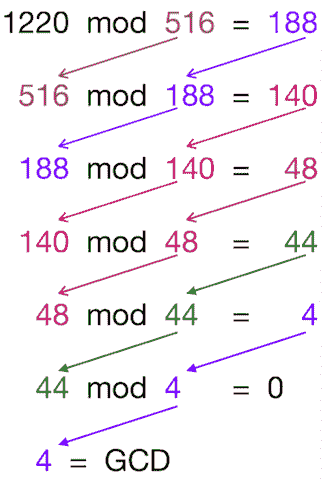

# 欧几里德算法:GCD(最大公约数)用 C++和 Java 例子解释

> 原文：<https://www.freecodecamp.org/news/euclidian-gcd-algorithm-greatest-common-divisor/>

对于这个主题，你必须先了解最大公约数(GCD)和模运算。

#### 最大公约数

两个或更多整数的 GCD 是除以每个整数使其余数为零的最大整数。

例-
20，30 的 GCD = 10*(10 是 20 和 30 除余数为 0 的最大数)*42，120，285 的 GCD = 3*(3 是 42，120 和 285 除余数为 0 的最大数)*

#### “mod”操作

mod 运算给出两个正整数相除后的余数。我们把它写成这样-
`A mod B = R`

这意味着，将 A 除以 B 得到余数 R，这不同于你的除法运算，它得到的是商。

例-
7 mod 2 = 1*(7 除以 2 得余数 1)*42 mod 7 = 0*(42 除以 7 得余数 0)*

理解了以上两个概念，你就很容易理解欧几里德算法了。

### 最大公约数的欧氏算法

欧几里得算法找到 2 个数的 GCD。

通过实际操作，你会更好地理解这个算法。假设你想计算 1220 和 516 的 GCD，让我们应用欧几里德算法

假设你想计算 1220 和 516 的 GCD，让我们应用欧几里德算法



算法的伪代码-
步骤 1: **设`a, b`为两个数**
步骤 2: **`a mod b = R`**
步骤 3: **设`a = b``b = R`**
步骤 4: **重复步骤 2 和 3，直到`a mod b`大于 0**
步骤 5: **GCD = b**
步骤 6:完成

JavaScript 代码来执行 GCD-

```
function gcd(a, b) {
  var R;
  while ((a % b) > 0)  {
    R = a % b;
    a = b;
    b = R;
  }
  return b;
} 
```

使用递归执行 GCD 的 JavaScript 代码

```
function gcd(a, b) {
  if (b == 0)
    return a;
  else
    return gcd(b, (a % b));
} 
```

使用递归执行 GCD 的 c 代码

```
int gcd(int a, int b) 
{ 
    // Everything divides 0  
    if (a == 0) 
       return b; 
    if (b == 0) 
       return a; 

    // base case 
    if (a == b) 
        return a; 

    // a is greater 
    if (a > b) 
        return gcd(a-b, b); 
    return gcd(a, b-a); 
} 
```

执行 GCD 的 C++代码-

```
int gcd(int a,int b) {
  int R;
  while ((a % b) > 0)  {
    R = a % b;
    a = b;
    b = R;
  }
  return b;
} 
```

使用递归执行 GCD 的 Python 代码

```
def gcd(a, b):
  if b == 0:
    return a:
  else:
    return gcd(b, (a % b)) 
```

使用递归执行 GCD 的 Java 代码

```
static int gcd(int a, int b)
{
  if(b == 0)
  {
    return a;
  }
  return gcd(b, a % b);
} 
```

您也可以使用欧几里得算法来寻找两个以上数字的 GCD。因为 GCD 是关联的，所以下面的操作是有效的- `GCD(a,b,c) == GCD(GCD(a,b), c)`

计算前两个数的 GCD，然后求结果和下一个数的 GCD。例- `GCD(203,91,77) == GCD(GCD(203,91),77) == GCD(7, 77) == 7`

用同样的方法可以求出`n`数的 GCD。

## 什么是扩展欧几里德算法？

这是欧几里德算法的扩展。它还计算系数 x，y，使得

ax+by = gcd(a，b)

x 和 y 也称为贝佐特恒等式的系数。

扩展欧几里德算法的 c 代码

```
struct Triplet{
	int gcd;
	int x;
	int y;
};
Triplet gcdExtendedEuclid(int a,int b){
	//Base Case
	if(b==0){
		Triplet myAns;
		myAns.gcd = a;
		myAns.x = 1;
		myAns.y = 0;
		return myAns;

	}
	Triplet smallAns = gcdExtendedEuclid(b,a%b);
	//Extended euclid says

	Triplet myAns;
	myAns.gcd = smallAns.gcd;
	myAns.x  = smallAns.y;
	myAns.y = (smallAns.x - ((a/b)*(smallAns.y)));
	return myAns;	
} 
```