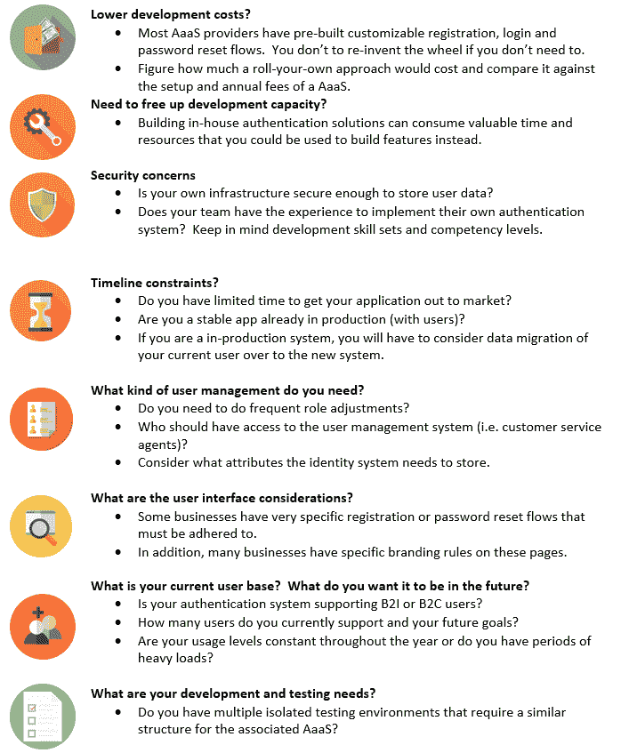
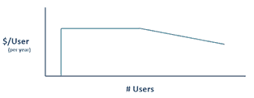

# 如何为您的公司选择最佳的身份认证服务提供商

> 原文：<https://www.freecodecamp.org/news/evaluating-authentication-as-a-service-providers-6903895a8450/>

杰夫·大川

# 如何为您的公司选择最佳的身份认证服务提供商

你有没有想过如何选择认证服务商？

我们正处于使用联合标识符为我们日常使用的网站提供认证的增长趋势中。

我们可以使用我们的社交媒体帐户登录无数的应用程序，我们的工作帐户都具有 SSO 功能，我们甚至可以使用我们的在线银行凭据登录政府网站。

从概念上讲，身份验证(和 SSO)很简单，但是要正确实现却很难，而且成本很高。尽管企业传统上关注于构建功能，但现在实际上他们也必须关注于降低用户注册争用，而不暴露应用程序的漏洞。就像云基础设施平台(如 AWS)现在允许企业专注于构建应用程序一样，我们看到认证也发生了同样的事情。

身份验证即服务(或身份验证服务提供商)为应用程序提供身份验证和用户管理服务。

它们不仅仅是身份提供者，还提供可配置的用户登录页面(或小部件)、注销功能、与社交媒体帐户的联合身份、用户数据库和某种程度的用户管理。它们有现成的功能来支持常见的身份验证协议，如 SAML 和 OpenID Connect。

希望进行单点登录的企业客户通常可以通过使用 SAML2，利用第三方应用程序(如 JIRA、Office 365 和 Salesforce)的简单一键式设置。

#### 你的目标是什么？

有时，为应用程序实现身份验证系统就像是重新发明轮子。身份验证即服务(AaaS)的概念试图解决这个问题，但在选择提供商(或决定推出定制解决方案)之前，需要考虑一些事情。

### 标准

一旦您为您的组织列出了一系列重要考虑事项，就应该开始评估市场上的身份认证即服务提供商(AaaSp)了。在过去的几年里，我们已经看到了一些 AssSp 的进入和消失。这使得选择正确的 AaaSp 变得更加重要。他们有各种各样的形式和规模——从拥有小客户的小公司到大型成熟企业供应商。

### 信任和声誉

委托像认证这样重要的事情需要相当大的信心，所以重要的是选择的卖主应该是**有信誉的**和**信任的** **认证权威**。考虑他们的架构是否已经过其他安全专家的审查，并审查关于该提供商的任何在线评论。

正如我们在 storm path(2017 年被 Okta 收购，然后放弃了 Stormpath API)中看到的那样，依赖第三方供应商会带来*供应商*放弃的风险。在最坏的情况下，正如上面提到的收购，许多人没有从 Strompath 到 Okta 的迁移路径，需要部署他们自己的身份验证系统。

供应商规模、客户名单和公司简介是可以考虑的一般准则，但你仍然在冒险。规模较小的初创供应商可以提供重大激励，但它们在没有适当通知的情况下迅速消失的能力，可能使它们成为一个风险很大的选择。另一方面，如果该业务变得不再有利可图，较大的提供商仍然可以关闭他们的服务。

### 目标用户

一些 AaaS 提供商，如 One Login，专门专注于 B2E——通过基于 web 的服务为公司内部员工提供单点登录体验。想象一下公司门户页面，这些页面链接到人力资源、公司 Wiki、Sharepoint 和 Salesforce。Auth0 和 AWS Cognito 是服务于 B2E 和 B2C 的提供商，明确支持拥有数十万客户的客户。

### Vender Lock

与 AaaSp 集成带来了比仅仅将应用程序堆栈集成到基于云的解决方案上更重要的相互依赖性，因为必须编写特定于提供商的代码**来完成集成。**

这不仅需要撤销，还需要为新的提供者编写更多的集成代码。从 AaaS 迁移到推出定制解决方案的成本甚至更高，因为一切都需要从头开始编写。

不同于基础设施的改变，缓解星门的存在是为了减少用户的干扰，交换 AAA 提供商几乎总是会影响用户。请记住，我们正在改变与最终用户直接交互的组件。

**数据导入**
大多数 AaaS 提供商定义了一种通过批量导入(用户必须通过密码重置流程)或逐步迁移流程将用户导入其系统的机制。随着逐步迁移，用户凭证首先根据旧数据库进行验证，然后加密并存储在新数据库中。在此使用案例中，用户不会受到迁移的影响。

**数据导出**
在应用程序使用 AaaS 的数据存储库的情况下，该功能尤为重要。出于安全原因，AaaS 提供商不公布他们的密码哈希算法。因此，当需要导出时，所有用户都必须启动密码重置流程。

如果这听起来还不够糟糕的话，许多 AaaS 提供商**不**提供批量数据导出功能，从而增加了从 AaaS 中迁移用户数据的额外复杂性和手动步骤。

AAA 供应商提供的一些服务由另一个第三方服务来完成。2fa/mfa 和电子邮件有时是需要向第三方单独注册(和额外付费)的功能。

以 2FA 为例，一些 AaaS 服务不允许您选择底层 2FA 提供商，并强制您使用他们的首选供应商。你不仅被迫与该供应商合作，还被迫支付他们的费用(有时有更便宜的选择)。

### 技术支持

**协议**
大多数 AaaS 提供商支持主要的联邦协议(OpenID Connect 和 SAML)。其他人有额外的连接器，允许定制的数据源(微软 AD 或 LDAP)和第三方应用程序的简单设置，如 JIRA，Office 365 和 Salesforce，通过使用 SMAL。

**集成**
将 AaaS 的服务集成到您的应用程序中仍然是一项重要的任务(尤其是如果您正在运行一个遗留应用程序)。因此，需要考虑的一点是，AaaS 是否为您的技术堆栈提供了库。

例如:大多数主要的 AaaS 提供商和社交媒体网站都提供客户端库来请求、使用和验证各种认证令牌和文档。如果您运行的是 Java 栈，许多服务都提供 Java 库来包含在您的项目中，用于任何后端处理。如果您的栈受支持，集成过程可以简单到放入一个 JS 文件，包括一个 JAR，并在一个属性值中填入一些值。

充足的、编写良好的文档和社区支持将大大有助于集成变得更加容易。一些提供商提供种子和示例项目来帮助您开始。

**其他功能**
许多服务提供附加功能，如用户档案、电子邮件和 2fa/mfa。

### 可定制的用户界面和流程

AaaS 提供者允许对 UI 页面、小部件和用户属性进行不同级别的定制。此外，一些系统有可以定制流程的“钩子”(更多细节请查看 Auth0 和 AWS Cognito)。

根据您的具体组织，很难在满足 UX 的需求和提供商可定制的内容(在合理范围内)之间取得平衡。在某些情况下，您选择的 AAA 可能不支持业务请求流。

#### 关于定制的说明:

现成的身份验证功能是使用 AaaSp 的最大好处之一。当使用预构建的组件时，集成非常简单。

另一方面，UI 和流的大量定制增加了时间和复杂性。你可能会发现自己对用户界面和认证流程进行了大量定制，以至于**必须**质疑推出定制的内部解决方案*是否会更便宜*(还要考虑每年的成本)。答案可能是**是的**。

我的建议是在 AaaS 框架内保留尽可能多的定制。当涉及到身份验证和密码重置流程时尤其如此，因为向这些组件添加定制往往会增加集成的复杂性，并产生供应商锁定。

### 开发和测试支持

#### 开发、质量保证和生产环境

一些公司有隔离的开发和 QA 环境。为了支持这些要求，*一些* AaaS 提供商允许一个帐户拥有多个身份数据库。不幸的是，这不是一个通用的功能，可能需要多个 AAA 帐户来支持每个测试环境。

#### 负载测试

所有 AaaS 系统都禁止未经授权的负载测试。如果您的应用程序需要端到端负载测试才能被批准用于生产，这可能会是一个问题。在这种情况下，一些 AaaS 提供商确实允许负载测试，如果它在测试发生之前被预先授权的话。测试必须在严格的约束和时间框架下进行。

更实际的情况是，您可能需要为应用程序实现一个登录旁路机制来支持负载测试。

### 定价

AAA 供应商之间的定价模式差异很大。一些提供商为小型初创组织提供奖励，并提供免费或非常实惠的最低级别。一般来说，预计会看到如下价格/用户图:

每个用户的价格最初非常低(或 0 美元)，这对于小组织或小批量的初创企业来说非常好。然而，随着用户群的增长，价格/用户保持不变。最终，在某个点之后，它将开始减少，因为你要么已经达到了最高的使用级别，要么处于谈判价格的位置。

刚开始时，成本似乎还算合理，但是一旦你被锁定，一个月内有 100，000 个活跃用户的应用程序可能会看到每年 15 万到 20 万的账单！

如果您的应用程序已经有几十万用户，推出您自己的解决方案可能会更便宜！除了按用户付费之外，通常还会产生额外的服务费(同样，2fa 和电子邮件)。

如果你的应用有大量的使用周期，B2C
协商价格。一些服务根据实际活跃用户的数量每月定价可变，而另一些服务根据全年最繁忙月份的估计值每月定价固定(不管实际有多少用户使用系统)。这些价格计划之间的差异可能很大。

**B2E**
价格总是按照每个员工账户的金额来设定。当心细则中的最低费用！

#### 用户管理和仪表板

大多数 AAA 在其管理仪表板中内置了某种形式的基本用户管理。在某些情况下，您可以为客户服务代表或其他同事创建非管理员帐户，以更改用户身份。

应该**避免仅仅为了让员工能够访问用户管理仪表板而向他们发放完全管理帐户**。管理员帐户只能由经过适当培训的员工使用，否则您将面临有人意外删除您的整个用户数据库或暴露用户身份的风险。

内置的 AaaS 控制面板是否支持您的需求取决于您的组织需要进行的日常用户属性更改。确保 AaaS 根据您组织的政策提供适当的审计跟踪/日志记录跟踪。

### SLA 和客户服务

并非所有的 AAA 提供商都提供与提供商客户经理的直接联系。免费或低使用率层通常只能访问社区论坛。一些提供商提供付费支持、专用服务器、日志访问和 HIPAA/PCI 合规性，但需要额外付费。

大多数 AaaSp 提供标准的 99.9%到 99.995%的 SLA 正常运行时间，但这仍然考虑到全年的停机时间。如果您的应用程序**在关键时期必须**运行，这可能很重要。一些 AaaSp 提供企业解决方案(定制部署),以确保在系统出现故障时有某种形式的冗余。

### 结论

对于初创企业，AaaSp 提供了一个经济实惠的身份认证解决方案，因此您可以专注于您的产品。对于拥有传统应用程序和既定用户群的大型组织，您必须考虑更广泛的标准，以确保您选择的 AAA 能够满足您的迁移、审计/日志记录和预算需求。

作为后续，我已经[写了一篇关于联合身份和认证的介绍](https://medium.com/@dev78digital/655a160d66cb)。