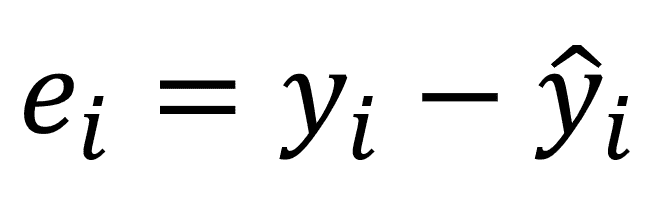
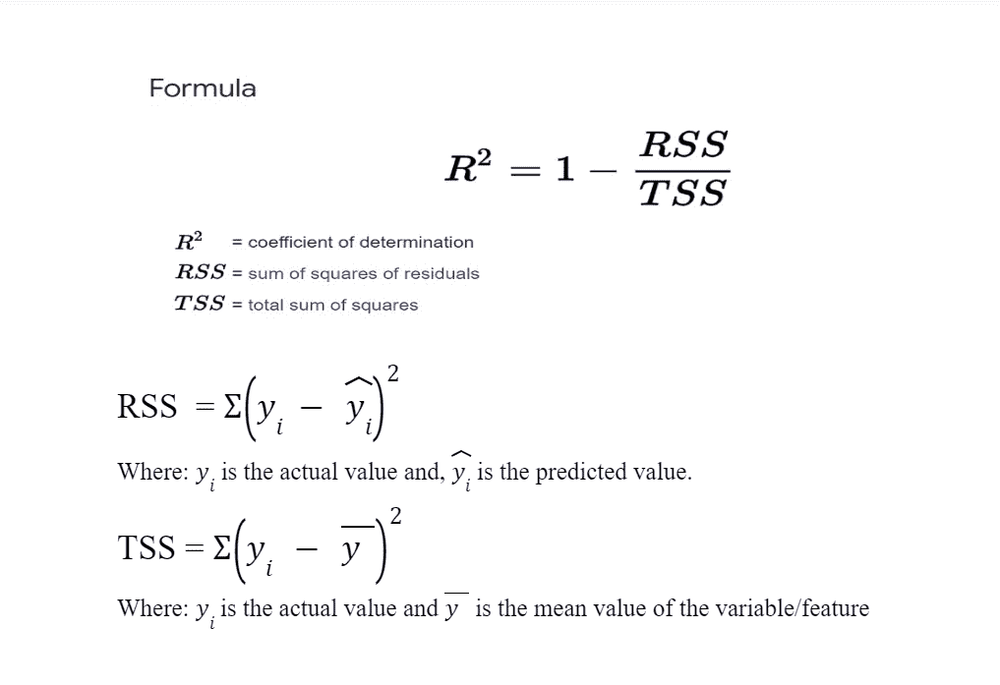
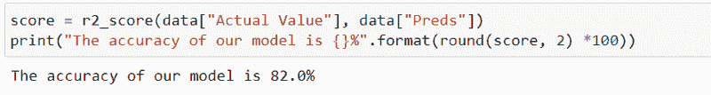
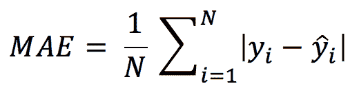
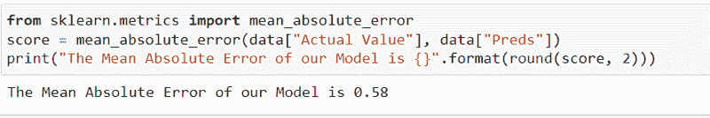
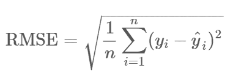
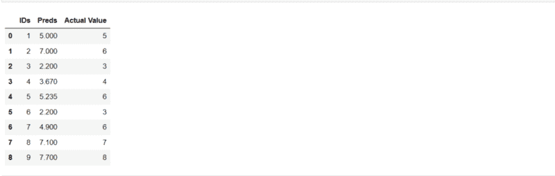
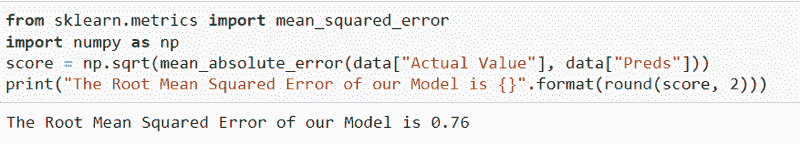

# 机器学习中回归问题的顶级评价指标

> 原文：<https://www.freecodecamp.org/news/evaluation-metrics-for-regression-problems-machine-learning/>

回归问题是机器学习中一种常见的监督学习问题。最终目标是预测量化值——例如，汽车价格、狗的体重等连续值。

但是为了确保您的模型在预测中表现良好，您需要对模型进行评估。

有一些评估指标可以帮助您确定模型的预测是否准确到一定的性能水平。

在本教程中，您将学习回归问题的顶级评估指标，以及何时使用它们。事不宜迟，让我们开始吧。

## 什么是残差？

在我们进入顶级评估指标之前，您需要理解当您评估一个回归模型时“残差”是什么意思。

在回归问题中，模型准确预测连续变量的值是不理想的，也是不可能的。回归模型只能预测低于或高于实际值的值。因此，确定模型准确性的唯一方法是通过残差。

残差是实际值和预测值之间的差值。你可以把残差想象成一个距离。因此，残差越接近零，我们的模型在进行预测时表现越好。

以下是计算残差的公式:



```
In the above formula:

ei -- stands for the residual value.
yi -- stands for the actual value.
y^i -- stands for the predicted value.

So say, for instance, that the actual value in the dataset is 5 and the predicted value is 8\. The residual value will be -3.
```

## 回归问题的顶级评估指标

对于回归问题，您需要了解的主要评估指标包括:

### R2 分数

R2 分数(发音为 R 平方分数)是一种统计度量，它告诉我们我们的模型在 0 到 1 的范围内做出所有预测的程度。

如上所述，对于模型来说，预测回归问题中的实际值并不理想(与具有离散值级别的分类问题相反)。

但是，我们可以使用 R2 分数来确定我们的模型在距离或残差方面的准确性。您可以使用以下公式计算 R2 分数:



#### 何时使用 R2 评分

您可以使用 R2 分数在百分比范围内获得模型的准确性，即 0-100，就像在分类模型中一样。

让我们来看看如何用 Python 实现 R2 乐谱。所以我们有一个包含实际值和预测值的小数据集。


为了在 Python 中实现 R2 评分，我们将利用 Scikit-Learn 评估指标库。

```
from sklearn.metrics import r2_score
score = r2_score(data["Actual Value"], data["Preds"])
print("The accuracy of our model is {}%".format(round(score, 2) *100))
```

`r2_score`需要两个参数——实际值和我们上面传递给它的预测值。度量的结果是这样的:



因此，我们可以说，我们的模型以 82%的准确率预测了这些值。

### 平均绝对误差

MAE 简单地定义为所有距离/残差的总和(实际值和预测值之间的差值)除以数据集中的总点数。

它是我们模型预测的绝对平均距离。

您可以使用以下公式计算 MAE:



我们可以看到，上面的公式有两条管道，用绝对符号表示。绝对符号确保负残差(可能是预测值大于实际值的结果)被转换为正残差，从而不会抵消其他正残差。

#### 何时使用 MAE

如果在进行预测时想知道模型的平均绝对距离，可以使用 MAE。换句话说，您想知道预测与实际模型的平均接近程度。

请记住，较低的 MAE 值表示模型预测正确。较大的 MAE 值表明模型的预测能力较差。

现在让我们看看如何用 Python 实现 MAE。我们将使用之前用于查找 r2_score 的数据集。


为了在 Python 中实现 MAE，我们将利用 Scikit-Learn 评估度量库。

```
from sklearn.metrics import mean_absolute_error
score = mean_absolute_error(data["Actual Value"], data["Preds"])
print("The Mean Absolute Error of our Model is {}".format(round(score, 2)))
```

MAE 还需要两个参数，实际值和预测值。



### 均方根误差(RMSE)

另一个常用的度量是均方根误差，它是平均平方距离(实际值和预测值之间的差异)的平方根。

RMSE 被定义为距离的所有平方除以总点数的平方根。



RMSE 的功能与 MAE 类似(即，您使用它来确定预测值与实际值的平均接近程度)，但有一点点不同。

如果模型高估了预测值(即模型预测值明显高于实际值)或低估了预测值(即预测值低于实际值)，您可以使用 RMSE 来确定是否存在任何可能导致的较大误差或距离。

#### 何时使用 RMSE

如果你担心大的误差，RMSE 是一个很好的度量标准。如果模型高估或低估了预测中的某些点(因为残差会是平方的，导致误差较大)，就应该使用 RMSE。

RMSE 是回归问题的一个流行评估指标，因为它不仅计算预测值与实际值的平均接近程度，而且还指示大误差的影响。较大的误差会对 RMSE 结果产生影响。

让我们看看如何用 Python 实现 RMSE。



Scikit-learn 评估度量库没有 RMSE 度量，但它包含均方误差方法。均方误差的平方根被称为 RMSE。

要得到 RMSE，我们可以用 Numpy 平方根法求均方误差的平方根，得到的结果就是我们的 RMSE。

```
from sklearn.metrics import mean_squared_error
import numpy as np
score = np.sqrt(mean_absolute_error(data["Actual Value"], data["Preds"]))
print("The Mean Absolute Error of our Model is {}".format(round(score, 2)))
```



我们可以看到，RMSE 值大于平均相对误差。这是数据集中一些大错误的结果。

## 结论和了解更多信息

在本教程中，您已经学习了一些日常使用的回归问题的顶级评估指标。

感谢您的阅读。这里有一些有用的资源，我也包括在下面。

[3.3\. Metrics and scoring: quantifying the quality of predictionsThere are 3 different APIs for evaluating the quality of a model’s predictions: Estimator score method: Estimators have a score method providing a default evaluation criterion for the problem they ...scikit-learn](https://scikit-learn.org/stable/modules/model_evaluation.html)

梅和 RMSE——哪个指标更好？|作者 JJ |机器世界中的人类| Medium