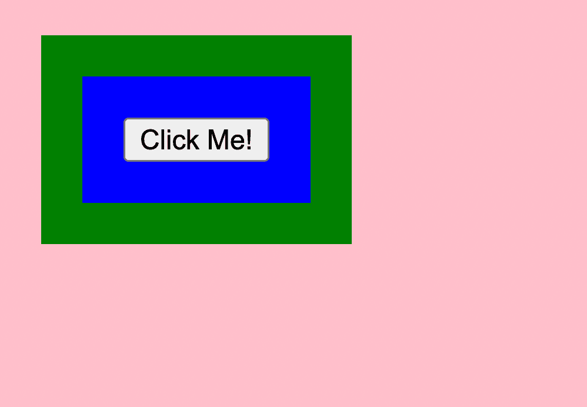
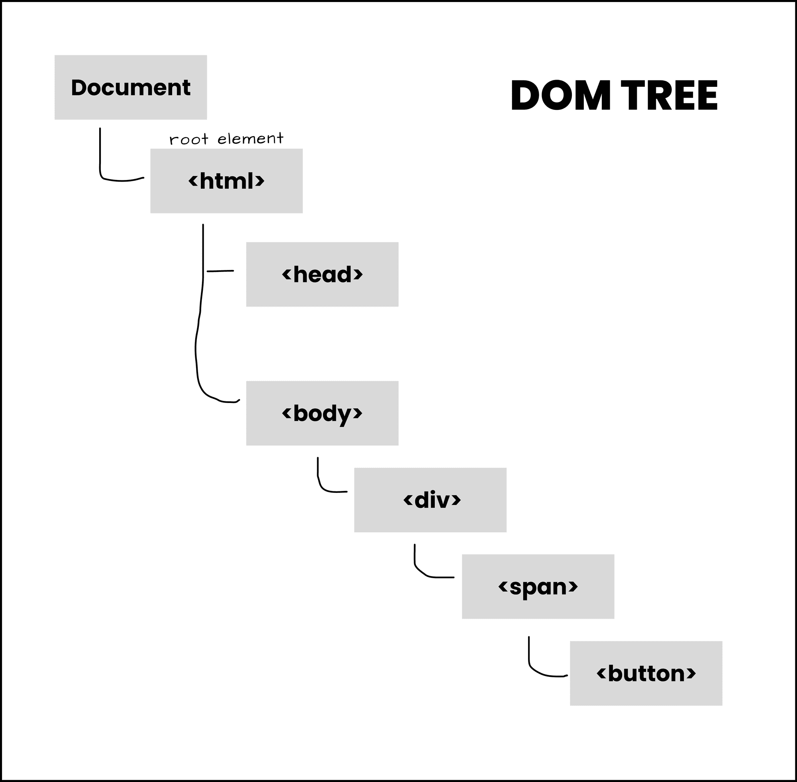
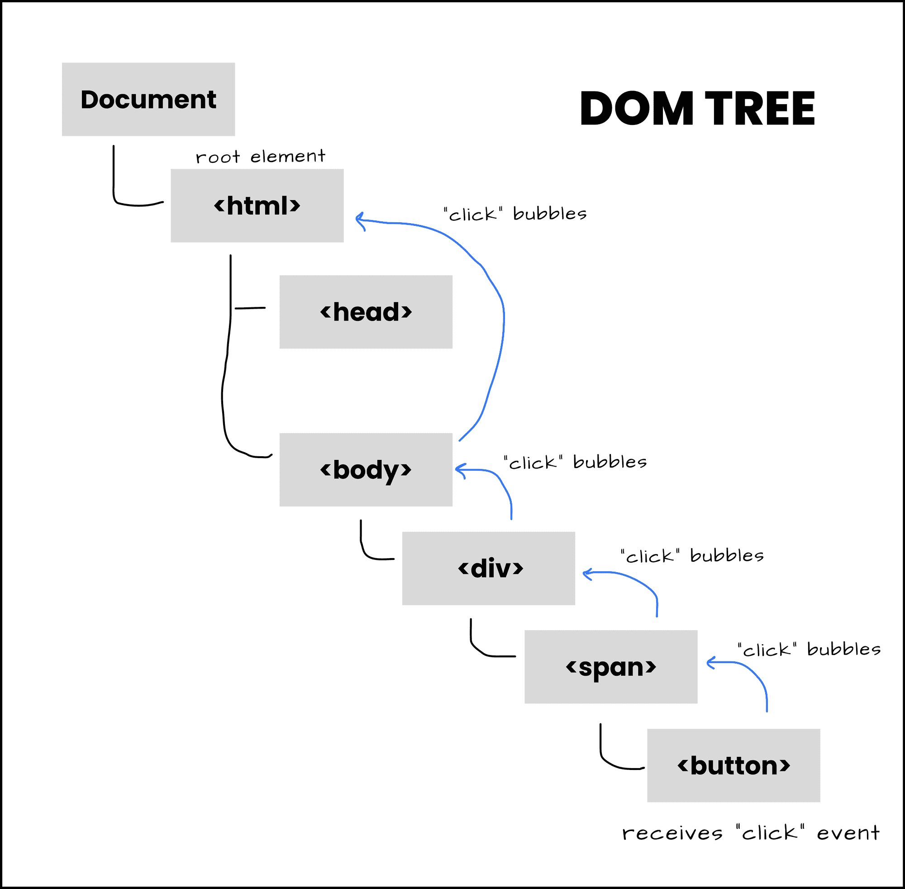

# JavaScript 中的事件冒泡——事件传播如何工作示例

> 原文：<https://www.freecodecamp.org/news/event-bubbling-in-javascript/>

HTML 元素接收不同类型的事件，从点击、模糊、滚动等等。

这些事件的一个共同点是事件冒泡。我将在本文中解释这种行为的含义。

我还制作了这篇文章的视频版本，你可以在这里观看。

## 什么是事件冒泡？

事件冒泡是 DOM(文档对象模型)中的一个概念。当一个元素接收到一个事件时就会发生这种情况，该事件会冒泡(或者可以说是被传输或传播)到 DOM 树中的父元素和祖先元素，直到到达根元素。

这是元素上事件的默认行为，除非您停止传播[，我将在本文的最后解释](#how-to-stop-event-bubbling)

让我们看一个例子，这样我可以更好地解释事件冒泡是如何工作的。

HTML:

```
<body>
  <div>
    <span>
      <button>Click Me!</button>
    </span>
  </div>
</body> 
```

CSS:

```
body {
  padding: 20px;
  background-color: pink;
}

div {
  padding: 20px;
  background-color: green;
  width: max-content;
}

span {
  display: block;
  padding: 20px;
  background-color: blue;
} 
```

结果是:



**按钮**是**跨度**的子节点，跨度又是 **div** 的子节点，div 是**主体**的子节点。DOM 树应该是这样的:



DOM tree for this interaction

当你点击**按钮**时，你可以认为你也在点击**跨度**(蓝色背景)。这是因为按钮是 span 的子节点。

与 **div** 和 **body** 也是同样的事情。当您单击按钮时，就好像您也单击了 span、div 和 body，因为它们是按钮的祖先。这就是事件冒泡的思想。

事件不会在接收它的直接元素处停止。事件向上冒泡到它的祖先，直到它到达根元素。

所以如果按钮接收到一个**点击**事件，例如`span`、`div`和`body`(直到 **html** ，根元素)分别接收到那个事件:



Illustration showing how event bubbling works

此外，如果您单击蓝框(span ),按钮不会收到 click 事件，因为它不是父项或祖先或 span。但是，div、body 和 HTML 将接收事件。

如果单击 div，也会发生同样的事情——事件会传播到 body 和 html 元素。

## 如何处理冒泡事件

“事件冒泡”行为使您可以处理父元素中的事件，而不是接收事件的实际元素。

在祖先元素上处理事件的模式称为事件委托。你可以[在这里](https://www.freecodecamp.org/news/event-delegation-javascript/)了解更多信息。

让我们创建一些事件监听器和处理程序:

```
const body = document.getElementsByTagName("body")[0]
const div = document.getElementsByTagName("div")[0]
const span = document.getElementsByTagName("span")[0]
const button = document.getElementsByTagName("button")[0]

body.addEventListener('click', () => {
  console.log("body was clicked")
})

div.addEventListener('click', () => {
  console.log("div was clicked")
})

span.addEventListener('click', () => {
  console.log("span was clicked")
})

button.addEventListener('click', () => {
  console.log("button was clicked")
}) 
```

这里，我们从 DOM 中选择了`body`、`div`、`span`和`button`元素。然后我们给它们分别添加了`click`事件监听器和一个记录“body 被点击”、“div 被点击”、“span 被点击”和“button 被点击”的处理函数。

当您点击粉色背景(即主体)时，控制台上会发生以下情况:

```
body was clicked 
```

当您单击绿色背景(即 div)时，控制台会显示:

```
div was clicked
body was clicked 
```

body 元素上的“click”事件被触发，即使 div 元素是被单击的目标元素，因为“click”事件从 div 冒泡到 body。

当您单击蓝色背景(即跨度)时，控制台显示:

```
span was clicked
div was clicked
body was clicked 
```

最后，当您单击按钮时，控制台会显示:

```
button was clicked
span was clicked
div was clicked
body was clicked 
```

## 如何停止事件冒泡

事件冒泡是事件的默认行为。但在某些情况下，您可能希望防止这种情况。

例如，从我们的 HTML 代码来看，您希望 div 在被单击时打开一个模态。另一方面，对于按钮，您希望它在被单击时发出 API 请求。

在这种情况下，您可能不想在单击按钮时打开模式。您可能希望只有当您实际单击模态时才打开它(而不是当您单击它的任何子对象时)。这就是阻止事件传播的切入点。

为了防止事件冒泡，可以使用事件对象的`stopPropagation`方法。

当处理事件时，一个`event`对象被传递给处理函数:

```
button.addEventListener("click", (event) => {
  // do anything with the event object
} 
```

`event`对象包含属性，这些属性包含关于被触发的事件及其被触发的元素的信息。这个对象还包含方法——其中之一是`stopPropagation()`。

事件的`stopPropagation`方法防止事件传播到触发事件的元素的父元素和祖先元素。

我们可以在上面的 JavaScript 代码中使用它:

```
body.addEventListener('click', () => {
  console.log("body was clicked")
})

div.addEventListener('click', () => {
  console.log("div was clicked")
})

span.addEventListener('click', () => {
  console.log("span was clicked")
})

button.addEventListener('click', (event) => {
  event.stopPropagation()
  console.log("button was clicked")
}) 
```

这样，当你点击按钮时，你在控制台中得到的是:

```
button was clicked 
```

按钮的父级和上级不会收到 click 事件，因为它不会从按钮中冒泡出来。

您也可以从不同的元素停止冒泡，如下所示:

```
body.addEventListener('click', () => {
  console.log("body was clicked")
})

div.addEventListener('click', () => {
  console.log("div was clicked")
})

span.addEventListener('click', (event) => {
  event.stopPropagation()
  console.log("span was clicked")
})

button.addEventListener('click', () => {
  console.log("button was clicked")
}) 
```

在 span 的事件监听器上调用了`stopPropagation()`，并且单击了按钮，在控制台上您会看到:

```
button was clicked
span was clicked 
```

事件从按钮冒泡到 span，但在那里停止，因为传播在这一点上停止。

## 包扎

当元素接收到事件时，这样的事件会向上传播到它们在 DOM 树中的父级和祖先。这就是**事件冒泡**的概念，它允许父元素处理发生在其子元素上的事件。

事件对象也有`stopPropagation`方法，可以用来停止事件的冒泡。如果您希望某个元素仅在被单击时接收 click 事件，而不是在其任何子元素被单击时接收 click 事件，这将非常有用。

`stopPropagation`和`preventDefault`是事件对象停止默认行为的方法。这里有一篇关于[这些方法的区别](https://www.freecodecamp.org/news/manage-default-behavior-in-browser/)的文章。