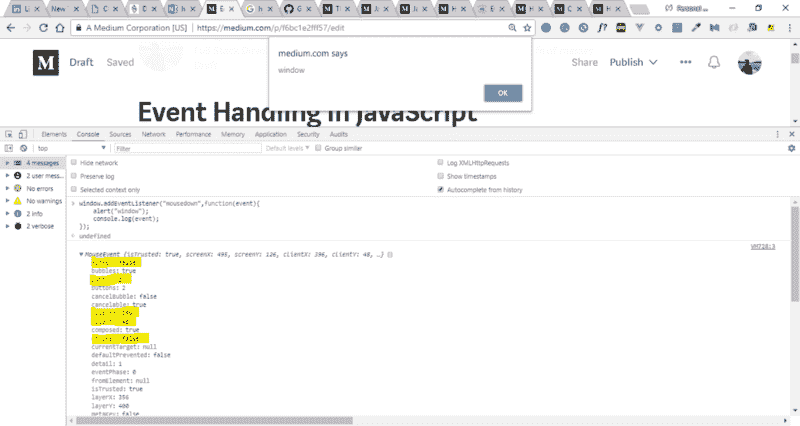

# 如何在 JavaScript 中处理事件(例子和全部)

> 原文：<https://www.freecodecamp.org/news/event-handling-in-javascript-with-examples-f6bc1e2fff57/>

在这篇博客中，我将尝试在不借助任何外部库(如 Jquery/React/Vue)的情况下，阐明 JavaScript 中事件处理机制的基本原理。

我将在本文中解释以下主题:

1.  **文档**和**窗口**对象，并给它们添加了**事件监听器**。
2.  **Event.preventDefault()** 方法及其用法。
3.  带有示例的 **Event.stopPropagation()** 方法。
4.  **如何从元素中移除**事件**监听器**。

### **用**事件监听器**记录**和**窗口**对象

窗口对象代表选项卡。如果你正在相应的浏览器上阅读这篇博客，那么你当前的标签就代表了窗口对象。

窗口对象可以访问工具栏、窗口高度和宽度、提示和警告等信息。让我们看看如何向窗口对象添加一个事件监听器(mousedown)并分析它的一些属性。

#### **如何在窗口对象上添加监听器**

**addEventListener** 方法是将事件监听器添加到**窗口**、**文档**或 DOM 中任何其他**元素**的最佳方式。

还有一种方法叫做“on”属性 onclick、onmouseover 等等。但是没有那么有用，因为它不允许我们在同一个元素上添加多个事件侦听器。其他方法允许这样做。

一个**事件**对象作为一个参数(可选)传递给处理程序，该处理程序包含与窗口上的事件(在我们的例子中是 mousedown)相关的所有信息。

打开此页面上的开发人员工具(Inspect 元素),将以下代码复制粘贴到控制台面板中，然后按 enter 键。

```
window.addEventListener("mousedown",function(event){
 alert("window");
 console.log(event);
});
```

之后，您可以转到当前选项卡的任何部分，右键单击**以查看控制台和与该事件相关的信息，如下面的快照所示。**

**注意**:如果你转到任何其他选项卡并右击，那么这个事件将不会被触发，因为它只属于这个选项卡(窗口对象)。



#### mousedown 事件的详细信息

在接下来的几行中，我将解释与我们刚刚执行的 **mousedown** 事件相对应的一些重要的捕获属性。

**按钮**:因为这是 mousedown 事件，它会告诉你你点击了哪个按钮。对于鼠标，左、中、右分别对应 0、1、2。如果你点击右边的按钮，你可以看到数值 2。

**clientX** 和 **clientY** :相对于内容区(Viewport)左上角的位置。只要用您单击的位置分析这些属性的值，您就可以看到它们是如何关联的。即使您向下滚动页面，这些属性也保持不变。屏幕左上角的 ScreenX 和 ScreenY 参考(监视器)。

**altkey / ctrlkey** :如果您在执行右键操作时按住这些键中的任何一个，那么您可以看到这些值为真。否则，它们就是假的，就像我们的例子一样。

**目标:**它对应于您对其执行操作的元素。无论您单击了什么元素，都可以在控制台中看到与该属性对应的信息

#### **什么是文档对象**？

文档由内部窗口中的内容组成。**文档** **对象**是 DOM 中每个节点的根。如果你在浏览器中加载一个 HTML 页面，那么这个文档就代表了整个页面。

### **event . prevent default()**方法及其用法

有时我们不希望 HTML 元素以默认的方式运行。在这种情况下，我们可以使用这种方法。

**例**:点击锚元素，默认会让浏览器重定向到那个页面。让我们设法避免那件事。

```
<html>

<body>

  <a href="https://google.com/">Google</a>

  <script>
    let link = document.querySelector("a"); // It is the method to access the first matched element
    link.addEventListener("click", function(event) {
      console.log("Redirecting Stopped");
      event.preventDefault();
    });
  </script>
</body>

</html>
```

您可以创建一个 HTML 文件并检查该代码。

### **event . stop propagation()**方法

**事件向外流动。**有一些特定的情况，比如当你有嵌套的元素，你对一个子元素执行了一些事件，结果它也对父元素执行了一些动作，这是你想要避免的。在这种情况下，这种方法很有用。

这听起来有点令人困惑，但我希望下面的例子能让你明白。

假设您在一个段落中有一个按钮，并且您已经将一个 mousedown 事件附加到这两个按钮上。您希望实现以下用例:

1.  如果您右键单击该按钮，那么它应该显示它已经被单击，并且不会传播到父元素(即段落)。
2.  如果您左击按钮，那么它应该正常地向外传播，并触发段落事件监听器。

解决方案:

```
<html>

<body>
  <p id="demo"> Hello Ho<button id="button12"> Button2 </button> </p>
  <script>
    // Event Listener on the Button and it's logic
    document.getElementById("button12").addEventListener("mousedown", function(event) {
      alert("button clicked");
      if (event.button == 2) // Right Click
        event.stopPropagation();
    });
    // Event Listener on the paragraph element with it's logic:
    document.getElementById("demo").addEventListener("mousedown", function(event) {
      alert("Paragraph clicked");
    });
  </script>
</body>

</html>
```

### **从元素中移除**一个**事件监听器**

为了从元素中移除事件监听器，我们需要使用事件名和函数名调用 **removeEventListener** 方法。

**注**:匿名函数传递时，没有内存映射。所以我们需要在回调之外定义这些函数，然后在 removeEventListener 回调中引用它们。

```
Document.getElementbyId("id_name").removeEventListener("click",fn_name)
```

如果您已经达到了这一步，那么您应该对事件侦听器如何在 JavaScript 中工作有了相当好的理解。

如果在使用您最喜欢的库/框架时，您曾经陷入事件处理部分，那么这些基础知识应该可以帮助您解决这个问题。