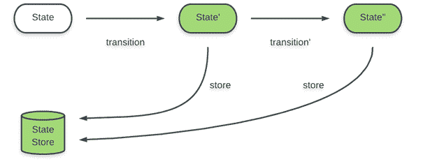
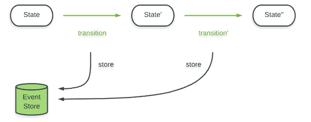

# 开始时你需要知道的活动采购要点

> 原文：<https://www.freecodecamp.org/news/event-sourcing-essentials-you-need-to-know-when-starting-out-13af35d9f932/>

作者:诺尔·威德默

# 开始时你需要知道的活动采购要点

活动采购是刚开始时的一个思维挑战。在这个故事中，我将从一个工程师的角度来描述我的经历。

我的目标是帮助你决定是否要投入资源开始活动采购。

[The Matrix](https://www.amazon.com/Complete-Trilogy-Reloaded-Revolutions-Blu-ray/dp/B001CEE1YE/ref=sr_1_6?keywords=the+matrix&qid=1550756146&s=movies-tv&sr=1-6): Neo is offered a choice.

### 关于作者

嗨？我是诺尔。我住在苏黎世(瑞士)附近，并自豪地在瑞士最大的电子商务平台上工作。在过去的 12 个月里，我和我的团队应用了事件采购，我们学到了很多。

我想与你分享四个要点，我希望我们一年前就知道。

### 事件采购的简单介绍

本文不是向您介绍事件源的概念。尽管如此，我仍然觉得我应该后退**一步**——来描绘一幅更清晰的画面。

在面向状态的应用程序中，您将一些计算的结果存储在数据存储中。您还可以保留一个日志，将旧的状态存档，用于审计或调试目的。但是通过存储状态，你丢失了关于从一个状态到另一个状态的转换的信息。如果一个用户的用户名消失了，你会想这是怎么发生的。

Storing state in a state-oriented application.

采购事件会保存这些信息。这是通过存储状态转换而不是结果状态来实现的。

Storing state transitions (events) in an event sourced application.

可以通过将所有事件应用到一个空画布来恢复当前状态。这意味着我们仍然可以访问当前状态，但需要投入计算资源来这样做。

网上有许多文章对此进行了更详细的介绍。马丁·福勒写了一篇关于它的文章。格雷格·杨[谈了很多关于活动采购](https://youtu.be/kZL41SMXWdM?t=2)的事情。Greg 对事件采购如此着迷，以至于[他实现了一个专门为事件采购设计的数据存储库](https://eventstore.org/)。我的团队正在使用 Greg 的活动商店，非常棒！

### 1)事件采购并不是灵丹妙药

一旦你爱上了事件外包的苦乐，将这个概念应用到你所有的问题中就变得很有吸引力。

这将为你提供大量的数据来分析，你将有一个强大的基础来发现其中有趣的相关性。您将能够发现低效的流程，并使它们更高效。

每个工程师(我)的最爱:

当您可以“时间旅行”到 bug 发生的确切时刻时，追踪 bug 会变得容易得多。最终你会节省时间和金钱。

嗯——不完全是。☝️

为你的事件寻找来源当然可以让你做分析。但是你还是需要去做。这需要时间。幸运的是，“时间旅行”是免费的。因此，从第一天起就保证了增强的调试。

塞思·戈丁就这个话题写了一篇很棒的博文。这是一个 2 分钟的阅读，所以检查一下。

现在你知道如果你使用你的事件进行分析，你将付出的代价，毕竟这是事件采购的主要商业利益。

不过，还有另一个成本。事件源会增加应用程序的复杂性。你不必处理你的应用程序的当前状态，而是必须处理它上线以来发生的所有事情。不再使用的事件将保留在您的数据存储中，您将不得不长期支持它们。

如果你部署了一个特性并不断迭代，那就太好了。请注意，现在您的数据存储中有该特性事件的多个版本，您必须支持所有版本。即使您不再创建这些事件的新实例。

事件采购增加了额外的时间复杂性，您必须适应。将它应用于您认为收集的数据变得相关的非零机会的地方。我对“相关”的定义是:

*   这些数据可以让你对自己的领域有更深入的了解
*   这些数据可以帮助您的企业自行改进流程
*   这些数据可以帮助你更快地找到漏洞

请注意，我在最后三个要点中都添加了“可能”一词。你很可能不会提前知道活动采购的确切好处。做出你最好的猜测。

### 2)认识到活动采购的功能性质

著名的[领域驱动设计的模式、原则和实践](https://www.amazon.com/Patterns-Principles-Practices-Domain-Driven-Design/dp/1118714709)的作者推荐像 C#或 Java 这样的面向对象编程语言。

我认为这个建议背后隐含的理由是使用这种语言的人数。是真的。当面对熟悉的语言时，新的团队成员可能会更容易进入这个领域。

但我不同意。格雷格·杨也是。**事件采购不是一个面向对象的概念。**

有人可能会说状态转换也是对象。事实上。你可以把一切都建模成对象。仅仅因为你可以并不意味着这是最好的模型。

考虑使用支持函数范式的语言。特别是[标记的联合](https://en.wikipedia.org/wiki/Tagged_union)和[模式匹配](https://en.wikipedia.org/wiki/Pattern_matching)非常有价值。处理你的事件会感觉很自然，你也不必和你的语言类型系统斗争。如果你的团队没有函数世界的经验，那么最好坚持使用熟悉的语言。

更重要的是要理解**选择关系数据存储将是一次痛苦的经历**。在获取事件资源时，您不需要处理关系数据。每个事件都有自己的模式，可以随着时间的推移而改变。使用关系型数据存储会带来伤害。

> SQL 什么都不是，但它一点也不擅长。格雷格·杨

### 3)期待一个陡峭的学习曲线

像所有的新事物一样，需要学习。不要试图回避它。那不行。

[The Matrix](https://www.amazon.com/Complete-Trilogy-Reloaded-Revolutions-Blu-ray/dp/B001CEE1YE/ref=sr_1_6?keywords=the+matrix&qid=1550756146&s=movies-tv&sr=1-6): Neo learns something special.

一个很好的学习方法是原型。试试这个:

*   为你的第一个基于事件的应用程序构建至少一个原型
*   运行并观察你的原型一段时间
*   实现新特性，并习惯于迭代您已经构建的东西

上线前尽可能多地迭代。一旦你上线了，实施新的学习就不那么容易了。

一旦您的团队对维护应用程序感到有信心，就投入使用。

还要考虑你的团队将如何向新成员介绍活动采购。新加入者已经处于压倒性的地位，学习新概念不会让他们更容易。

想办法用一种柔和安全的方式向他们介绍活动采购。一旦你开始获得新的团队成员，弄清楚这一点是很重要的。推迟到那一天也没关系。

### 4)为政治辩论做准备

你有没有意识到你的公司想要**便宜**和**质量**结果**今天**？

天啊，我在跟谁说话——当然是你。？

当你尝试一个他们可能从未听说过的令人费解的概念*时，他们*会喜欢吗？你公司的技术是什么样的？你通常结合关系数据存储使用面向对象编程语言吗？当你切换到一个功能性的技术堆栈时，*他们*会喜欢吗？

根据你公司的文化，你可能不得不在多条战线上与你的同事对抗。作为一个例子。说实话。你知道这很难，尤其是在开始的时候。分享你的担忧。确保所有相关人员都知道风险以及你将如何防范风险。

不要忘记你是如何描绘这个采购天堂的。让企业参与进来，允许他们根据你有价值的事件建立报告。他们会喜欢的。

通过分享改进的调试经验，让相关的工程人员参与进来。工程师很固执，他们可能还是不喜欢。

我发现与我的同事练习这种辩论很有用。建立一个安全的培训环境，并鼓励你的团队成员参与其中。

[The Matrix](https://www.amazon.com/Complete-Trilogy-Reloaded-Revolutions-Blu-ray/dp/B001CEE1YE/ref=sr_1_6?keywords=the+matrix&qid=1550756146&s=movies-tv&sr=1-6): Neo trains in a safe environment.

做好准备，了解自己的情况。你会成功的！？

### 结论

我来总结一下。

*   更多的数据并不总是好的。
*   没有时间分析的额外数据是没有用的。
*   没有意图和时间对结果采取行动的分析是无用的。
*   事件源增强了调试应用程序的能力。
*   事件源是一种功能范式。
*   期待一个陡峭的学习曲线。
*   不是每个人都会对你的计划感到高兴。

就是这样。我的意图是让你对我的经历有所期待。别担心。下定决心，选择红色药丸！

### 黑客帝国

这个故事中的所有图像都是从电影《黑客帝国》中借来的。

我花了 9 年时间编写面向对象的代码，并使用关系数据存储。大约两年前，我开始尝试功能代码和非关系数据存储。思维转变是我迄今为止职业生涯中最重要的一课。

质疑你的环境。找到瑕疵。退出矩阵，体验一个全新的世界。

永别了。下次见。祝你好运！

[The Matrix](https://www.amazon.com/Complete-Trilogy-Reloaded-Revolutions-Blu-ray/dp/B001CEE1YE/ref=sr_1_6?keywords=the+matrix&qid=1550756146&s=movies-tv&sr=1-6): Neo receives a goodbye gift.

我只写编程和技术。如果你跟着我，我不会浪费你的时间。？