# 事件查看器–如何访问 Windows 10 活动日志

> 原文：<https://www.freecodecamp.org/news/event-viewer-how-to-access-the-windows-10-activity-log/>

Windows 10 事件查看器是一个显示日志的应用程序，该日志详细记录了计算机上重大事件的信息。这些信息包括自动下载的更新、错误和警告。

在本文中，您将了解什么是事件查看器，它有不同的日志，最重要的是，如何在 Windows 10 计算机上访问它。

## 什么是事件查看器？

您在 Windows 10 电脑上打开的每个程序都会向事件查看器中的特定活动日志发送通知。

所有其他活动(如操作系统更改、安全更新、驱动程序异常、硬件故障等)也会记录到特定的日志中。因此，您可以将事件查看器视为记录计算机上每一项活动的数据库。

使用事件查看器，您可以解决不同的窗口和应用程序问题。

如果您深入研究事件查看器，您会看到不同的信息、警告和大量错误。不要惊慌，这很正常。即使是维护得最好的计算机也会显示大量的错误和警告。

## 如何访问 Windows 10 活动日志

在 Windows 10 上，有三种主要方式可以访问事件查看器——通过开始菜单、运行对话框和命令行。

### 如何通过开始菜单访问 Windows 10 活动日志

**步骤 1** :点击开始或按键盘上的 WIN (Windows)键
**步骤 2** :搜索“事件查看器”
**步骤 3** :点击第一个搜索结果或按`ENTER`
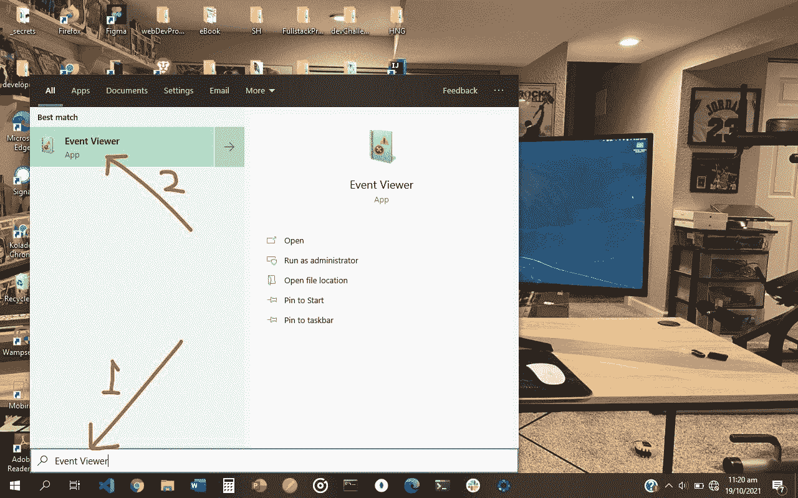

你会看到这个页面:
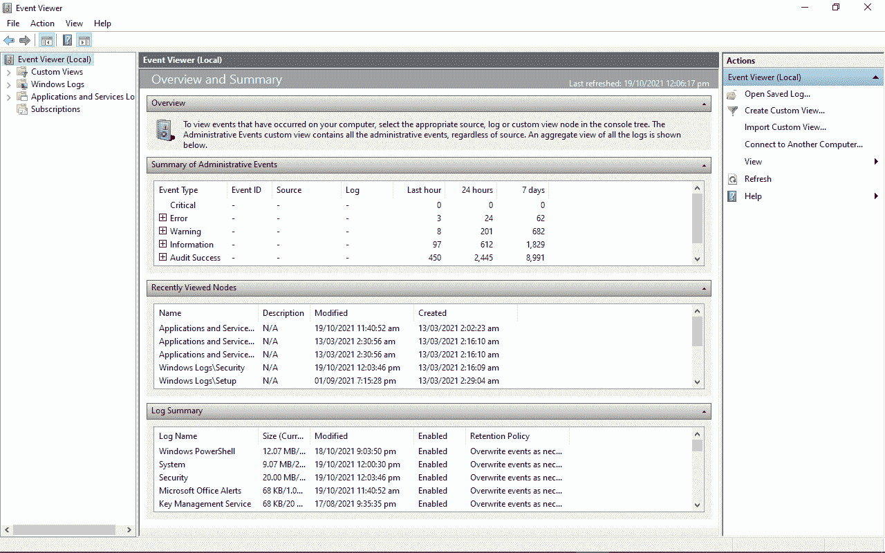

### 如何通过运行对话框访问 Windows 10 活动日志

**第一步**:右击开始(Windows log)选择“运行”，或者在键盘上按`WIN` (Windows 键)+`R`
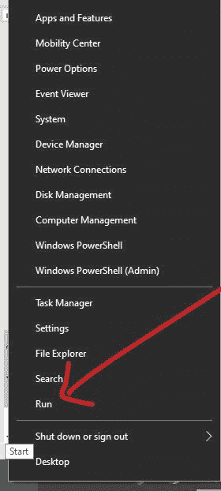

**第二步**:在编辑器中键入“eventvwr”，点击“确定”或点击`ENTER`
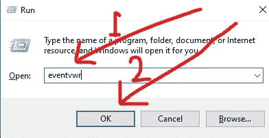
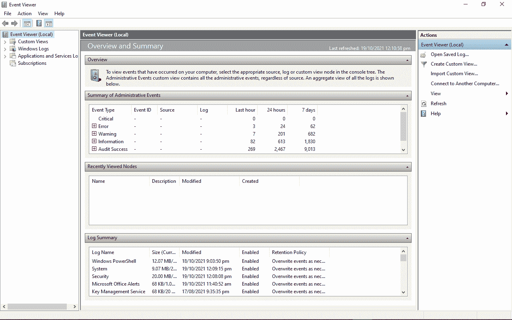

### 如何通过命令提示符访问 Windows 10 活动日志

**第一步**:点击开始(Windows logo)，搜索“cmd”
**第二步**:回车或点击第一个搜索结果(应该是命令提示符)启动命令提示符
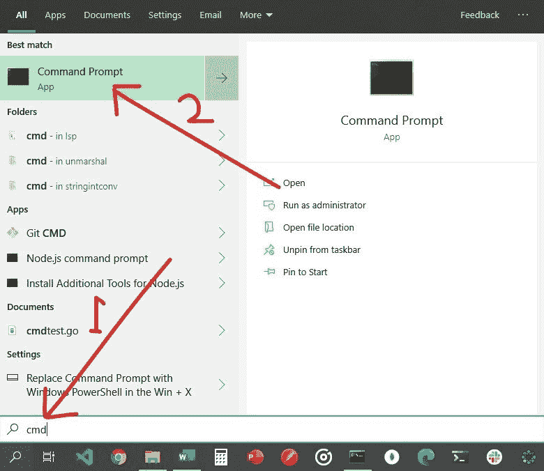

**第三步**:输入“eventvwr”，点击`ENTER`
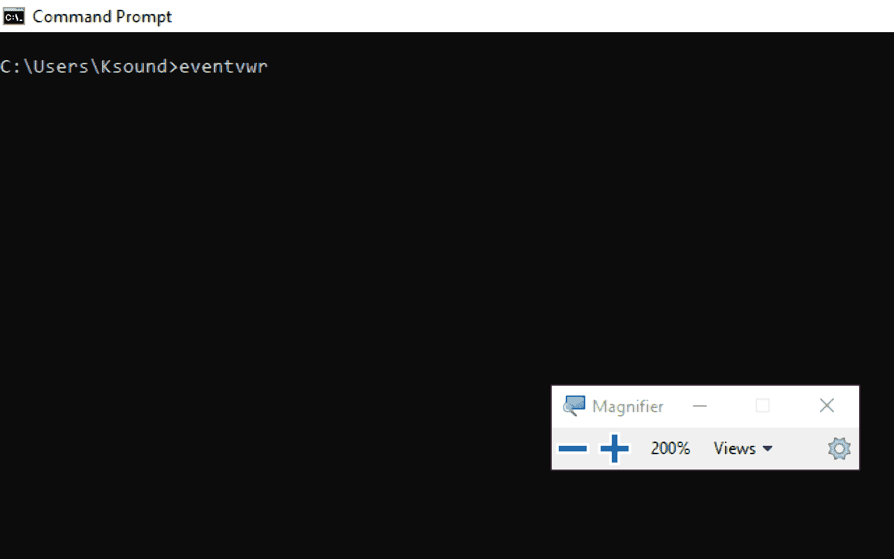
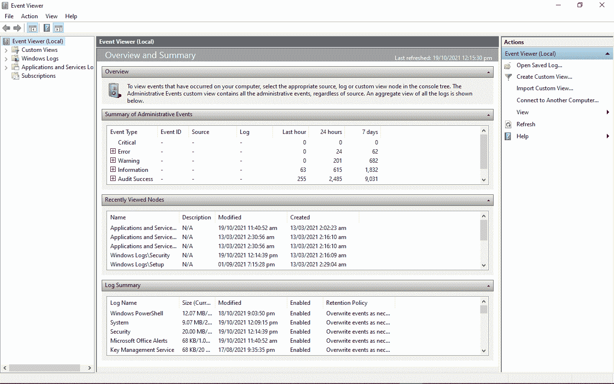

## 事件查看器活动日志

当您打开事件查看器查看计算机的活动日志时，会自动向您显示事件查看器(本地)选项卡。但是这可能不包含您需要的详细信息，因为它只是一个当您打开事件查看器时看到的页面。

事件查看器的功能远不止这些。

### 管理事件日志

您可以展开自定义视图选项卡来查看您计算机的管理事件，如下:
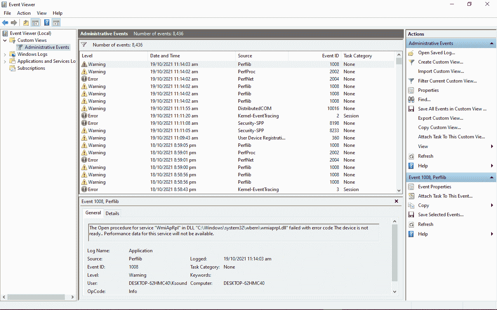

### Windows 活动日志

您还可以展开 Windows 日志以显示各种活动，例如:

*   应用事件:程序活动
    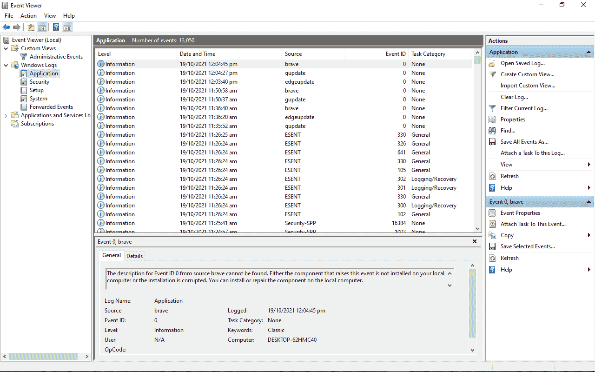的信息、错误和警告报告

*   安全事件:这显示了各种安全操作的结果。它们被称为审计，每个审计都可能是成功或失败的
    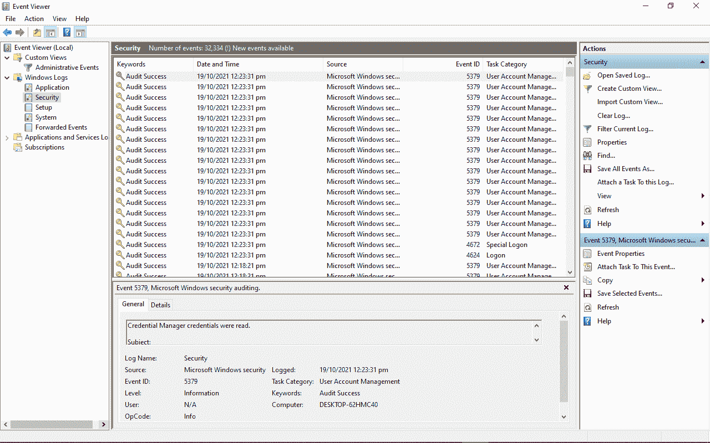

*   Setup 事件:这与域控制器有关，域控制器是在计算机网络上验证用户的服务器。你不应该每天都担心他们。
    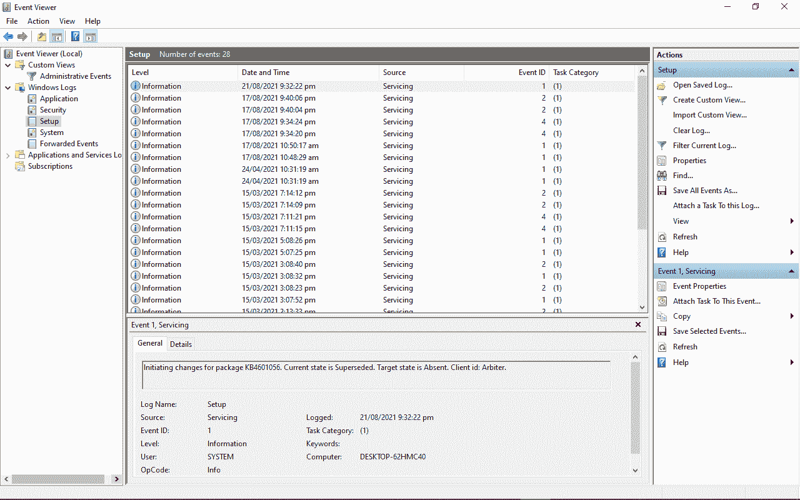

*   系统事件:这些是来自系统文件的报告，详细描述了它们遇到的错误
    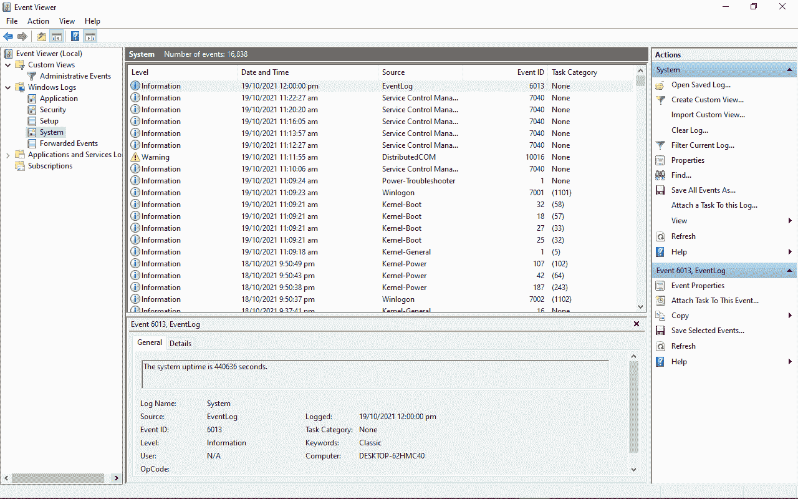

*   转发的事件:这些事件从同一网络中的其他计算机发送到您的计算机。它们帮助您跟踪同一网络中其他计算机的事件日志。
    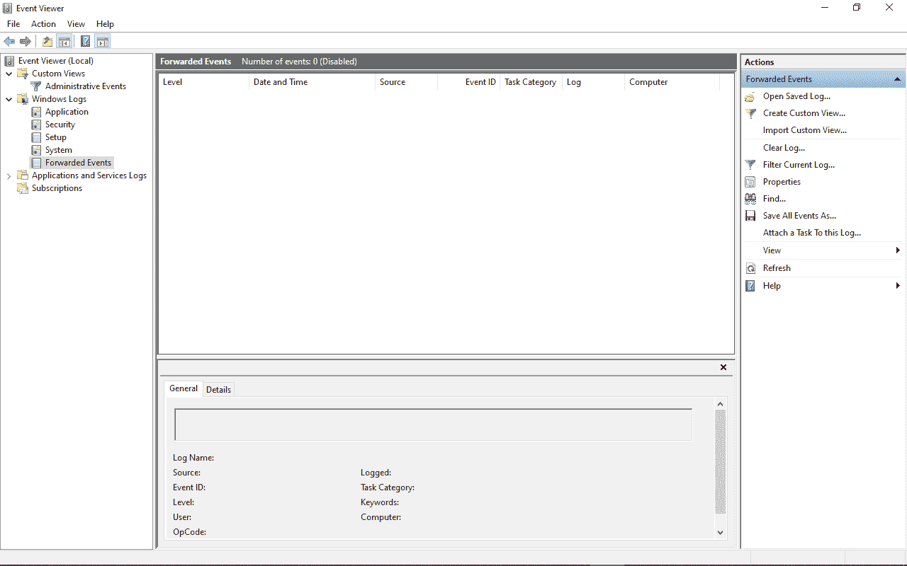

此外，还有应用程序和服务日志，显示硬件和 Internet Explorer 活动，以及 Microsoft Office apps 活动。

您可以双击某个错误来检查其属性，并在线查找该错误的事件 ID。这可以帮助您发现有关错误的更多信息，以便您可以在需要时修复它。
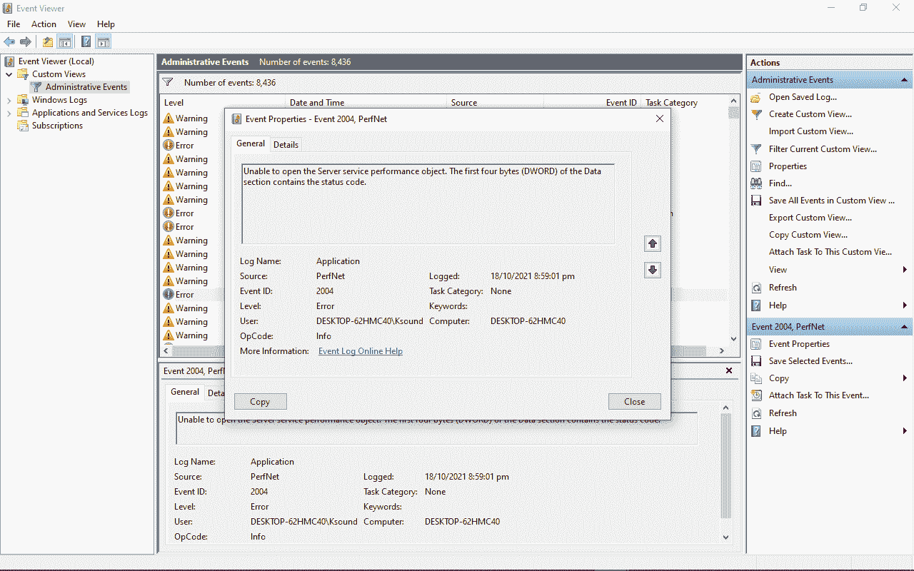

## 结论

在本文中，您了解了 Windows 10 事件查看器，这是一个非常强大的工具，Windows 用户应该知道如何使用。

除了查看各种活动日志，它还可以帮助您了解计算机上发生了什么。

感谢您的阅读。如果你认为这篇文章有帮助，请与你的朋友和家人分享。