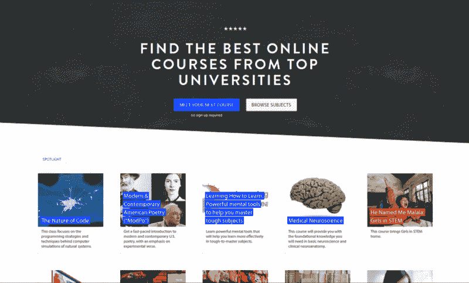
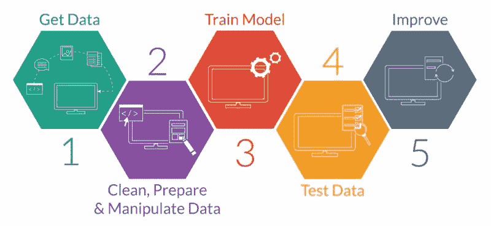
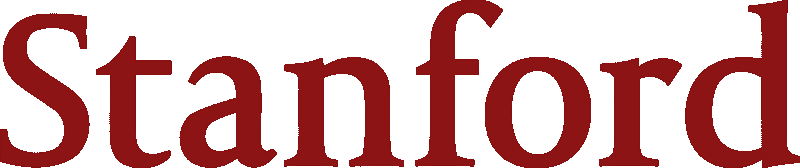
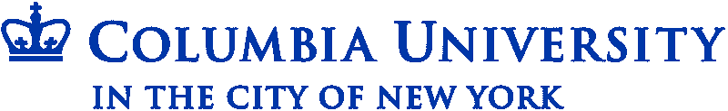
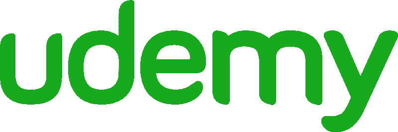
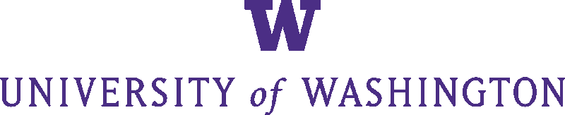

# 互联网上的每一门机器学习课程，根据你的评论进行排名

> 原文：<https://www.freecodecamp.org/news/every-single-machine-learning-course-on-the-internet-ranked-by-your-reviews-3c4a7b8026c0/>

大卫·文丘里

# 互联网上的每一门机器学习课程，根据你的评论进行排名

[*Wooden Robot*](https://www.pexels.com/photo/wooden-robot-6069/) *by Kaboompics*

一年半前，我退出了加拿大最好的计算机科学项目之一。我开始利用在线资源创建自己的[数据科学硕士项目](https://medium.com/@davidventuri/i-dropped-out-of-school-to-create-my-own-data-science-master-s-here-s-my-curriculum-1b400dcee412#.5fwwphdqd)。我意识到，我可以通过 edX、Coursera 和 Udacity 来学习我需要的一切。我可以更快、更有效地学习它，而且只需要很少的费用。

我现在几乎完成了。我参加了许多数据科学相关的课程，并旁听了更多课程的部分内容。我知道有哪些选择，以及准备成为数据分析师或数据科学家的学员需要哪些技能。因此，我开始创建一个回顾驱动的指南，为数据科学中的每个学科推荐最好的课程。

对于本系列的第一个指南，我为初学数据科学家推荐了几个[编码类](https://medium.freecodecamp.com/if-you-want-to-learn-data-science-start-with-one-of-these-programming-classes-fb694ffe780c#.42hhzxopw)。然后是[统计和概率课](https://medium.freecodecamp.com/if-you-want-to-learn-data-science-take-a-few-of-these-statistics-classes-9bbabab098b9#.p7pac546r)。然后是[数据科学简介](https://medium.freecodecamp.com/i-ranked-all-the-best-data-science-intro-courses-based-on-thousands-of-data-points-db5dc7e3eb8e)。还有，[数据可视化](https://medium.freecodecamp.com/an-overview-of-every-data-visualization-course-on-the-internet-9ccf24ea9c9b)。

### 现在谈谈机器学习。

为了这本指南，我花了十几个小时试图识别截至 2017 年 5 月提供的每一门在线机器学习课程，从它们的教学大纲和评论中提取关键信息，并汇编它们的评级。我的最终目标是找出三个最好的课程，并在下面展示给你。

为了这个任务，我求助于开源课程中央社区，以及它的数千个课程评级和评论的数据库。

Class Central’s [homepage](https://www.class-central.com/).

自 2011 年以来， [Class Central](https://www.class-central.com/) 创始人[达瓦尔·沙阿](https://www.freecodecamp.org/news/every-single-machine-learning-course-on-the-internet-ranked-by-your-reviews-3c4a7b8026c0/undefined)比世界上任何人都更关注在线课程。Dhawal 亲自帮我整理了这个资源列表。

### 我们如何选择要考虑的课程

每门课程必须符合三个标准:

1.  它必须有大量的机器学习内容。理想情况下，机器学习是首要课题。注意，深度学习专用课程除外。稍后会详细介绍。
2.  必须按需提供或每隔几个月提供一次。
3.  **它必须是一个互动的在线课程，所以没有书籍或只读教程**。虽然这些都是可行的学习方法，但本指南主要关注课程。完全是视频的课程(即没有测验、作业等。)也排除在外。

我们相信我们涵盖了所有符合上述标准的著名球场。由于 Udemy 上似乎有数百门课程，我们选择只考虑评论最多和评分最高的课程。

不过，总有可能我们漏掉了什么。所以，如果我们漏掉了一门好的课程，请在评论区告诉我们。

### 我们如何评估课程

我们收集了中央课堂和其他复习网站的平均评分和复习次数，以计算每门课程的加权平均评分。我们阅读文本评论，并使用这些反馈来补充数字评级。

我们根据三个因素做出主观的教学大纲判断:

1.  **机器学习工作流程的解释。**课程是否概述了执行一个成功的 ML 项目所需的步骤？参见下一节了解典型的工作流程需要什么。
2.  **机器学习技术和算法的覆盖面。**有多种技术(如回归、分类、聚类等。)和算法(例如，在分类中:朴素贝叶斯、决策树、支持向量机等。)涵盖或只是精选的几个？优先选择覆盖面广而又不遗漏细节的课程。
3.  **常用数据科学和机器学习工具的使用。**课程是否使用 Python、R 和/或 Scala 等流行编程语言授课？那些语言中流行的库怎么样？这些不是必需的，但是很有帮助，所以我们稍微倾向于这些课程。

### 什么是机器学习？什么是工作流？

一个流行的定义源于 1959 年阿瑟·塞缪尔的定义:机器学习是计算机科学的一个子领域，它赋予了 T2“计算机无需明确编程就能学习的能力”在实践中，这意味着开发能够根据数据做出预测的计算机程序。就像人类可以从经验中学习一样，计算机也可以，数据=经验。

机器学习工作流是执行机器学习项目所需的过程。尽管单个项目可能不同，但大多数工作流都有几个共同的任务:问题评估、数据探索、数据预处理、模型训练/测试/部署等。以下是对这些核心步骤的可视化描述，非常有用:

The core steps of typical machine learning workflow, [via UpX Academy](https://upxacademy.com/introduction-machine-learning/)

理想的课程会介绍整个过程，并提供互动范例、作业和/或测验，让学生自己完成每项任务。

### 这些课程涵盖深度学习吗？

首先，让我们定义一下深度学习。这里有一个简洁的描述:

> “深度学习是机器学习的一个子领域，涉及受大脑结构和功能启发的算法，称为人工神经网络。”

> ——来自[机器学习大师](http://machinelearningmastery.com/what-is-deep-learning/)的杰森·布朗利

正如所料，一些机器学习课程的部分内容包含深度学习内容。然而，我选择不包括深度学习课程。如果你对深度学习特别感兴趣，我们为你准备了以下[文章](https://medium.freecodecamp.com/dive-into-deep-learning-with-these-23-online-courses-bf247d289cc0):

[**通过 12 门免费在线课程投入深度学习**](https://medium.freecodecamp.com/dive-into-deep-learning-with-these-23-online-courses-bf247d289cc0)
[*每天都有关于深度学习如何改变我们周围世界的新头条。几个例子:*medium.freecodecamp.com](https://medium.freecodecamp.com/dive-into-deep-learning-with-these-23-online-courses-bf247d289cc0)

我的三大建议是:

*   [**深度学习与 TensorFlow 的创造性应用**](https://www.class-central.com/mooc/6679/kadenze-creative-applications-of-deep-learning-with-tensorflow) *作者卡登泽*
*   [**用于机器学习的神经网络**](https://www.class-central.com/mooc/398/coursera-neural-networks-for-machine-learning) *由多伦多大学(由 Geoffrey Hinton 教授)通过 Coursera*
*   [**深度学习 A-Z:动手操作的人工神经网络**](http://click.linksynergy.com/fs-bin/click?id=SAyYsTvLiGQ&offerid=507388.9689&type=3&subid=0&u1=medium-career-guide-machine-learning)
    *由基里尔·叶列缅科、哈德林·德·庞特维斯和超级数据科学团队通过 Udemy*

### 推荐的先决条件

下面列出的几门课程要求学生有编程、微积分、线性代数和统计经验。鉴于机器学习是一门高级学科，这些先决条件是可以理解的。

错过了几个科目？好消息！这方面的一些经验可以通过我们在本数据科学职业指南的前两篇文章([编程](https://medium.freecodecamp.com/if-you-want-to-learn-data-science-start-with-one-of-these-programming-classes-fb694ffe780c#.ld31z08y5)、[统计](https://medium.freecodecamp.com/if-you-want-to-learn-data-science-take-a-few-of-these-statistics-classes-9bbabab098b9))中的推荐获得。下面几个排名靠前的课程也提供了温和的微积分和线性代数复习，并为那些不太熟悉的人突出了与机器学习最相关的方面。

### 我们挑选的最佳机器学习课程是…

*   [机器学习](https://www.class-central.com/mooc/835/coursera-machine-learning)(斯坦福大学 via Coursera)

斯坦福大学 Coursera 上的[机器学习](https://www.class-central.com/mooc/835/coursera-machine-learning)在评分、评论和教学大纲匹配度方面显然是当前的赢家。由著名的谷歌大脑创始人、[百度](https://en.wikipedia.org/wiki/Baidu)前首席科学家吴恩达教授，正是这个课程引发了 Coursera 的创立。在 422 条评论中，它的加权平均评分为 4.7 星。

它于 2011 年发布，涵盖了机器学习工作流程的所有方面。尽管它的范围比它所基于的最初的斯坦福课程要小，但它仍然设法涵盖了大量的技术和算法。预计时间线为十一周，其中两周专门用于神经网络和深度学习。有免费和付费两种选择。

Ng 是一位充满活力而又温和的教练，有着丰富的经验。他激发了人们的信心，尤其是在分享实用的实施技巧和常见陷阱的警告时。提供了线性代数复习，Ng 强调了与机器学习最相关的微积分方面。

评估是自动的，通过每节课和编程作业后的选择题测验来完成。作业(一共有八个)可以在 MATLAB 或者 Octave 中完成，Octave 是 MATLAB 的开源版本。Ng 解释了他的语言选择:

> 在过去，我尝试过使用各种不同的编程语言来教授机器学习，包括 C++、Java、Python、NumPy 以及 Octave……在教授机器学习近十年后，我发现如果使用 Octave 作为编程环境，你会学得更快。

虽然 Python 和 R 可能是 2017 年更引人注目的选择，因为这些语言[越来越受欢迎](http://blog.codeeval.com/codeevalblog/2016/2/2/most-popular-coding-languages-of-2016)，但评论者指出，这不应该阻止你选修这门课程。

几位著名的评论家指出了以下几点:

> 斯坦福大学的机器学习课程在 MOOC 领域久负盛名，是这一主题的权威介绍。本课程广泛涵盖了机器学习的所有主要领域…Ng 教授在每个部分之前都进行了富有启发性的讨论和举例。吴恩达是一位有天赋的老师，能够以非常直观和清晰的方式解释复杂的主题，包括所有概念背后的数学。强烈推荐。
> 
> 我认为这门课的唯一问题是，它对其他课程的期望太高了。

### 一个新的常春藤联盟介绍了一个杰出的教授

*   [机器学习](https://www.class-central.com/mooc/7231/edx-machine-learning)(哥伦比亚大学通过 edX)

哥伦比亚大学的[机器学习](https://www.class-central.com/mooc/7231/edx-machine-learning)是一个相对较新的产品，是他们在 edX 上的人工智能微主机的一部分。虽然它比较新，没有大量的评论，但它确实有一些非常强的评论。约翰·佩斯里教授以才华横溢、思路清晰和聪明著称。它在 10 次评论中的加权平均评分为 4.8 星。

该课程还涵盖了机器学习工作流程的所有方面，以及比上述斯坦福课程更多的算法。哥伦比亚大学的是更高级的介绍，评论者指出，学生应该熟悉推荐的先决条件(微积分、线性代数、统计学、概率和编码)。

测验(11)、编程作业(4)和期末考试是评估的方式。学生可以使用 Python、Octave 或 MATLAB 来完成作业。课程的总预计时间是 12 周，每周 8 到 10 个小时。它是免费的，需要购买经过验证的证书。

以下是前面提到的一些精彩的[评论](https://www.coursetalk.com/providers/edx/courses/machine-learning-5):

> 在我当学生的这些年里，我遇到过不聪明的教授，聪明但不知道如何解释清楚的教授，以及聪明但知道如何解释清楚的教授。佩斯利博士属于第三类。这是一门很棒的课程…老师的语言很精确，在我看来，这是这门课程最强的地方之一。讲座质量很高，幻灯片也很棒。
> 
> 佩斯利博士和他的导师是……机器学习之父迈克尔·乔丹的学生。佩斯利博士是哥伦比亚大学最好的文学硕士教授，因为他有能力清晰地解释事物。这学期有多达 240 名学生选修了他的课程，这是哥伦比亚大学教授机器学习的人数最多的一次。

### 来自行业专家的 Python & R 实用介绍

*   机器学习 A-Z:数据科学中的实践 Python&R(基里尔·叶列缅科、哈德林·德·庞特维斯和通过 Udemy 的 SuperDataScience 团队)

Udemy 上的 Machine Learning A-Z 是一个令人印象深刻的详细课程，它以*Python 和 R 两种语言提供教学，这是罕见的，其他任何顶级课程都无法做到。在 8，119 条评论中，它的加权平均评分为 4.5 星，这使它成为被考虑的课程中评论最多的课程。*

*它通过 40.5 小时的点播视频，覆盖了整个机器学习工作流程和几乎荒谬(以一种好的方式)的算法数量。该课程采用了一种更实用的方法，并且比上述两门课程更注重数学。每一部分都以叶列缅科的“直觉”视频开始，该视频总结了所教授概念的基本理论。de Ponteves 然后通过 Python 和 r 的单独视频介绍了实现。*

*作为“额外收获”，该课程包括 Python 和 R 代码模板，供学生下载并在自己的项目中使用。有测验和家庭作业的挑战，虽然这些不是本课程的强项。*

*叶列缅科和超级数据科学团队因其“化繁为简”的能力而备受尊崇此外，列出的先决条件是“只是一些高中数学”，所以对于那些被斯坦福大学和哥伦比亚大学吓倒的人来说，这门课程可能是一个更好的选择。*

*一些著名的评论家[指出](https://www.udemy.com/machinelearning/#reviews)如下:*

> *课程制作专业，音质极佳，讲解清晰简洁……对于你的资金和时间投入来说，这是一个不可思议的价值。能够同时用两种不同的编程语言学习这门课程真是太棒了。
> 
> 基里尔是 Udemy(如果不是互联网)上绝对最好的导师之一，我推荐参加他教的任何课程。…本课程有大量的内容，比如说大量的内容！*

**

### *竞争*

*在 422 条评论中，我们的第一选择的加权平均评分为 4.7 分(5 颗星)。让我们看看其他备选方案，按评级降序排列。提醒一下，只有深度学习的课程不包括在本指南中——你可以在这里找到那些。*

*[分析边缘](https://www.class-central.com/mooc/1623/edx-the-analytics-edge)(麻省理工学院/edX):更侧重于一般的分析，尽管它确实涵盖了几个机器学习主题。使用 R. Strong 叙述，利用熟悉的现实世界的例子。富有挑战性。十二周内每周十到十五个小时。可免费购买经过验证的证书。在 214 条评论中，它的加权平均评分为 4.9 星。*

*[Python for Data Science and Machine Learning boot camp](http://click.linksynergy.com/fs-bin/click?id=SAyYsTvLiGQ&offerid=507388.9690&type=3&subid=0&u1=medium-career-guide-machine-learning)(何塞·波尔蒂利亚/Udemy):有大段大段的机器学习内容，但涵盖了整个数据科学过程。更详细地介绍 Python。令人惊叹的课程，尽管对本指南的范围来说并不理想。21.5 小时的点播视频。费用视 Udemy 折扣而定，折扣是常见的。在 3316 条评论中，它的加权平均评级为 4.6 星。*

*[数据科学和机器学习训练营(Data Science and Machine Learning boot camp with R](https://click.linksynergy.com/fs-bin/click?id=SAyYsTvLiGQ&subid=&offerid=323058.1&type=10&u1=medium-career-guide-machine-learning&tmpid=14538&RD_PARM1=https%3A%2F%2Fwww.udemy.com%2Fdata-science-and-machine-learning-bootcamp-with-r%2F))(何塞·波尔蒂利亚/Udemy):对波尔蒂利亚上述课程的评论也适用于此，但 R. 17.5 小时的点播视频除外。费用视 Udemy 折扣而定，折扣是常见的。在 1317 条评论中，它的加权平均评级为 4.6 星。*

*[机器学习系列](https://click.linksynergy.com/fs-bin/click?id=SAyYsTvLiGQ&subid=&offerid=323058.1&type=10&u1=medium-career-guide-machine-learning&tmpid=14538&RD_PARM1=https%3A%2F%2Fwww.udemy.com%2Fuser%2Flazy-programmer%2F) (Lazy Programmer Inc./Udemy):由一位简历令人印象深刻的数据科学家/大数据工程师/全栈软件工程师授课，Lazy Programmer 目前在 Udemy 上有一系列 16 门以机器学习为主的课程。总的来说，这些课程有 5000+的评分，几乎所有课程都有 4.6 星。每个单独课程的描述中都提供了有用的课程顺序。使用 Python。费用视 Udemy 折扣而定，折扣是常见的。*

*机器学习(Georgia Tech/Udacity):三个独立课程的汇编:有监督的、无监督的和强化学习。Udacity 的机器学习工程师 Nanodegree 和佐治亚理工学院在线硕士学位(OMS)的一部分。一口大小的视频，这是 Udacity 的风格。友好的教授。估计时间为四个月。免费。在 9 次评论中，它的加权平均评分为 4.56 星。*

*[在 Azure HDInsight 中用 Spark 实现预测分析](https://www.class-central.com/mooc/4151/edx-implementing-predictive-analytics-with-spark-in-azure-hdinsight)(微软/edX):介绍机器学习的核心概念和各种算法。利用多种大数据友好工具，包括 Apache Spark、Scala 和 Hadoop。同时使用 Python 和 r。六周内每周四小时。可免费购买经过验证的证书。它在 6 次评论中的加权平均评分为 4.5 星。*

*[使用 Python 进行数据科学和机器学习——动手实践！](https://click.linksynergy.com/fs-bin/click?id=SAyYsTvLiGQ&subid=&offerid=323058.1&type=10&u1=medium-career-guide-machine-learning&tmpid=14538&RD_PARM1=https%3A%2F%2Fwww.udemy.com%2Fdata-science-and-machine-learning-with-python-hands-on%2F)(弗兰克·凯恩/Udemy):使用 Python。凯恩在亚马逊和 IMDb 有九年的工作经验。九个小时的点播视频。费用视 Udemy 折扣而定，折扣是常见的。在 4139 条评论中，它的加权平均评级为 4.5 星。*

*用于大数据和机器学习的 Scala 和 Spark(何塞·波尔蒂利亚/Udemy):“大数据”焦点，特别是在 Scala 和 Spark 中的实现。十个小时的点播视频。费用视 Udemy 折扣而定，折扣是常见的。在 607 条评论中，它的加权平均评分为 4.5 星。*

*[机器学习工程师 nano degree](https://www.class-central.com/certificate/machine-learning-engineer-nanodegree--nd009)(uda city):uda city 的旗舰机器学习项目，其特色是一流的项目评审系统和职业支持。该计划是几个单独的 Udacity 课程的汇编，是免费的。由 Kaggle 共同创作。估计时间为六个月。目前费用为每月 199 美元，12 个月内毕业的学生可获得 50%的学费退款。它在 2 篇评论中的加权平均评分为 4.5 星。*

*[从数据中学习(入门机器学习)](https://www.class-central.com/mooc/1240/edx-learning-from-data-introductory-machine-learning)(加州理工学院/edX):目前 edX 上已停止报名，但也可通过加州理工学院的独立平台报名(见下文)。它在 42 篇评论中的加权平均评分为 4.49 星。*

*[从数据中学习(机器学习入门)](https://www.class-central.com/mooc/366/learning-from-data-introductory-machine-learning-course)(亚塞尔·阿布-穆斯塔法/加州理工学院):“真正的加州理工课程，而不是掺水的版本。”评论指出，它对于理解机器学习理论是非常好的。教授亚塞尔·阿布·穆斯塔法很受学生欢迎，也是本课程所依据的教科书的作者。视频是上传到 YouTube 的讲座录音(带有画中画的讲座幻灯片)。家庭作业是。pdf 文件。在线学生的课程体验没有前三名推荐的那么完美。它在 7 次评论中的加权平均评分为 4.43 星。*

*[挖掘海量数据集](https://www.class-central.com/mooc/2406/stanford-openedx-mining-massive-datasets)(斯坦福大学):以“大数据”为重点的机器学习。介绍现代分布式文件系统和 MapReduce。七周内每周十小时。免费。它在 30 篇评论中的加权平均评分为 4.4 星。*

*[AWS 机器学习:Python 完全指南](https://click.linksynergy.com/fs-bin/click?id=SAyYsTvLiGQ&subid=&offerid=323058.1&type=10&u1=medium-career-guide-machine-learning&tmpid=14538&RD_PARM1=https%3A%2F%2Fwww.udemy.com%2Faws-machine-learning-a-complete-guide-with-python%2F) (Chandra Lingam/Udemy):对基于云的机器学习，特别是亚马逊网络服务的独特关注。使用 Python。九个小时的点播视频。费用视 Udemy 折扣而定，折扣是常见的。它在 62 条评论中的加权平均评分为 4.4 星。*

*[机器学习介绍&Python 中的人脸检测](https://click.linksynergy.com/fs-bin/click?id=SAyYsTvLiGQ&subid=&offerid=323058.1&type=10&u1=medium-career-guide-machine-learning&tmpid=14538&RD_PARM1=https%3A%2F%2Fwww.udemy.com%2Fintroduction-to-machine-learning-in-python%2F) (Holczer Balazs/Udemy):使用 Python。八小时的点播视频。费用视 Udemy 折扣而定，折扣是常见的。它在 162 条评论中的加权平均评分为 4.4 星。*

*[StatLearning:统计学习](https://www.class-central.com/mooc/1579/stanford-openedx-statlearning-statistical-learning)(斯坦福大学):基于优秀教材《[统计学习入门，R 中应用](https://www.amazon.com/Introduction-Statistical-Learning-Applications-Statistics-ebook/dp/B01IBM7790)》，由编写该教材的教授授课。评论家指出，MOOC 不如这本书好，理由是“单薄”的练习和平庸的视频。九周内每周五小时。免费。它在 84 条评论中的加权平均评分为 4.35 星。*

*[机器学习专业](https://www.class-central.com/certificate/machine-learning-specialization)(华盛顿大学/Coursera):很棒的课程，但是最后两节课(包括 capstone 项目)取消了。评论者指出，这个系列比其他顶级机器学习课程(如斯坦福大学或加州理工学院的课程)更容易消化(阅读:对那些没有强大技术背景的人来说更容易)。请注意，该系列不完整，没有推荐系统、深度学习和摘要。提供免费和付费选项。它在 80 篇评论中的加权平均评分为 4.31 星。*

*

The University of Washington teaches the [Machine Learning Specialization](https://www.class-central.com/certificate/machine-learning-specialization) on Coursera.* 

*[从 0 到 1:机器学习，NLP&Python——切入正题](https://click.linksynergy.com/fs-bin/click?id=SAyYsTvLiGQ&subid=&offerid=323058.1&type=10&u1=medium-career-guide-machine-learning&tmpid=14538&RD_PARM1=https%3A%2F%2Fwww.udemy.com%2Ffrom-0-1-machine-learning%2F)(疯疯癫癫的玉米/Udemy):“对机器学习技术的务实、害羞但自信的呈现。”由拥有数十年行业经验的四人团队共同授课。使用 Python。费用视 Udemy 折扣而定，折扣是常见的。在 494 条评论中，它的加权平均评分为 4.2 星。*

*[机器学习原理](https://www.class-central.com/mooc/6511/edx-principles-of-machine-learning)(微软/edX):使用 R、Python、微软 Azure 机器学习。微软数据科学专业计划证书的一部分。六周内每周三到四个小时。可免费购买经过验证的证书。在 11 次评论中，它的加权平均评分为 4.09 星。*

*[大数据:统计推断和机器学习](https://www.class-central.com/mooc/5421/futurelearn-big-data-statistical-inference-and-machine-learning)(昆士兰科技大学/FutureLearn):一个很好的，简短的探索性机器学习课程，重点是大数据。涵盖了一些工具，如 R，H2O 流，和 WEKA。仅持续三周，建议每周两小时，但一位评审员指出，每周六小时更合适。提供免费和付费选项。在 4 篇评论中，它的加权平均评分为 4 星。*

*[基因组数据科学和聚类](https://www.class-central.com/mooc/3556/coursera-genomic-data-science-and-clustering-bioinformatics-v)(生物信息学 V)(加州大学圣地亚哥分校/Coursera):面向那些对计算机科学和生物学的交叉以及它如何代表现代科学的重要前沿感兴趣的人。侧重于聚类和降维。UCSD 生物信息学专业的一部分。提供免费和付费选项。在 3 次评论中，它的加权平均评分为 4 星。*

*[机器学习简介](https://www.class-central.com/mooc/2996/udacity-intro-to-machine-learning) (Udacity):优先考虑主题广度和实用工具(Python 中)而不是深度和理论。巴斯蒂安·特龙和凯蒂·马龙这两位老师让这门课变得非常有趣。由小视频和小测验组成，每节课都有一个小项目。目前隶属于 Udacity 的数据分析师 Nanodegree。预计时间为十周。免费。它在 19 篇评论中的加权平均评分为 3.95 星。*

*[用于数据分析的机器学习](https://www.class-central.com/mooc/4354/coursera-machine-learning-for-data-analysis)(卫斯理大学/Coursera):简要介绍机器学习和一些精选算法。涵盖决策树、随机森林、套索回归和 k 均值聚类。卫斯理数据分析和解释专业化的一部分。预计时间为四周。提供免费和付费选项。它在 5 次评论中的加权平均评分为 3.6 星。*

*[用 Python 为数据科学编程](https://www.class-central.com/mooc/6471/edx-programming-with-python-for-data-science)(微软/edX):由微软与 Coding Dojo 合作制作。使用 Python。六周内每周八小时。提供免费和付费选项。它在 37 篇评论中的加权平均评分为 3.46 星。*

*[交易机器学习](https://www.class-central.com/mooc/1026/udacity-machine-learning-for-trading)(佐治亚理工学院/Udacity):专注于将概率机器学习方法应用于交易决策。使用 Python。Udacity 的机器学习工程师 Nanodegree 和佐治亚理工学院在线硕士学位(OMS)的一部分。估计时间为四个月。免费。它在 14 篇评论中的加权平均评分为 3.29 星。*

*[实用的机器学习](https://www.class-central.com/mooc/1719/coursera-practical-machine-learning)(约翰·霍普金斯大学/Coursera):对一些机器学习算法的简短、实用的介绍。表达各种担忧的几篇一/二星级评论。JHU 数据科学专业的一部分。四周内每周四到九个小时。提供免费和付费选项。它在 37 篇评论中的加权平均评分为 3.11 星。*

*[数据科学和分析的机器学习](https://www.class-central.com/mooc/4912/edx-machine-learning-for-data-science-and-analytics)(哥伦比亚大学/edX):介绍了广泛的机器学习主题。一些充满激情的负面评论，包括内容选择，缺乏编程任务，以及缺乏启发性的演示。五周内每周七到十个小时。可免费购买经过验证的证书。在 36 条评论中，它的加权平均评分为 2.74 星。*

*推荐系统专业化(明尼苏达大学/Coursera):强烈关注一种特定类型的机器学习——推荐系统。四门专业课加上一个顶点项目，这是一个案例研究。使用 LensKit(推荐系统的开源工具包)教授。提供免费和付费选项。在 2 次评论中，它的加权平均评分为 2 星。*

*[利用大数据的机器学习](https://www.class-central.com/mooc/4238/coursera-machine-learning-with-big-data)(加州大学圣地亚哥分校/Coursera):糟糕的评论，突出了糟糕的教学和评估。有些人注意到他们只花了几个小时就完成了整个课程。UCSD 大数据专业的一部分。提供免费和付费选项。它在 14 篇评论中的加权平均评分为 1.86 星。*

*[实用预测分析:模型和方法](https://www.class-central.com/mooc/4341/coursera-practical-predictive-analytics-models-and-methods)(华盛顿大学/Coursera):对核心机器学习概念的简要介绍。一位评论者指出，缺少测验，作业没有挑战性。UW 数据科学的一部分。四周内每周六到八小时。提供免费和付费选项。它在 4 篇评论中的加权平均评分为 1.75 星。*

*截至 2017 年 5 月，以下课程有一个或没有评论。*

*[面向音乐家和艺术家的机器学习](https://www.class-central.com/mooc/3768/kadenze-machine-learning-for-musicians-and-artists)(伦敦大学/卡登泽金匠学院):独一无二。学生学习算法、软件工具和机器学习最佳实践，以理解人类手势、音乐音频和其他实时数据。七次会议。提供审计(免费)和高级(每月 10 美元)选项。它有一个 5 星评价。*

*[Python 中的应用机器学习](https://www.class-central.com/mooc/6673/coursera-applied-machine-learning-in-python)(密歇根大学/Coursera):使用 Python 和 scikit learn toolkit 教授。Python 专门化的应用数据科学的一部分。计划于 5 月 29 日开始。提供免费和付费选项。*

*[应用机器学习](https://www.class-central.com/mooc/6406/edx-applied-machine-learning)(微软/edX):使用各种工具教授，包括 Python、R、微软 Azure 机器学习(注:微软制作课程)。包括动手实验，以强化讲座内容。六周内每周三到四个小时。可免费购买经过验证的证书。*

*[用 Python 进行机器学习](https://bigdatauniversity.com/courses/machine-learning-with-python/)(大数据大学):用 Python 授课。面向初学者。预计完成时间为四个小时。大数据大学隶属于 IBM。免费。*

*[用 Apache SystemML 进行机器学习](https://bigdatauniversity.com/courses/machine-learning-apache-systemml/)(大数据大学):用 Apache SystemML 授课，这是一种声明式风格语言，专为大规模机器学习而设计。预计完成时间为八小时。大数据大学隶属于 IBM。免费。*

*[面向数据科学的机器学习](https://www.class-central.com/mooc/8216/edx-machine-learning-for-data-science)(加州大学圣地亚哥分校/edX):2018 年 1 月才推出。编程例子和作业都是 Python 的，使用 Jupyter 笔记本。十周内每周八小时。可免费购买经过验证的证书。*

*[分析建模介绍](https://www.class-central.com/mooc/8217/edx-introduction-to-analytics-modeling)(乔治亚理工学院/edX):该课程宣传 R 是其主要的编程工具。十周内每周五到十个小时。可免费购买经过验证的证书。*

*[预测分析:从大数据中获得洞察力](https://www.class-central.com/mooc/7645/futurelearn-predictive-analytics-gaining-insights-from-big-data)(昆士兰科技大学/FutureLearn):几个算法的简要概述。使用惠普企业的 Vertica 分析平台作为应用工具。开始日期待定。四周内每周两小时。可免费购买成就证书。*

*[机器学习简介](https://miriadax.net/web/introduccion-al-machine-learning)(Universitas telefónica/miriada X):用西班牙语授课。介绍机器学习，包括监督和非监督学习。在四周内总共估计有二十个小时。*

*[机器学习路径步骤](https://www.dataquest.io/path-step/machine-learning) (Dataquest):使用 Dataquest 的交互式浏览器内平台用 Python 讲授。多个指导性项目和一个“plus”项目，在该项目中，您可以使用自己的数据构建自己的机器学习系统。需要订阅。*

*以下六门课程由 [DataCamp](https://www.datacamp.com/courses/topic:machine_learning?tap_a=5644-dce66f&tap_s=93618-a68c98) 提供。DataCamp 的混合教学风格利用视频和基于文本的教学，通过浏览器内的代码编辑器提供大量示例。每门课程都需要订阅。*

*

[DataCamp](https://www.datacamp.com/courses/topic:machine_learning?tap_a=5644-dce66f&tap_s=93618-a68c98) offers several machine learning courses.* 

*[机器学习简介](https://www.datacamp.com/courses/introduction-to-machine-learning-with-r?tap_a=5644-dce66f&tap_s=93618-a68c98) (DataCamp):涵盖分类、回归、聚类算法。使用 R 个视频和 81 个练习，估计时间为 6 小时。*

*[使用 scikit-learn 的监督学习](https://www.datacamp.com/courses/supervised-learning-with-scikit-learn?tap_a=5644-dce66f&tap_s=93618-a68c98) (DataCamp):使用 Python 和 scikit-learn。涵盖分类和回归算法。17 个视频和 54 个练习，预计时间为 4 小时。*

*[R 中的无监督学习](https://www.datacamp.com/courses/unsupervised-learning-in-r?tap_a=5644-dce66f&tap_s=93618-a68c98) (DataCamp):提供 R 中聚类和降维的基本介绍，十六个视频和 49 个练习，估计时间线为四个小时。*

*[机器学习工具箱](https://www.datacamp.com/courses/machine-learning-toolbox?tap_a=5644-dce66f&tap_s=93618-a68c98) (DataCamp):教授机器学习中的“大思想”。使用 R. 24 视频和 88 个练习，估计时间为四小时。*

*专家指导下的机器学习:学校预算 (DataCamp):来自 DrivenData 上的机器学习竞赛的案例研究。包括建立一个模型来自动对学校预算中的项目进行分类。DataCamp 的“用 scikit-learn 进行监督学习”是前提条件。15 个视频和 51 个练习，预计时间为 4 小时。*

*[Python 中的无监督学习](https://www.datacamp.com/courses/unsupervised-learning-in-python?tap_a=5644-dce66f&tap_s=93618-a68c98) (DataCamp):涵盖了使用 Python、scikit-learn 和 scipy 的各种无监督学习算法。课程结束时，学生将建立一个推荐系统来推荐受欢迎的音乐艺术家。13 个视频和 52 个练习，预计时间为 4 小时。*

*[机器学习](http://www.cs.cmu.edu/~ninamf/courses/601sp15/index.html)(汤姆·米切尔/卡内基·梅隆大学):卡内基·梅隆大学的研究生入门机器学习课程。这是他们第二门研究生课程“统计机器学习”的先决条件网上张贴的大学讲座录音，包括练习题、家庭作业和期中考试(都有答案)。还有一个 [2011 版](http://www.cs.cmu.edu/~tom/10701_sp11/)的课程。CMU 是研究机器学习的最好的研究生院之一，有一个专门研究机器学习的部门。免费。*

*统计机器学习(拉里·乏色曼/卡耐基·梅隆大学):可能是本指南中最高级的课程。卡内基梅隆大学机器学习课程的后续。网上张贴的大学讲座录音，包括练习题、家庭作业和期中考试(都有答案)。免费。*

*

CMU is one of the best grad schools for studying machine learning. [Machine Learning](http://www.cs.cmu.edu/~ninamf/courses/601sp15/index.html) and [Statistical Machine Learning](https://www.class-central.com/mooc/8509/statistical-machine-learning) are available online for free.* 

*[本科机器学习](http://www.cs.ubc.ca/~nando/340-2012/index.php)(南多·德·弗雷塔斯/不列颠哥伦比亚大学):本科机器学习课程。讲座被拍摄下来，放在 YouTube 上，幻灯片也放在课程网站上。课程作业也贴了出来(虽然没有解答)。德弗雷塔斯现在是牛津大学的全职教授，并在各种论坛上因其教学能力而受到称赞。提供研究生版本(见下文)。*

*[机器学习](http://www.cs.ubc.ca/~nando/540-2013/lectures.html)(Nando de Freitas/不列颠哥伦比亚大学):研究生机器学习课程。德弗雷塔斯的本科课程中的评论(如上)在这里也适用。*

### *包装它*

*这是六个系列中的第五个，涵盖了让您进入数据科学领域的最佳在线课程。我们在[第一篇文章](https://medium.freecodecamp.com/if-you-want-to-learn-data-science-start-with-one-of-these-programming-classes-fb694ffe780c#.fhrn45v3c)中介绍了编程，在[第二篇文章](https://medium.freecodecamp.com/if-you-want-to-learn-data-science-take-a-few-of-these-statistics-classes-9bbabab098b9#.p7pac546r)中介绍了统计和概率，在[第三篇文章](https://medium.freecodecamp.com/i-ranked-all-the-best-data-science-intro-courses-based-on-thousands-of-data-points-db5dc7e3eb8e)中介绍了数据科学，在[第四篇文章](https://medium.freecodecamp.com/an-overview-of-every-data-visualization-course-on-the-internet-9ccf24ea9c9b)中介绍了数据可视化。*

*[**我根据数千个数据点对互联网上的每一个数据科学入门课程进行排名**
*一年前，我从加拿大最好的计算机科学项目之一退学。我开始创建自己的数据…*](https://www.freecodecamp.org/news/i-ranked-all-the-best-data-science-intro-courses-based-on-thousands-of-data-points-db5dc7e3eb8e/)*

*最后一篇文章将是这些文章的总结，加上其他关键主题的最佳在线课程，如数据争论、数据库，甚至软件工程。*

*如果您正在寻找数据科学在线课程的完整列表，您可以在 Class Central 的[数据科学和大数据](https://www.class-central.com/subject/data-science)主题页面上找到它们。*

*如果你喜欢读这篇文章，可以看看 [Class Central](https://www.class-central.com/) 的其他作品:*

*这里有 250 门常春藤盟校的课程，你现在就可以在网上免费选修
*布朗大学、哥大、康乃尔大学、达特茅斯大学、哈佛大学、宾夕法尼亚大学、普林斯顿大学和耶鲁大学的 250 门 MOOCs 课程。**

*[**根据数据统计的 50 个最好的免费在线大学课程**
*当我在 2011 年 11 月推出 Class Central 时，大约有 18 个免费的在线课程，而且几乎都是…*](https://www.freecodecamp.org/news/the-data-dont-lie-here-are-the-50-best-free-online-university-courses-of-all-time-b2d9a64edfac/)*

*如果你对我错过的课程有什么建议，请在回复中告诉我！*

*如果您觉得这很有帮助，请单击？所以更多的人会在媒体上看到它。*

**这是我在中央课堂上发表的[原文](https://www.class-central.com/report/best-machine-learning-courses/)的浓缩版，我在里面加入了详细的课程大纲。**