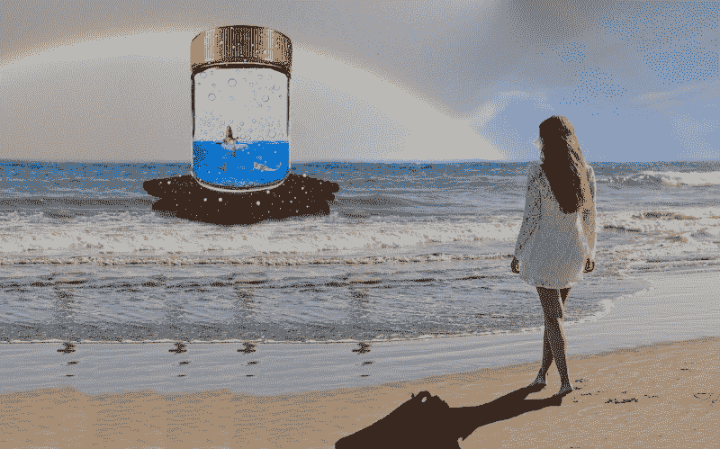

# 在我的拓展旅程中，每一步都带来新的东西

> 原文：<https://www.freecodecamp.org/news/every-step-brings-something-new-on-my-outreachy-journey-e7c0f7adf2ea/>

托尼·肖特斯维

# 在我的拓展旅程中，每一步都带来新的东西

这是我的外展实习文章的第四部分。我每两周写一篇文章，提供我旅途中的最新消息，并且我一直努力按照计划进行。如果你需要赶上或被提醒到目前为止发生了什么，你可以阅读我以前的文章。

在我的第一篇文章中，我分享了我是如何战胜困难，被[外展](https://www.outreachy.org/)实习生接受，与[图书馆健康](http://librehealth.io/)一起工作的。下一篇文章讨论了我被录取后开始实际实习的准备工作。在上一篇[文章中，我谈到了我经历的一些技术挑战。今天，我将分享从那以后发生的事情。](https://medium.freecodecamp.org/the-next-steps-on-my-outreachy-journey-docker-big-challenges-and-small-victories-2c3a2dd2277a)

#### 我在做什么

LibreHealth Toolkit 是一个软件 API 和用户界面，可用于创建电子健康记录。LibreHealth Radiology suite 是 LibreHealth Toolkit 的定制版本，带有用于放射学和成像专业人员的附加工具。

我正在为电子健康记录(EHR)和放射学模块编写图书馆健康非技术用户指南。在 EHR 模块中学习供应商和员工的工作流程令人兴奋。我也正在学习放射科的工作流程。

我很喜欢使用 EHR 自由健康[演示网站](https://librehealth.io/demos/)为医生的实践创建一个新的设施，以及运行该设施所需的员工和程序。我根据需要使用 Snag-it、Photoshop 和 Google Inspector，让图像为文档服务。

LibreHealth EHR 演示允许我保存用户偏好和新的患者信息，以便在我下次使用它时仍然存在。

#### 非常少的技术

我还不太熟悉 LibreHealth Radiology 模块应该如何工作，也不知道保存我想要创建的新患者和员工信息有多容易。所以我打算下载实际的软件，以确保我可以使用它。

我还希望创建一个易于遵循的下载和安装工具包和放射学软件的指南。

我真的很喜欢我的技术导师，他解决问题的方式让我受益匪浅。当我使用软件时遇到任何错误或信息，我会告诉他我在电脑上看到的最新信息。当他说“嗯”或“奇怪”的时候总是很有趣。过了一会儿，他给了我另一个解决方案让我尝试，我测试了一下，然后告诉他结果。

目前，码头和放射科安装被搁置，直到我再次听到他的回复。

#### 更多文档

但这是一个非常好的时机。我的文档导师回来了。他审阅了我的文档的第二次修订，并提供了一些更多的建议。我喜欢和他一起工作，因为他解释了为什么我应该做出那些改变。而且他很耐心的听我的想法，回答我的问题。

因为我正在处理两个风格相似的不同文档，所以我必须确保在每个文档中一致地实现更改。

一个名为“提供者订单”的用户指南从前台登记到医生出诊全程跟踪患者。它介绍了医生如何记录就诊，然后为患者创建接受 x 光检查的订单。这份文件已经根据我导师的建议进行了修改，正在等待批准。

另一个用户指南“遭遇”通过类似的过程跟随患者。然而，在这份文件中，医生开出了注射处方，我们按照完整的流程结账。

#### 又倒退了一步

我回到了“邂逅”文档的工作中。我参考了我一直用作基础的遭遇视频，并重新打开了我用来创建这些用户故事的演示。

登录屏幕是西班牙语的。我不会说也看不懂西班牙语。？

我做了我认为正确的事情，把这种语言带回了美国英语。但是没有改变。我的文档导师查看了它，并就如何修复它提出了一些建议。在我们尝试了所有我们认为可行的方法后，我们给我们的技术导师打了电话。

他立即知道哪里出了问题，并很快解决了问题。想象一下当他说，它也可以在管理= >全局屏幕中修复时，我的尴尬。唯一一件我忘记检查的事。？

#### 又向前迈了一步

所以我又回到了“邂逅”文档的轨道上，希望这将有助于放射学工作流程。

我发现了更多关于诊断、程序和药物账单代码的信息。我将回去完善一些由于这些新信息而改变的图片。我希望能在几天内完成《遭遇战》文件的第二次修订。

#### 同时…

不用说，我最近没有对 freeCodeCamp Medium 出版物做太多编辑。我终于进去看看 freeCodeCamp Medium 最近在发布什么了。我很高兴看到昆西·拉森(Quincy Larson)的文章宣布了 [freeCodeCamp 2018 年最佳贡献者奖获得者](https://medium.freecodecamp.org/announcing-our-freecodecamp-2018-top-contributor-award-winners-861da08a77e1)。

只有 200 多人被选为这些奖项的候选人。我很兴奋也很感激能被选中，并希望能参加纽约的庆祝活动。

#### 下次多点

现在，回去工作。我希望下次我能告诉你更多关于图书馆健康放射学的内部运作。

我认为写这些文章我最喜欢的部分之一是找到非常酷的标题图片。我用的是 [Pixabay](https://pixabay.com/) 的。