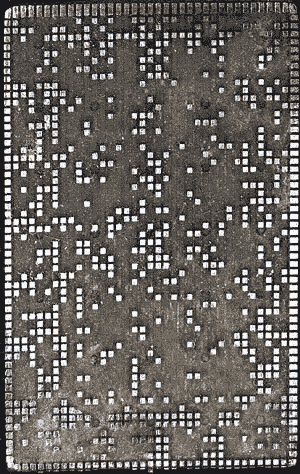

# 每建一个待办事项 app，就有一只小狗死掉。这里有一些更好的项目想法。

> 原文：<https://www.freecodecamp.org/news/every-time-you-build-a-to-do-list-app-a-puppy-dies-here-are-some-better-project-ideas-279d4055f77/>

这里有三个值得你花时间的链接:

1.  每建一个待办事项 app，就有一只小狗死掉。这里有一些更好的项目想法( [11 分钟阅读](http://bit.ly/2jqUDwr))
2.  过去 150 年绝对最糟糕的技术预测( [4 分钟阅读](http://bit.ly/2kcWodM))
3.  一位前火狐工程师解释了为什么你应该禁用所有的反病毒软件(除了微软的)

额外收获:一群复古计算爱好者仍在为 1981 年的 TI-99/4A 电脑制作图形。这是他们的大型演示( [8 分钟手表](http://bit.ly/2jObcyj))

### 想到这一天:

> "永远不要相信你不能扔出窗外的电脑."—史蒂夫·沃兹尼亚克

### 每日一图:

IBM 026 的代码牌。点击阅读更多关于这种古老的打孔卡技术[。](http://bit.ly/2jz5pM5)

编码快乐！

–昆西·拉森，自由代码营的老师