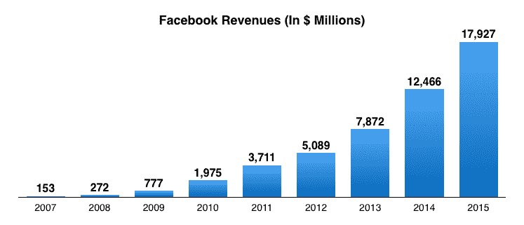
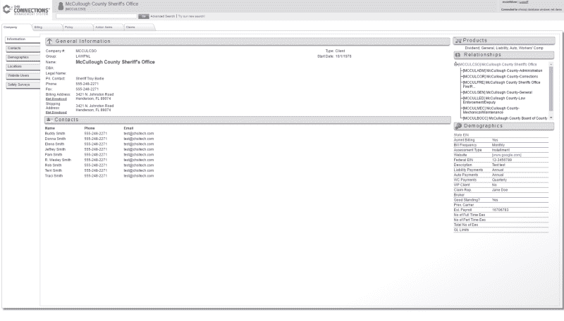
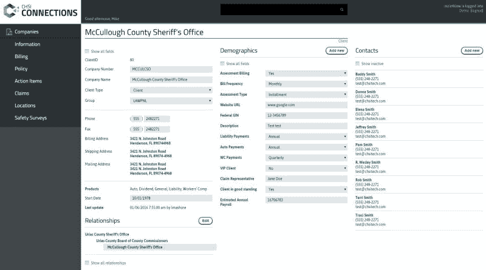
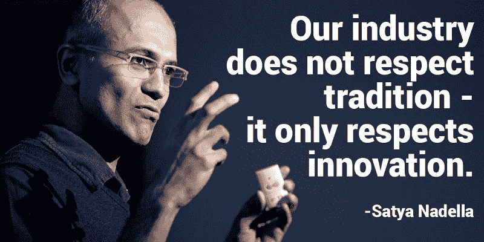

# 憎恨者将会憎恨:我们能从脸书 2006 年新闻反馈重新设计中学到什么

> 原文：<https://www.freecodecamp.org/news/everyone-hates-a-redesign-or-do-they-b8a2fec9efbe/>

作者:迈克·泽特洛

# 憎恨者将会憎恨:我们能从脸书 2006 年新闻反馈重新设计中学到什么

假设你是一名软件开发人员。你被安排到一个团队去重新设计你公司应用程序的一个核心特性。你花了几个月的时间收集用户数据，制作原型，和用户一起测试(他们喜欢这样！)，并构建应用程序。今天它将上线。

你的专题一上线，电话就开始响，电子邮件就开始涌入，你的首席执行官必须公开道歉。因为每个人都讨厌重新设计。

想象一下成千上万的人抗议这一变化。他们开始制作反你特色的网页。他们集体抵制你的产品。时代杂志写了一篇文章剖析你的失败。

It’s not this bad. Or maybe it is.

你可能会开始更新你的 LinkedIn 个人资料和简历(当然，忽略这次惨败)，期待着一旦首席执行官收拾完你的烂摊子，你就会被解雇。

现在假设每个人都错了。你已经做了调查。你已经和用户一起测试过了(他们很喜欢！).想象一下，当数十万人抗议时，其他人使用了重新设计的产品，利润飙升。想象一下你的重新设计真的永远改变了世界和人们的互动方式。

### 这是一个真实的故事

这是我最喜欢的设计故事——脸书新闻的故事。2006 年，当脸书推出其新闻订阅功能时，我住在一个大学城。我真的可以听到学生们在反抗。

> 在 24 小时内，全国成千上万的学生组织起来抗议这项新功能— [时间，2006 年 9 月 6 日](http://content.time.com/time/nation/article/0,8599,1532225,00.html)T3

人们对脸书很不满。似乎每个人都在权衡，100%的回应是否定的。

> “脸书世界最近的事件模式就像是马克·扎克伯格正在写一本关于如何毁掉社交网站的书。”—2006 年[博主的典型观点](https://blog.thebrickfactory.com/2006/09/how-to-sabotage-a-social-networking-site/)

当然，我们都知道这个故事十几年后的结局:

[Source](https://revenuesandprofits.com/facebook-revenues-profits-and-users-growth-analysis-2015/)

新闻订阅一直存在，迷你订阅成为时间轴，马克·扎克伯格成为世界第五大富豪，今天，人们认为 T2 甚至可以竞选美国总统。

“滚动浏览提要”现在是我们现代词汇和日常行为的一部分。脸书团队设计了一个非常有用、强大、令人上瘾的东西，几乎世界上的每个人都无法将目光从它身上移开。

现在，你肯定会在你的简历和 LinkedIn 上列出这些。

### 如果每个人都讨厌它，为什么它会赢？

不是每个人都讨厌它，只是听起来好像每个人都讨厌它。脸书推出新闻订阅时，拥有大约 1200 万用户。抗议团体(讽刺的是，在脸书)像反对脸书新闻的学生有超过 70 万成员。“这是一群愤怒的人，但与沉默的大多数人相比，这不足以成为问题，沉默的大多数人在看到新功能时会认为“嗯，这很棒”。

这就是二分法:自认为“哈，这很棒”的用户和走上街头的用户。那些心满意足地浏览新闻提要的人写不出很好的时代杂志文章。尽管他们占绝大多数。

凭借“事后诸葛亮”的眼光，我们可以回顾过去，并将大规模重新设计的成功归因于四个关键因素:

1.  支持数据
2.  该功能的喜欢/讨厌特性
3.  公司对用户的反应
4.  尊重创新

#### 支持数据

脸书原型化，测试，迭代，甚至和用户一起测试。测试用户喜欢它！看到它预发布的博客给了它一个“[大拇指](http://www.techcrunch.com/2006/09/05/new-facebook-redesign-more-than-just-aesthetics/)”数据压倒性地支持新闻订阅功能。

然而，当面对接二连三的抱怨时，很容易情绪化。你想采取行动来停止疼痛。

但如果你在早期就做了尽职调查，你实际上没什么好害怕的。暴风雨会过去的。好的数据不会说谎。

需要强有力的领导才能支持团队，经受住抱怨。很多 CEO 可能没有勇气告诉 70 万+的用户，“[冷静。深呼吸。我们听到了。](http://blog.facebook.com/blog.php?post=2208197130)

#### 公司对用户的反应

这是脸书做得好的下一件事。当抗议达到白热化时，马克·扎克伯格的回应很谦逊。他倾听抱怨。他让公司走上了未来更多考虑这些用户的道路。但是他没有退缩，没有改变，也没有做出愚蠢的妥协，比如让新功能可选。

他很有同情心，但很坚决。

我不得不承认，这个脸书新闻的故事最近一直在我的脑海中，因为我最近收到了大量愤怒的电子邮件，内容是关于我的团队刚刚在 CHSI 科技公司发布的一个功能——一个新的客户关系管理(CRM)界面。

Our old CRM vs. our new CRM

因为我们的用户群比脸书的小得多，所以我能够亲自与用户打交道。在发布的头几天，我给十几个不安的用户打了电话。

一开始我怀疑自己。然后我相信了数据。在电话中，我感同身受地听着用户解释他们为什么不喜欢这一变化。然后我又问为什么。然后我又问了一遍，直到我找到了他们需要的根源。

在每种情况下，他们所需要的都可以在重新设计的框架内完成。需要向一些人展示如何在他们的终端进行一些数据清理(更清晰的重新设计暴露了多年的数据缺陷)。其他人只需要做一些小的调整，就可以让它以最佳方式为他们的用例工作。

我表达了自己内心的扎克伯格:同情但坚决。

#### 该功能的喜欢/讨厌特性

假设你的用户群中大约有 6%的人公开抗议和抵制这个特性，剩下的 94%的人对此感到厌烦。你可能会遇到一些麻烦，抗议可能会胜出，尤其是如果你的公司对“看起来很糟糕”很敏感的话。但是如果喜欢它的人比讨厌它的人多——即使喜欢这个功能的人相对于反对者保持沉默——如果公司坚持到底，这个功能将会胜出。

再说一次，我最近才经历过。用户对我们重新设计的最初两条主动反馈:

> **“爱，爱，爱它！感谢您和您的团队为改进系统所做的一切工作。”**

和

> “我们一点也不喜欢它。请尽快把我们切换回旧屏幕。”

这两个回答看起来棒极了。第一，一点积极的强化让我更容易相信我们早期收集的数据。第二，我能够立即与不满意的用户通话，在解决他们的问题的同时进行“愉快的对话”(他们的原话)。在通话结束时，他们甚至主动提出加入我们的用户群，参加未来的原型测试会议！

当你的特性有爱它或恨它的性质时，只要“爱它”的数量高得多(即使它们大多是无声的)，你就赢了。

成千上万的投诉可能已经动摇了新闻提要设计团队。但是我确信团队中有人很快指出数百万人采用并享受这个特性。

#### 尊重创新

顾客对你大吼大叫或反对你的改变是令人痛苦的。你可能只是想停止痛苦，提供一条出路。

Mashable 首席执行官彼得·卡什莫尔[预测脸书将会让步](http://mashable.com/2006/09/06/the-facebook-backlash-begins/#B6CFpVB81Eqi):

> “坦率地说，唯一可能的结果是脸书将被迫提供一个“关闭开关”——大多数用户将选择退出该系统，使其变得不那么有用。脸书不太可能完全移除这一功能，但他们需要某种妥协来让用户满意。”

脸书有两个可怕的选择:

1.  恢复旧的设计，从头开始。
2.  更糟糕的选择是:两者兼而有之——“经典”加“现代”的设计。

选项 1 很可怕，因为这是纯粹的情绪反应，不尊重数据。

选项 2 更糟，因为公司没有做出产品决策。他们现在不得不维护两个代码库，这使他们的成本翻倍。不是 100%的团队提供更多令人惊奇的特性，而是 50%的团队将浪费在维护旧代码上，试图取悦 6%的用户群。

当卡什莫尔说，“[脸书应该简单地为功能](http://mashable.com/2006/09/08/facebook-gets-egg-on-its-face-changes-news-feed-feature/#ZETin4ZMOSqV)提供一个‘关闭’开关，”听起来他不是一个程序员或者没有太多的技术方面的东西。如果有哪怕一秒钟的考虑，像这样的建议就不应该出现。

因为传统或怀旧而保留遗留软件对公司来说是一场持续的战斗，因为他们想要迭代和重新设计更好的产品。

微软正在用微软的[画图](https://www.windowscentral.com/microsofts-paint-fiasco-struggle-windows)来经历这一过程。微软想弃用几十年的老产品，而代之以新产品。看起来天底下的每个用户都在与这种变化做斗争——但事实真的是这样吗？有没有沉默的大多数会喜欢使用现代应用程序？

许多人可能叫嚣着要旧的东西，但也许更多的人对更新、更好的做事方式感兴趣。

如果公司因为害怕用户反弹而耗尽开发资源维持旧的东西，创新型创业公司——不受这种担忧的困扰——可以突然闯入并扰乱市场。

[Microsoft CEO, Satya Nadella, 2014](https://news.microsoft.com/2014/02/04/satya-nadella-email-to-employees-on-first-day-as-ceo/#JLIxfmsqyH3Xo0GK.97)

### 似乎每个人都讨厌重新设计

但这可能只是少数人的声音。

我没有忽视不满意的用户的反馈。你当然需要考虑他们的想法，观察他们如何使用你的应用程序。但是你需要像对待最安静的用户一样对待最大声的用户。吱吱响的轮子**不应该**得到所有的油脂。

所以，当我收集了每一条关于我们重新设计的不请自来的负面反馈时，我也去了我的用户群并得到了他们的反馈。平等地权衡所有观点，很明显道路是向前的:坚定地，带着同理心，走向创新。

你喜欢你读的东西吗？如果是这样，请给我一些掌声，这样会有更多的人看到这个帖子。谢谢！