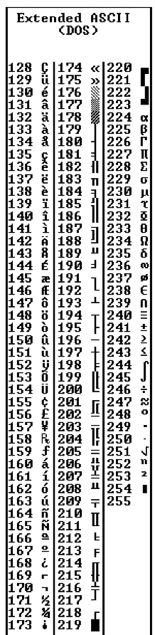
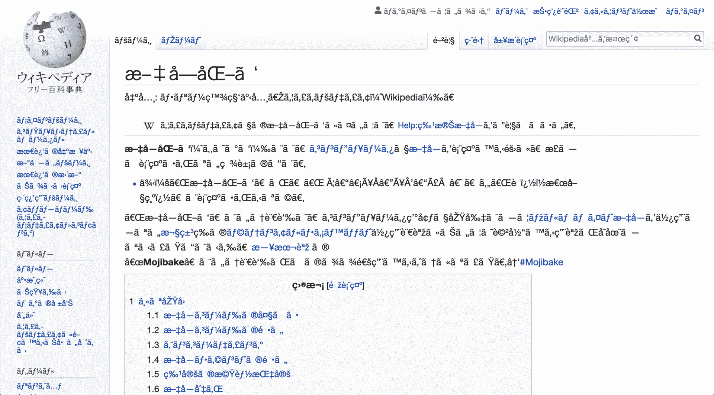
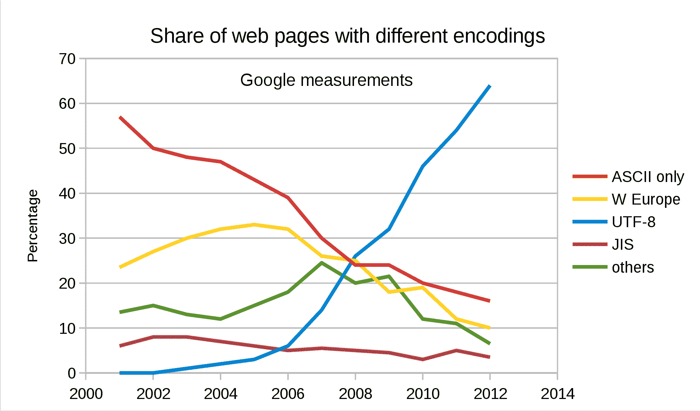
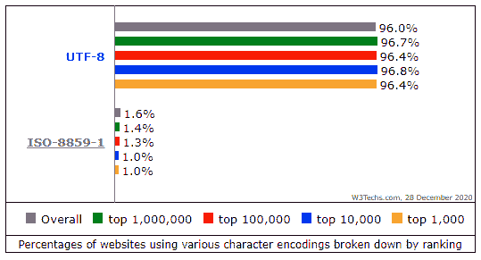
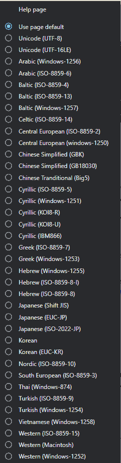

# Unicode 字符——每个开发人员都必须知道的编码知识

> 原文：<https://www.freecodecamp.org/news/everything-you-need-to-know-about-encoding/>

如果你正在编写一个使用多种语言的国际应用程序，你需要了解编码。或者你只是好奇单词是如何出现在你的屏幕上的——是的，那也是编码。

我将在本文中解释编码的简史(我将讨论标准化是多么的少)，然后我将谈论我们现在使用什么。我还会介绍一些你需要了解的计算机科学理论。

## 编码简介

计算机只能理解二进制。二进制是计算机的语言，由`0`和`1`组成，不允许有其他的。一位数称为一个`bit`，一个`byte`为 8 位。所以 8 个`0`或`1`组成一个`byte`。

一切最终都以二进制结束——编程语言、鼠标移动、打字和屏幕上的所有文字。

如果你正在阅读的所有文本也曾经是二进制的，那么我们如何将二进制转换成文本呢？让我们来看看开始时我们是怎么做的。

## 编码简史

在互联网的早期，只有英语。我们不需要担心任何其他字符，而**美国信息交换标准码** ( **ASCII** )就是适合这个目的的字符编码。

**ASCII** 是从二进制到字母数字字符的映射。所以当 PC 收到二进制时:

```
01001000 01100101 01101100 01101100 01101111 00100000 01110111 01101111 01110010 01101100 01100100
```

有了 ASCII 码，它可以把它翻译成“Hello world”。

一个字节(八位)足够容纳每个英文字符和一些控制字符。这些控制字符中的一些被用于称为电传打字机的仪器，所以在当时它们是有用的(现在没那么有用了！)

但控制字符是像 7 ( `111`二进制)这样的东西，它会在你的 PC 上发出铃声，8 ( `1000`二进制)会覆盖它刚刚打印的最后一个字符，或者 12 ( `1100`二进制)会清除视频终端上刚刚写的所有文本。

当时的计算机使用 8 位代表一个字节(他们并不总是这样)，所以没有问题。我们可以存储所有的控制字符，所有的数字，所有的英文字符，还有剩余！因为一个字节可以编码 255 个字符，而 ASCII 只需要 127 个字符。所以我们有 128 个编码没有被使用。

我们在这里看一个 ASCII 表，看看每个字符。所有小写和大写的 A-Z 和 0-9 都被编码成二进制数。记住前 32 个是不可打印的控制字符。

## ASCII 字符表


你能看出它是如何以 127 结尾的吗？我们在尽头有一些空余的房间。

# ASCII 的问题

备用字符从 127 到 255。人们开始思考怎样才能最好地填充那些剩余的字符。但是每个人对最终的角色都有不同的想法。

美国国家标准协会(**ANSI**-**-**不要与 **ASCII** 混淆)是一个标准团体，为许多不同领域建立标准。他们决定每个人都在用 0-127 做什么，这也是 **ASCII** 已经在做的事情。但是其他的都开着。

没有人争论 ASCII 编码中的 0-127 是什么。问题出在备用的**号**上。

下面是第一台 IBM 计算机对 ASCII 的 128-255 编码所做的事情。



Some squiggles, some background icons, math operators and some accented characters like é.

但其他计算机并不都遵循这一点。每个人都想为 ASCII 的结尾实现自己的编码。

ASCII 码的这些不同结尾被称为**代码页**。

### 什么是 ASCII 代码页？

这里有超过 465 个不同代码页的集合！你可以看到同一种语言有多个代码页**甚至** **。例如，希腊语和汉语都有多个代码页。**

那么我们究竟该如何标准化这一点呢？或者让它在不同的语言之间工作？同一种语言不同代码页之间？用非英语语言？

中文有超过 100，000 个不同的字符。我们连中文的备用字都不够，更别说同意最后的字应该是中文的了。这看起来不太好。

这个问题甚至有自己的术语: **Mojibake** 。

你有时可能会在解码文本时看到混乱的文本，但是使用了错误的解码。在日语里是**字符转换**的意思。



Example of completely garbled text (mojibake).

## 这听起来有点疯狂...

没错。我们将没有机会可靠地交换数据。

互联网只是世界各地计算机的巨大连接。想象一下，如果所有这些国家决定他们各自认为的标准应该是什么。如果希腊计算机只接受希腊语，而英国计算机只发送英语...？你只会对着一个空荡荡的洞穴大喊大叫。没有人会理解你。没人能破译这些废话。

ASCII 不适合在现实生活中使用。在一个全球化的互联网络中，我们必须不断发展，否则就永远要处理成百上千的代码页。

除非你喜欢尝试阅读这样的段落。 �֎֏0590֐��׀ׁׂ׃ׅׄ׆ׇ

## Unicode 出现了

Unicode 有时被称为[通用编码字符集](https://en.wikipedia.org/wiki/Universal_Coded_Character_Set) (UCS)，甚至 ISO/IEC 10646。但 Unicode 是它更常见的名字。

但是，这就是 Unicode 进入这个领域来帮助解决由**编码**和**代码页**引起的问题。

Unicode 由大量的**代码点**组成(将世界各地的大量字符映射到一个所有计算机都可以引用的键上。)一组**代码点**被称为**字符集** - ，这就是 Unicode。

我们可以把一些抽象的东西映射到我们想要引用的字母上。而且每个角色都这样！甚至[埃及象形文字](https://unicode.org/charts/PDF/U13000.pdf)。

有些人做了所有艰苦的工作，将每个字符(在所有语言中)映射到一个我们都可以访问的键。它们看起来像这样:

**《你好世界》**

###### U+0048:拉丁文大写字母 H
U+0065:拉丁文小写字母 E
U+006C:拉丁文小写字母 L
U+006C:拉丁文小写字母 L
U+006F:拉丁文小写字母 O
U+0020:空格【SP】
U+0057:拉丁文大写字母 W
U+006F:拉丁文小写字母 O
U+0072:拉丁文小写字母 R
U+006 f

U+让我们知道它是 Unicode 标准，数字是二进制 get 转换成数字的结果。它使用了十六进制的符号，这是表示二进制数的一种更简单的方式。不过，在这里你不必太担心十六进制。

这里有一个链接，你可以在文本框中键入任何你想要的内容，并查看 Unicode 字符编码。或者在这里查看所有 143859 个 Unicode 字符点[。还可以看到每个角色来自世界的哪个地方！](https://unicode-table.com/en/)

我只想说清楚。此时，我们有了一个映射到字符的**代码点**的大字典。一个真正大的**角色集**。仅此而已。

我们还需要添加最后一种成分。

## Unicode 转换协议(UTF)

UTF 是我们编码 Unicode 码位的一种方式。UTF 编码由 Unicode 标准定义，能够对我们需要的每一个 Unicode 码位进行编码。

但是有不同类型的 UTF 标准。它们根据用于编码一个**代码点**的字节数量而不同。这也取决于你使用的是 **UTF-8** (每个码位一个字节)、 **UTF-16** (每个码位两个字节)还是 **UTF-32** (每个码位四个字节)。

如果我们有这些不同的编码，我们如何知道一个文件将使用哪种编码？有一种东西叫做**字节顺序标记**(**BOM**)——有时也称为**编码签名**。 **BOM** 是文件开头的一个双字节标记，告诉文件使用什么编码。

**UTF-8** 是互联网上使用最多的，在 HTML5 中也被指定为新文档的首选编码，所以我将花最多的时间来解释这个。



You can see in the [diagram](https://en.wikipedia.org/wiki/UTF-8#/media/File:Utf8webgrowth.svg) even from 2012, UTF-8 was widely becoming the most used encoding. And for the web it still is.



W3 [diagram](https://w3techs.com/technologies/cross/character_encoding/ranking) to show how well used UTF-8 is used on a variety of websites.

## 什么是 UTF-8，它是如何工作的？

**UTF-8** 将 0-127 的所有 Unicode 码位编码在 1 个字节内(同 **ASCII** )。这意味着如果你使用 **ASCII** 编写程序，而你的用户使用 **UTF-8，**他们*不会注意到任何错误*。一切都会好的。

请记住这是一个多么强大的卖点。当 **UTF-8** 被每个人实现和使用时，我们需要保持 **ASCII** 向后兼容。它不会破坏当前正在使用的任何东西。

因为它叫做 **UTF-8** 、**、**记住那是最小位数(8 位是一个字节！)那一个**码点**将会是。还有其他存储在多个字节中的 Unicode 字符(根据字符的不同，最多 6 个字节)。这就是人们所说的编码叫做**变长**的意思。

可能更多，取决于语言。英语是 1 字节。[欧洲(拉丁语)、希伯来语和阿拉伯语](https://design215.com/toolbox/ascii-utf8.php)用 2 个字节表示。3 个字节用于[中文、日文、韩文和其他亚洲文字](https://design215.com/toolbox/utf8-3byte-characters.php) *。*你明白了。

当你需要一个字符跨越一个以上的字节时，你有一个位组合来标识一个延续符号，表示这个字符在接下来的几个字节中延续。所以对于英语，每个字符仍然只使用一个字节，但是如果你需要一个文档包含一些外国字符，你也可以这样做。

现在，奇妙的是，我们都同意什么是[苏美尔楔形文字](https://en.wikipedia.org/wiki/Cuneiform_(Unicode_block))编码(𒀵 𒁷𒂅 𒐤)，以及一些[表情符号的](https://unicode.org/emoji/charts/full-emoji-list.html)😉😉这样我们都可以交流了！

高层次的概述是:你首先阅读 **BOM** ，这样你就知道你的编码。您将文件解码成 Unicode **代码点**，然后将 Unicode 字符集中的字符表示成绘制到屏幕上的字符。

## 关于 UTF 的最后一句话

记住，编码是**键**。如果我发送了完全错误的编码，你就什么都看不到了。在接收或发送数据时要注意这一点。通常它被抽象在你日常使用的工具中，但是作为程序员，理解幕后发生的事情是很重要的。

那么，我们如何指定我们的编码呢？因为 HTML 是用英文写的，而且几乎所有的编码都可以很好的处理英文。我们可以将它嵌入到`<head>`部分的顶部。

```
<html lang="en">
<head>
  <meta charset="utf-8">
</head>
```

在`<head>`的最开始做这件事很重要，因为如果当前使用的编码是错误的，解析 [HTML 可能不得不重新开始](https://html.spec.whatwg.org/multipage/parsing.html#determining-the-character-encoding)。

我们还可以从 HTTP 请求/响应的 [Content-Type](https://developer.mozilla.org/en-US/docs/Web/HTTP/Headers/Content-Type) 头中获得编码。

如果一个 HTML 文档不包含编码标签， [HTML5 spec](https://html.spec.whatwg.org/multipage/parsing.html#determining-the-character-encoding) 有一些有趣的方法，它可以猜测名为 [**BOM 嗅探**](https://encoding.spec.whatwg.org/#bom-sniff) 的编码。这是它根据我们之前讨论的**字节顺序标记** ( **BOM** )猜测编码的地方。

## 就这样吗？

Unicode 还没有完成。像任何标准一样，我们对标准进行添加、删除和提出新的建议。没有一个规范被认为是“完整的”。

一般一年有 1 到 2 个发布，你可以在这里找到它们[。](https://unicode.org/history/publicationdates.html)

最近，我读到了一个非常有趣的关于 [Twitter 错误地呈现俄罗斯 Unicode 字符的 bug](https://twitter.com/availablegreen/status/1332774350613835779)。

如果你已经读到这里，那么恭喜你——有很多东西需要消化。

我会鼓励你做最后一项作业。

看看当编码错误时，网站有多糟糕。我使用了这个谷歌 Chrome 扩展，改变了我的编码，并尝试阅读网页。这个信息完全不清楚。试着阅读这篇文章。尝试浏览维基百科。自己看 **Mojibake** 。

这有助于了解编码到底有多重要。



## 结论

在我研究并试图简化这篇文章的过程中，我了解了迈克尔·艾弗森。自 1993 年以来，他已经提出了超过 200 个 Unicode 的变化，并为标准增加了数千个字符。截至 2003 年，他被认为是 Unicode 提案的主要贡献者。他是 Unicode 成为现在这个样子的一个重要原因。令人印象深刻，正如我们所知，他为互联网做出了巨大贡献。

我希望这已经很好地解释了为什么我们需要编码，编码解决了什么问题，以及当它出错时会发生什么。

如果你喜欢这篇文章并想看更多，我在 Twitter 上分享我的文章。