# 关于 Angular 中的 ng-template、ng-content、ng-container 和*ngTemplateOutlet，您需要了解的一切

> 原文：<https://www.freecodecamp.org/news/everything-you-need-to-know-about-ng-template-ng-content-ng-container-and-ngtemplateoutlet-4b7b51223691/>

那是我忙于为我的 office 项目开发新功能的一天。突然，有件事引起了我的注意:

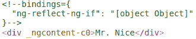

Final rendered DOM in Angular

在检查 DOM 时，我看到 Angular 将`ngcontent`应用到元素上。嗯……如果它们包含了最终 DOM 中的元素，那么`<ng-container>`有什么用？当时我搞不清`<ng-container>`和`<ng-content>`。

在寻找问题答案的过程中，我发现了`<ng-template>`的概念。出乎我意料的是，还有`*ngTemplateOutlet`。我开始我的旅程是为了弄清楚两个概念，但是现在我有了四个，听起来几乎一样！

你遇到过这种情况吗？如果是，那么你来对地方了。所以事不宜迟，让我们一个一个来。

### 1.<ng-template></ng-template>

顾名思义，`<ng-template>`是一个模板元素，Angular 将它与结构指令一起使用(`*ngIf`、`*ngFor`、`[ngSwitch]`和自定义指令)。

****这些模板元素只有在有**** *结构指令的情况下才起作用。* Angular 将主机元素(指令应用到的元素)包装在`<ng-template>`中，并通过用诊断注释替换它来使用完成的 DOM 中的`<ng-template>`。

考虑一个简单的`*ngIf`例子:

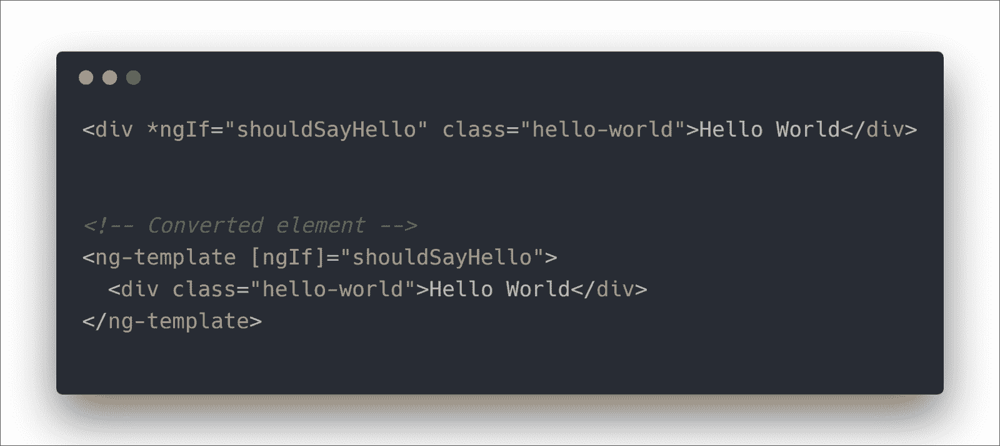

**Example 1**- Angular process of interpreting structural directives

上图是`*ngIf`的角度解读。Angular 将指令应用到的主机元素放在`<ng-template>`中，并保持主机不变。最终的 DOM 类似于我们在本文开头看到的:

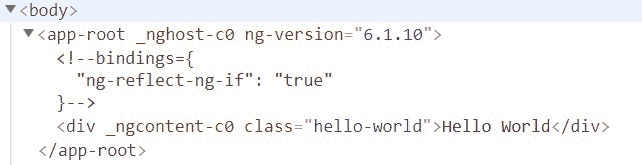

**Example 1**- Final rendered DOM

#### 用法:

我们已经看到了 Angular 是如何使用`<ng-template>`的，但是如果我们想要使用它呢？由于这些元素只与结构指令一起工作，我们可以写成:

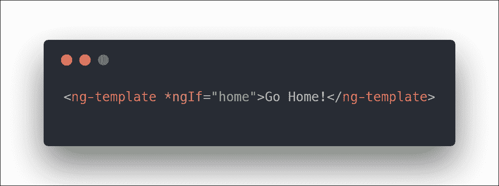

**Example 2**- Using <ng-template>

这里的`home`是设置为`true`值的组件的`boolean`属性。上面代码在 DOM 中的输出:

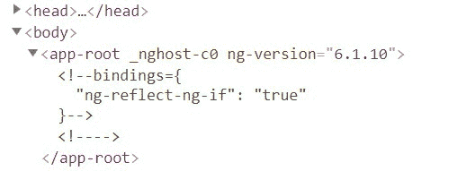

**Example 2**- Final rendered DOM

什么都没有渲染！:(

但是为什么我们在正确使用了结构指令的`<ng-template>`之后，仍然看不到我们的信息呢？

这是预期的结果。正如我们已经讨论过的，Angular 用诊断注释替换了`<ng-template>`。毫无疑问，上面的代码不会产生任何错误，因为 Angular 非常适合您的用例。你永远也不会知道幕后到底发生了什么。

让我们比较一下 Angular 渲染的上面两个 DOM:

**Example 1** vs **Example 2**

仔细看的话，在 ****例 2**** 的最后一个 DOM 中还有一个 ****额外的注释标签**** 。Angular 解释的代码是:

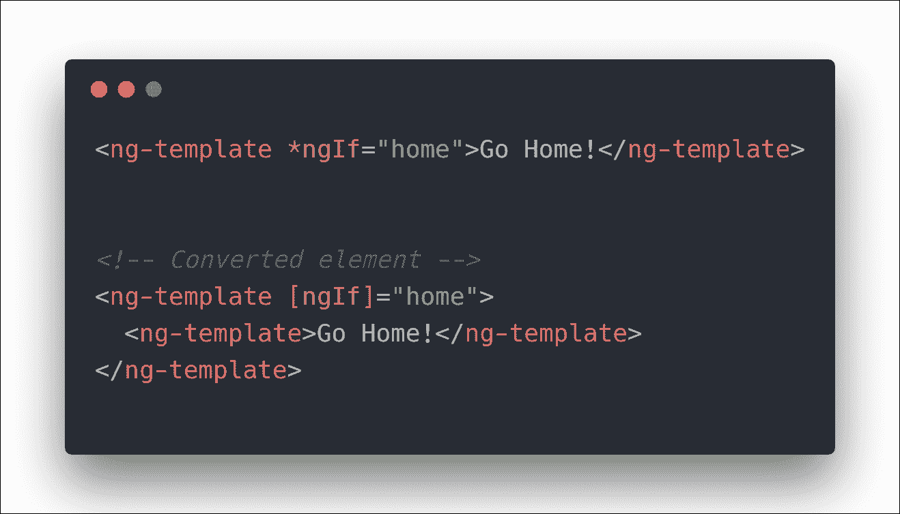

Angular interpretation process for **Example 2**

Angular 用另一个`<ng-template>`把你的主机`<ng-template>`包起来，不仅把外部的`<ng-template>`转换成诊断注释，还把内部的也转换成了诊断注释！这就是你看不到任何消息的原因。

要消除这种情况，有两种方法可以获得您想要的结果:

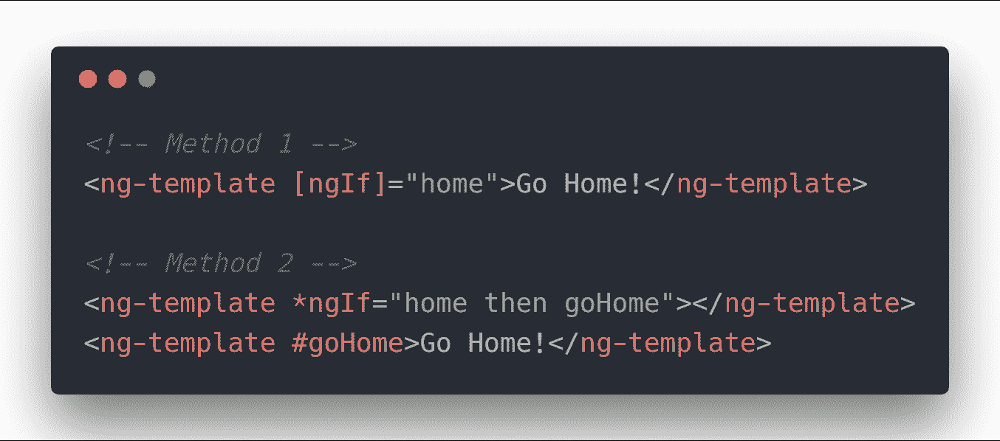

Correct usage of <ng-template>

#### 方法 1:

在这种方法中，您为 Angular 提供了不需要进一步处理的去糖格式。这一次 Angular 只将`<ng-template>`转换成注释，但不改变其中的内容(它们不再像以前那样在任何`<ng-template>`中)。因此，它将正确地呈现内容。

要了解更多关于如何将这种格式与其他结构指令一起使用的信息，请参考本文[的文章](https://www.concretepage.com/angular-2/angular-4-ng-template-example#ngSwitch)。

#### 方法二:

这是一种很少见的格式，很少使用(使用两个兄弟`<ng-template>`)。在这里，我们在`then`中给`*ngIf`一个模板引用，告诉它如果条件为真，应该使用哪个模板。

不建议像这样使用多个`<ng-template>`(你可以使用`<ng-container>`来代替)，因为这不是它们的本意。它们被用作可以在多个地方重用的模板的容器。我们将在本文的后面部分对此进行更多的讨论。

### 2.<ng-container></ng-container>

您是否曾经编写或看到过类似这样的代码:

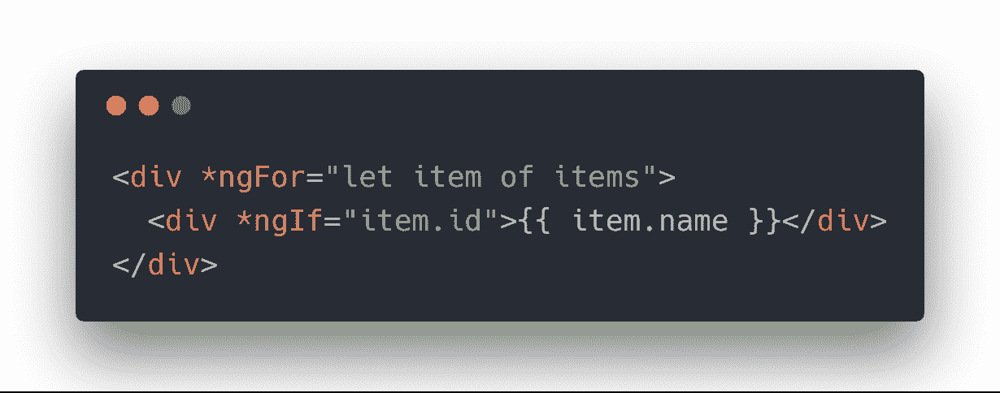

**Example 1**

我们许多人编写这段代码的原因是无法在 Angular 中的单个主机元素上使用多个结构指令。现在这段代码运行良好，但是如果`item.id`是一个可能不需要的假值，它会在 DOM 中引入几个额外的空值`
`。

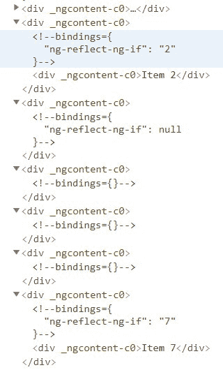

**Example 1**- Final rendered DOM

人们可能不关心这样一个简单的例子，但是对于一个具有复杂 DOM(显示成千上万的数据)的大型应用程序来说，这可能会变得很麻烦，因为元素可能会附带侦听器，这些侦听器仍然会在 DOM 中侦听事件。

更糟糕的是应用样式(CSS)所需要的嵌套级别！

Image from: [Inside Unbounce](https://inside.unbounce.com/product-dev/making-css-fit/)

别担心，我们会去营救的！

Angular `<ng-container>`是一个不影响样式或布局的分组元素，因为 Angular *没有把它放在 DOM* 中。

所以如果我们用`<ng-container>`写我们的 ****例 1**** :

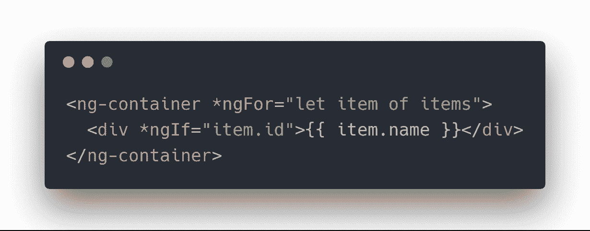

**Example 1** with <ng-container>

我们得到最终的 DOM 为:

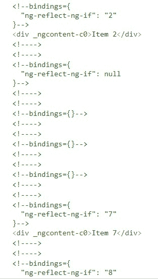

Final rendered DOM with <ng-container>

看，我们去掉了那些空的`
`。当我们只想应用多个结构指令而不在 DOM 中引入任何额外元素时，我们应该使用`<ng-container>`。

更多信息请参考[文档](https://angular.io/guide/structural-directives#group-sibling-elements-with-ng-container)。还有另一个用例，它用于将模板动态注入页面。我将在本文的最后一节讨论这个用例。

### 3.

它们用于创建可配置的组件。这意味着组件可以根据用户的需求进行配置。这就是众所周知的 ****内容投影**** 。在已发布的库中使用的组件利用`<ng-content>`使它们自己可配置。

考虑一个简单的`<project-content>`组件:

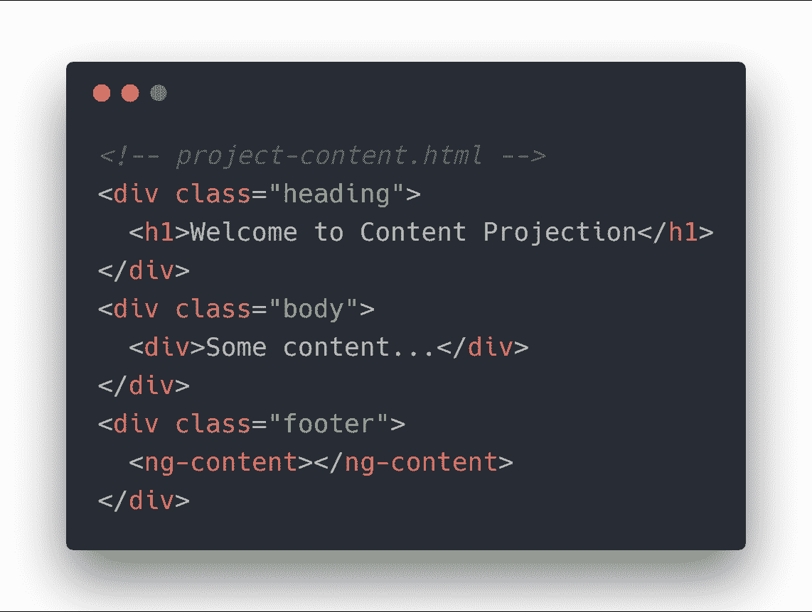

**Example 1**- <project-content> definition

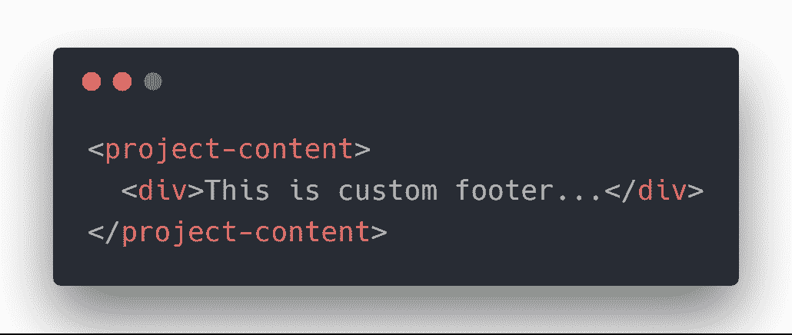

Content Projection with <project-content> component

在`<project-content>`组件的开始和结束标记内传递的 HTML 内容是要投影的内容。这就是我们所说的 ****内容投影**** 。内容将在组件内的`<ng-content>`中呈现。这使得`<project-content>`组件的消费者可以在组件中传递任何自定义页脚，并精确控制*组件的呈现方式。*

#### 多重投影:

如果您可以决定哪些内容应该放在哪里，会怎么样？您也可以使用`<ng-content>`的`select`属性来控制内容的投影方式，而不是将每个内容投影到一个`<ng-content>`中。需要一个元素选择器来决定在特定的`<ng-content>`中投影哪些内容。

方法如下:

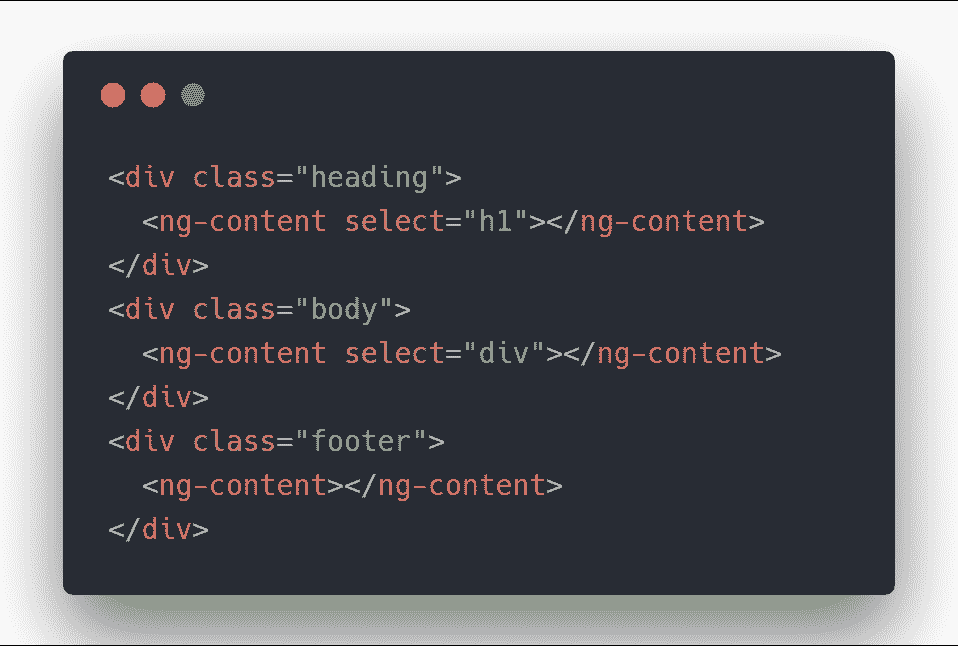

**Example 2**- Multi-content projection with updated <project-content>

我们修改了`<project-content>`定义，以执行多内容投影。属性选择将在特定的`<ng-content>`中呈现的内容类型。在这里，我们首先用`select`来呈现标题`h1`元素。如果投影内容没有`h1`元素，它将不会呈现任何内容。类似地，第二个`select`寻找一个`div`。剩下的内容在最后一个`<ng-content>`中呈现，没有`select`。

调用组件将看起来像:

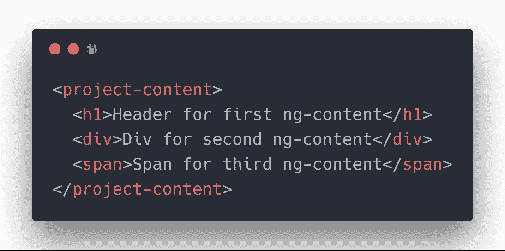

**Example 2**- Calling of <project-content> component in parent component

### 4.*ngTemplateOutlet

> **…它们被用作可以在多个地方重用的模板的容器。我们将在本文的后面部分对此进行更多的讨论。**
> 
> **……还有另一个用例，它用于将模板动态注入页面。我将在本文的最后一节讨论这个用例。**

这是我们将讨论前面提到的上述两点的部分。`*ngTemplateOutlet`用于两种情况——在视图的不同部分插入一个通用模板，而不考虑循环或条件，以及创建一个高度配置的组件。

#### 模板重用:

考虑一个视图，其中您必须在多个位置插入一个模板。例如，在网站中放置公司徽标。我们可以通过编写一次徽标模板并在视图中的任何地方重用它来实现这一点。

以下是代码片段:

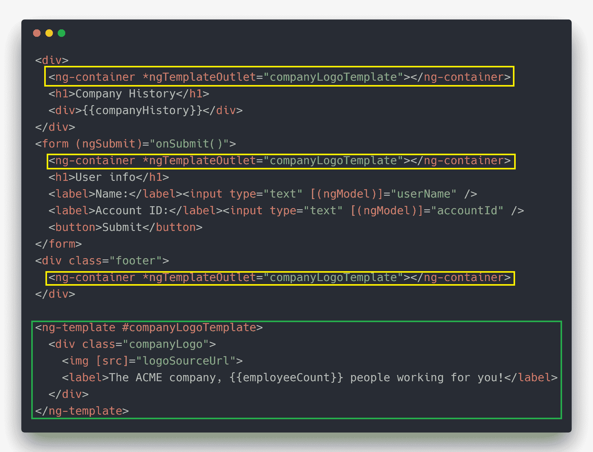

**Example 1**- Template reuse

正如你所看到的，我们只写了一次 logo 模板，在同一页上用了三次，只用了一行代码！

`*ngTemplateOutlet`还接受一个上下文对象，可以传递该对象来定制通用模板输出。有关上下文对象的更多信息，请参考官方[文档](https://angular.io/api/common/NgTemplateOutlet)。

#### 可定制的组件:

`*ngTemplateOutlet`的第二个用例是高度定制的组件。考虑我们之前的`<project-content>`组件示例，并做了一些修改:

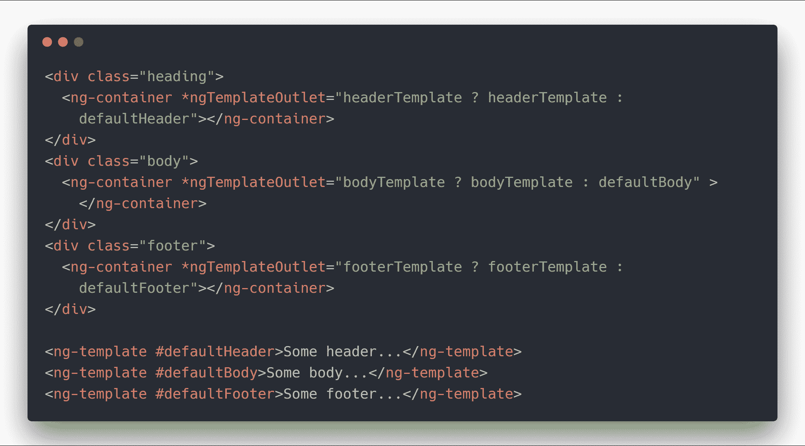

**Example 2**- Making customizable component, project-content.html

上面是`<project-content>`组件的修改版本，它接受三个输入属性— `headerTemplate`、`bodyTemplate`、`footerTemplate`。以下是`project-content.ts`的片段:

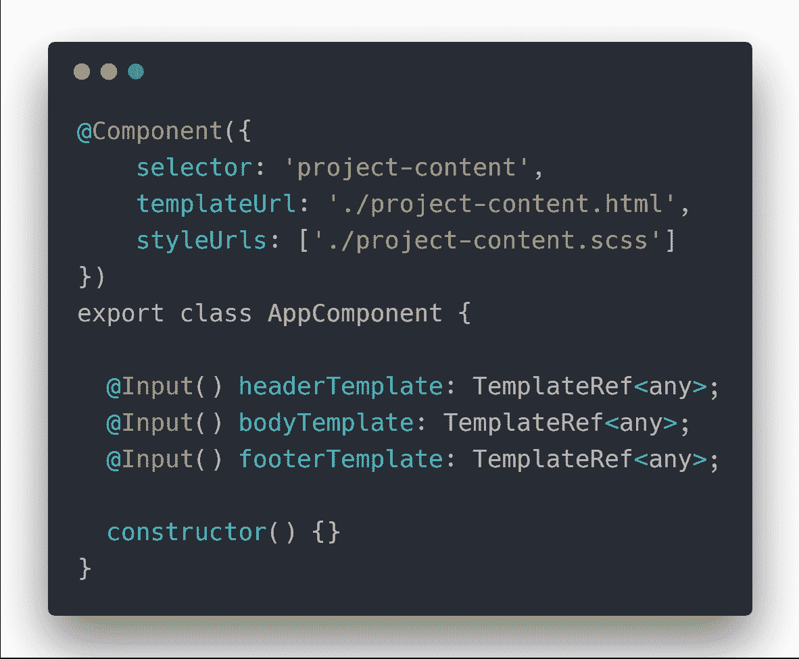

**Example 2**- Making customizable component, project-content.ts

我们在这里试图实现的是显示从`<project-content>`的父组件接收的页眉、正文和页脚。如果没有提供其中的任何一个，我们的组件将在它的位置显示默认模板。因此，创建了高度定制的组件。

要使用我们最近修改的组件:

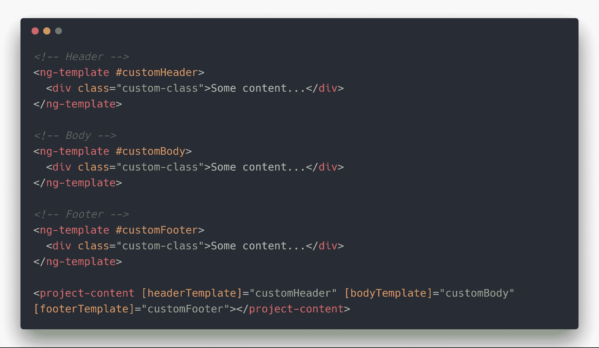

**Example 2**- Using newly modified component <project-content>

这就是我们如何将模板引用传递给我们的组件。如果其中任何一个没有通过，那么组件将呈现默认模板。

### ng-内容与*ngTemplateOutlet

它们都有助于我们实现高度定制的组件，但是选择哪一个以及何时选择呢？

可以清楚地看到，如果没有提供默认模板，`*ngTemplateOutlet`给了我们更多显示默认模板的能力。

而`ng-content`就不是这样了。它按原样呈现内容。在`select`属性的帮助下，你最多可以分割内容并在视图的不同位置呈现它们。您不能在`ng-content`内有条件地呈现内容。你必须展示从父母那里收到的内容，却无法根据这些内容做出决定。

然而，在这两者之间进行选择完全取决于您的用例。至少现在我们的武器库中有了一个新武器`*ngTemplateOutlet`，除了`ng-content`的特性之外，它还提供了对内容的更多控制！