# 掌握卷积神经网络需要知道的一切

> 原文：<https://www.freecodecamp.org/news/everything-you-need-to-know-to-master-convolutional-neural-networks-ef98ca3c7655/>

作者:Tirmidzi Faizal Aflahi

看下面的照片:

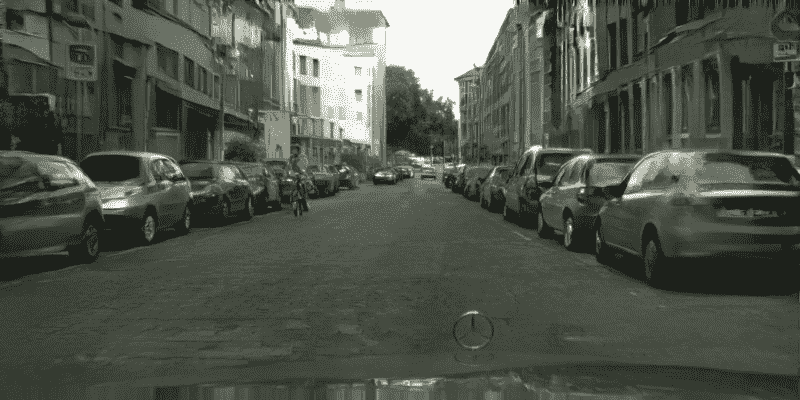

Courtesy of [Pix2PixHD](https://github.com/NVIDIA/pix2pixHD)

那不是一张真实的照片。您可以在新标签中打开图像并放大图像。你看到马赛克了吗？

图片其实是由一个叫人工智能的程序生成的。感觉不现实吗？很棒，不是吗？

自从 Alex Krizhevsky 和他的朋友通过 ImageNet 竞赛将这项技术公之于众以来，仅仅过去了 7 年。这项比赛是一年一度的计算机视觉比赛，将图片分为 1000 个不同的类别。从阿拉斯加雪橇犬到卫生纸。亚历克斯和朋友们建立了一个叫 AlexNet 的东西，它以与第二名之间的巨大差距赢得了比赛。

这项技术被称为**卷积神经网络**。它是深度神经网络的一个分支，在处理图像方面表现得非常好。


Courtesy of ImageNet

上图是几年前赢得比赛的软件产生的错误率。2016 年，**其实比人类表现**好 5%左右。

将深度学习引入这个领域实际上是*打破游戏*多于改变游戏。

### 卷积神经网络体系结构

那么，这项技术是如何工作的呢？

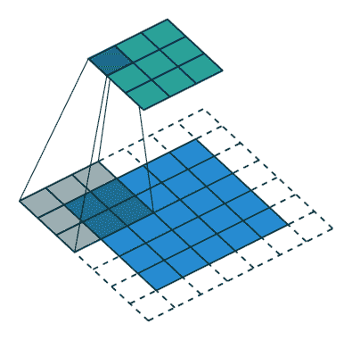

卷积神经网络由于其独特的过程而比其他深度神经网络架构表现更好。CNN 不是一次看一个像素，而是将几个像素组合在一起(如上图所示的一个 3×3 像素的例子)，这样他们就可以理解时间模式。

另一方面，CNN 可以“看到”形成直线或曲线的像素组。由于深度神经网络的深层性质，在下一个级别中，他们将看到的不是像素组，而是形成一些形状的线条和曲线组。如此等等，直到它们形成完整的画面。


Deep Convolutional Neural Network by [Mynepalli](https://www.researchgate.net/figure/Learning-hierarchy-of-visual-features-in-CNN-architecture_fig1_281607765)

如果你想了解 CNN，你需要学习很多东西，从最基本的东西开始，像内核、池层等等。但是现在，你可以直接使用这项技术的许多开源项目。

这实际上是真的，因为有一种叫做**迁移学习**的技术。

### 迁移学习

迁移学习是一种在另一个更具体的任务中重用已完成的深度学习模型的技术。

例如，假设您在一家火车管理公司工作，想要评估您的火车是否准时。并且您不想仅仅为了这项任务而增加另一个劳动力。

**您可以重复使用 ImageNet 卷积神经网络模型，可能是 ResNet(2015 年的获胜者),并使用您的火车车队的图像重新训练网络。你会做得很好的。**

使用迁移学习有两个主要的竞争优势。

1.  **比从头开始训练需要更少的图像就能表现良好**。ImageNet competition 有大约 100 万张图像用于训练。使用迁移学习，你可以只用 1000 张甚至 100 张图片就能表现很好，因为它已经用那 100 万张图片训练好了。
2.  **需要更少的时间来实现良好的性能**。要想像 ImageNet 一样好，你需要花几天时间来训练网络，而且这还不包括在网络运行不良的情况下改变网络所需的时间。使用迁移学习，你只需要几个小时甚至几分钟就可以完成一些任务的训练。节省了大量时间。

### 图像分类到图像生成

借助迁移学习，出现了许多创新。如果你能处理一些图像，并告诉我们这些图像是关于什么的，那么如何构建图像本身呢？

接受挑战！

**生成对抗网络**登场。

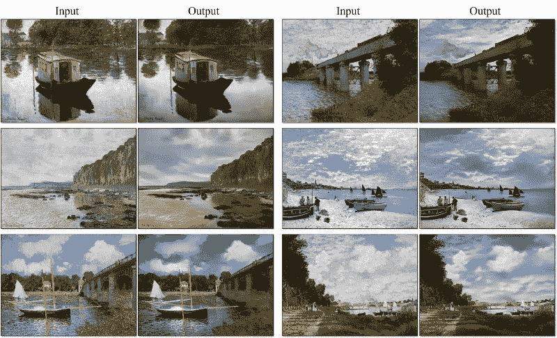

CycleGAN by [Jun-Yan Zhu](https://github.com/junyanz/pytorch-CycleGAN-and-pix2pix)

这项技术可以使用一些输入生成图片。

给定一幅名为 CycleGAN 的画，它可以生成一张逼真的照片，我在上面的照片中给了你。在另一个用例中，给定一些草图，它也可以生成一个包的图片。它甚至可以在给定低分辨率照片的情况下生成更高分辨率的照片。

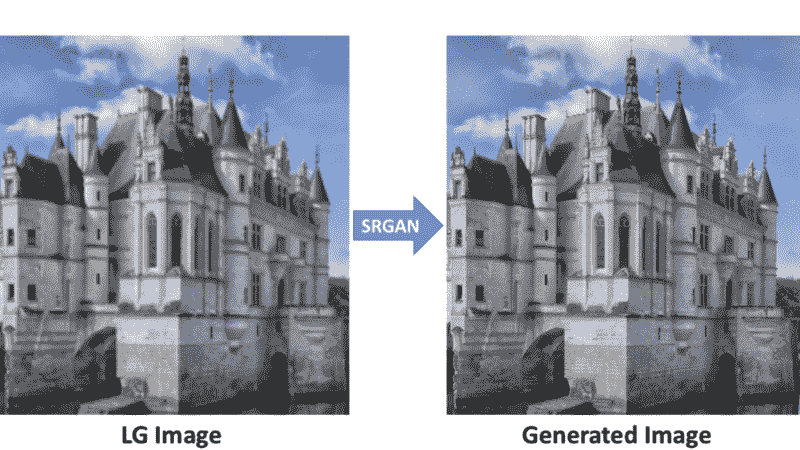

[Super Resolution Generative Adversarial Network](https://github.com/tensorlayer/srgan)

很神奇，不是吗？

当然了。您现在就可以开始学习构建它们。但是怎么做呢？

### 卷积神经网络教程

那么，我们开始吧。你会发现开始这个话题很简单，非常简单。但掌握它是另一个层面。

我们暂且把掌握它放在一边。

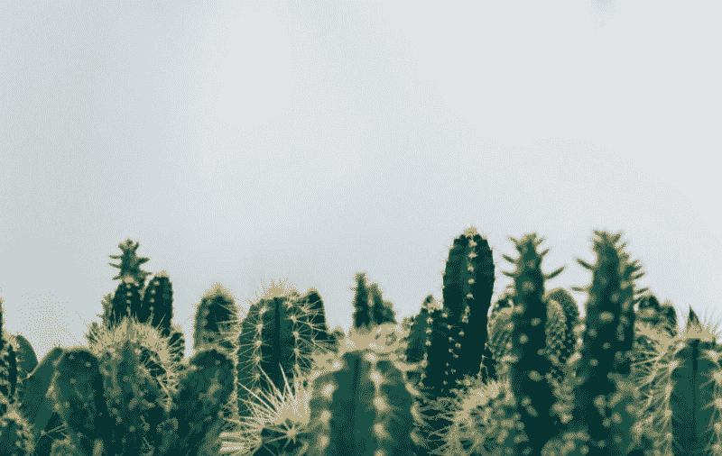

Photo by [Thomas Verbruggen](https://unsplash.com/photos/5A06OWU6Wuc?utm_source=unsplash&utm_medium=referral&utm_content=creditCopyText) on [Unsplash](https://unsplash.com/search/photos/columnar-cactus?utm_source=unsplash&utm_medium=referral&utm_content=creditCopyText)

浏览了几天，发现这个项目真的很适合你入手。

### [空中仙人掌识别](https://www.kaggle.com/c/aerial-cactus-identification)

这是来自 [Kaggle](https://www.kaggle.com/) 的一个辅导项目。你的任务是识别航拍图像中是否有柱状仙人掌

很简单，是吧？

您将获得 17，500 张图片，需要标记 4000 张尚未标记的图片。如果你的程序正确标记了所有的 4000 张图片，你的分数是 1 或 100%。

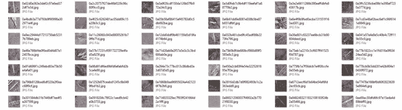

Cactus

这些图像非常像你在上面看到的。一张可能包含也可能不包含一组柱状仙人掌的区域照片。照片是 32×32 像素。它显示了不同方向的仙人掌，因为它们是航空照片。

那你需要什么？

### 用 Python 实现卷积神经网络

是的，Python，深度学习的流行语言。有了许多选择，你几乎可以对每个选择进行反复试验。选项包括:

1.  **Tensorflow** ，最受欢迎的深度学习库。由谷歌的工程师创建，拥有最大的贡献者基础和最多的粉丝。因为社区这么大，你很容易就能找到你问题的解决方案。它有 **Keras** 作为高级抽象包装器，这对新手来说非常有利。
2.  **Pytorch** 。我最喜欢的深度学习库。完全基于 Python 构建，并遵循 Python 的优缺点。Python 开发人员将会非常熟悉这个库。它有另一个名为 **FastAI** 的库，给出了 Keras 对 Tensorflow 的抽象。
3.  **MXNet** 。Apache 的深度学习库。
4.  **Theano** 。张量流的前身
5.  **CNTK** 。微软也有自己的深度学习库。

对于本教程，让我们使用我最喜欢的 Pytorch，并辅以它的抽象 FastAI。

开始之前，需要安装 Python。去 [Python 网站](https://www.python.org/downloads/)下载你需要的。你需要确保你安装了**版本 3.6+** ，否则你将使用的库可能不支持它。

现在，打开你的命令行或终端，安装这些东西

```
pip install numpy pip install pandas pip install jupyter
```

**Numpy** 将用于存储输入的图像。和**熊猫**处理 CSV 文件。Jupyter notebook 是你用 Python 交互式编码所需要的。

然后，去 [Pytorch 网站](https://pytorch.org/)下载你需要的。你可能需要 CUDA 版本来加快你的训练速度。但是要确保 Pytorch 的版本是 1.0+。

之后，安装 torchvision 和 FastAI:

```
pip install torchvision pip install fastai
```

用命令 **jupyter notebook** 运行 Jupyter，它将打开一个浏览器窗口。

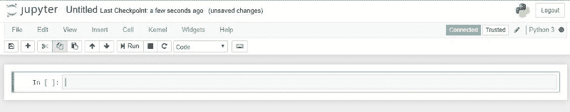

现在，你已经准备好了。

### 准备数据

导入必要的代码:

```
import numpy as npimport pandas as pd from pathlib import Path from fastai import * from fastai.vision import * import torch %matplotlib inline
```

你想做的任何事情，都需要 Numpy 和熊猫。FastAI 和 Torch 是你的深度学习库。Matplotlib Inline 将用于显示图表。

现在，从[比赛网站下载数据文件。](https://www.kaggle.com/c/aerial-cactus-identification/data)

提取 zip 数据文件，并将它们放入 jupyter 笔记本文件夹中。

假设你把你的笔记本命名为仙人掌。您的文件夹结构如下所示:

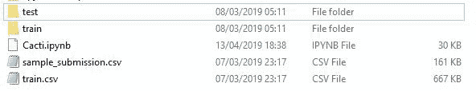

**训练文件夹**包含您训练步骤的所有图像。

**测试文件夹**包含所有提交的图像。

**Train CSV** 文件包含训练数据；用 has_cactus 列映射图像名称，如果它有 cactus，则给出值 1，否则给出值 0。

**示例提交 CSV** 文件包含您需要提交的所有格式。这里所述的文件名等同于测试文件夹中的所有文件。

```
train_df = pd.read_csv("train.csv")
```

将训练 CSV 文件加载到数据框中。

```
data_folder = Path(".") train_images = ImageList.from_df(train_df, path=data_folder, folder='train')
```

使用 **ImageList from_df** 方法创建一个负载生成器，将 train_df 数据帧与 train 文件夹中的图像进行映射。

### 数据扩充

这是一种从现有数据中创造更多数据的技术。猫的形象垂直翻转还是猫。通过这样做，你基本上可以将你的数据集翻倍，4 倍，甚至 16 倍。

如果您碰巧只有很少的数据要处理，那么您将非常需要这项技术。

```
transformations = get_transforms(do_flip=True, flip_vert=True, max_rotate=10.0, max_zoom=1.1, max_lighting=0.2, max_warp=0.2, p_affine=0.75, p_lighting=0.75)
```

FastAI 为您提供了一个很好的转换方法来完成所有这些，称为 **get_transform** 。您可以垂直、水平翻转、旋转、缩放、添加照明/亮度以及扭曲图像。

你可以试试我上面提到的参数，看看它会是什么样子。或者你可以[打开文档](https://docs.fast.ai/vision.transform.html)详细阅读。

当然，将转换应用到您的图像列表:

```
train_img = train_img.transform(transformations, size=128)
```

参数大小将用于放大或缩小输入，以匹配您将使用的神经网络。我将使用的网络名为 **DenseNet** ，它在 ImageNet 2017 上获得了最佳论文奖，它需要 128×128 像素大小的图像。

### 培训准备

加载完数据后，你需要让自己和你的数据为深度学习中最重要的阶段做好准备，这个阶段叫做训练。**基本上这就是深度学习中的学习**。它从您的数据中学习，并相应地更新自己，以便对您的数据有良好的性能。

```
test_df = pd.read_csv("sample_submission.csv") test_img = ImageList.from_df(test_df, path=data_folder, folder='test')
```

```
train_img = train_img           .split_by_rand_pct(0.01)           .label_from_df()           .add_test(test_img)           .databunch(path='.', bs=64, device=torch.device('cuda:0'))                       .normalize(imagenet_stats)
```

对于训练步骤，您需要将一些训练数据分割成一小部分，称为**验证数据**。你不能碰这些数据，因为它们会成为你的验证工具。**当您的卷积神经网络在验证数据上表现良好时，它也可能在将要提交的测试数据上表现良好**。

FastAI 有一个叫做 **split_by_rand_pct** 的便捷方法，可以将一部分数据分割成验证数据。

它还有方法 **databunch** 来执行批处理。我使用 64 作为批次，因为这是我的 GPU 的限制。如果没有 GPU，发出**设备**参数。

然后，调用 **normalize** 方法来归一化您的图像，因为您将使用预先训练好的网络。 **imagenet_stats** 将根据预训练网络如何为 imagenet 比赛进行训练来标准化图像。

将测试数据添加到训练图像列表使得稍后预测变得容易，而无需更多的预处理。请记住，这些图像不会被训练，也不会去验证。您只是想用与训练图像相同的方式预处理数据。

```
learn = cnn_learner(train_img, models.densenet161, metrics=[error_rate, accuracy])
```

您已经完成了培训数据的准备工作。现在，用 **cnn_learner** 创建一个训练方法。正如我之前所说，我将使用 DenseNet 作为预训练网络。你可以使用[火炬接力](https://pytorch.org/docs/stable/torchvision/models.html)提供的另一个网络。

### 单循环技术

你现在就可以开始训练了。但是，当训练任何深度神经网络，包括卷积神经网络时，总是存在混乱。也就是**选择合适的学习速率**。该算法被称为梯度下降，它将试图减少由一个称为学习率的参数定义的误差。

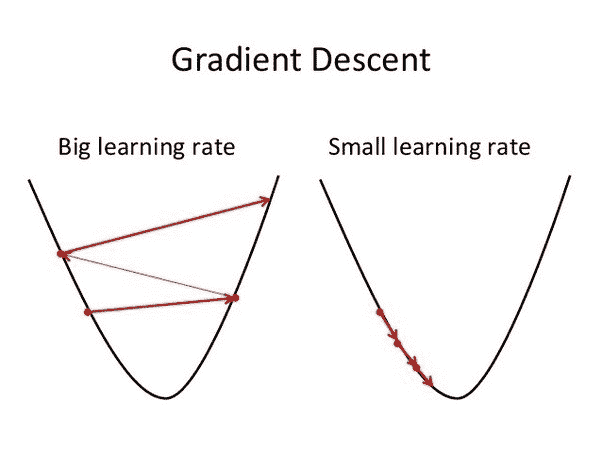

**较大的学习率使训练步骤更快**，但容易越界。这就使得错误有可能像上图这样失控。虽然**较小的学习率使得** **的训练步骤较慢，**但也不会失控。

所以，选择合适的学习速度真的很重要。在不失控的情况下把它做得足够大。

说起来容易做起来难。

于是，一个叫莱斯利·史密斯的人创造了一种叫做[单周期策略](https://sgugger.github.io/the-1cycle-policy.html)的技术。

凭直觉，你可能想找到几个学习率，然后**找到一个误差几乎最小但有改进空间的学习率**。让我们在代码中尝试一下。

```
learn.lr_find() learn.recorder.plot()
```

它会打印出这样的内容:

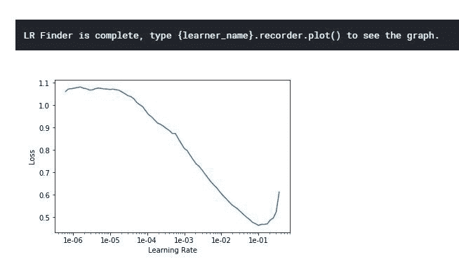

最小值应为 10 ⁻。所以，我认为我们可以用比它小的东西，但不要太小。也许 3 * 10 的⁻是个不错的选择。我们试试吧！

```
lr = 3e-02 learn.fit_one_cycle(5, slice(lr))
```

训练几个步骤(我选 5，不要太大也不要太小)，看看结果。

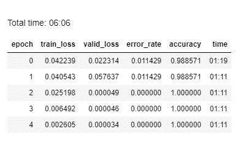

**等等，什么！？**

我们简单的解决方案为我们的验证分割提供了 100%的准确性！其实是有效的。而且只需要六分钟训练。多么幸运啊！在现实生活中，你会做几次迭代，只是为了找出哪些算法比其他算法做得更好。

我渴望提交！哈哈。**让我们预测测试文件夹并提交结果。**

```
preds,_ = learn.get_preds(ds_type=DatasetType.Test) test_df.has_cactus = preds.numpy()[:, 0]
```

因为您已经将测试图像放在训练图像列表中，所以您不需要预处理和加载您的测试图像。

```
test_df.to_csv('submission.csv', index=False)
```

这一行将创建一个包含图像名称的 CSV 文件，并为所有 4，000 个测试图像创建一个 cactus 列。

当我试图提交时，我实际上刚刚意识到你需要通过 Kaggle 内核提交 CSV。我错过了。

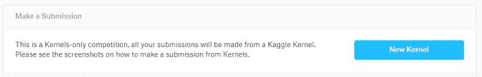

Courtesy of [Kaggle](https://www.kaggle.com/)

但是，幸运的是，**内核实际上和你的 jupyter 笔记本**一样。你可以复制粘贴你在笔记本上建立的所有东西，然后提交到那里。

然后**嘭**！


上帝啊！我的公开分数是 0.9999。那真的很好。但是，当然，我想得到一个完美的分数，如果我的第一次尝试是这样的。

所以，我在网络上做了一些调整，然后又一次，砰！

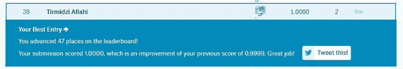

我做到了！你也可以。其实也没那么难。

(顺便说一句，这个排名是在 4 月 13 日获得的，所以我现在可能会放弃我的排名……)

### 我学到了什么

这个问题很简单。所以，你在解决它的时候不会面临任何奇怪的挑战。这使得它成为最适合开始的项目之一。

唉，因为许多人在这方面得到了满分，我认为管理员需要创建另一个测试集来提交。也许更难。

不管是什么原因，你尝试这个都没有障碍。你现在就可以尝试一下，效果会很好。


Photo by [Mario Mrad](https://unsplash.com/photos/rGG-BCtNiuo?utm_source=unsplash&utm_medium=referral&utm_content=creditCopyText) on [Unsplash](https://unsplash.com/search/photos/vision?utm_source=unsplash&utm_medium=referral&utm_content=creditCopyText)

### 最后的想法

卷积神经网络对各种任务非常有用。从图像识别到生成图像。现在分析图像不像以前那么难了。当然，如果你尝试，你也可以做到。

刚入门，挑一个好的卷积神经网络项目，得到好的数据。

祝你好运！

*这篇文章最初发表在我的博客上，时间是[，数据显示为](https://thedatamage.com/convolutional-neural-network-explained/)。*