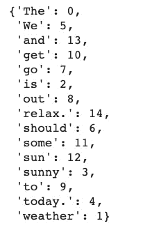
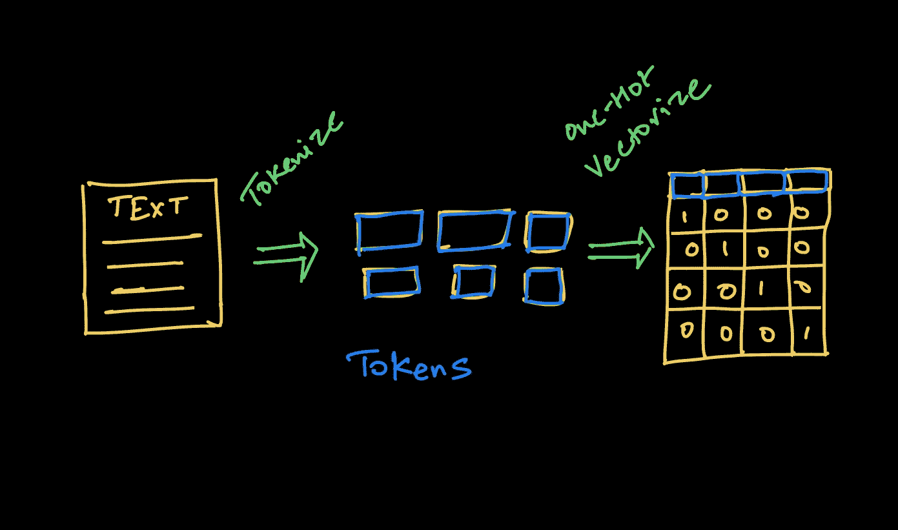
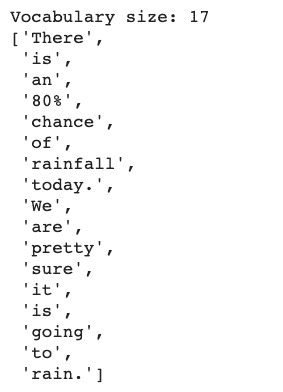
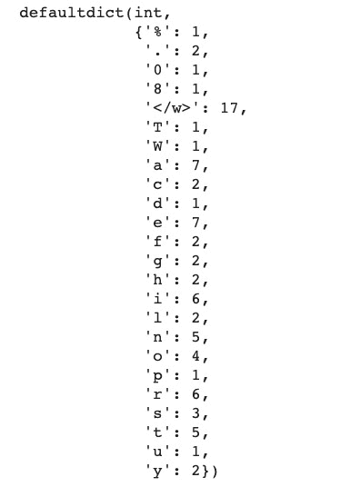
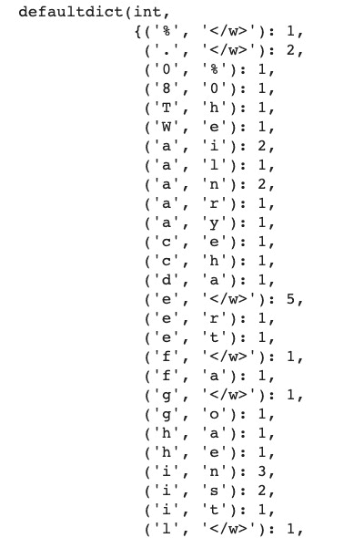
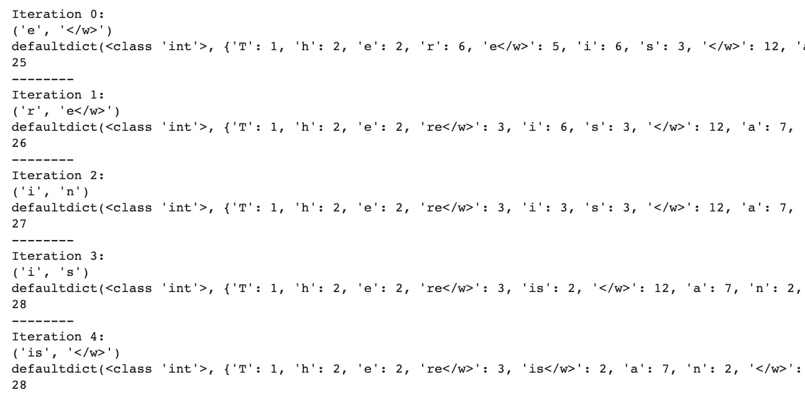

# NLP 中标记化——字节对编码的演变

> 原文：<https://www.freecodecamp.org/news/evolution-of-tokenization/>

自然语言处理对于人工智能游戏来说可能有点晚，但是像 Google 和 OpenAI 这样的公司正在用 NLP 技术创造奇迹。

这些公司已经发布了最先进的语言模型，如伯特和 GPT-2 和 GPT-3。GitHub Copilot 和 OpenAI codex 是最近新闻报道的一些热门应用程序。

作为一个对 NLP 了解非常有限的人，我决定把它作为一个研究领域，这样我可以对它了解得更多。我接下来的几篇文章和视频将重点分享我在剖析 NLP 的一些重要组件后所学到的东西。

### NLP 的主要组件

NLP 系统有三个主要组件来帮助机器理解自然语言:

1.  标记化
2.  把...嵌入
3.  模型架构

像伯特、GPT-2 和 GPT-3 这样的顶级深度学习模型都共享相同的组件，但具有不同的架构，从而将一个模型与另一个模型区分开来。

在这篇文章中(以及与之配套的[笔记本](https://colab.research.google.com/drive/1QLlQx_EjlZzBPsuj_ClrEDC0l8G-JuTn?usp=sharing)，我们将重点关注 NLP 管道的第一个组件的基础知识，即**令牌化**。这是一个经常被忽视的概念，但它本身就是一个研究领域。

我们已经远离了传统的 NLTK 标记化过程。虽然我们有最先进的标记化算法，但理解它的演变以及我们如何走到现在这一步始终是一个很好的实践。

所以，这是我们要讲的内容:

*   什么是标记化？
*   为什么我们需要一个记号赋予器？
*   标记化的类型——单词、字符和子单词。
*   字节对编码算法——这是目前大多数 NLP 模型使用的一个版本。

本教程的下一部分将深入探讨更高级(或增强版本的字节对编码)的算法:

*   **单字算法**
*   **工件–伯特变压器**
*   **例句–端到端令牌化系统**

## 什么是标记化？

记号化是以称为记号的较小单元来表示原始文本的过程。然后，可以将这些标记与数字进行映射，以进一步提供给 NLP 模型。

下面是一个过于简化的例子，说明了记号赋予器的功能:

```
## read the text and enumerate the tokens in the text
text = open('example.txt', 'r').read(). # read a text file

words = text.split(" ") # split the text on spaces

tokens = {v: k for k, v in enumerate(words)} # generate a word to index mapping
```



这里，我们简单地将文本中的每个单词映射到一个数字索引。当然，这是一个非常简单的例子，我们没有考虑语法、标点符号或复合词(如 test、test-ify、test-ing 等)。

因此，我们在这里的工作需要一个更技术性、更准确的标记化定义。为了考虑到所有的标点符号和每个相关的单词，我们需要从字符层面开始工作。

标记化有多种应用。其中一个用例来自编译器设计，您可能需要解析计算机程序，将原始字符转换为编程语言的关键字。

**在深度学习中，**记号化(tokenization)是将字符序列转换成记号序列的过程，记号序列需要进一步转换成可以被神经网络处理的数值向量序列。

## 为什么我们需要一个记号赋予器？

对记号赋予器的需求来自于“我们如何让机器阅读？”

处理文本数据的一种常见方式是在字典中定义一组规则，然后查找固定的规则字典。但这种方法只能到此为止，我们希望机器从它读取的文本中学习这些规则。

现在，机器不知道任何语言，也不理解声音或语音。他们需要从头开始学习，这样他们就可以阅读任何语言。

很艰巨的任务，对吧？

人类通过把声音和意义联系起来来学习语言，然后我们学习用那种语言读和写。机器做不到这一点，所以需要给它们最基本的文本单元，让它们开始处理文本。

这就是标记化发挥作用的地方。它将文本分解成更小的单元，称为“记号”。

有不同的方法来标记文本，这就是我们现在要学习的。

## 标记文本的不同方法

为了使深度学习模型从文本中学习，我们需要一个两步过程:



1.  令牌化–决定我们将用来生成令牌的算法。
2.  将记号编码成向量

## 基于单词的标记化

正如第一步所建议的，我们需要决定如何将文本转换成小的标记。我们大多数人建议的一个简单直接的方法是使用基于单词的标记，通过空格分割文本。

### 单词标记器的问题

训练数据中有很高的漏词风险。使用单词标记，您的模型将无法识别不属于模型训练数据的单词变体。

因此，如果您的模型在训练数据中看到了`foot`和`ball`，但最终文本有`football`，则模型将无法识别该单词，它将被视为一个`<UNK>`标记。

同样，标点符号也带来了另一个问题。例如，`let`或`let's`将需要单独的令牌，这是一个低效的解决方案。这将**需要大量的词汇**来确保你已经考虑到了这个词的每一个变体。

即使您添加了一个 **lemmatizer** 来解决这个问题，您也在您的处理管道中添加了一个额外的步骤。

处理俚语和缩写也很难。最近，我们在文本中使用了很多俚语和缩写，比如“FOMO”、“LOL”、“TL；“等等博士。我们对这些单词做了什么？

**最后，如果语言不使用空格进行分割会怎样？**对于像中文这样不使用空格进行分词的语言，这个分词器会彻底失效。

在遇到这些问题后，研究人员研究了另一种方法，这种方法包括将所有字符标记化。

## 基于字符的标记化

为了解决与基于单词的标记化相关的问题，数据科学家尝试了一种替代方法，即逐个字符的标记化。

这确实解决了遗漏单词的问题，因为现在我们正在处理可以用 ASCII 或 Unicode 编码的字符。现在它可以为任何单词生成嵌入。

每个字符，不管是空格、撇号、冒号还是其他什么，现在都可以被赋予一个符号来生成一个向量序列。

但是这种方法有它自己的缺点。

### 基于角色的模型的问题

首先，这种方法需要更多的计算资源。基于字符的模型会将每个字符视为一个令牌。更多的令牌意味着处理每个令牌需要更多的输入计算，这又需要更多的计算资源。

例如，对于一个 5 个单词的长句，您可能需要处理 30 个标记，而不是 5 个基于单词的标记。

此外，它还减少了 NLP 任务和应用的数量。对于长字符序列，只能使用某种类型的神经网络架构。

这限制了我们可以执行的 NLP 任务的类型。对于像实体识别或文本分类这样的应用程序，基于字符的编码可能是一种低效的方法。

最后，还有学习不正确语义的风险。使用字符可能会导致单词拼写错误。此外，没有内在的意义，学习字符就像学习没有意义的语义。

> 令人着迷的是，对于这样一个看似简单的任务，人们编写了多种算法来寻找最佳的令牌化策略。

理解了这些标记化方法的优缺点之后，寻找一种提供中间路线的方法是有意义的。我们想要一个用有限的词汇来保留语义的，可以在合并时生成文本中所有单词的。

## 子词标记化

使用基于字符的模型，我们可能会丢失单词的语义特征。对于基于单词的标记化，我们需要一个非常大的词汇表来包含每个单词的所有可能的变体。

因此，我们的目标是开发一种算法，它可以:

1.  保留令牌的语义特征，即每个令牌的信息。
2.  标记化，而不需要非常大的词汇量和有限的单词集。

要解决这个问题，您可以考虑根据一组前缀和后缀来分解单词。例如，我们可以编写一个基于规则的系统来识别子词，如`"##s"`、`"##ing"`、`"##ify"`、`"un##"`等等，其中双散列的位置表示前缀和后缀。

因此，像`"unhappily"`这样的单词使用子词`"un##"`、`"happ"`和`"##ily"`进行标记化。

该模型只学习相对较少的子词，然后将它们放在一起创建其他词。这解决了创建大词汇量所需的内存需求和努力的问题。

### 子词标记化算法的问题:

首先，根据定义的规则创建的一些子词可能永远不会出现在您的文本中进行标记，最终可能会占用额外的内存。

此外，对于每种语言，我们需要定义不同的规则集来创建子词。

为了缓解这个问题，在实践中，大多数现代记号赋予器都有一个训练阶段，该阶段识别输入语料库中的重复出现的文本并创建新的子词记号。对于罕见的模式，我们坚持使用基于单词的标记。

在这个过程中，另一个起着至关重要作用的重要因素是用户设置的词汇表的大小。较大的词汇表允许对更多的常用单词进行标记，而较小的词汇表需要创建更多的子词来创建文本中的每个单词，而不使用`<UNK>`标记。

在这里，为您的应用取得适当的平衡是关键。

## 字节对编码(BPE)算法

BPE 最初是一种数据压缩算法，用于通过识别公共字节对来寻找表示数据的最佳方式。我们现在在 NLP 中使用它来用最少的标记找到文本的最佳表示。

它是这样工作的:

1.  在每个单词的末尾添加一个标识符(`</w>`)来标识一个单词的结尾，然后计算在文本中的词频。
2.  将单词拆分成字符，然后计算字符频率。
3.  根据字符标记，对于预定义的迭代次数，计算连续字节对的频率，并合并最频繁出现的字节对。
4.  不断迭代，直到达到迭代次数限制(由您设置)或达到令牌限制。

让我们通过一些示例文本来完成(代码中的)每个步骤。为了编写这段代码，我得到了毛蕾在 BPE 的极简博客的帮助。我鼓励你去看看！

## 步骤 1:添加单词标识符并计算词频

以下是我们的示例文本:

```
"There is an 80% chance of rainfall today. We are pretty sure it is going to rain."
```

```
## define the text first
```

```
text = "There is an 80% chance of rainfall today. We are pretty sure it is going to rain."
```

```
## get the word frequency and add the end of word (</w>) token ## at the end of each word

words = text.strip().split(" ")

print(f"Vocabulary size: {len(words)}")
```



## 第二步:将单词拆分成字符，然后计算字符频率

```
char_freq_dict = collections.defaultdict(int)
for word, freq in word_freq_dict.items():
    chars = word.split()
    for char in chars:
        char_freq_dict[char] += freq

char_freq_dict
```



## 步骤 3:合并最频繁出现的连续字节对

```
import re

## create all possible consecutive pairs
pairs = collections.defaultdict(int)
for word, freq in word_freq_dict.items():
    chars = word.split()
    for i in range(len(chars)-1):
        pairs[chars[i], chars[i+1]] += freq
```



## 步骤 4 -迭代 n 次以找到最佳(就频率而言)编码对，然后连接它们以找到子字

此时，最好将我们的代码组织成函数。这意味着我们需要执行以下步骤:

1.  在每次迭代中找到最频繁出现的字节对。
2.  合并这些令牌。
3.  使用添加的新对编码重新计算字符标记的频率。
4.  继续这样做，直到不再有对，或者到达 for 循环的末尾。

详细的代码，你应该**看看我的 [Colab 笔记本](https://colab.research.google.com/drive/1QLlQx_EjlZzBPsuj_ClrEDC0l8G-JuTn?usp=sharing)。**

这是这 4 个步骤的精简输出:



因此，当我们迭代每个最佳对时，我们合并(连接)该对。您可以看到，当我们重新计算频率时，原来的字符标记频率会减少，新的配对标记频率会在标记字典中弹出。

如果您查看创建的令牌数量，它首先会增加，因为我们创建了新的配对，但经过多次迭代后，数量开始减少。

这里，我们从 25 个令牌开始，在第 14 次迭代中增加到 31 个令牌，然后在第 50 次迭代中减少到 16 个令牌。很有趣，对吧？

## 如何改进 BPE 算法

BPE 算法是一种贪婪算法，这意味着它试图在每次迭代中找到最佳对。这种贪婪的方法有一些限制。

所以 BPE 算法当然也有利弊。

最终的令牌将根据您运行的迭代次数而变化。这也导致了另一个问题:我们现在可以对一个文本使用不同的标记，从而使用不同的嵌入。

为了解决这个问题，已经提出了多种解决方案。但最突出的是一个 unigram 语言模型，它添加了[子词正则化(一种新的子词分割方法)](https://arxiv.org/pdf/1804.10959.pdf)训练，该训练使用损失函数计算每个子词标记选择最佳选项的概率。我们将在接下来的文章中对此进行更多的讨论。

## 我们在 BERTs 还是 GPTs 中使用 BPE？

像 BERT 或 GPT-2 这样的模型使用某种版本的 BPE 或 unigram 模型来标记输入文本。

BERT 包含了一个新的算法，叫做 WordPiece。它类似于 BPE，但增加了一层可能性计算，以决定合并后的令牌是否会最终合格。

## 摘要

在这篇博客中，你已经了解了机器如何通过将文本分解成非常小的单元来开始理解语言。

现在，有很多方法可以分解文本，所以比较不同的方法变得很重要。

我们从通过空格分割英语文本来理解标记化开始，但不是每种语言都以相同的方式书写(即使用空格来表示分段)。然后我们通过字符分割来生成字符标记。

字符的问题是从标记中丢失了语义特征，冒着创建不正确的单词表示或嵌入的风险。

为了两全其美，我们着眼于更有前途的子词标记化。最后，我们研究了实现子词标记化的 BPE 算法。

我们将在下周更多地研究接下来的步骤和高级标记器，如 WordPiece、SentencePiece，以及如何使用 HuggingFace 标记器。

## 参考文献和注释

我的帖子实际上是以下论文和博客的积累，我鼓励你阅读:

1.  [具有子词单元的稀有词的神经机器翻译](https://arxiv.org/pdf/1508.07909.pdf) -讨论基于 BPE 压缩算法的不同分割技术的研究论文。
2.  [GitHub repo on Subword NMT(神经机器翻译)](https://github.com/rsennrich/subword-nmt)——支持上述论文的代码。
3.  [毛蕾关于字节对编码的博客](https://leimao.github.io/blog/Byte-Pair-Encoding/)——我自己用他博客里的代码实现并理解了 BPE。
4.  Cathal Horan 的博客。

如果你想在数据科学或 ML 领域起步，请查看我的课程数据科学基础[**&ML**](https://www.wiplane.com/p/foundations-for-data-science-ml)。

如果你想将我所有的教程/博客直接发送到你的收件箱，考虑在这里订阅[我的时事通讯。](https://dswharshit.substack.com/)

如有任何补充或建议，您可以通过以下方式联系我:

*   [YouTube](https://www.youtube.com/channel/UCH-xwLTKQaABNs2QmGxK2bQ)
*   [推特](https://twitter.com/dswharshit)
*   [LinkedIn](https://www.linkedin.com/in/tyagiharshit/)