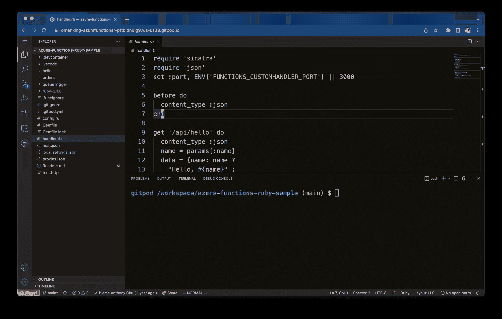
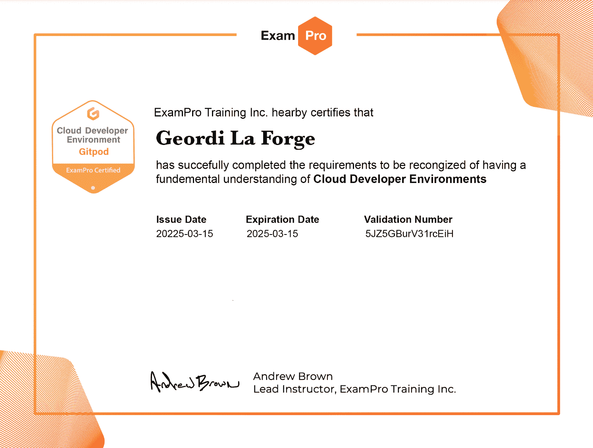
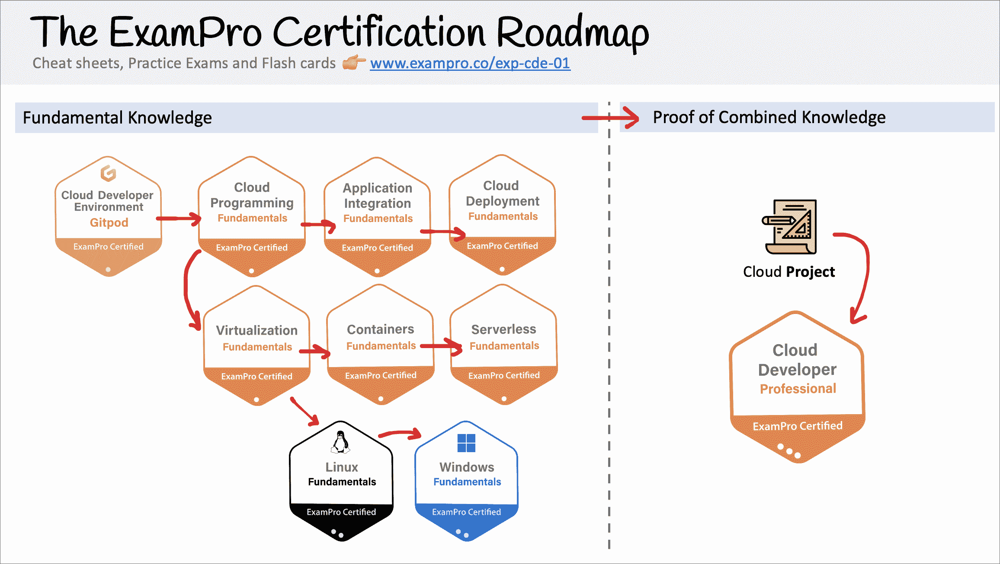

# ExamPro 云开发人员环境认证—通过 12 小时课程的考试

> 原文：<https://www.freecodecamp.org/news/exampro-cloud-developer-environment-certification-gitpod-course/>

如果你是一名 web 应用程序开发人员，想要学习如何利用云或者想成为云开发人员，那么 ExamPro 云开发环境(EXP-CDE-01)是第一步。

## 什么是云开发者环境？

云开发者环境(CDE)是:

*   可以在云中运行的代码编辑器
*   底层计算环境运行在云中。

这与传统环境不同，传统环境运行在您的本地机器上，使用您的本地计算能力。

云开发者环境有很多优势:

*   你只需要一个网络浏览器和一个互联网连接
*   在团队内的同一环境中进行远程协作非常容易
*   减少新团队成员的开发人员环境配置
*   非常适合云技术，这些技术需要基于使用案例的完全不同的环境
*   更多...

A picture Gitpod, which is a Cloud Developer Environment

## 什么是 ExamPro 云开发者环境认证(EXP-CDE-01)？

该云认证旨在教您如何为 Web 开发人员、云开发人员或云工程师角色利用云开发人员环境。

获取关于云开发者环境的知识是成为云开发者的第一步，也是最重要的一步。

这个认证**也被称为 Gitpod 认证**，因为它非常注重使用开源和软件即服务(SaaS)git pod。

A picture of the badge and certification for the EXP-CDE-01

选择 Gitpod 的原因是:

*   它有一个慷慨的自由层
*   它是开源的(麻省理工学院许可)
*   它与供应商无关，(可以与 Gitlab、Github、Bitbucket 一起工作)
*   它的代码编辑器是 Visual Studio Code，最流行的代码编辑器
*   它是云开发环境的市场领导者

云开发环境(CDE)具有非常相似的特性集，因此在 Gitpod 上学习的 CDE 概念将会转化为其他 CDE。

### 什么是 ExamPro 认证？

ExamPro 是一家制作多个免费视频学习课程的公司，这些课程发布到 freeCodeCamp YouTube 上，面向受欢迎的云服务提供商，如 AWS、Azure、GCP、Kubernetes，用于认证，如:CLF-C01、SAA-C02、SOA-C01、DVA-C01、AZ-900、DP-900、AI-900、AZ-104、GCP-CDL、朝鲜中央通讯社等。

ExamPro 正在制作自己的云认证，符合特定的云角色。ExamPro 是发布机构，旨在大幅降低云认证的成本，使云知识更容易获得。

## 什么是云开发者？

云开发人员是一个 web 应用程序开发人员的角色，在构建 web 应用程序时会结合云服务。

云开发者可以比网络应用开发者多赚 30%的钱，因为云开发者知道如何充分利用云。

因此，由云开发者构建的网络应用将更加可用、可扩展、耐用、安全，并允许小型组织在全球市场上与老牌科技巨头竞争。

云开发人员这个词越来越流行，许多招聘 web 开发人员或全栈开发人员的职位实际上都是云开发人员。

## 成为云开发者很难吗？

云开发人员的技能类似于 web 应用程序开发人员，但是 Web 应用程序的大部分功能可以卸载到云服务上。

因此，云开发人员需要具备以下知识:

*   云开发者环境(Cloud Developer Environments)——有一个专门的短期开发者环境，适合与许多不同种类的 SDK 和开发工具一起工作
*   **云编程** -多种编程语言的广泛知识，因为云服务 SDK 语言的可用性因服务而异
*   **应用集成** -云服务需要集成到您的网络应用中，或者与其他服务进行通信。云开发人员编写代码或配置来将这些集成在一起
*   **云部署** -云开发人员有额外的责任去理解部署管道在云环境中是如何工作的

云开发人员从了解其应用程序将部署到的底层基础设施和架构中获益匪浅。然而，云开发人员不负责基础设施的生命周期、自动化或维护。

了解以下关于云基础架构的信息对云开发人员非常有益:

*   **虚拟化** —运行 web 应用程序最常见的地方是在虚拟机上，虚拟环境是容器和无服务器等现代架构的基础。
*   **Linux** —运行 web 应用服务器最常见的操作系统，云开发人员需要了解基本的 Linux 网络、Linux 故障排除
*   **Windows** — Windows Server 在传统 IT 中非常常见，拥有一般的 Windows 知识和 Linux 可以让云开发人员最大限度地利用运行在 Windows 上的云服务。
*   **容器** —作为虚拟机的下一步，容器允许额外的可移植性和隔离，并鼓励与云服务更加一致的微服务架构。
*   **无服务器** —一种现代架构，开发者可以专注于代码，其他一切都由云提供商处理。

## ExamPro 云开发人员环境认证概述

考试问题分为以下几个领域:

*   7%领域 1:云开发人员环境概念
*   5%领域 2: Gitpod 集成
*   35%域 3: Gitpod 配置
*   35%域 4: Gitpod 工作流
*   18%领域 5: Gitpod.io、Gitpod Enterprise、Gitpod OSS

## ******如何获得认证？******

考试通过 **ExamPro 平台**上的 TeacherSeat Anchor 在线进行。

你可以在这里找到更多细节:
[https://exampro.co/exp-cde-01](https://exampro.co/exp-cde-01)

*   考试包含 **55 道题**。
*   题型为**多选** e 和**多选**格式。
*   考试持续时间 **1.5 小时**
*   需要 **80%** 以上才能通过
*   考试由**监考**(监考意味着有人会在你考试时监视你，以确保考试的完整性)
*   回答错误不会受到惩罚
*   你有一次机会

前往 freeCodeCamp 的 YouTube 频道开始学习 12 小时的课程。

[https://www.youtube.com/embed/XcjqapXfrhk?feature=oembed](https://www.youtube.com/embed/XcjqapXfrhk?feature=oembed)