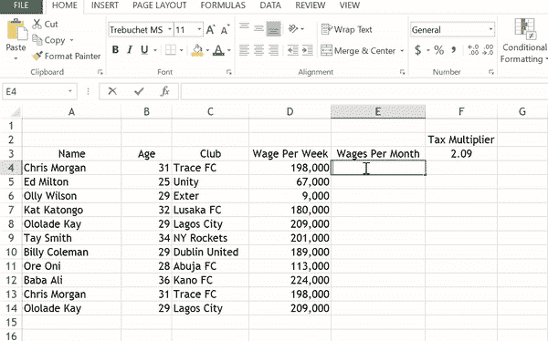
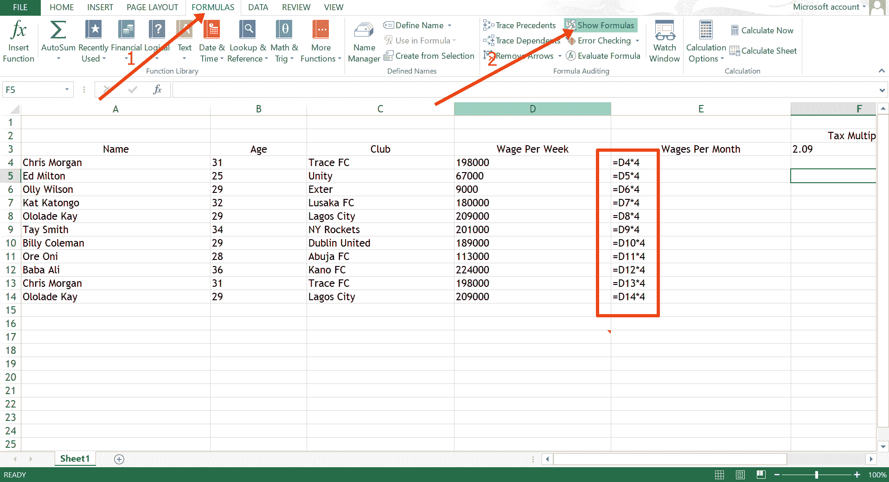
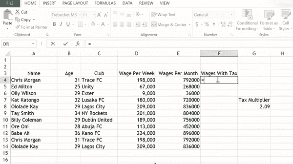
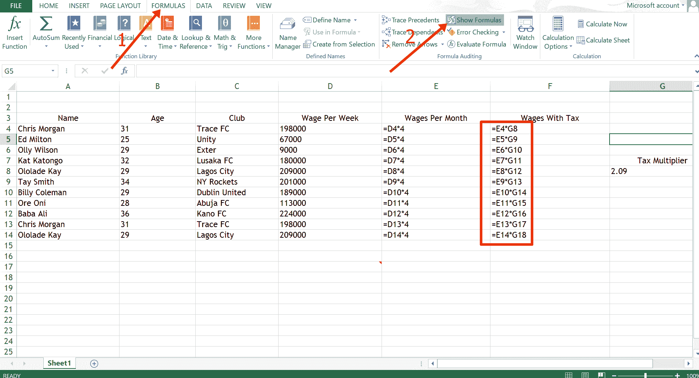
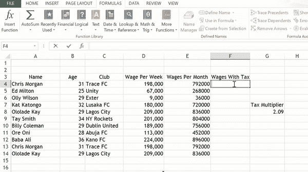
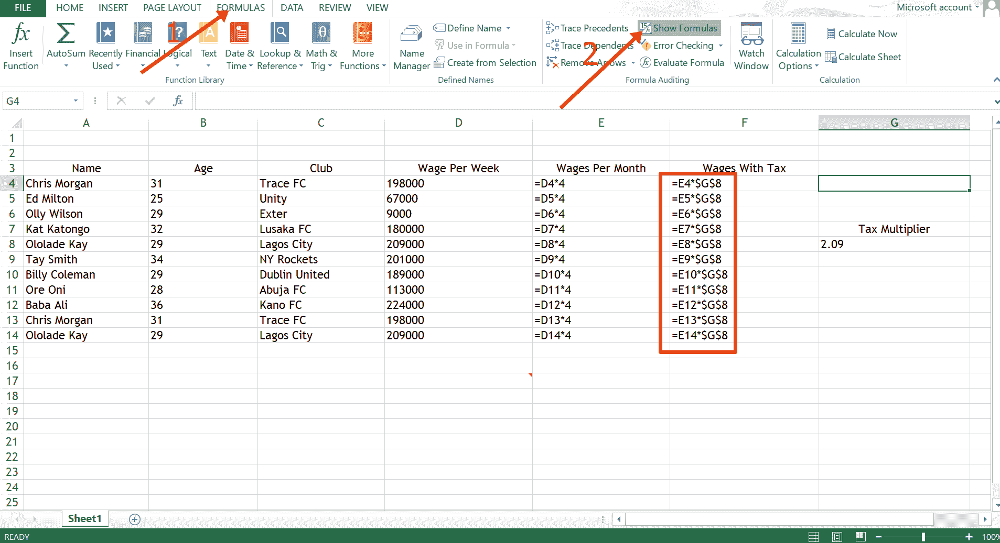

# Excel 绝对引用–单元格引用示例

> 原文：<https://www.freecodecamp.org/news/excel-absolute-reference-cell-referencing-example/>

在 Excel 中，您可以使用绝对和相对单元格引用来进行计算。

相对参考是默认设置。因此，例如，每当您将公式向下扩展到一些单元格时，这些单元格会根据行和列的关系发生变化。

如果您希望每个单元格都锁定在某个公式上，并且不改变，该怎么办？这就是你必须使用绝对参考的地方。

在本文中，我将向您展示绝对引用在 Excel 中是如何工作的。但是首先，你必须知道相对引用是如何工作的。

## 相对引用在 Excel 中的工作原理

相对引用是 Excel 中的默认引用。

当您在单元格中输入公式并将其扩展到其他单元格时，这些其他单元格也会使用该公式。

在下图中，我计算了每个足球运动员一个月的收入，并使用了相对参考:

如果你检查每个单元格中的公式，你会发现单元格`D4` ( `=D4*4`)中的公式已经相对扩展到其他单元格(`D5`到`D14`)。

所以单元格`D5`现在使用`D5*4`，`D6`现在使用`D6*4`，以此类推。

要查看 Excel 中的公式，请切换到公式菜单，然后单击“显示公式”:

这就是相对引用在 Excel 中的工作方式。

## Excel 中的绝对引用

如果您不希望公式在向下扩展到各个单元格时发生变化，则需要使用绝对引用。

绝对引用是通过在行和列前面加上美元符号来实现的。比如 `$D$4`。

如果您只想固定该行，可以这样做: `$D4`。

如果您只想固定该列，可以这样做: `D$4`。

请记住，如果您想要进行相对引用，您可以键入公式 `=D4*4`单元格`E4`并将其扩展到单元格`E5`。于是公式变成了 `=D5*4`。

但是如果你像 `=$D$5*4`一样输入公式作为绝对引用，它就保持 `=$D$5*4`。

在下面的例子中，我试图用工资乘以税收乘数来计算用税收支付的工资，但我没有得到我想要的:

这是因为使用了相对参考。您可以通过检查公式再次确认这一点:

你可以看到公式从 G8 向下改变，从 G8 向下的任何东西都不存在于工作表中。

为了解决这个问题，我们必须通过在第(G)行和第(8)列前面加上美元符号来将公式锁定为 G8。于是，公式变成了`E4*$G$8`、`E5*$G$8`、`E6*$G$8`，以此类推。

现在它正常工作:

如果你检查公式，它们都保持固定为`$G$8` :

## 结论

本文向您展示了在 Excel 中如何使用绝对引用，并将其与另一种引用类型(相对引用)进行了比较，以便您能够更好地理解它。

如果您不想在扩展公式时将公式复制到其他单元格，那么您应该考虑使用绝对引用。

感谢您的阅读。