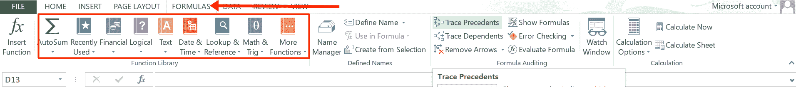

# Excel 公式–适用于初学者的基本函数

> 原文：<https://www.freecodecamp.org/news/excel-formulas-for-beginners/>

Microsoft Excel 允许您使用公式和函数来执行基本和高级数值计算。你可以做加、减、乘、除、平均、处理字符串等等。

在 Excel 中，公式和函数的区别在于，函数是预定义的计算，而公式是用户定义的计算。

例如，`SUM`是一个函数，而`=SUM(E1:E9)`是一个使用`SUM`函数的公式。

在本文中，我将向您展示 Excel 公式和函数，这些公式和函数将使您在使用 Excel 时更加轻松。您还将学习如何使用每个公式。

| 功能 | 描述 | 使用 |
| --- | --- | --- |
| **处理数字的 Excel 公式** |  |  |
| 总和 | 用于在单元格中添加数字 | =SUM(D2:D10) |
| 平均的 | 用于计算单元格中某些数字的平均值 | =平均值(E6:E8) |
| 部 | 用于查找单元格中数字的最小值 | 最小(C1:C10) |
| 马克斯(男子名ˌ等于 Maximilian) | 用于查找单元格中数字的最大值 | =最大值(C1:C10) |
| 苏米夫 | 将特定单元格中符合特定条件的所有数字相加 | =SUMIF(B7:B9，" > 2000 "，E2:E6) |
| ISNUMBER | 如果值是数字，则返回 true，如果不是数字，则返回 false | ISNUMBER(E7) |
| ISEVEN | 如果数字是偶数，则返回 true，否则返回 false | ISEVEN(D3) |
| ISODD | 如果数字是奇数，则返回 true，否则返回 false | =ISODD(D10) |
| ISERROR | 如果值是错误的，则返回 true，否则返回 false | =ISERROR(D9) |
| 中位数 | 返回某些数字中间的数字 | =中位数(D2:D10) |
| 产品改进(Product Improve) | 将圆周率的值返回到 15 位数字 | =Pi() |
| 密码 | 返回计算机使用的字符集中字符串第一个字符的数字代码 | =代码(免费) |
| 边缘 | 生成一个介于 0 和 1 之间的随机数 | 兰德() |
| 力量 | 返回一个数字的幂的结果 | =幂(3，9) |
| 轮次 | 将数字舍入到指定的小数位数 | =ROUND(D10，3) |
| 罗马的 | 将数字转换为罗马数字 | =罗马(2022) |
| 现代的 | 返回一个数除以另一个数的余数 | =MOD(123，3) |
| 基础 | 将数字转换为具有给定基数的文本表示形式 | =BASE(2，32，1) |
| 天花板 | 将数字向上舍入到最接近的整数或最接近的有效倍数 | =上限(D6，2) |
| 细胞 | 返回有关单元格的信息 | =单元格(D9) |
| 茶 | 从计算机的字符集中返回由代码号指定的字符 | =CHAR(D4) |
| 数数 | 计算某些参数列表中有多少个数字 | =计数(D2:D10) |
| 美元 | 将货币格式的数字转换为指定的小数位数 | =美元(4000，4) |
| 装货付款(Cash On Shipment) | 返回一个角度的余弦值 | =COS(60) |
| 犯罪 | 返回角度的正弦值 | =SIN(30) |
| 黝黑色 | 返回角度的正切值 | =谭(45 岁) |
| **处理日期的 Excel 公式** |  |  |
| 时间 | 将小时、分钟和秒钟转换为时间格式的 Excel 序列号 | =时间(9，20，40 |
| 日期 | 返回代表 Excel 日期时间代码中的某一天的数字 | =日期(2022，5，12) |
| 天 | 将数字转换为一个月中的日期 | =天(243) |
| 小时 | 返回 0 到 23 之间的小时数 | =小时(34) |
| 分钟 | 返回分钟，一个介于 0 和 59 之间的数字 | =分钟(59) |
| 第二 | 返回秒，一个介于 0 和 59 之间的数字 | =秒(48) |
| 今天 | 返回日期格式的当前日期 | =今天() |
| 工作日 | 返回星期几，一个介于 1 和 7 之间的数字 | =WEEKDAY(12，4) |
| 月 | 返回月份，一个 1 到 12 之间的数字 | =月(9) |
| 年 | 返回年，日期在 1900 和 9999 之间 | =年(12) |
| **用于处理文本和字符串的 Excel 公式** |  |  |
| 连锁的 | 将各种文本组合在一起 | =CONCATENATE("免费"，"代码"，"营地") |
| 低输入联网（low-entry networking 的缩写） | 返回字符串的长度 | =伦(C1) |
| 左边的 | 从字符串的左侧返回指定字符串的数目 | =LEFT(C6，5) |
| 正确 | 从字符串的右侧返回指定字符串的数目 | =右(C6，5) |
| 中间的 | 从指定的起始位置和长度返回字符串中间的数字 | =中间值(C7，3，5) |
| 替换 | 用另一个指定的字符串替换字符串的一部分 | =REPLACE("Coding "，2，2，" og ") |
| 发现 | 用一个字符串返回另一个字符串的起始位置 | =FIND("od "，" Coding "，1) |
| ISTEXT | 如果值是字符串，则返回 true，否则返回 false | =ISTEXT(D9) |
| 降低 | 将文本转换为小写 | =LOWER("FREECODECAMP ") |
| 上面的 | 将文本转换为大写 | =UPPER("freecodecamp ") |
| 整齐 | 删除文本中除单词间的单个空格以外的所有空格 | =TRIM("自由代码营") |
| 确切的 | 如果两个文本相等，则返回 true，否则返回 false | =EXACT("免费"，"免费" |
| 适当的 | 将单词的首字母转换为大写字母 | =PROPER("javascript ") |
| **逻辑** |  |  |
| 和 | 如果所有参数都为真，则返回 true，否则返回 false | =AND(12，34) |
| 不 | 将 false 变为 true，将 true 变为 false | =不是(真) |
| 运筹学 | 仅当所有参数都为假时，才返回假 | =OR(12，12) |

## 结论

Excel 提供了各种允许您操作数据的函数。

要查看更多这些函数，请单击公式选项卡
