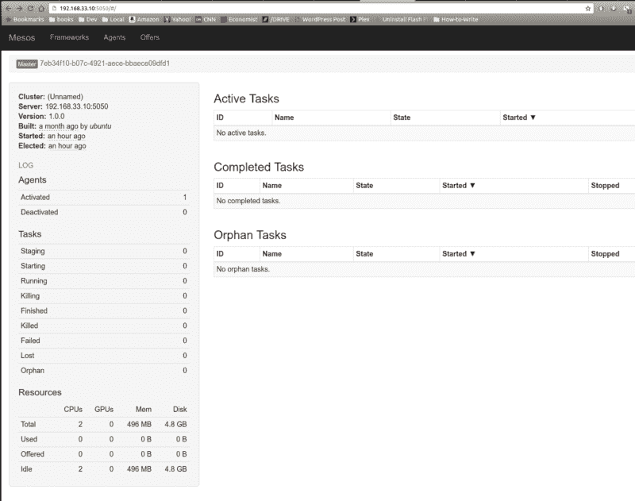
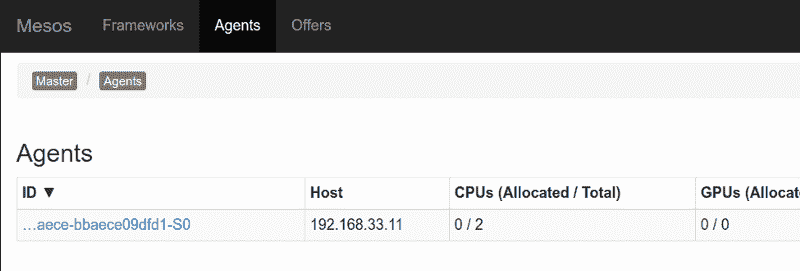
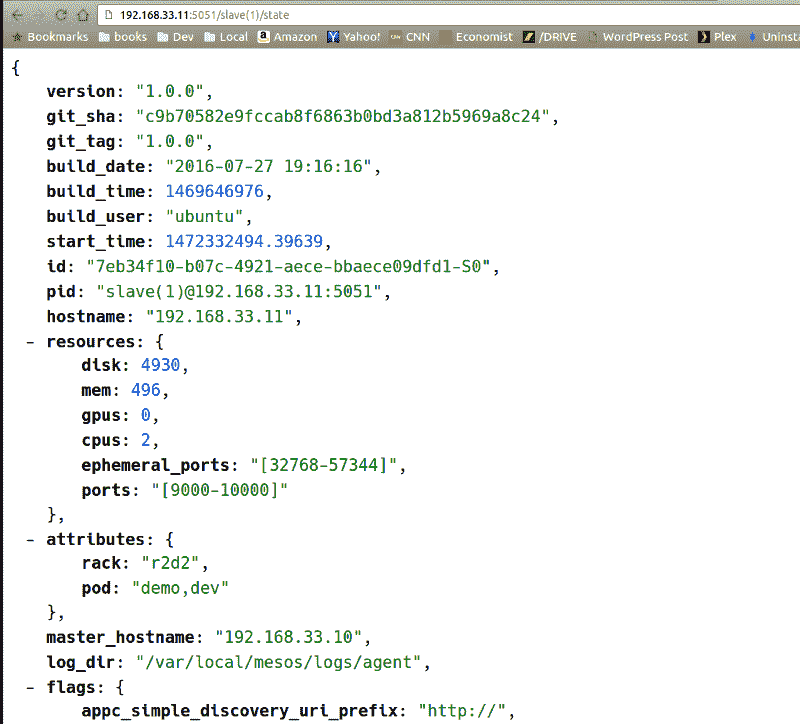

# 体验 Apache Mesos HTTP API 的乐趣和收益

> 原文：<https://www.freecodecamp.org/news/experimenting-with-the-apache-mesos-http-api-for-fun-and-profit-part-1-of-3-cf5736e84f85/>

马可·马森齐奥

# 体验 Apache Mesos HTTP API 的乐趣和收益


Apache Mesos 是 Twitter 和 Airbnb 等大规模服务中用于生产的工具。这是它的教科书描述:

> Mesos 内核在每台机器上运行，并为应用程序(例如 Hadoop、Spark、Kafka、Elasticsearch)提供 API，用于整个数据中心和云环境的资源管理和调度。—来自 [Apache Mesos](https://mesos.apache.org) 项目现场。

这是三篇文章中的第一篇，展示了如何在您的笔记本电脑上设置一个基于 vagger 的 Apache Mesos 测试/开发环境，如何针对 HTTP API 运行 Python 笔记本，以及如何在正在运行的代理 VM 上启动 Docker 容器。

这一系列是我在【2015 年欧洲中尺度会议上发表的[演讲](https://youtu.be/G7xfEs0lX5U)的扩展(和更新)版本，针对刚刚发布(2016 年 8 月)的 Apache Mesos 1.0.0 进行了更新——你也可以在那里找到[幻灯片](http://events.linuxfoundation.org/sites/events/files/slides/MesosCon%20EU%20-%20HTTP%20API%20Framework.pdf)。

这篇文章内容丰富，要求你熟悉一些关于容器、虚拟机和 Mesos 的概念。但我会花时间展示所有的中间步骤(因此，3 部分)。这应该很容易理解，即使你以前从来没有使用过流浪者，Mesos，甚至 Jupyter 笔记本。

我建议您首先对 Python 和处理 HTTP 请求和响应有一个基本的了解，因为我们不会在那里讨论这些细节。

所有代码都可以在 zk-mesos git 存储库上获得[:](https://github.com/massenz/zk-mesos)

```
git clone git@github.com:massenz/zk-mesos.git
```

并且还可以查看[自述](https://github.com/massenz/zk-mesos)。

### 入门指南

为了跟进，你需要克隆这个库(如上所示)并安装 [Virtualbox](http://virtualbox.org) 和[流浪者](https://www.vagrantup.com/docs)。按照他们各自网站上的说明操作，您很快就可以开始运行了。

我也推荐快速扫描流浪文档。超越`*流浪`*的流浪知识并不真的需要从这个系列中获得最大收益，但如果你卡住了，它可能会有所帮助(或者想在我们的*流浪文件*上试验和改进)。

如果你不熟悉 Apache Mesos，我建议你去看看这个项目的网站。我推荐阅读 [Mesos in Action](http://amzn.to/2citsRx) (注意，我是手稿的审稿人之一)。

我们将不会在这里从源代码中构建中间层，而是使用 T2 中间层包。你不需要下载它们。*流浪文件*会自动下载安装到虚拟机上。

为了运行 Python 笔记本，我们将利用 [Jupyter](http://jupyter.org) 包，并使用 *virtualenv* 来运行我们所有的代码。Virtualenv 不是绝对必要的，但是可以防止你搞乱你的系统 Python。

如果您以前从未使用过 [virtualenv](https://virtualenv.pypa.io/en/stable/installation/) :

```
$ sudo pip install virtualenv
```

然后创建并运行一个 *virtualenv* :

```
$ cd zk-mesos $ virtualenv mesos-demo$ source mesos-demo/bin/activate $ pip install -r requirements.txt
```

最后，验证您可以运行并加载 Jupyter 笔记本:

```
$ jupyter notebook
```

这应该会自动打开你的浏览器并指向 [http://localhost:8888](http://localhost:8888) 。从这里你可以选择*笔记本/Demo-API.ipynb* 文件。暂时不要运行它，但是如果它出现了，它将确认您的 Python 设置是正确的。

### 构建和安装 Apache Mesos

这就是流浪者之美闪耀光芒的地方。安装 Apache Mesos Master 和 Agent 并不是简单的任务，但是在我们的例子中，这只是一个问题:

```
$ cd vagrant $ vagrant up
```

当发出任何一个浮动命令时，确保你和*浮动文件*在同一个目录下，否则它会报错。

值得注意的是，我们正在构建**两个**流浪者盒子，所以任何命令都将在**和**上操作，除非特别说明。为了避免这种情况，您可以在命令后指定虚拟机的名称。例如，通过 SSH 连接到代理:

```
$ vagrant ssh agent
```

这应该能让你登录那个盒子。从那里，您可以探索、试验和诊断任何问题。

执行*流浪起来*命令需要一些时间，但它最终会让你的 Virtualbox 拥有两个虚拟机，分别命名为 *mesos-master* 和 *mesos-agent* 。顺便说一句，你应该永远不需要使用 VirtualBox 来管理它们。所有的任务都可以通过漫游命令来完成。但是如果必要或需要，您可以手动管理它们。

构建虚拟机后，请确保您可以访问 Mesos HTTP UI，网址为:

```
http://192.168.33.10:5050
```



Mesos Master web UI — reachable at http://192.168.33.10:5050

您还应该看到一个代理正在运行，可以通过主 UI 访问。



Agents view on the Mesos Master web UI

或直接访问:

```
http://192.168.33.11:5051/state
```



JSON response from the Agent, when hitting the /state endpoint

请注意，代理不仅运行在与主服务器不同的 IP 地址上，还运行在不同的端口上(5051 而不是 5050)。

查看 variant/run-Agent . sh，查看我们用来运行代理的几个命令行标志(以及主代理的 run-master.sh)。

### 动物园管理员

值得注意的是，我们还在 Docker 容器内的 *mesos-master* VM 上运行 Zookeeper 的一个实例(用于领导者选举和主/代理协调):部分原因是我们可以这样做，但也是为了展示使用容器这样做是多么容易。

这一行代码(在 *run-master.sh* 中)将为您提供一个非常好的 ZK 实例(尽管在生产环境中这是一个非常不可靠的实例，在生产环境中，您希望在物理上独立的机器/机架上运行至少 3-5 个节点):

```
docker run -d --name zookeeper -p 2181:2181 -p 2888:2888 \    -p 3888:3888 jplock/zookeeper:3.4.8
```

因为我们向主机虚拟机公开了端口(特别是 2181)，所以我们可以通过 Zookeeper CLI 实用程序( *zkCli.sh* )连接到它并探索它。在您的开发机器上(您需要首先下载 Zookeeper ),您可以使用:

```
$ zkCli.sh -server 192.168.33.10:2181...[zk: 192.168.33.10:2181(CONNECTED) 4] get /mesos/vagrant/json.info_0000000000
```

```
# Formatted for better readability:{"address":  { "hostname": "mesos-master",    "ip":"192.168.33.10",    "port":5050  },  "hostname":"mesos-master",  "id":"7eb34f10-b07c-4921-aece-bbaece09dfd1",  "ip":169978048,  "pid":"master@192.168.33.10:5050",  "port":5050,  "version":"1.0.0"}
```

```
cZxid = 0xbctime = Sat Aug 27 14:00:44 PDT 2016...
```

这是代理获取有关如何连接到主节点的信息的方式。

每次选举新的领导者时， *_000000* 后缀都会增加，因此根据 ZK 实例运行的时间以及主实例是否重新启动，它可能会变成类似于 *_0000005。用动物园管理员的话说，那是一个“*短暂节点”*。*

在上面记录中，值得注意的是,“pid”是唯一标识符，而“ip”是 IPv4 八元组的压缩 4 字节表示。这些遗留字段最终可能会被删除。

#### 包裹

现在，您自豪地拥有了一个主/代理 2 节点 Apache Mesos 部署。欢迎与 Twitter 和 Airbnb 制作奇才同列。

在第 2 部分中，我们将针对主 API 运行我们的 Python 笔记本，并接受代理提供的 Docker 容器。

如果你有时间，让我们开始学习[如何连接到 Mesos Master 并接受资源提供](https://medium.com/@massenz/a-python-notebook-to-experiment-with-the-apache-mesos-http-api-part-2-of-3-7f97fbe32e80#.yhx3zxpws)。

*最初发表于 2016 年 8 月 27 日[codetrips.com](https://codetrips.com/2016/08/27/a-python-notebook-to-experiment-with-the-apache-mesos-http-api-part-1-of-3/)。*